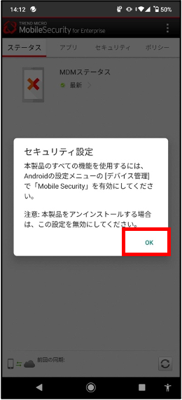

このページでは，UTokyo Antivirus LicenseをAndroidで利用する方法を説明します．このライセンスの概要については，「[ウイルス対策ソフトウェア包括ライセンス](..)」をご覧ください．

## インストール方法
{:#install}

※ご案内している内容は、Android OSバージョン，および機種により一部表示や手順が異なることがあります．

1.	Android端末にて以下のURLをブラウザで開きます．
https://ccs.trendmicro.com:443/jp/mobile?EK=QUL4QGLKSC
下記QRコードからもアクセスできます．
{:.small}
※URL・QRコードは変更することがあります．エラーが出る場合は最新の手順書をご覧ください．

1.	アプリをダウンロードします．「ダウンロードを続行」を選択します．　
{:.small}
 「ダウンロード」を選択します．
{:.small}

1.	ダウンロードが完了したことを確認し，ダウンロードしたファイルをタップします．
{:.small}
{:.small}
{:.small}

1.	ダウンロードしたファイル 「TmmsSuite.apk」を起動し，インストールを開始します．
3点マークをタップし，「インストール」を選択　
{:.small}
「インストール」を選択
{:.small}

1.	インストールが完了したら，アプリを起動します．またはアプリ一覧からも起動できます．
1{:.small}
{:.small}

1.	下記のメッセージが表示されますので「続行」を選択します．
{:.small}

1.	下記は全て「許可」を選択します．一つでも「許可しない」を選択するとインストールが中断します．
{:.small}
{:.small}
{:.small}
{:.small}
下記のように一覧で表示されることもありますが，その場合も全て「ON」を選択します．
{:.small}

1.	下記が表示された場合は，許可に設定します．
{:.small}
{:.small}
{:.small}

1.	トレンドマイクロの規約を確認し，「同意する」を選択します．
{:.small}

1. 「QRコードを使用して登録」を選択し，以下のQRコードを読み込みます．
{:.small}
{:.small}
【QRコード】
{:.small}
※QRコードは変更することがあります．エラーになる場合は最新の手順書をご覧ください．

1. QRコードが読み込めない場合は，「手動で登録」を選択してください．
{:.small}
以下の登録キーを入力し，「次へ」を選択します．
【登録キー】
{:.small}
※登録キーは変更することがあります．エラーになる場合は最新の手順書をご覧ください．
{:.small}

1.	セキュリティ設定に関するメッセージを確認し，「OK」を選択します．
{:.small}

1.	「このデバイス管理アプリを有効にする」を選択します．
{:.small}
{:.small}

1.	MDMステータスが最新になっていれば完了です．
インストール直後はMDMステータスが非同期になることがありますが，右下の同期マークをタップすると同期されます．
{:.small}

1.	セキュリティステータスの「＞」をタップし，「検索開始」を実施すると，ステータスが保護に変わります．
{:.small}
{:.small}
{:.small}
{:.small}
 

## アンインストール方法
{:#uninstall}

1.	MobileSecurityを開き，3点マークをタップし，「アンインストール」を選択します．
{:.small}

1. 「OK」を選択します．これでアンインストールは完了です．
{:.small}
