---
title:UTokyo Antivirus Licenseの利用方法(iOS・iPadOS)
---

 このページでは，UTokyo Antivirus LicenseをiOS・iPadOSで利用する方法を説明します．このライセンスの概要については，「[ウイルス対策ソフトウェア包括ライセンス](..)」をご覧ください．
 

 
## インストール方法
{:#install}

1.	App Store を開き，「Enterprise Mobile Security」アプリを検索します．

1.	「入手」を選択し，インストールを開始します．
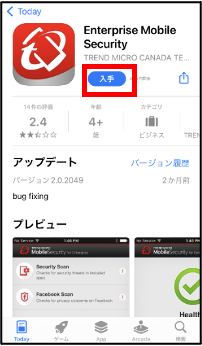{:.small}
1.	個人情報に関する規定を確認し，「同意して次へ」を選択します．
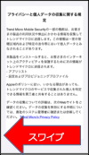{:.small}
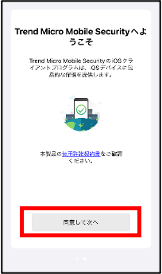{:.small}

1.	インストールが完了すると，サーバの登録画面が表示されます．
「QRコードを使用して登録」を選択し，以下のQRコードを読み込みます．
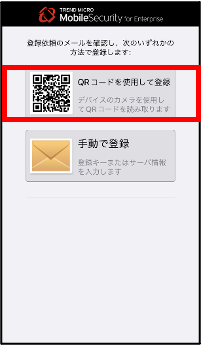{:.small}
【QRコード】
{:.small}
　※QRコードは変更することがあります．エラーになる場合は最新の手順書をご覧ください．

1.	QRコードが読み込めない場合は，「手動で登録」を選択してください．
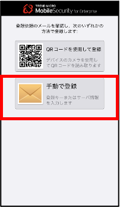{:.small}
以下の登録キーを入力し，「次へ」を選択します．
【登録キー】
{:.small}
※登録キーは変更することがあります．エラーになる場合は最新の手順書をご覧ください．
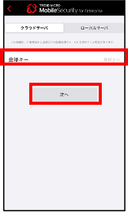(fig/2022-06-11-12-54-23.png){:.small}

1.	構成プロファイルのダウンロードが表示されますので，「許可」を選択します．
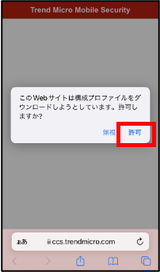{:.small}

1. 「このページを”ENT Security”で開きますか？」と表示された場合は，「キャンセル」を選択します．
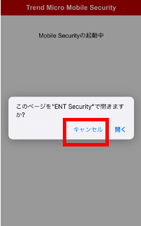{:.small}
1. 「設定」を開きます．
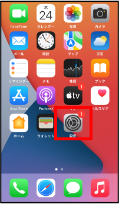{:.small}

1. 「一般」を選択します．
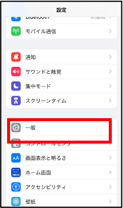{:.small}　　　　　　  
「VPNとデバイス管理」を選択します．
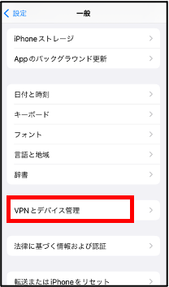{:.small}
「MDM登録プロファイル」を選択します．
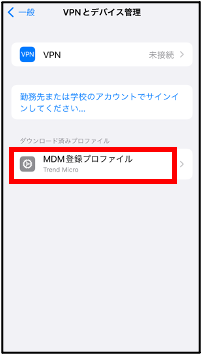{:.small}

1. 「インストール」を選択します．
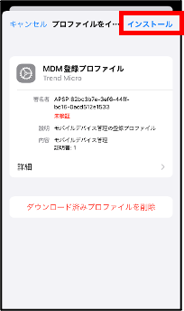{:.small}　
「インストール」を選択します．
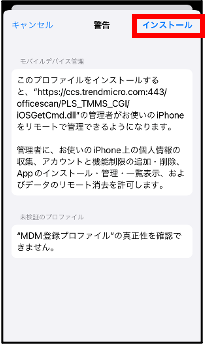{:.small}
「信頼」を選択します．　
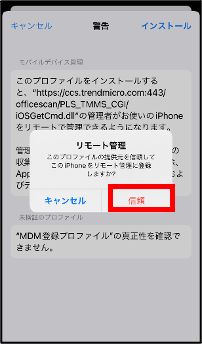{:.small}
「完了」を選択します．
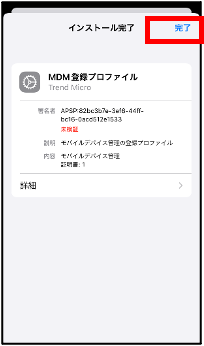{:.small}

1.	Mobile Securityのアプリを起動し，MDMステータスが最新になっていれば完了です．
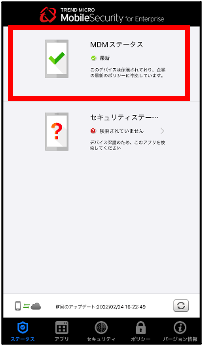{:.small}
インストール直後は下記のようにMDMステータスが非同期になることがあります．右下のアイコンをタップすると同期します．
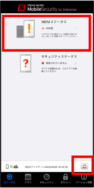{:.small}
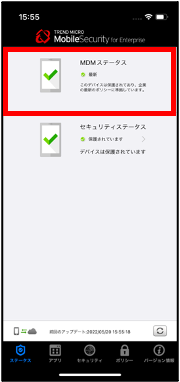{:.small}
セキュリティステータスの「＞」をタップし，「検索開始」を実施すると，ステータスが保護になります．
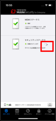{:.small}
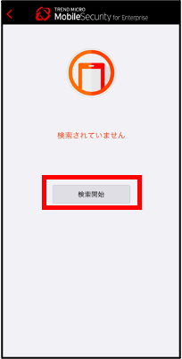{:.small}
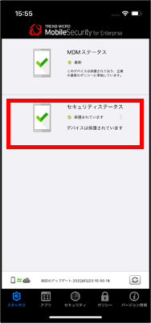{:.small}

## アンインストール方法
{:#uninstall}

1.	MobileSecurityのアイコンを長押しし，「Appを削除」を選択します．
{:.small}

1.	「Appを削除」を選択します．
{:.small}

1.	「削除」を選択します．
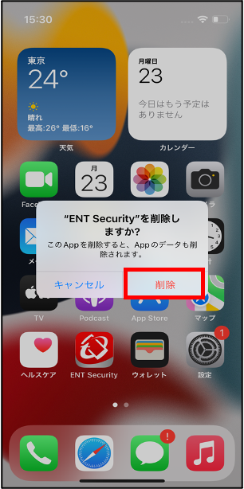{:.small}

1. 「設定」を開きます．
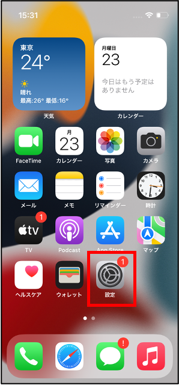{:.small}

1. 「一般」を選択します．
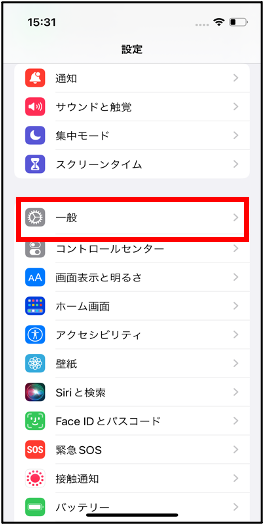{:.small}
「VPNとデバイス管理」を選択します．　　
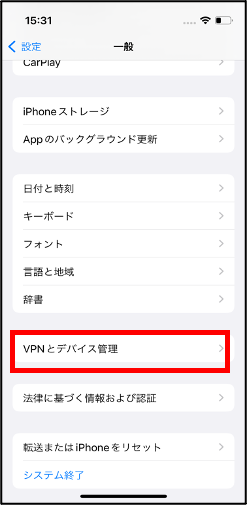{:.small}
「MDM登録プロファイル」を選択します．
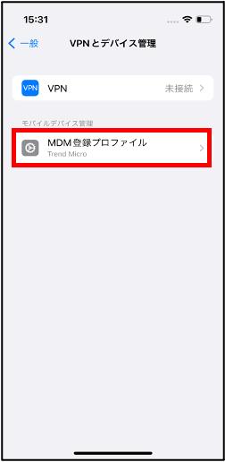{:.small}

1. 「削除」を選択し，パスコードの入力後，再度「削除」を選択します．
これでアンインストールは終了です．
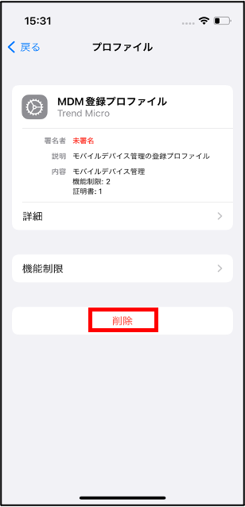{:.small}
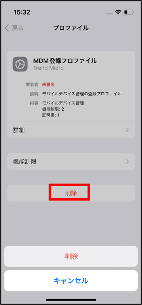{:.small}
