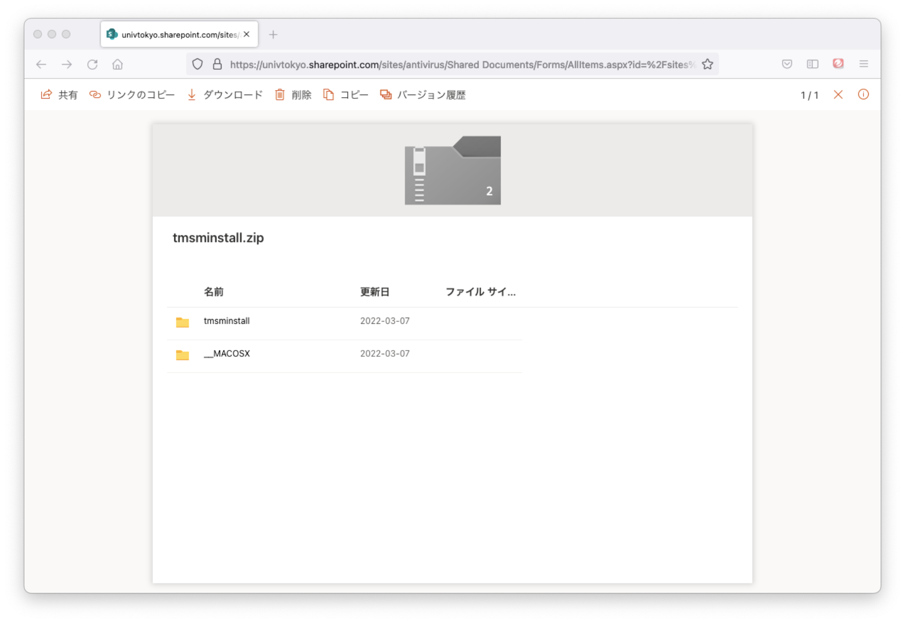
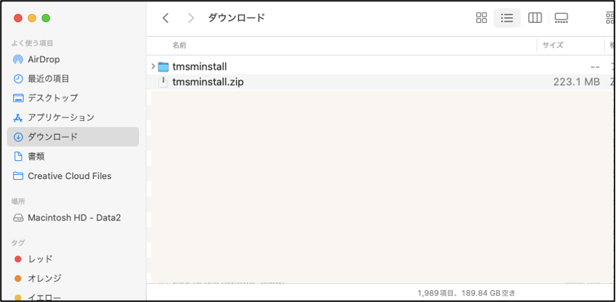
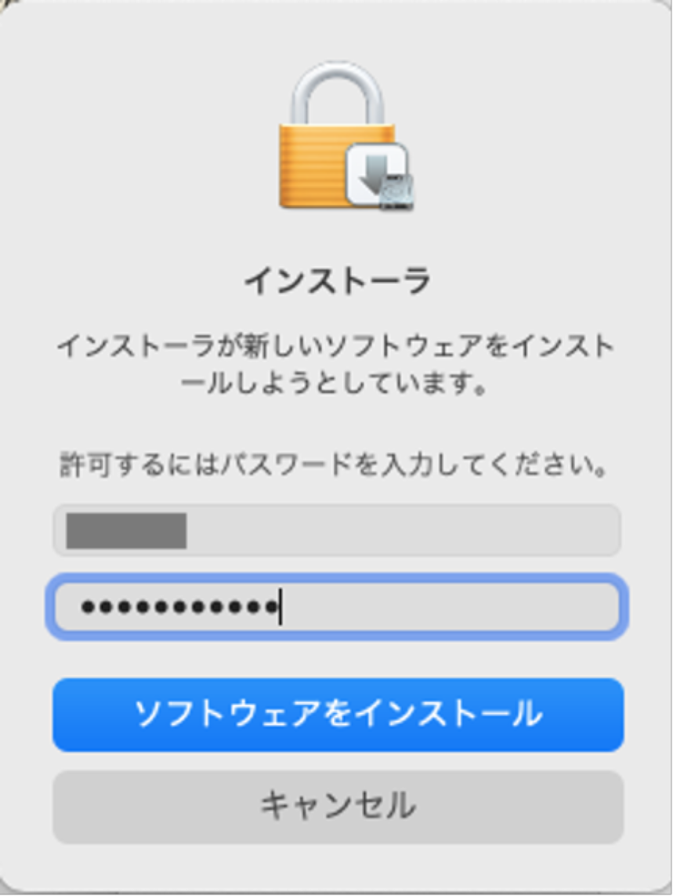
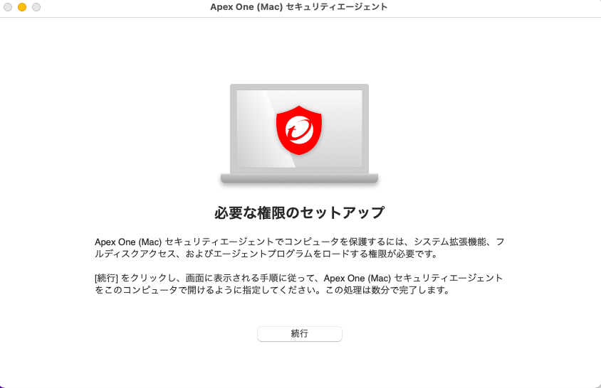
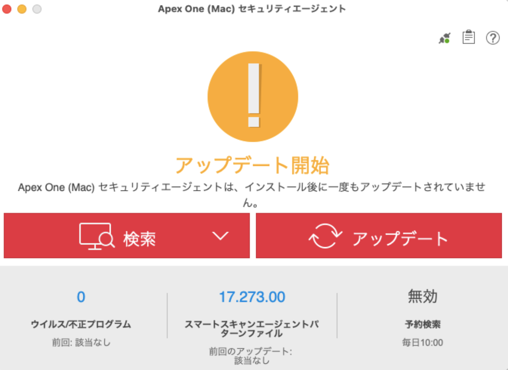

このページでは，UTokyo Antivirus LicenseをmacOSのコンピュータで利用する方法を説明します．このライセンスの概要については，「[ウイルス対策ソフトウェア包括ライセンス](..)」をご覧ください．

すでに別のアンチウイルスソフトウェアがインストールされていると新たにインストールできない場合があります．先にアンインストールしてから手順を実行してください．

## インストール方法
{:#install}

1. [こちらのリンク](https://univtokyo.sharepoint.com/:u:/s/antivirus/EUB-3pO4d_9Jvcz-28s-A2QBpI08UNxT9rsbiBr8WqDj7Q)にアクセスしてください（UTokyo Accountでのサインインが必要です）．
1. 以下のような画面が表示されたら，上のリボンから「ダウンロード」を押してダウンロードしてください． 
{:.small}
1. Finderでダウンロードしたファイルを解凍します．
{:.small}
1. 解凍したフォルダ内にある`tmsinstall.pkg`を実行してください．
1. インストーラが起動すると以下のような画面になります．「許可」をクリックしてください．
{:.small}
1. 続けて「続ける」「続ける」「インストール」をクリックすると，以下のような画面になります．パスワードを入力するか指紋を認証することでインストールを開始してください．
{:.small}
3. 実行が終わると，複数のウィンドウが開きます．以下のウィンドウで「続行」をクリックしてください．
{:.small}
1. 以下の画面が開きます．指示に従って，全ての手順を実施し，「続行」をクリックしてください．
{:.small}
1. 以下の画面が開きます．指示に従って，全ての手順を実施し，「続行」をクリックしてください．
{:.small}
    * 手順2では「プライバシー」タブを選択したリストの中から「フルディスクアクセス」を選択します．
    * 手順4, 5を実施すると，下記のようなメッセージが出ますが，どちらも「あとで行う」を選択します。
    {:.small}
    * 手順6では，TrendMicroExtensionにチェックが入ってないのでチェックをいれ，画面に提示されている3つのアプリの項目にチェックが入っていることを確認します．
1. 以下の画面が開きます．「OK」を選択します．
{:.small}
1. 以下のような画面が開きます．ブラウザ上での保護を受ける場合は，「拡張機能を有効にする」をクリックし，表示される指示に従ってください．
1. 「閉じる」をクリックすると，以下のような画面が表示されます．続けて「OK」「ゴミ箱に入れる」をクリックしてください．
1. Dockに{:.inline}ができているので，起動します．
1. 以下のような画面が開きます．「アップデート」をクリックしてください．
{:.small}
1. アップデートが終わり，以下のような画面が出たら，準備は終了です．
{:.small}

## アンインストール方法
{:#uninstall}

1. [こちらのリンク](https://univtokyo.sharepoint.com/:u:/s/antivirus/EUB-3pO4d_9Jvcz-28s-A2QBpI08UNxT9rsbiBr8WqDj7Q)にアクセスしてください（UTokyo Accountでのサインインが必要です）．
1. 以下のような画面が表示されたら，上のリボンから「ダウンロード」を押してダウンロードしてください． 
{:.small}
1. Finderでダウンロードしたファイルを解凍します．
{:.small}
1. 解凍したフォルダ内にある`Apex One (Mac)セキュリティエージェントアンインストーラ.app`を起動します．
  * 以下のメッセージが出たら，「開く」をクリックしてください．
  {:.small}
  * 以下のメッセージが出たら，「開く」をクリックしてください． 
  {:.small}
  * 以下のメッセージが出たら，ログインパスワードを入力してください．
  {:.small}
1. 起動すると，以下の画面が出ますので，「アンインストール」をクリックしてアンインストールを開始します．
{:.small}
   * 以下のようなメッセージが出たら，「続ける」をクリックしてください．
   {:.small}
   * 以下のようなメッセージが出たら，ログインパスワードを入力してください．
   {:.small}
1. 終了すると，以下のようなメッセージが表示されます．「閉じる」をクリックします．
{:.small}
