このページでは，UTokyo Antivirus LicenseをmacOSのコンピュータで利用する方法を説明します．このライセンスの概要については，「[ウイルス対策ソフトウェア包括ライセンス](..)」をご覧ください．

## インストール方法
{:#install}

複数のウイルス対策ソフトウェアがインストールされると不具合を起こす場合があります．すでにインストールされている別のウイルス対策ソフトウェアから切り替えたい場合は，先にそちらをアンインストールしてから手順を実行してください．

1. [こちらのリンク](https://univtokyo.sharepoint.com/:u:/s/antivirus/EUB-3pO4d_9Jvcz-28s-A2QBpI08UNxT9rsbiBr8WqDj7Q)にアクセスします（UTokyo Accountでのサインインが必要です）．
1. 以下のような画面が表示されたら，上のリボンから「ダウンロード」を押してダウンロードします． 
{:.small}
1. Finderでダウンロードしたファイルを解凍します．
{:.small}
1. 解凍したフォルダ内にある`tmsinstall.pkg`を実行します．
1. インストーラが起動すると以下のような画面になります．「許可」をクリックします．
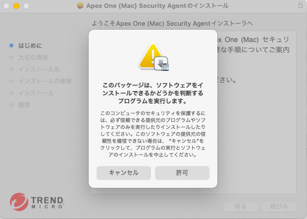{:.small}
1. 続けて「続ける」「続ける」「インストール」をクリックすると，以下のような画面になります．ログインパスワードを入力するか指紋を認証することでインストールを開始します．
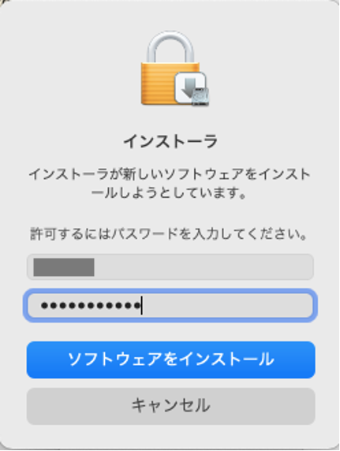{:.small}
3. 実行が終わると，複数のウィンドウが開きます．以下のウィンドウで「続行」をクリックします．
{:.small}
1. 以下の画面が開きます．指示に従って，全ての手順を実施し，「続行」をクリックします．
{:.small}
1. 以下の画面が開きます．指示に従って，全ての手順を実施し，「続行」をクリックします．
{:.small}
    * 手順2では「プライバシー」タブを選択したリストの中から「フルディスクアクセス」を選択します．
    * 手順4, 5を実施すると，下記のようなメッセージが出ますが，どちらも「あとで行う」を選択します。
    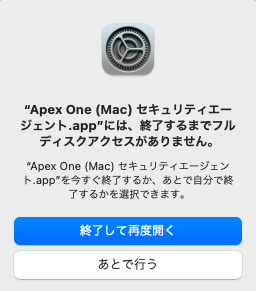{:.small}
    * 手順6では，TrendMicroExtensionにチェックが入ってないのでチェックをいれ，画面に提示されている3つのアプリの項目にチェックが入っていることを確認します．
1. 以下の画面が開きます．「OK」を選択します．
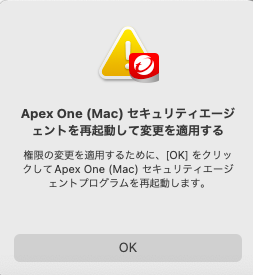{:.small}
1. Dockに{:.inline}ができているので，起動します．
1. 以下のような画面が開きます．「アップデート」をクリックします．
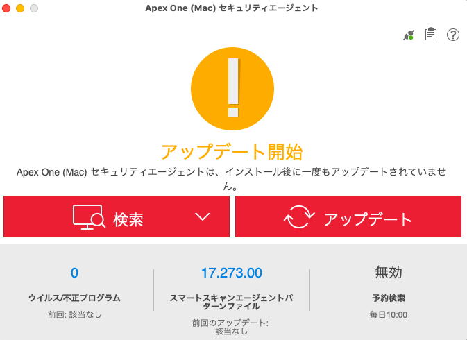{:.small}
1. アップデートが終わり，以下のような画面が出たら，準備は終了です．
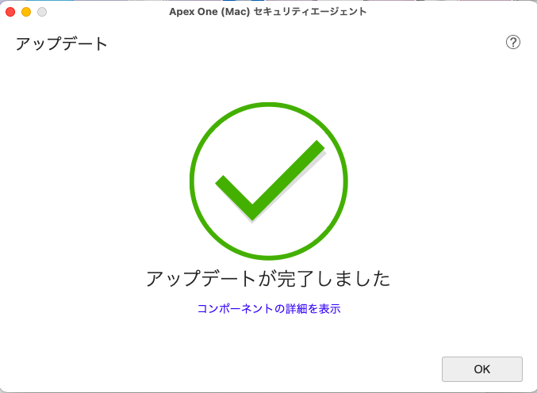{:.small}

### ブラウザ拡張機能のインストール

以下の手順は任意です．

Apex Oneのインストール途中，またはインストールが完了しブラウザを起動すると，下記のメッセージが表示されます．設定する場合は「拡張機能を有効にする」を選択します．設定しない場合は「閉じる」を選択して終了します．
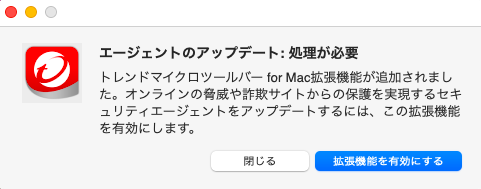{:.small}

Safariでの手順とFireFoxでの手順について，それぞれ説明します．

#### Safariの場合

以下のメッセージが表示されますので，表示されている手順1，2を実行します．
{:.small}
* 手順2でチェックを入れるとき，以下のメッセージが表示されますので，「オンにする」を選択します．
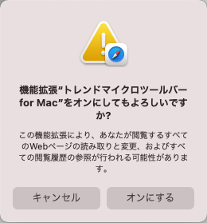{:.small}

#### FireFoxの場合

以下のメッセージが表示されますので，表示されている手順1〜3を実行します．
{:.small}

* 手順3では，以下のようなメッセージが表示されますので，「追加」をクリックします．
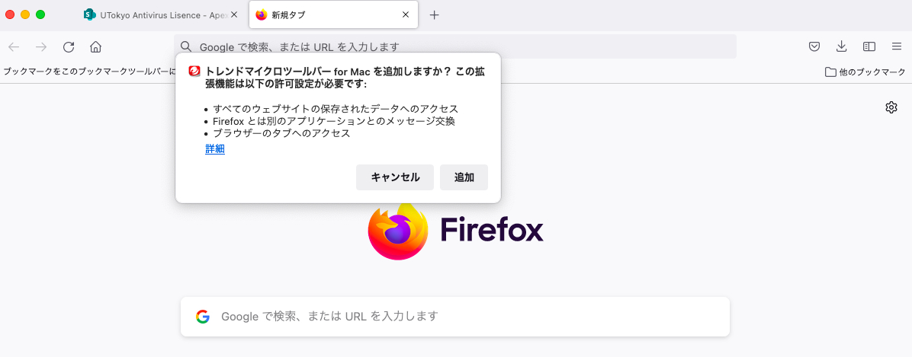{:.small}
* 続けて，以下のようなメッセージが表示されますので，「OK」をクリックします．
{:.small}

## アンインストール方法
{:#uninstall}

1. [こちらのリンク](https://univtokyo.sharepoint.com/:u:/s/antivirus/EdZbkYKJ7TRGkZ3_mdCDcPUBwSFIlihBh4SiAd0xt8AjCA)にアクセスします（UTokyo Accountでのサインインが必要です）．
1. 以下のような画面が表示されたら，上のリボンから「ダウンロード」を押してダウンロードします． 
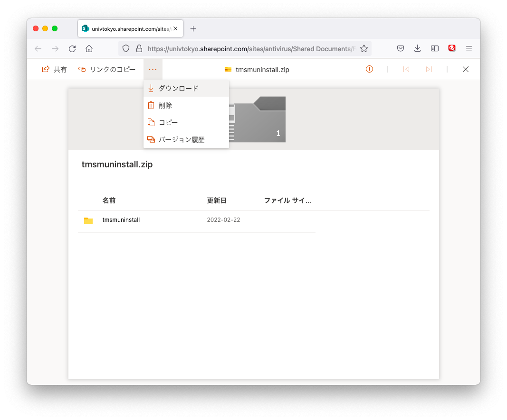{:.small}
1. Finderでダウンロードしたファイルを解凍します．
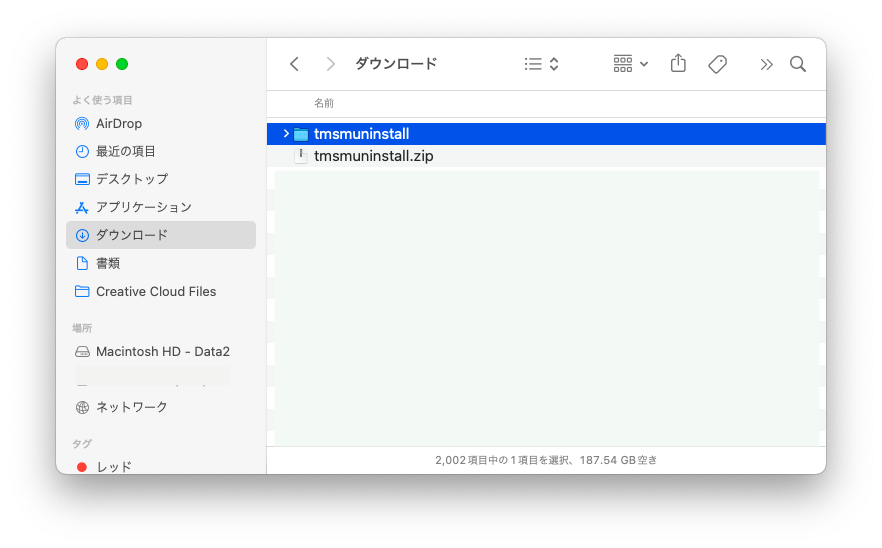{:.small}
1. 解凍したフォルダ内にある`Apex One (Mac)セキュリティエージェントアンインストーラ.app`を起動します．
  * 以下のメッセージが出たら，「開く」をクリックします．
  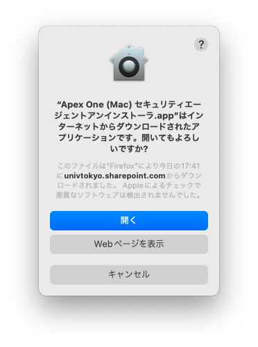{:.small}
  * 以下のメッセージが出たら，「開く」をクリックします． 
  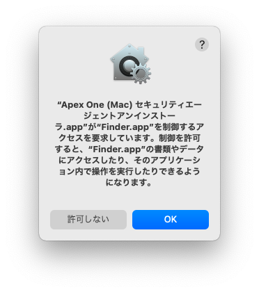{:.small}
  * 以下のようなメッセージが出たら，ログインパスワードを入力するか指紋を認証します．
  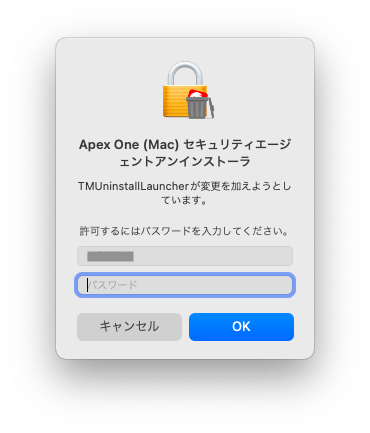{:.small}
1. 起動すると，以下の画面が出ますので，「アンインストール」をクリックしてアンインストールを開始します．
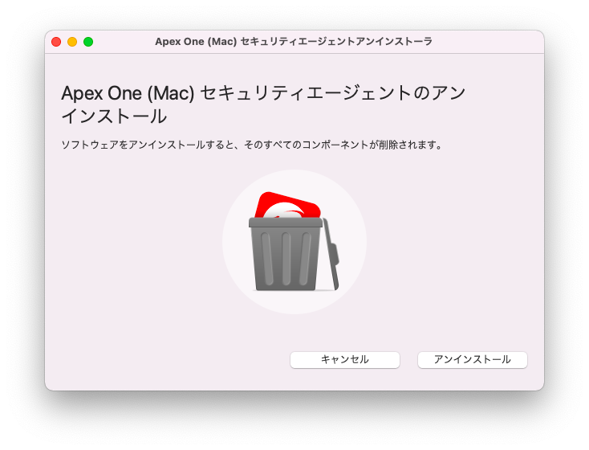{:.small}
   * 以下のメッセージが出たら，「続ける」をクリックします．
   {:.small}
   * 以下のようなメッセージが出たら，ログインパスワードを入力するか指紋を認証します．
   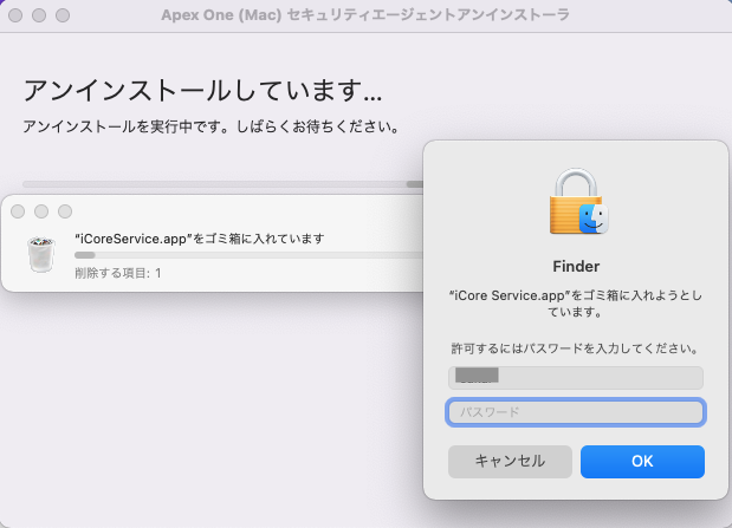{:.small}
1. 終了すると，以下のメッセージが表示されます．「閉じる」をクリックします．
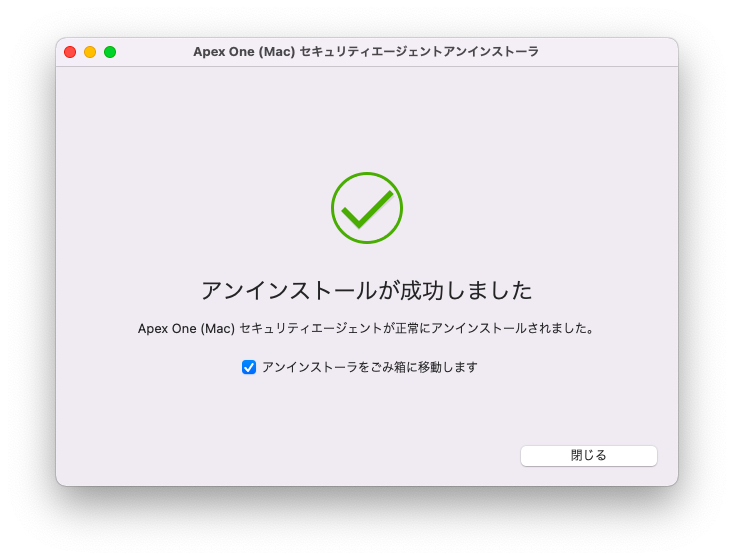{:.small}
