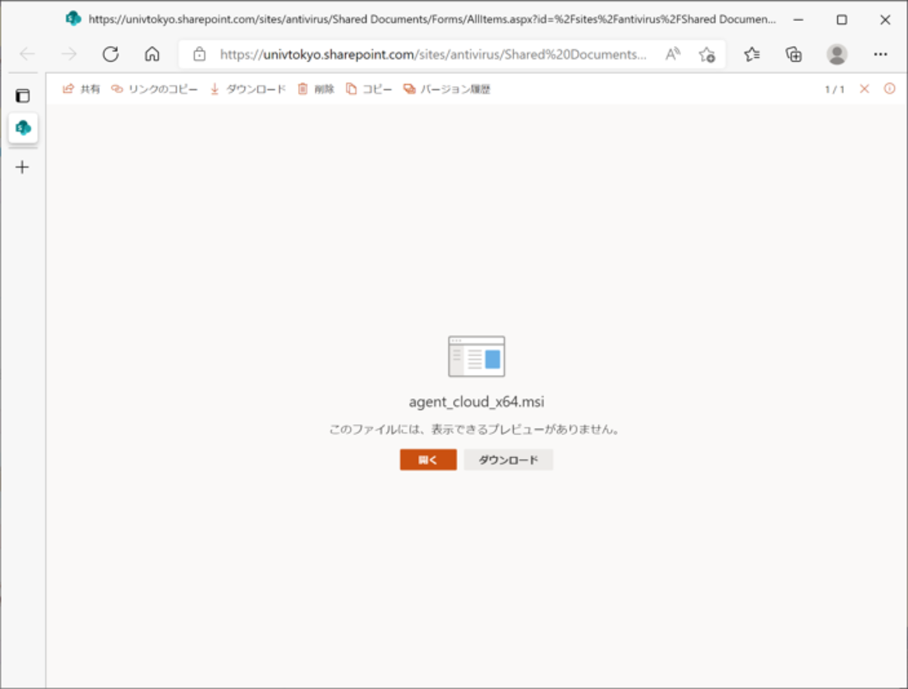
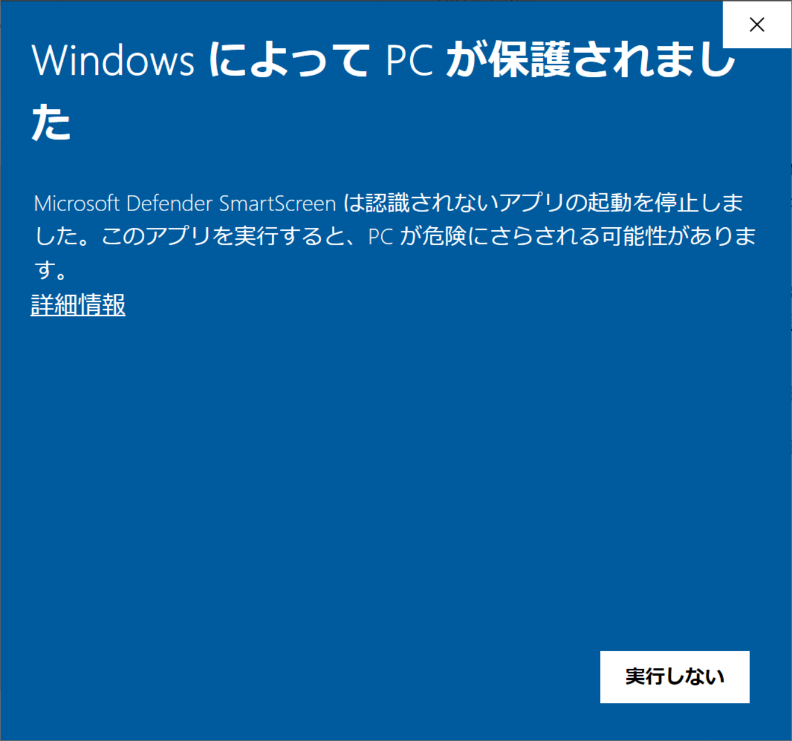
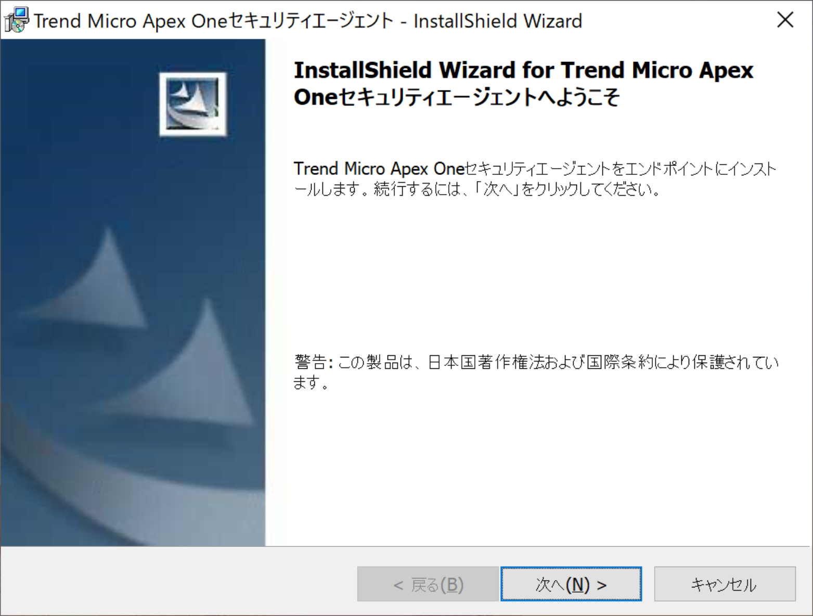
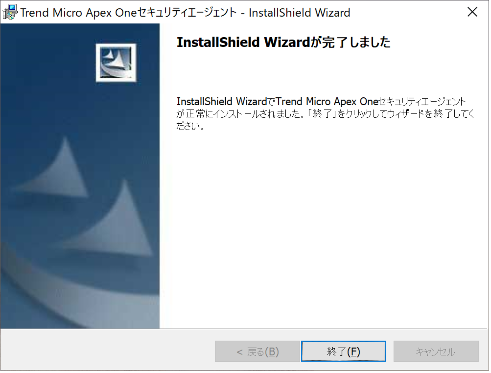
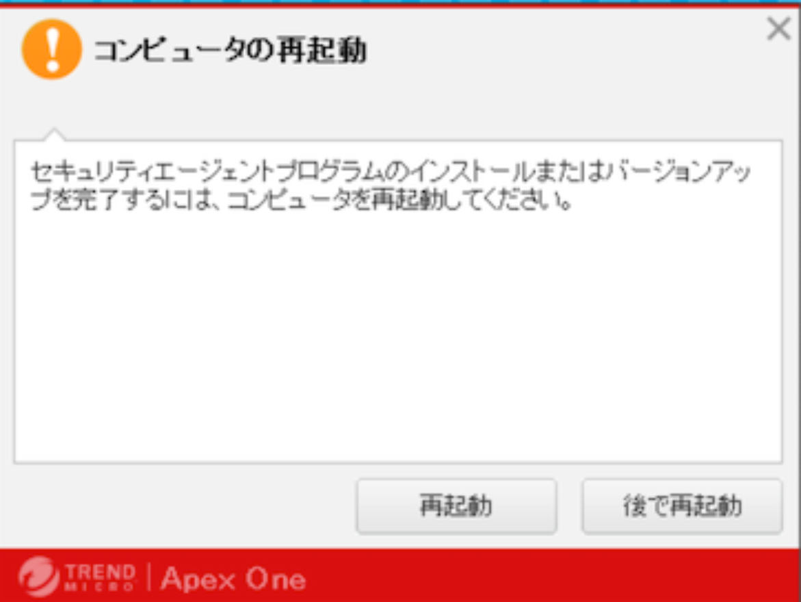
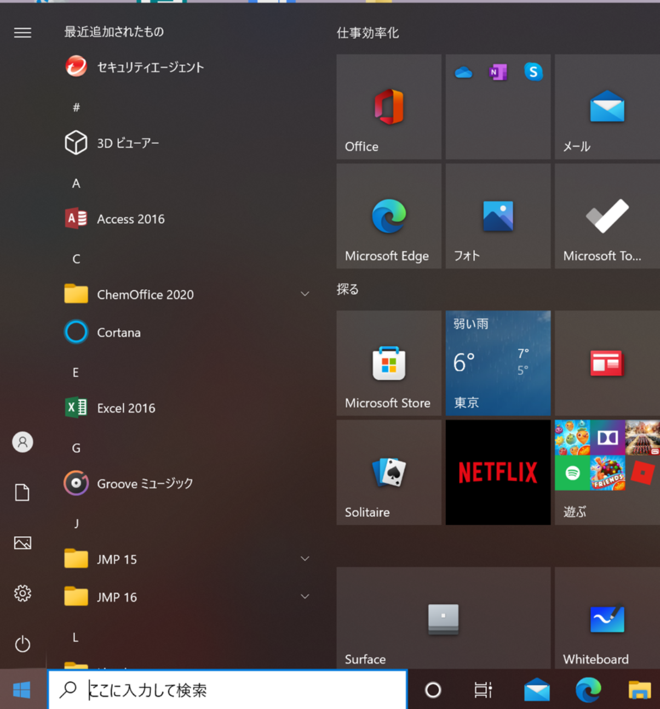
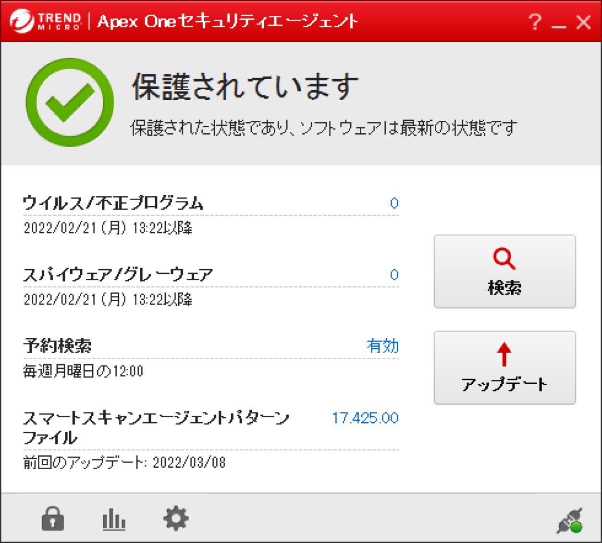
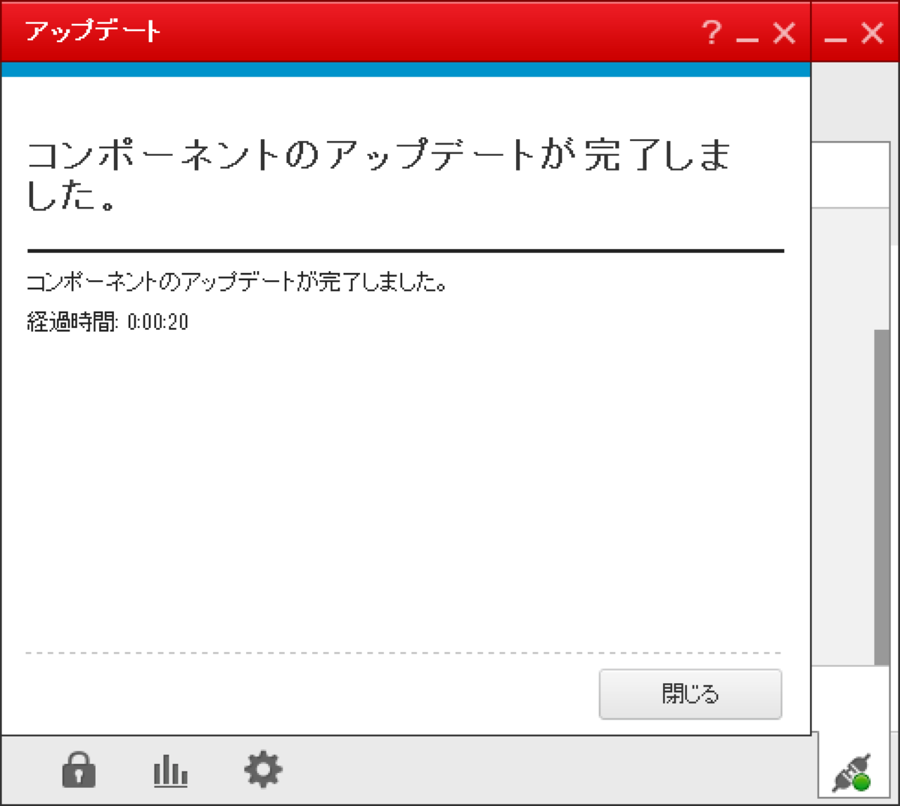

このページでは，UTokyo Antivirus LicenseをWindows OSのコンピュータで利用する方法を説明します．このライセンスの概要については，「[ウイルス対策ソフトウェア包括ライセンス](..)」をご覧ください．

すでに別のアンチウイルスソフトウェアがインストールされていると新たにインストールできない場合があります．先にアンインストールしてから手順を実行してください．

## インストール方法
{:#install}

1. 以下のリンクのいずれかにアクセスしてください（UTokyo Accountでのサインインが必要です）：
    * OSが64bitの方：[こちら](https://univtokyo.sharepoint.com/:u:/s/antivirus/EZGMnsqLZgFGr5_6nzxbv9MBoFN4X4A4-Q5MBEKMqHOZBg)
    * OSが32bitの方：[こちら](https://univtokyo.sharepoint.com/:u:/s/antivirus/EfPjx719Te5BjSbDxxx4OgwB4oZXtrD13r3gT-s0sqCpoA)
1. 以下のような画面が表示されたら，「ダウンロード」を押してダウンロードしてください． {:.small}
1. ダウンロードしたインストーラを実行してください．
1. 以下のような画面が表示されます．「詳細情報」をクリックすると「実行」が出てきますので，実行してください．
{:.small}
1. 以下のようなインストーラが起動しますので，「次へ」をクリックします．
{:.small}
1. しばらく待つと以下のような画面になります．「終了」をクリックします．
{:.small}
1. 以下のような画面が出ますので，「再起動」をクリックしてコンピュータを再起動してください．
{:.small}
1. 再起動が終わったら，スタートメニューから「セキュリティエージェント」を起動してください．
{:.small}
1. 起動したら以下のような画面になります．「アップデート」をクリックアップデートしてください．
{:.small}
1. アップデートが終わり，以下のような画面が出たら，準備は終了です．
{:.small}

## アンインストール方法
{:#uninstall}

1. Windowsのスタートメニュー開き，「Trend Micro Apex One セキュリティエージェント」フォルダ内の「セキュリティエージェント」を右クリックし，「アンインストール」をクリックします．
{:.small}
1. 開いた画面で「TrendMicroApex One セキュリティエージェント」を選択し，「アンインストール」をクリックします．
{:.small}
1. 開いたアンインストーラが終了するのを待ちます．
{:.small}
1. 上の画面が消え，以下のメッセージが表示されたら，OKをクリックします．
{:.small}
1. 下記のいずれかのフォルダを削除します．
  * 32ビットOS：`C:¥Program Files¥Trend Micro¥Security Agent¥`
  * 64ビットOS：`C:¥Program Files (x86)¥Trend Micro¥Security Agent¥`
