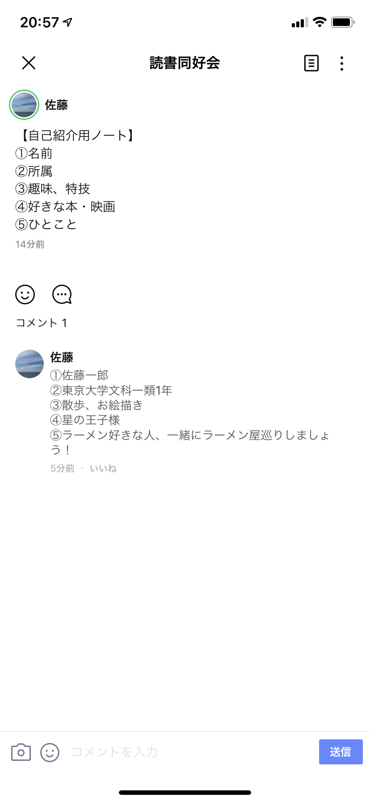
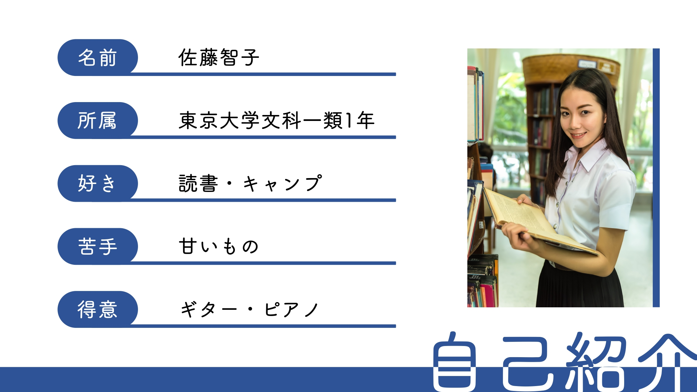
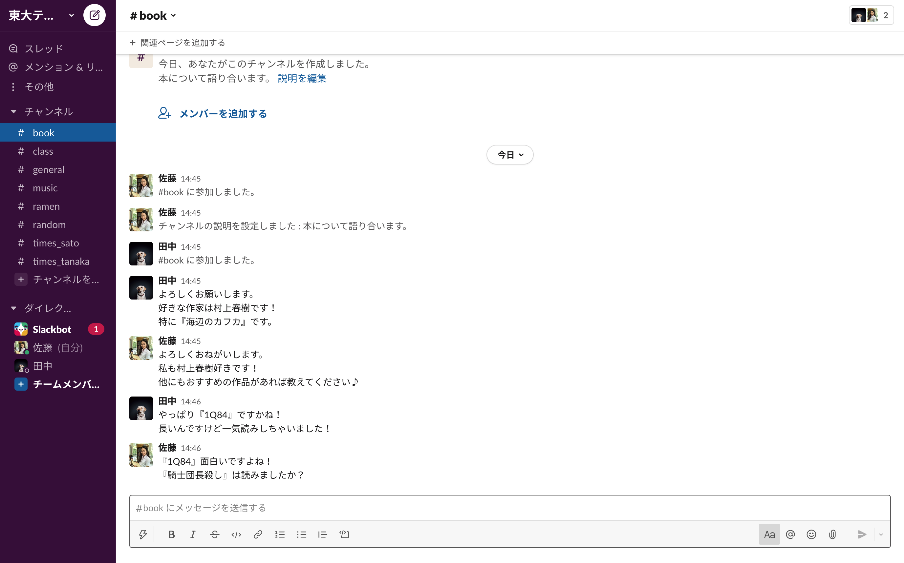
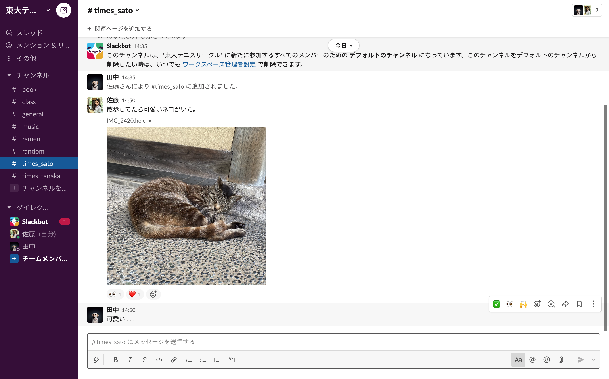
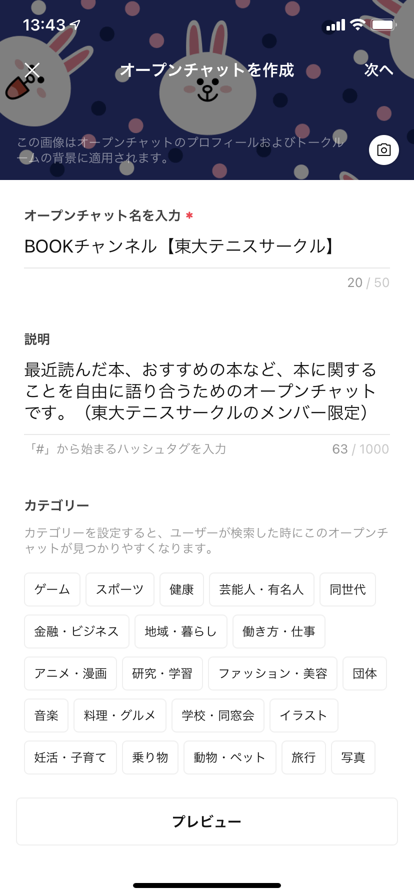
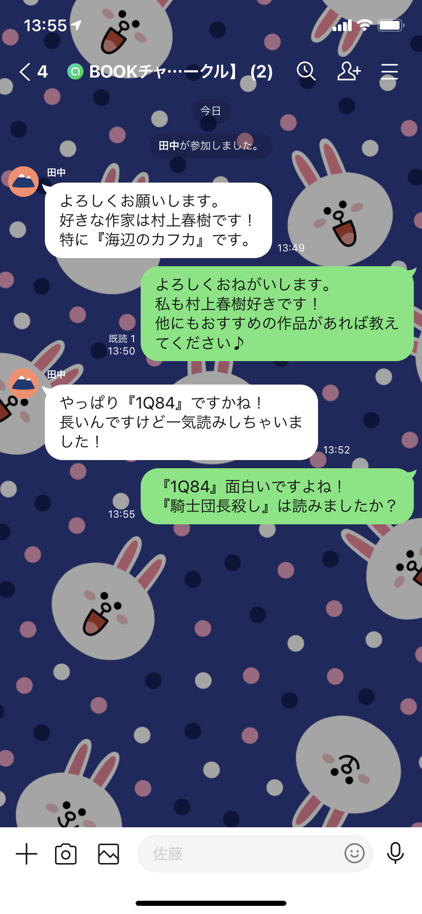

## はじめに
この記事では，学生がオンラインツールを用いて交流し，その関係を深めるための方法について紹介しています．
対面でのサークル活動が制限される状況においても，各メンバーのサークルへの帰属意識を高め，メンバー間の交流を促進したいという学生（サークルの運営者など）が主な対象です．
特に人数の多いサークルでは，オンラインでアクティブに交流することで，対面だけで活動するとき以上に多くの人と親密になれる可能性があります．
関係性を深めるために有効だと考えられる3つの交流方法「プロフィールの共有」「雑談しやすい環境づくり」「オンライン交流会の開催」を紹介するとともに，それぞれの交流方法に便利なツールを複数まとめました．
それぞれの項目で独立して情報を提示しているので，必要な項目から読み進めてください．

## 方法別ツール紹介
これからそれぞれの方法に即したツールの紹介を行います．それぞれのメリットやデメリットを挙げていますが，ツールの利便性はサークルで主に使用しているプラットフォームに大きく依存することに注意してください．
例えば，LINEで主にコミュニケーションを取っているサークルであれば，無理に外部のツールを使用せず，LINEに実装されている機能を利用した方が良い場合があります．サークルの現状と照らし合わせながら，より適当なツールを検討してください．

### プロフィールの共有
サークルのメンバーの自己紹介情報を共有することによって，各メンバーの人柄を知ることができます．リストアップされることで各メンバーがサークルへの帰属意識を高められるほか，メンバー間の会話のきっかけにもなり，交流が促進されます．

#### ツール選びのポイント
サークルで活動する中で，プロフィール情報はいつでも参照できる場にあると都合が良いことが多いです．（人数が多いサークルは一度に情報を把握しきるのが難しいため，その傾向がより高まります．）そのため，プロフィールの共有は通常のチャットで行うのではなく，いつでも参照できるよう情報が固定される場で行うことをオススメします．
また，メンバーが追加されるケースなどに備え，自由に情報が付け加えられるような仕組みになっていることが望ましいです．

#### オススメのツール
- **LINE**  
    LINEで交流することの多いサークルにオススメのプロフィールの共有方法です．
    - **ノートを使用する**  
        LINEのノートでは，いつでも見返すことが可能なテキスト，画像，動画などをグループに投稿することができます．
        プロフィール紹介文などを1つのノートにまとめて掲示することで，メンバーの情報を保存しておくことが可能です．
        ノートの作成方法は，公式の[LINEみんなの使い方ガイド](https://guide.line.me/ja/chats-calls-notifications/chats/create-notes.html)を参照してください．
               
        画像のように複数の質問項目を事前に挙げておけば，プロフィールの共有が行いやすくなります．
    - **アルバムを使用する**  
        LINEのアルバムでは，いつでも見返すことが可能な画像をグループに投稿することができます．
        ノートよりも画像を一覧しやすいため，プロフィール紹介を画像で行う場合はこちらの機能を使用するのがオススメです．
        アルバムの作成方法は，公式の[LINEみんなの使い方ガイド](https://guide.line.me/ja/chats-calls-notifications/chats/create-albums.html)を参照してください．  
        【プロフィール紹介画像の例】 
              
        画像でのプロフィール紹介は自由度が高く，人柄や個性が表れやすくなる一方，作成コストが高く，メンバーの負担が重くなる傾向にあります．
        サークルの性質や求める雰囲気を考慮した上で，ノートと使い分けてください．
         
        
- **Google ドライブ**  
    Slackなど，まとまった情報を固定するのに向かないプラットフォームを主に使用しているサークルにオススメのプロフィールの共有方法です．
    - **Google フォームで回答を集めてGoogleスプレッドシートに表示する**  
        Google フォームには，集めた回答をGoogle スプレッドシートに表示させる機能があります．
        この機能を用いることで，Google フォームで集めたプロフィール紹介用の回答をGoogle スプレッドシートで一覧できるようになります．
        Google フォームの回答をGoogle スプレッドシートに表示させる方法は，公式の[ヘルプページ](https://support.google.com/docs/answer/2917686?hl=ja)を参照してください．
        プロフィールを共有するGoogle スプレッドシートはGoogle ドライブの分かりやすい場所に保存し，簡単にアクセスできる状態にしておくことをオススメします．
        主に使用しているプラットフォームにリンクを固定しておく方法もあります．
    - **Google ドライブのフォルダを使用する**  
        Google ドライブではファイルを複数人で共有することができます．
        プロフィールの紹介画像などを各メンバーが作成し，任意のフォルダにまとめて保存しておけば，情報をいつでも見返すことが可能です．
        Google ドライブの使用法については，[こちら](/articles/google-drive/)のuteleconの記事が参考になります．

### 雑談しやすい環境づくり
オンラインでは事務連絡がメインになりやすいので，メンバーが自由に雑談できるようになるためには，自由なコミュニケーションに適した環境を作る必要があります．
事務連絡にとどまらない交流を通して，サークルのメンバー間でより親密な関係を築きやすくなります．

#### ツールの選び方のポイント
雑談しやすい環境を作るには，複数の交流スペースを作成できるツールが適しています．交流スペースが一箇所しかない場合，そこで情報を発信するハードルが上がるからです．
（特に，新しくサークルに入ったメンバーは発言をためらう傾向があります．）複数のチャンネルを作成できるツールであれば，情報発信の場が分散されるため，各メンバーが自由に発言しやすくなります．
交友関係を閉鎖的にしないために，チャンネルは誰でも簡単に出入りできる状態にしておくことが望ましいです．

#### オススメのツール

- **Slack**    
    Slackで交流することの多いサークルにオススメの雑談しやすい環境づくりの方法です．
    Slackは複数のチャンネルを作成できるほか，外部ツールを導入するなどして自由にプラットフォームをカスタマイズすることができるため，雑談を行いやすいツールのひとつと言えます．
    - **カスタム絵文字を追加する**  
        Slackには，ユーザーがオリジナルのカスタム絵文字を追加できる機能があります．
        この機能を用いることで，サークルの雰囲気に合わせた交流が行いやすくなり，他の人のメッセージに反応するモチベーションが高まります．
        カスタム絵文字の追加方法については，公式の[ヘルプページ](https://slack.com/intl/ja-jp/help/articles/206870177)を参照してください．
    - **趣味チャンネルを作成する** 
        Slackには簡単にチャンネルを作成できる機能があります．事務連絡メインで使用するチャンネルのほかに，同じ趣味の人と交流する趣味チャンネルを作成できます．
        チャンネルの作成方法については，公式の[ヘルプページ](https://slack.com/intl/ja-jp/help/articles/201402297)を参照してください．
              
        【趣味チャンネルの例】 
        - BOOKチャンネル：最近読んだ本，オススメの本について語り合う．
        - MUSICチャンネル：最近聴いた曲，オススメの曲について語り合う．
        - 授業チャンネル：履修して面白かった授業を紹介する．
        - ラーメンチャンネル：最近行ったラーメン店，オススメのラーメン店について語り合う．
    - **個人のチャンネル（times）を作成する**  
        メンバー個人がそれぞれ自身の専用チャンネルを作成できます．
        TwitterのTweetのように，その日あったことや考えていることなどをチャンネルで自由に発信すれば，その人の人柄や趣味などの情報が共有されます．
              
        発信されたメッセージに対して他の人がリプライすることもでき，メンバー間の会話が生まれやすくなります．
        また発信者側も，日常的にサークルのチャンネルにアクセスする習慣がつき，サークルへの帰属意識が高まります．
        デメリットとして，チャンネルの数が増えて煩雑になりやすいことが挙げられます．人数が多い団体には不向きな交流方法です．
        （個人のチャンネル（times）はダイレクトメッセージとは異なります．他のチャンネルと同じように作成し，他の人が自由に閲覧できる状態にしておいてください．）
        チャンネルの作成方法については，公式の[ヘルプページ](https://slack.com/intl/ja-jp/help/articles/201402297) を参照してください．
    - **Collaを導入する**  
        Collaは株式会社トラックレコードが提供しているSlack用のアプリケーションです．
        アプリが自動でメンバーに質問し，その回答を共通チャンネルで発表します．
        アプリが発表した質問の回答は，交流のきっかけになる可能性があります．
        デメリットとして，質問のために頻繁に通知が来ることが挙げられます．また，Slack公式のアプリではないことに注意してください．
        Collaの導入に関しては，[公式ページ](https://colla.jp/)を参照してください．
         

- **Discord**  
    Discordは複数のチャンネルを作成できます．音声でのやり取りを行いやすいという強みがあります．
    - **カスタム絵文字を追加する**  
        Discordには，ユーザーがオリジナルのカスタム絵文字を追加できる機能があります．
        この機能を用いることで，サークルの雰囲気に合わせた交流が行いやすくなり，他の人のメッセージに反応するモチベーションが高まります．
        カスタム絵文字の追加方法については，公式の[ヘルプページ](https://support.discord.com/hc/ja/articles/360036479811)を参照してください．
    - **趣味チャンネルを作成する**  
        Discordには簡単にチャンネルを作成できる機能があります．事務連絡メインで使用するチャンネルのほかに，同じ趣味の人と交流する趣味チャンネルを作成できます．
        チャンネルの作成方法については，公式の[ヘルプページ](https://slack.com/intl/ja-jp/help/articles/201402297)を参照してください．
        DiscordでもSlackの例にあげたようなチャンネルが作れます．
         

- **LINE**  
    LINEで交流することの多いサークルにオススメの雑談しやすい環境づくりの方法です．
    - **オープンチャットの趣味用トークルームを作成する**  
        LINEには，トークテーマごとに会話や情報交換を行える「オープンチャット」という機能があります．
        そこで，特定の趣味やテーマに関するトークルームを作成することができます．
        簡単に入室・退室することが可能で，LINEの友だち交換をする必要もありません．
        参加コードを設定して，サークルのメンバーだけにトークルームの公開範囲を限定しておくこともできます．
        オープンチャットの作成方法・利用法については，公式の[ヘルプページ](https://guide.line.me/ja/services/openchat.html)を参照してください．
        LINEのオープンチャットでもSlackの例に挙げたようなチャンネルが作れます．
            
            

### オンライン交流会の開催
オンライン交流会を開催することで，普段コミュニケーションを取らない相手とも交流することができます．多くのメンバーが集まることになるので，サークルの一体感を強めることにも繋がります．
ただし，参加人数が多い交流会の場合，特定の話題や遊ぶためのゲームなど，会話のきっかけになるものを用意しておかないと，話が発展しない恐れがあるため，注意が必要です．
（オンラインでの会話は1人の発言に全員の注意が集まるので，一般的にオフラインでの会話よりも発言のハードルが高まります．）

#### ツールの選び方のポイント
オンライン交流会を開催する場合，テキストベースのコミュニケーションツールよりも音声・映像ベースのコミュニケーションツールを使う方が良いです．
タイムラグが少なく，より多くの情報のやりとりができるからです．画面共有やチャットなど，使用頻度の高い機能が備わっているものがオススメです．
オンライン会議ツールを使った交流方法については，[こちら](/articles/online-interaction/)のuteleconの記事も参考になります．

#### オススメのツール

- **Zoom**  
    ホストが事前にミーティングを設定して開かれるZoomは，開催日時が決まったある程度大型のイベントを開くのに向いています．
    画面共有にも適しており，同じ画面を見ながら会話を進めることもできます．
- **Discord**  
    出入りが容易で，誰がルーム内にいるかルーム外からでも把握できるDiscordは，Zoomで開かれるものよりもライトなイベントに向いています．
    URLを共有する必要もないため，事前告知なく気が向いた人が参加するイベントも開催しやすいです．
    
#### オンライン交流会のテーマ・コンテンツ
- **オンラインゲームで交流する**  
    オンライン交流会の開催に適したツールを利用し，オンラインゲーム会を開くことができます． 
    【オンラインゲーム会の例】
    - 人狼：会話ベースの推理ゲーム．アプリを使用して行うとスムーズに進められる．プレイ人数5人〜15人程度．
    - 水平思考クイズ：1人が問題を出し，残りの人が回答する形式のクイズ．プレイ人数2人以上．
    - 絵しりとり：絵でつなげていくしりとり．実際の紙に描くことも，専用アプリを使用することもできる．プレイ人数2人以上．
- **雑談会を開く**  
    オンライン交流会の開催に適したツールを利用し，特定のテーマの雑談会を開くことができます． 
    【雑談会の例】
    - ビブリオバトル：参加者が制限時間内にお気に入りの本の魅力を紹介しあい，1位を決定する．テーマを本ではなく，映画，音楽などに置き換えることもできる．共通の趣味を持った人で行うとより楽しめる．
    - お絵描き会：参加者が時間を決めてそれぞれ自由に絵を描き，最後に見せ合う．絵以外の創作を行うことも可能．絵を描いている途中に会話することもできるが，それぞれ作業中であるため，無言の時間も苦になりにくい．
    - 動画鑑賞会：共通の動画を同時に視聴しながら会話する．テレビ番組やYouTubeのプレミア配信など，リアルタイムで配信されているものをそれぞれの端末で視聴することを推奨する．（画面共有による映画やドラマなどの同時観賞は，その動画の配信元や使用ツールの規約によって規制されている場合がある．）
