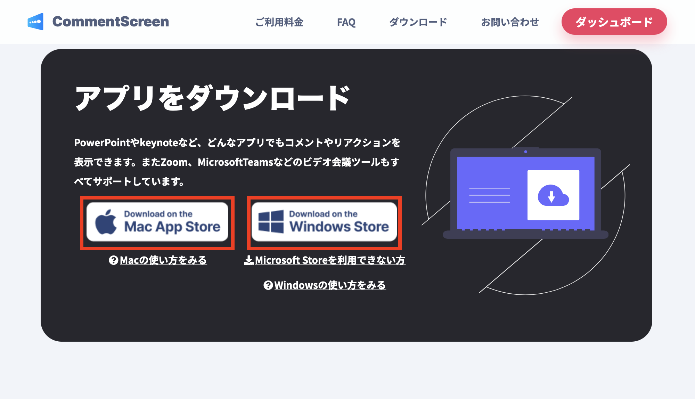
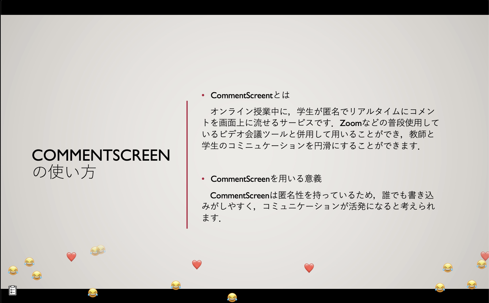
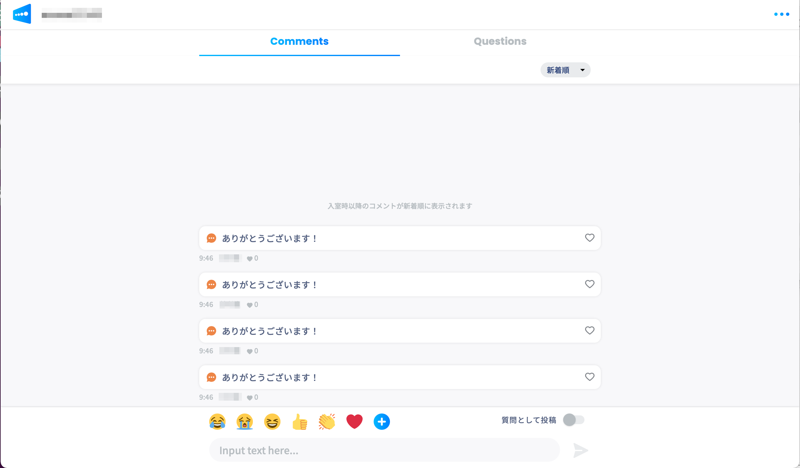

## この記事のハイライト
授業でCommentScreenを利用してみたいと考えている教員，および実際にこのサービスを利用する学生に対し，その使い方等をメインに説明します．

## CommentScreenとは
### サービスについての説明
CommentScreenとは，ビデオ会議ツールの画面上にリアルタイムでコメントを流せるサービスです．オンライン授業で普段使用しているZoomなどのビデオ会議ツールと併用することで，学生からコメントをもらうことができ，教員と学生のコミニュケーションを円滑にすることができます．

### 基本情報
#### サービス提供元
CommentScreen株式会社

#### 利用プラン
教育関係者および学生向けの有償プランとして，Teacherプラン，Teacher Proプランが提供されています．これらのプランの間には，同時に参加できる最大人数や，イベント内で作成できるアンケートの回数に違いがあります．なお，無償で使用できるFreeプランや，無償での短期間のトライアルも提供されているようですが，同時に利用できる人数や使用できる機能に大幅な制限があります。(2023年2月現在のものです．詳しくは，[CommentScreenの公式サイト](https://commentscreen.com/price?education=true)から確認できます．）

## CommentScreenの特徴・メリット
CommentScreen内のコメントは匿名性を持つため，誰でも書き込みがしやすく，コミュニケーションが活発になると考えられます．また，気軽にコメントができるので，教員と学生間の距離が近く感じられるという特徴があります．これらのことから，学生の授業への積極性が増すという効果が期待できます．

### 使いやすさ
CommentScreenの大きな特徴として，Zoomなどの普段使用している使い慣れたビデオ会議ツールと併用して用いることができるため，利用し始めやすく，このことにより非常に使いやすいツールであることが挙げられます．また，コメントを集めるためのルームも容易に設定でき，教員はQRコードやURLを提示するだけで学生の参加を促せます．学生側も授業時にスマホやパソコンのブラウザからリンクに飛ぶだけで簡単に参加でき，アプリをダウンロードする必要もありません．以上のことから，CommentScreenを用いる心理的障壁はかなり小さく，授業でも比較的躊躇なく取り入れられるのではないかと思われます．

### CommentScreenを用いるべき授業のスタイル・規模
このツールは基本的にオンライン授業での利用が中心です．これまでに述べたサービスの性質上，数十人から数百人といった中規模から大規模の授業において，その効果を最も発揮すると考えられます．また，学生からのコメントが流れるため，学生からの様々な意見や発言を求めるスタイルの授業に向いています．さらに，授業以外の場面でも上で述べたような中規模以上のオンラインのイベントで効果的に利用することができると思われます．

### 類似のサービス「Slido」との使い分け
#### 「Slido」とは
Slidoは，Q&Aやライブ投票・アンケートなど，授業や会議・講演会などでの参加者との双方向コミュニケーションに役立つ機能を提供しているWebサービスです．  
(詳しくはこちらの[Slidoの記事](/slido/)をご覧ください．)

#### 「Slido」との比較
CommentScreenは，Slidoとは違い，画面共有している画面上にコメントが流れるため，他人のコメントやスタンプを見る際に画面を遷移させたり視線を大きく移動させたりする必要がないという特徴があります．また，デザインが動画のコメントに似ており，学生が楽しく授業に参加できます．

一方で，リアルタイムでの授業への参加が重視されているツールのため，Slidoのようにコメント一つ一つに対して「いいね」などのリアクションをする機能がなく，多くの人の共通して興味をもっているコメントが分かりにくいという側面もあります．場面によって使い分けると良いでしょう．

## 実際の使い方
以下ではCommentScreenの実際の使い方を紹介していきます．
まずは初回のみ必要な作業について説明し，次に授業前，最後に実際の授業中の操作方法について説明します．

### 初回に必要な設定
アカウントの作成とダウンロードが必要です．以下ではそのやり方について説明します．なお，ダウンロードやアカウント作成は，授業で用いる教員のみが初回に必要な作業です．授業を受ける学生は必要ありません．

#### アカウントの作成
[アカウント作成のページ](https://commentscreen.com/auth/signup)に行き，アカウントを作成します．

#### ダウンロード
CommentScreenの[ダウンロードページ](https://commentscreen.com/#download)に行き，Mac，もしくはWindowsのダウンロードボタンを押し，画面に表示される指示通りにダウンロードを行います．

### 授業前の設定方法
授業前の設定として，教員は授業ごとにサインインとルームの立ち上げを行い，その後ルームに学生を入れる必要があります．

#### サインイン
アプリを起動し，右下の「Login」ボタンを押し，登録したメールアドレス，パスワードを入力し，ログインする．

#### ルームの立ち上げ
授業内で学生がコメントやスタンプを投稿するルームを作成します．  
1. 「Create new room」というボタンを押します．
2. 「月1（授業名）第1回」のように授業やイベントを表す適当なルーム名を入力し，日付を選択した後，「Create room」ボタンを押します．

#### ルームに学生を入れる
教員が作成したルームに学生を招待します．ルームへの招待は，WebサイトのURL，もしくはQRコードを共有することで行うことができます．なおこのとき，学生がアプリをダウンロードする必要はありません．以下では，それぞれのルームに招待する2つの方法を説明します．

方法①：WebサイトのURLをコピーして共有する

上の画像の青い「クリップボードにコピー」と書かれた部分をクリックすると，立てたルームのURLをクリップボードにコピーすることができます．これをZoomなどのオンライン会議ツールのチャットや授業に関する情報が載っているサイトなどで共有することで，学生にそのルームに入ってもらうことができます．

方法②：QRコードを共有する

上のように，画像の青い「QRコード」と書かれた部分をクリックすると，ルームにアクセスできるQRコードが表示されます．

これをスマホのカメラ等で読み取ってもらうことで，学生にルームに入ってもらうことができます．

### 授業中の実際の使い方
#### 画面共有
まず，CommentScreenでルームを立ち上げた際に表示される以下のような画面で，「display enable」という部分にチェックがついていることを確認してください．これにより，学生のコメント等が教員の画面上に表示されるようになります．

次に，授業で用いるZoomなどのオンライン会議ツール上で，教員の画面を共有します．そうすると以下の画像のように書き込みが学生にも共有され，学生もコメントやスタンプなどが流れてくるのをリアルタイムで見ることができます．

このとき，Zoomなどで画面を共有する方法として，画面全体の共有を選択する必要があります．ウィンドウごとの共有ではコメントなどが学生の画面に共有されないので，注意してください．

#### 学生側の画面
教員から共有されたリンクを開くか，またはQRコードを読み取ることで，学生は以下の画面に飛ぶことができます．この画面でコメントを寄せたり，スタンプを押したりすることで，教員の画面に表示され，全体に共有されます．

#### アンケート機能
授業前に教員がCommentScreenのルームでアンケートを作成しておくことで，授業中に学生にアンケートを取ることができます．
ただし，加入しているCommentScreenのプランにより，1回のイベントで実施できるアンケートの回数に制限があるため，事前にプラン内容を確認してください．詳しくは，[CommentScreenの公式サイト](https://commentscreen.com/price?education=true)をご覧ください．

## CommentScreenを用いて授業をする場合のポイント
### 荒らしへの対策
学生が自由にコメントやスタンプなどでリアクションできるツールにおいて，荒らしは一つの大きな問題のひとつです．CommentScreenも例外ではありません．そのような行為をする学生がいるとは信じたくありませんが，授業の冒頭などで，事前に「荒らしがあった場合はすぐにCommentScreenの利用を停止する」などの忠告をしておくことで荒らしを起こりにくくするなどの対策が考えられます．また学生に対しては，荒らしが発生した場合も過剰反応することなく，無視を徹底するなどの対策を取るように示しておくことなども重要だと考えられます．他にも，実際に悪質なコメントがたびたび投稿されているのを確認した場合，そのようなコメントが共有画面に映し出されないように，教員側で一時的にCommentScreenのアプリケーションを終了するという方法もあります．

### グッドプラクティス
CommentScreenを使用した授業の実践例を紹介します．工学系研究科の杉田直彦先生による「生産システム」の授業(学生数は約100名)において，実際にCommentScreenが使わました．教員，そして学生の双方が，ともにお互いとの距離が近く感じられて，使いやすかったと感じているようです．  
（詳しい内容を知りたい方は，[杉田先生の生産システムの記事](/good-practice/interview/sugita)をご覧ください．）
