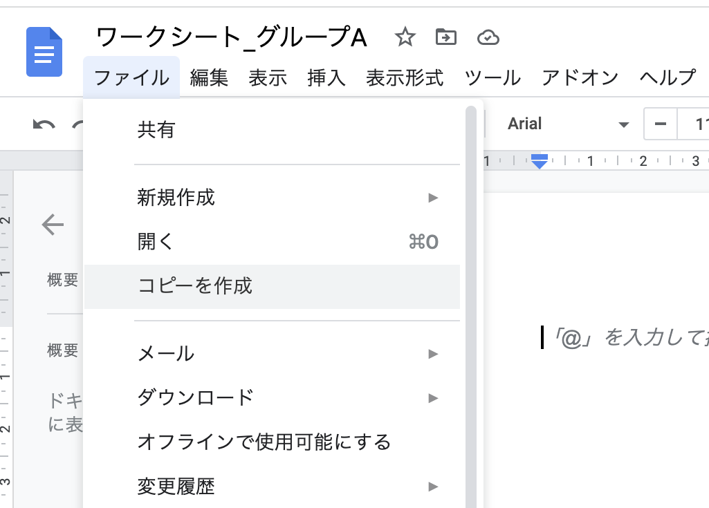
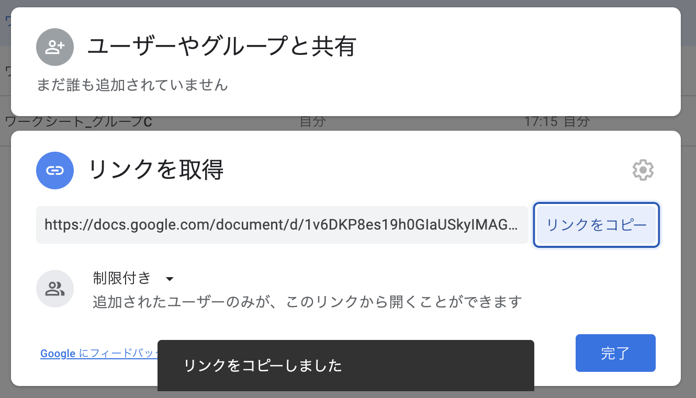
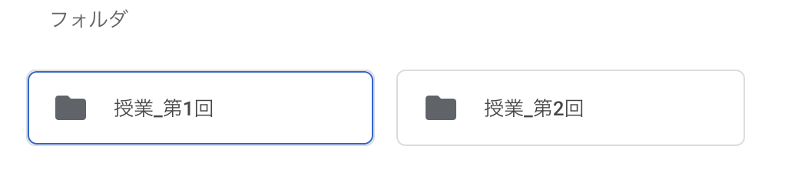

## はじめに

日頃，授業や会議の準備，資料の整理などにGoogleドライブを使用する中で，時折，ファイルやフォルダの複製を伴う作業が生じます．

**ファイルの複製：**例えば，授業のグループワークで使用するワークシートをGoogleドキュメントで作成し，同じ雛形でグループの数だけ用意したいとき，グループの数が多ければ，何度も複製の操作を繰り返す手間が掛かります．一度にいくつも複製できたら，とても便利です．
  

**フォルダの複製：** 「資料や写真などファイルの整理をしたいがバックアップを取っておきたい」というとき，フォルダごと複製できると便利です．例えば，何百枚もの写真が入ったフォルダから，半分ほど選抜してチームに共有する必要があるとしましょう．フォルダごと複製できれば，コピーフォルダ内で不要なものを削除して，チームメイトと共有することができます．そのかたわら，オリジナルのフォルダのデータはそのままバックアップとして保存しておくことができます．
  

この記事では，**従来の操作（GUI）では難しいGoogleドライブのファイルやフォルダの複製作業を，プログラミング技術（GAS）を用いて実現する方法**を紹介します．

プログラミングを学んだことのない初心者の方でもすぐに実行できる簡単な方法を画像とともに説明しています．ぜひお手元で試しながらお読みください．

## 復習 手動で1つ1つ複製する方法

### ファイルを手動で複製する方法

まず，（プログラミング等を用いることなく）単純操作のみで複製する方法をおさらいします．

**ファイル**（Googleドキュメント・Googleスライド・Googleスプレッドシートなど）**を手動で複製する方法は，2通り**あります．

とても簡単な操作なので，**複製したいファイルの数が少ない場合は手動で複製しても良い**でしょう．

**方法1：**オリジナルファイルを開いた状態で，メニューの［ファイル］をプルダウンで開き，［コピーを作成］をクリックします．
  

下の画像のようなウィンドウがポップアップして，複製してできるファイルの名前を変更したり，複製先のフォルダを指定したりすることができます．
  

**方法2：**フォルダ内でオリジナルファイルを選択します（連続する複数ファイルを一度に選択できます）．右クリック（［Ctrl］+ クリック）し，開いたタブから［コピーを作成］をクリックします．
  

方法1と2では，できることに差があります．

- 方法1
  - 複製できる数: 1つのオリジナルファイルから1つのコピーファイルを作成できる。
    （AからA'を作成できる）
  - ファイル名: 任意のファイル名を入力する欄が出現する。
    入力しなければ「（オリジナルのファイル名）のコピー」になる。
  - 保存先: 保存先のフォルダを指定できる。
  - コメントと提案: 引き継ぐかどうかを選択することができる。
- 方法2
  - 複製できる数: 複数のオリジナルファイルからそれぞれ1つずつコピーファイルを作成できる。
    （一度にA・B・CからA'・B'・C'を作成できる）
  - ファイル名: 自動的に「（オリジナルのファイル名）のコピー」になる。
    必要があれば複製後に変更操作を行う
  - 保存先: オリジナルファイルがあるフォルダに作成される。
  - コメントと提案: 引き継がれない。

### フォルダは手動で複製できない

Googleドライブには，**簡単な操作でフォルダそのものを複製する機能はありません．**

例えば，以下のようなフォルダがあったとします．

```text
フォルダ「授業_第1回」
  ┝─ ファイル「ワークシート_グループA」
  ┝─ ファイル「ワークシート_グループB」
  └─ ファイル「ワークシート_グループC」
```

これを複製し，「授業 第2回」の分を作成したい場合は，「授業 第1回」以下の3つのファイルをそれぞれ複製した後，新規作成した「授業 第2回」のフォルダに移動させる必要があります．
  

## Google Apps Script（GAS）を使って自動で複製してみましょう


ここからは，GASを使ってファイルやフォルダを複製する方法を紹介します．
（GASについて知りたい方は，[GAS（Google Apps Script）を使ってみましょう
](/articles/gas)をご覧ください．）

### ファイルの複製方法

**GASを用いれば，1回の操作で複数のコピーファイルを作成することが可能となります．**

- 今回紹介する方法
  - 複製できる数: 1つのオリジナルファイルから
    コピーファイルをいくつでも作成できる。
  - ファイル名: 自動的に「（オリジナルのファイル名）_（番号）」になる。
  - 保存先: オリジナルファイルがあるフォルダに作成される。
  - コメントと提案: 引き継がれない。

1. まず，Googleドライブを開きます．

2. 画面左上の［新規］をクリックし，［その他］から［Google Apps Script］を選択します．
  

3. スクリプトエディタが開いたら，予め記入されている記号や文字列を消去して，全ての行を空欄にします．スクリプトエディタとは，スクリプトを編集するためのスペースで，番号が振られた行が連なっている場所です．
  

4. 下記のスクリプト（テキスト）をコピーして，スクリプトエディタ上にペーストしてください．

    ```js
    function copyFiles() {
      const id = "ファイルID"; // コピー元となるファイルのID
      const n = 半角数字; // コピーするファイル数

      const fileBase = DriveApp.getFileById(id);
      const nameBase = fileBase.getName();

      for (let i = 0; i < n; i++) {
        const nameNew = `${nameBase}_${i + 1}`;
        fileBase.makeCopy(nameNew);
      }
    }
    ```

5. 複製したいファイルを右クリックし，［リンクを取得］を選択します．
  

6. URLをコピーします．
  
  （または，ファイルを開くとウィンドウの上部にそのファイルのURLが表示されるので，それをコピーすることも可能です．）
  

7. 上から2行目の「**ファイルID**」という部分を，6. でコピーしたURLに置き換えます．ただし，ここで必要なのはURLの中にある，ファイルIDの部分のみです．ファイルのIDは，`https://docs.google.com/document/d/`より後ろ，`/edit`より前の部分です．他の部分を消去して，ファイルIDのみを残します．

    ☞ファイルIDとは：URLの中で，他のファイルやフォルダと共通しない，そのファイルやフォルダだけが持つ固有の文字列です．
      

8. 3行目の「**半角数字**」という部分に，複製したいファイルの数を半角で入力します．ここでは8グループ分のシートを作成することにします．
  

    さて，これでスクリプトの全文が完成しました．

9. ［プロジェクトを保存］ボタン（ツールバーの左から3番目にあるフロッピーディスクのアイコン）をクリックします．（Windowsであれば［Ctrl］+ ［s］，Macであれば［command］+ ［s］を押しても同様に保存できます．）
  

10. 必要に応じて［無題のプロジェクト］欄（Apps Scriptのロゴの右隣）に，プロジェクト名を入力します．
  
  

11. ツールバーの［実行］ボタン（左から2番目の再生マークのアイコン）をクリックします．
  

12. 初回は，アクセス権限の承認を求めるダイアログがポップアップするので，［権限を確認］をクリックします
  

    使用しているアカウントの種類によっては，さらに以下の画像のようなウィンドウがポップアップすることがあります．少々不安になる文言ですが，慌てずに，下部の［詳細］をクリックしてください．（一見すると［安全なページに戻る］をクリックしたくなりますが，戻るとスクリプトを実行することができません．このウィンドウは、自分でGASを作成した場合には必ず表示されるものなので、心配しないでください。）
      

    展開した部分の下部［（プロジェクト名）（安全ではないページ）に移動）］をクリックします．（心配無用です．）
      

13. アカウントを選択するよう求められるので，複製したいオリジナルのファイルが置かれているドライブのアカウントを選択し，さらに［許可］をクリックします．
  
  

14. 許可すると，少々待った後にスクリプトが実行されます．
  

15. ドライブのフォルダ内を確認してみてください．ファイルが複製されていることが分かります．ファイル名は，オリジナルのファイル名に「_1」「_2」「_3」といった番号が追加されたものになります．
  

### フォルダの複製方法

**Googleドライブの標準的な機能（GUI）を使用してフォルダを複製する方法はありませんが，GASであれば実現可能です．**

また，この方法では，フォルダに含まれるサブフォルダ（いわゆる「子フォルダ」や「孫フォルダ」）やファイルなど全てが複製されます．

フォルダの中の多くのファイルを全て手作業で複製するのはとても骨が折れる作業ですから，ぜひ自動化を試していただきたいところです．

行程は，前項「ファイルの複製」の1〜14とほとんど同じです．

まず，新規スクリプトを作成するため，1〜3を同様に行います．

次に，4. のところでは，下記のスクリプトをコピーして，スクリプトエディタ上にペーストしてください．

```js
function mainCopyFolder() {

  const folderIdSrc = "フォルダID"; // コピー元のフォルダid
  const folderNameDest = "新フォルダ名"; // コピー先のフォルダ名

  const folderSrc = DriveApp.getFolderById(folderIdSrc);
  const folderDest = folderSrc.getParents().next().createFolder(folderNameDest);

  copyFolder(folderSrc, folderDest);
}

function copyFolder(src, dest) {
  const folders = src.getFolders();
  const files = src.getFiles();

  while (files.hasNext()) {
    const file = files.next();
    file.makeCopy(file.getName(), dest);
  }

  while (folders.hasNext()) {
    const subFolder = folders.next();
    const folderName = subFolder.getName();
    const folderDest = dest.createFolder(folderName);
    copyFolder(subFolder, folderDest);
  }
}
```

上から空行入れて3行目の「**フォルダID**」という部分を，複製したいオリジナルのフォルダのIDに置き換えます．フォルダのIDは，URLの`https://drive.google.com/drive/folders/`より後ろ，`?usp=sharing`より前の部分です．（URLの取得のしかたは，ファイルの複製の行程5, 6と同様です．）

上から3行目の「**新フォルダ名**」という部分に，コピーフォルダに付けたいフォルダ名を入力します．例えば「授業 第1回」のフォルダを複製して「授業 第2回」と名付けることができます．
  

さて，これでスクリプトの全文が完成しました．

続けて，前項「ファイルの複製」の行程9〜14を行います．

Googleドライブの中の，オリジナルフォルダが置かれている場所を確認してみてください．同じ場所にコピーフォルダができていることが分かります．フォルダの中を確認してみるとファイルもコピーできていることがわかります．
  

### スクリプトは繰り返し使用できます

一度作成・保存したスクリプトはGoogleドライブ上に格納されます．

スクリプトファイルをクリックして開き，ファイルID・フォルダIDや複製したい数などの情報を必要に応じて書き換えれば，何度も繰り返して使用することができます．

## あわせて読みたい記事

[GAS（Google Apps Script）を使ってみましょう
](/articles/gas)


オンラインのグループディスカッションで生じやすい問題とその対策案

オンラインのグループディスカッションで便利なワークシート


[オンライン授業情報交換会 第11回 オンライン授業で使えるツール(1)](/events/luncheon/2020-06-24/)
