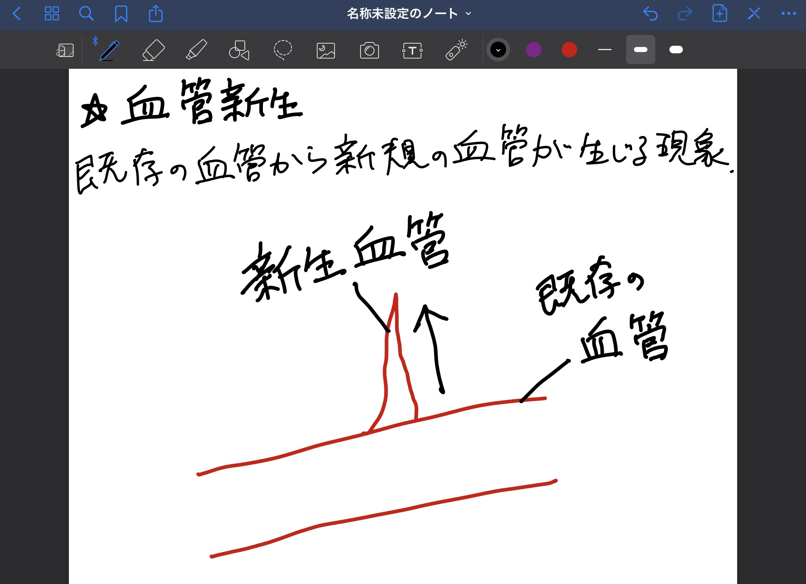

## この記事のハイライト

* この記事では，GoodNotes 5を用いて画面上で板書を行う方法について紹介しています．
* こんな場面で使用できます．
    * リアルタイムで板書をしながら授業を行いたい．
    * 事前に作成した資料（PDF，PowerPoint，Wordなど）に書き込みながら授業を行いたい．
    * 学生の提出課題（PDF，PowerPoint，Wordなど）を添削したい．
    * 以下のようなことはできません．
        * Windowsに対応していません．（iPhone，iPad，Macのアプリケーションです）

### １．アプリケーションについての説明

読み込んだスライドや文書（PDF，Power Point，Wordなどに対応）に，Apple Pencilによる手書きの注釈を付けることが可能なメモ／描画用アプリケーションです．

<figure>

</figure>

本記事では，iPad上でApple Pencil（別売）を用いてGoodNotes 5を使用する方法について説明します．Zoomと組み合わせて使用することで，リアルタイムで手書きの板書をしながら授業を展開することが可能です．

iPhoneやMacでもAppの購入や操作自体は可能ですが，iPhoneの場合は画面サイズが小さいため，タッチペン等を別途購入して使用したとしても，細かい板書はしにくく不向きだと考えられます．またMacの場合は，ペンタブレットを別途購入すれば板書は可能ですが，iPadのように画面に直接タッチして書き込むことはできません．

（注）Apple Pecilは，Apple純正のタッチペンで，iPadのみに対応しています．2021年3月現在では，iPhoneおよびMac共に，Apple Pencilには対応していません．

* 提供元
    * Time Base Technology Limited
    * 公式サイト　[https://www.goodnotes.com/](https://www.goodnotes.com/)

* 使用可能な環境
    * 端末・OS 
        * iPad：iPadOS 12.0 以降.
        * iPhoneまたはiPod touch：iOS 12.0 以降.
        * Mac：MacOS 10.15 以降.
        * ※Windows非対応
    * インストールに必要なドライブ容量
        * iPad：154.4 MB
        * iPhone：163.5 MB
        * Mac：167.7 MB
        * ※別途読み込んだファイルの保存域が必要．

    * 必須またはオプションのアクセサリ
        * 必須ではないがApple Pencilの使用を推奨．
        * オンライン授業で使用する場合は，Zoom等のビデオ会議用ツールが別途必要．

* 運用コスト
    * 費用
        * Appは購入する必要があります．（980円で購入できます）
        * iPadの場合は，以下のいずれかの使用を推奨．
        * Apple Pencil（第1世代）10,800円（税別）
        * Apple Pencil（第2世代）14,500円（税別）
        * 非推奨だが，iPhoneおよびMacの場合は，タッチペン（100円〜5,000円程度）またはペンタブレット（5,000〜20,000円程度）の別途購入により，ペンを用いた板書が可能．
    * 通信量の例
        * 0 MB（GoodNotes 5自体はオフラインで使用可）
* 授業を受ける学生側が準備すること
    * なし

### ２．インストール方法と起動方法

iPad，iPhone，iPod touchまたはMacにて使用できます．以下ではiPadでの使用方法を記載します．
* App Storeにて「GoodNotes 5」を購入する．
* Appストアの公式サイトへは，下のURLからジャンプできます．
* [https://apps.apple.com/app/goodnotes-5/id1444383602#?platform=ipad](https://apps.apple.com/app/goodnotes-5/id1444383602#?platform=ipad)

        

<figure>

</figure>

* 「GoodNotes」と表示されたアイコンをタッチして起動する．

<figure>

</figure>

### ３．基本的なツールについて
基本的な操作は，GoodNotesの公式サイトに載っています（英語，繁体字，簡体字のみ）．
[https://support.goodnotes.com/hc/en-us/articles/360000690095-Getting-started-with-GoodNotes-5](https://support.goodnotes.com/hc/en-us/articles/360000690095-Getting-started-with-GoodNotes-5)

以下では，基本的なツールと簡単な使用方法を記載します．

#### ペンツール    

<figure>

</figure>

手書き用の最も基本的なツールです．「万年筆」「ボールペン」「筆ペン」の3種類から選択できます．

それぞれを使用した際の筆跡は下の画像でご確認ください．

<figure>

</figure>

<figure>

</figure>

<figure>

</figure>

下の画像のように，ペンのカラーや太さを変更することが可能です．

<figure>

</figure>   

<figure>

</figure>

<figure>

</figure>

#### 消しゴムツール

<figure>

</figure>

ペンツールやマーカーツールなどで描画した文字や線を消去するツールです．

アイコンを長押しすると，下の画像のようにメニューが現れ，ストローク全体を消去したり，蛍光ペンのみを消去したりすることも可能です．

<figure>

</figure>

#### 蛍光ペンツール
    
<figure>

</figure>

マーク用ツールです．蛍光ペンツールを使うと，元の描画やPDFファイル上の文字の上から線を引いても，描画や文字の部分が避けられた線が引かれます．

下の画像のように，アイコンを長押しすると現れるメニューの中の「直線で描く」を選択しておけば，多少ブレた線を引いてしまっても自動的に直線に修正されます．

<figure>

</figure>

ペンツールと同じく，下の画像のように蛍光ペンのカラーや太さを変更することが可能です．

<figure>

</figure>  

<figure>

</figure>

<figure>

</figure>

#### シェイプツール

<figure>

</figure>

図形を作成可能なツールです．

シェイプツールを用いて手描きで楕円（だえん）や円，四角形，三角形等を描画すると，下の画像のように自動で近い形状に修正されます．

<figure>

</figure>

#### なげなわツール

<figure>

</figure>

描画した文字や図形を選択して移動したり，文字・図形の拡大や消去をすることが可能なツールです．

（例）下の画像は，シェイプツールで作成した楕円（だえん）を移動している様子です．

<figure>

</figure>

#### 画像ツール

<figure>

</figure>

デバイス上の画像を選択して，挿入できるツールです．iPad上の「フォト」や「ファイル」から選択可能です．

<figure>

</figure>

#### カメラツール

<figure>

</figure>

その場で撮影した写真を挿入できるツールです．

#### テキストツール

<figure>

</figure>

キーボードを用いてテキストを挿入できるツールです．
   
<figure>

</figure>

下の画像のように，フォントや段落，テキストのカラー，テキストボックスのスタイルを変更可能です．

<figure>

</figure>

<figure>

</figure>

<figure>

</figure>

<figure>

</figure>

<figure>

</figure>

<figure>

</figure>

<figure>

</figure>

#### ポインタツール

<figure>

</figure>

タッチした位置にポインタを表示させるツールです．

下の画像のように，タッチ操作に追尾してポインタが表示されるタイプと，タッチ操作を終えて画面からApple Pencilを離すまでポインタの軌跡が残り続けるタイプの2種類があります．

<figure>

</figure>

<figure>

</figure>

### ４．想定される授業でのGoodNotes 5の使用法

#### Zoomの授業でGoodNotes 5の画面を共有する場合

本記事で紹介する画面共有の方法は，初心者でも簡単にできると思われる方法です．本記事では詳述しませんが，中上級者の方は，「AirPlay（またはそのミラーリングソフト）」を用いた画面共有等の別の方法を用いることで，MacPCや一部のWidowsPCからiPadの画面を共有することも可能です．

まず，App Storeで「Zoom Cloud   Meetings」を入手します．
* （注）Appは無料で入手可能．基本的に東京大学の学生および教員は，大学から有料ライセンスを付与されています（2021年3月現在）．

「Zoom」と表示されたアイコンをタップしてZoomを起動します．

メニューバーの「共有」をタップし，続いて表示される「画面」をタップします．

    

<figure>

</figure>

「ブロードキャストを開始」をタップします．

<figure>

</figure>

「画面を共有しています」と表示されます．

<figure>

</figure>

GoodNotes 5に切り替えます．
共有中は画面右上に赤いマークが表示されます．

<figure>

</figure>

#### Google ドライブ上に保存した事前作成資料（PDF，PowerPoint，Wordなど）を開き，その上に板書する場合

１. ファイルを開く方法

まず，App Storeにて「Google ドライブ - 安全なオンライン ストレージ」を入手します．
* （注）Google ドライブのアプリは無料で入手可能です．

「ドライブ」と表示されたアイコンをタップしてAppを起動します．

開きたいファイル（PDF，Power Point，またはWordのファイル）があるフォルダまで移動し，開きたいファイルのファイル名の横に表示されている「・・・」をタップします．

<figure>

</figure>

表示されたメニューから「アプリケーションで開く」をタップします．

<figure>

</figure>

「エクスポートの準備中」と表示されるので，準備が完了するまで待ちます．

<figure>

</figure>

表示されたメニューから「GoodNotesで開く」をタップします．

<figure>

</figure>

「GoodNotesで開きますか？」という確認画面が表示されるので，「開く」をタップします．

<figure>

</figure>

自動でGoodNotes 5が起動され，「GoodNotesに読み込む」という画面が表示されるので，GoodNotes 5 App内での保存場所を選択し，「新規ファイルとして読み込む」をタップします．
* （注）GoodNotes 5 Appで別のファイルを開いていた場合は，「新規書類として読み込む」の他に，「現在の書類に読み込む」という選択肢が表示されます．ファイルを混同したくない場合は，「新規書類として読み込む」をタップしてください．

<figure>

</figure>

ファイルが表示されました．

<figure>

</figure>

２. 基本的な板書の方法

スライド間の移動は画面横方向へのスワイプ動作またはサムネイル表示（上段メニューバーの左から2番目のアイコンをタップして表示）したスライドから選択すると行うことができます．

<figure>

</figure>

「ペンツール」（下段ツールバーの左から2番目のアイコン）をタップして選択します．ペンの種類は，「万年筆」「ボールペン」「筆ペン」から選択可能です．

板書には「マーカーツール」（下段ツールバーの左から4番目アイコン）や「テキストツール」（下段ツールバーの右から2番目のアイコン）なども使用可能です（前述）．

<figure>

</figure>

下段ツールバーの右側に表示される色付きの円形アイコンをタップすることで「ペンのカラー」が表示されます．「プリセット」では基本的な15色の中から選択可能です．

<figure>

</figure>

「カスタム」ではより詳細に色を規定できます．

<figure>

</figure>

下段ツールバーの右側に表示される線形アイコンをタップすることで「Pen Thickness」が表示される．スライダーをスライドすることでペンの太さを規定できます．

        

<figure>

</figure>

実際にこのようなライブ感で板書を行うことが可能です．Zoomを用いてiPadで共有した画面を，同じZoomにつないだ別PCで録画（教員の共有画面を受講している学生が見ていると想定）．例では，マーカーツール，ペンツール，消しゴムツール，テキストツールを使用しています．
[https://drive.google.com/file/d/1MQ8Ib_lYkUzHV9ayQ_aPJvdRbANx0Y2I/view?usp=sharing](https://drive.google.com/file/d/1MQ8Ib_lYkUzHV9ayQ_aPJvdRbANx0Y2I/view?usp=sharing)

#### ホワイトボードのようなまっさらな画面に板書する場合

「新規...」をタップします．

<figure>

</figure>

表示されたメニューから「ノート」をタップします．

<figure>

</figure>

表紙の有無や，用紙の色やサイズ，縦・横の向き，けい線の種類等を選択し，「作成」をタップします．

 
<figure>

</figure>

白紙のノートが表示されるので，ペンツールを用いて板書を行います．

ペンツールの使用方法は，上述の＜Google Drive上に保存した事前作成資料（PDF，PowerPoint，Wordなど）を開き，その上に板書する場合．＞(本稿p.32の目次)の項をご参照ください．

<figure>

</figure>

### ５．応用例の紹介

* [白石忠志　先生：法I](https://utelecon.adm.u-tokyo.ac.jp/good-practice/interview/shiraishi)
    * 白石先生の授業は約400人の学生が受講した大人数講義でした．講義での板書に活用したのがGoodNotes 5で，講義後にはScrapboxに板書の画像を掲載されています．

* [齊藤宣一　先生：計算数理I・計算数理](https://utelecon.adm.u-tokyo.ac.jp/good-practice/interview/saito)

    * 齊藤先生の授業は約70人の学生が受講した中規模講義でした．講義中の板書にGoodNotes 5を使用し，講義後には板書の画像をPDFにして閲覧できるよう工夫されています．

その際に共有いただいたTips（ポイント）を紹介いたします．

Tips1: GoodNotes 5でとった板書を書き出して資料化する．

板書をPDFや画像ファイル（.jpeg）に書き出すことで，授業後の復習用資料として板書内容を学生に共有することが可能です．

以下では，資料化のための手順を記載します．

「共有」をタップし，続いて表示される「すべてを書き出す」または「このページを書き出す」をタップします．

「すべてを書き出す」を選択すると，全ページを資料化できます．「このページを書き出す」を選択すると，表示中のページのみを資料化することができます．

<figure>

</figure>

PDF・イメージ（.jpeg）・GoodNotesファイルの中から，書き出したいファイル形式を選択します．「ファイル名」にファイル名を記入し，「書き出す」をタップします．

<figure>

</figure>

書き出したファイルを開くAppをタップして選択します．例えば，Googleドライブに保存したり，Slackやメールで添付送信をしたりすることができます．本記事ではGoogle ドライブに保存する方法を紹介します．

 
<figure>

</figure>

Googleドライブ内の保存先フォルダを指定して，「ここに保存」をタップします．

        

<figure>

</figure>

「アップロード」をタップします．

 
<figure>

</figure>
