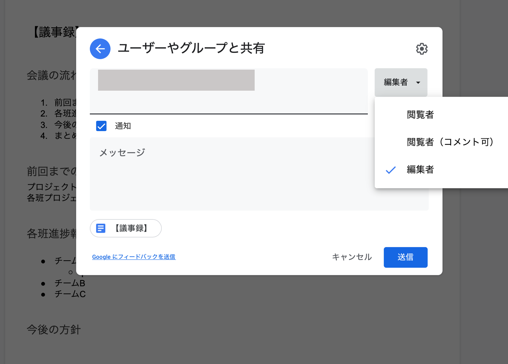

## この記事のハイライト
この記事では，Googleドキュメントの基本的な使い方について紹介します．
Googleドキュメント
### こんな場面で使用できます
- （教員）ゼミ形式の授業の議事録を取りたい
- （学生）勉強会やサークル活動の議事録を取りたい
- （学生）文章の編集作業を行いたい

## Googleドキュメントとは
Googleドキュメントはオンラインでドキュメントの作成，編集が行えるソフトウェアです．クラウド上に文章を保存するため，複数人が共同で編集作業を行うことができます．

### 仕様
- 提供元：Google LLC
- 使用可能な環境
    - 端末・OS：PC，タブレット，スマートフォンで使用可能．
    - 対応しているOS・ブラウザのバージョンについては[こちら（Googleドライブ公式ヘルプページ）](https://support.google.com/drive/answer/2375082?co=GENIE.Platform%3DDesktop&hl=ja&oco=1)を確認してください．
- 運用コスト
    - 費用：無料（容量を増やす場合は有料だが，ECCSクラウドメールのアカウントは容量無制限）

## インストール方法
Googleドキュメントを作成・共有するには，Googleアカウントが必要になります．（Googleアカウントの作成方法については[こちら（Googleアカウント公式ヘルプページ）](https://support.google.com/accounts/answer/27441?hl=ja) を確認してください．

また東京大学の構成員の場合は，ECCSクラウドメールのアカウントでサインインして利用することをおすすめします．ECCSクラウドメールでサインインすると，容量が無制限になるほか，東大のアカウントに限定した共有などの機能が使えるようになります．ECCSクラウドメールの使い方は，「[ECCSクラウドメール (Google Workspace)](/eccs_cloud_email)」を確認してください．

他の人から共有された文書の閲覧・編集については，ビジター機能を使うことで，Googleアカウントを持っていない人でも行うことができます．

### スマートフォンで使用する場合
スマートフォンでGoogleドキュメントを編集する場合は，アプリのダウンロードが必要になります．（閲覧だけであればブラウザから行うことも可能です）  
アプリケーションのダウンロードサービスでGoogleドキュメントのアプリをインストールしてください．

### PCで使用する場合
PCで使用する場合はウェブブラウザでドキュメントを作成します．
[Googleドキュメントのホーム画面](https://docs.google.com/document/u/0/)を開いてください．

## ドキュメント作成方法
### スマートフォンで使用する場合

デバイスでGoogleドキュメントのアプリを開きます．
右下の新規作成アイコンをタップします．［テンプレートを選択］をタップします．  
使用するテンプレートをタップします.

### PCで使用する場合
[Googleドキュメントのホーム画面](https://docs.google.com/document/u/0/)を開いてください．

## 使用方法
Word等の文書作成ソフトウェアと同様のやり方で書き進めます．  
  

### 見出しの設定
見出しを設定することで，見出しの見た目を統一させ，文書を階層的に構成することができます．  
見出しにしたい箇所を選択し，「標準テキスト」となっているところをクリックしてください．  
以下のような選択肢が出てくるので，適当な見出しを選び，見出しの設定をしてください．  

  
「【議事録】」を「見出し2」に，「会議の流れ」「前回までの流れ」「各班進捗報告」「今後の方針」「まとめ」をそれぞれ「見出し3」に設定しました．  
また，Windowsでは「Ctrl+Alt+（1〜6）」，Macでは「⌘＋option＋（1〜6）」のショートカットキーを用いて見出しを設定することもできます.

### 箇条書きの設定
#### ナンバリング
ナンバリングしたい箇所を選択し，メニューにある「番号付きリスト」を選択します．  
もしくはWindowsでは「Ctrl+Shift+7」，Macでは「⌘＋Shift＋7」のショートカットキーを用いて「番号付きリスト」を設定することもできます.  

#### 箇条書き
箇条書きにしたい箇所を選択し，メニューにある「箇条書き」を選択します．  
もしくはWindowsでは「Ctrl+Shift+8」，Macでは「⌘＋Shift＋8」のショートカットキーを用いて「箇条書き」を設定することもできます.  
  
一段深い階層の箇条書きを追加する場合は，Enterキーを押して箇条書きを追加したあと，Tabキーを押します．  
一段浅い階層の箇条書きを追加する場合は，Shift+Tabキーを押します．  
  

### 作成した文書の共有
  
Google ドキュメントで作成した文書は共有することで，他のユーザーと共同編集を行うことができます．  

  
文章を共有して同時に編集している場合，他の人のカーソルは色がついた状態で表示されるため，誰がどの場所を編集しているかがわかるようになっています．．

共有相手の権限（編集可能・閲覧のみなど）もそれぞれ選択できます．  
ここでは文書の共有方法・権限の付与方法について紹介します．共有方法には「ユーザーの追加」と「リンクを共有」の2種類があります．

#### ユーザーの追加
画面右上の「共有」をクリックします．  
「ユーザーやグループを追加」に，Googleに登録されたユーザーのメールアドレスまたは登録名を入力し，「完了」をクリックします．  
  
共有したことを相手にメールで通知するかどうかを選択します．  
また，共有相手の権限（文書を編集できない「閲覧者」，コメントだけ可能な「閲覧者（コメント可）」，全て可能な「編集者」）を選択します.  
  
「編集者」が1名追加されました．追加したユーザーの権限はいつでも変更可能で，オーナーにすることや削除することもできます．

#### リンクを共有
文書にアクセスできるリンクを共有します．    
  
権限を与えるユーザーの範囲を選択します（追加したユーザーのみ権限が与えられる「制限付き」，東京大学のECCSクラウドメールのユーザーに権限が与えられる「東京大学ECCSクラウドメール」，全てのユーザーに権限が与えられる「リンクを知っている全員」の選択肢があります）．  
  
リンクを共有したユーザーの権限を選択します．  
