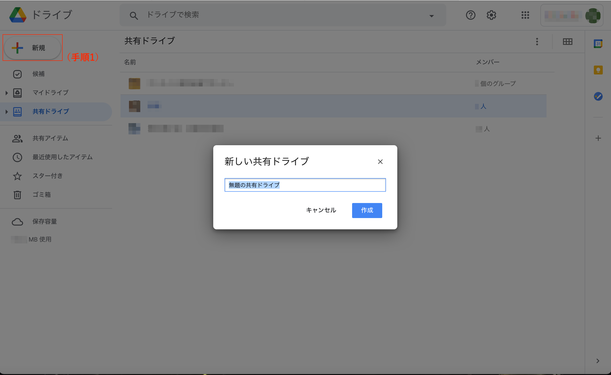

## Google ドライブとは

### アプリについての説明

Google ドライブは，Google社の提供するクラウドストレージサービスです．写真や動画，ファイルなどを安全に保存し，様々な方法で共有できます．
Google ドライブを利用するには，Google アカウントが必要です．

### 東京大学のGoogle アカウント（ECCSクラウドメールアカウント）について

東京大学の構成員は，東大のGoogle アカウント（以下，ECCSクラウドメールのアカウント）を使ってGoogle ドライブを利用することができます．
ECCSクラウドメールのアカウントは有料のアカウントであり，個人の無料アカウントとは以下のような違いがあります．

<!--「以下、ECCSクラウドメールのアカウント」とあったので、このセクション内の「東大のアカウント」を「ECCSクラウドメールのアカウント」と書き換えました。「東大の」の方が分かりやすい気もするので、必要なら戻してください。 -->

* 個人の無料アカウントでは容量に15GBの制限がありますが，ECCSクラウドメールのアカウントでは容量が無制限になります．
* マイドライブや共有ドライブで，ECCSクラウドメールのアカウントのみにファイルを共有する設定が使用できます．
* ECCSクラウドメールのアカウントは共有ドライブにおいて管理者となることが可能ですが、個人の無料アカウントではなれません．

ECCSクラウドメールのアカウントを取得していない方は以下の記事を参考にしてください．

[ECCSクラウドメール](/eccs_cloud_email)

以下，本記事ではECCSクラウドメールのアカウントでのログインを想定して説明します．

<!--上記内容と重複しているので削除可能
### 容量について

ECCSクラウドメールはGoogle Workspaceの有料のアカウントであり，容量無制限でGmailやGoogleフォト，Google ドライブなどを使用することが可能です．ただし，個人の無料アカウントの場合，各Google アカウントに15GBまでの保存容量の制限があります．
-->

### 起動方法と操作方法

[マイドライブ - Google ドライブ](https://drive.google.com/drive/u/0/my-drive)からECCSクラウドメールのアカウントを用いてログインします．
すると，以下のような画面が表示されます．

#### マイドライブ

ファイルの追加・編集・移動・削除，及びファイルやフォルダの共有設定など，全ての権限をアカウント所有者が実行できます．

<figure>

</figure>

* **①候補リスト**：ここにはマイドライブ内のファイル以外にも，共有ドライブや共有アイテム内のファイルが表示され，ファイル名の下に最後に編集した時期と編集者が表示されます．
* **②フォルダ**：ここには自身が作成したフォルダの一覧が表示されます．ただし，直接作成していなくても，例えばGoogle Classroomを通してアップロードしたファイル等が自動でフォルダにまとめられていることがあります．
* **③ファイル**：ここには自身がアップロードしたファイルの一覧が表示されます．ただし，直接アップロードしていなくても，例えばGoogleフォームを通してアップロードしたファイル等もここに表示されます．
* **④表示切替**：ギャラリー表示とリスト表示の間の変更を行うことができます．
* **⑤詳細表示**：ファイルなどを何も選択せずにここをクリックするすると，マイドライブ内でのファイルの編集・移動履歴が表示されます．ファイルを選択した状態でクリックすると，そのプロパティと履歴が表示されます．
* **⑥Google アプリ**：ここをクリックすると，Google アプリ（Google ドキュメント，Google スライド等）の一覧が表示されます．同じアカウントのまま他のアプリへ移ることが可能です．また，アカウントの設定画面へもここから移ることが可能です．
* **⑦アドオン取得**：Google カレンダーと同期させるなど，他アプリをGoogle ドライブを通して使用することが可能です．
* **⑧アカウント変更**：ここをクリックするとアカウントの設定やアカウントの追加，ログアウトを行うことができる．

もう少し詳しく知りたい方はこちらをご参照ください．
* [Google ドライブの使い方 - パソコン - Google ドライブ ヘルプ](https://support.google.com/drive/answer/2424384?hl=ja&co=GENIE.Platform=Desktop)

#### 共有ドライブ
{:#shared_drive}

共有ドライブを使えば，組織でドライブ内のファイルなどの管理ができます．管理者は5段階の権限をメンバーに付与することができ，ユーザーの所属や業務内容に基づいた権限設定が可能です．大学のECCSクラウドメールのアカウントでログインする場合は，共有ドライブは使えますが，個人のアカウントの場合は，利用が制限されます．

<figure>

</figure>

権限は以下の中から設定できます．
	
* **管理者**：共有ドライブで最も高い権限です．共有ドライブ上のファイル，メンバー，設定全般に対して操作を行うことができます．（Google Groupを使うと自分以外は管理者にはなれません．）
* **コンテンツ管理者**：ファイルを追加・編集・移動・削除することができます．ただし，メンバー管理や，共有ドライブの設定に対して操作を行うことはできません.
* **投稿者**：ファイルを追加・編集することができます．ただし，共有ドライブ内でのファイルの移動はできません．
* **閲覧者（コメント可）**：ファイルの閲覧や，コメントをつけることができます．ただし，ファイルの共有設定によってはダウンロードができないこともあります．
* **閲覧者**：ファイルの閲覧を行うことができます．ただし，ファイルの共有設定によってはダウンロードができないこともあります．

もう少し詳しく知りたい方はこちらをご参照ください．
* [概要: 共有ドライブとは - Google Workspace ラーニング センター](https://support.google.com/a/users/answer/9310156?hl=ja&ref_topic=9300128)

#### 共有アイテム

自身が共有した，または自身に共有されたファイルやフォルダが表示されます．共有ドライブではファイルやフォルダの全権限が管理者にありますが，共有アイテムで表示されるものはあくまで共有者のマイドライブ内のファイルやフォルダなので，全権限はそのオーナー（アカウントの所有者）にあります．

### マイドライブと共有ドライブの違いについて

#### マイドライブの特徴

* ファイルのオーナーのアカウントが失効すると，ファイルは消えてしまいます．
* 共有相手のGoogle アカウントを登録するか，リンクを共有相手に送ることで，共有が可能です．
* 特定の人に対して特定のファイルを共有する場合は，「マイドライブ」で共有することをおすすめします．

#### 共有ドライブの特徴

* ファイルのオーナーのアカウントが失効しても，ファイルが共有ドライブ内に残り続けます．ファイルの削除はオーナーが実際に行う必要があります．
* 共有の際には，リンクでの共有はできないので，共有相手全員のGoogle アカウントを登録する必要があります．
* 長期間にわたり，組織的にファイルの共有をする場合は，「共有ドライブ」で共有することをおすすめします．

## マイドライブにおける共有の方法

マイドライブにおける共有オプションの設定方法について解説します．

1. **共有するファイルの選択，または作成します**
   1. [マイドライブ - Google ドライブ](https://drive.google.com/drive/u/0/my-drive)からGoogle アカウント（大学のECCSクラウドメールのアカウント）を用いてログインし，マイドライブを開きます．
   2. 共有したいファイルを選択，または作成します．ファイルを作成する場合，左上の新規のボタンを押し，必要なファイルを作成します．
   3. 共有したいファイルが選択された状態で，共有アイコンを押します．
2. **ファイルの共有をする**：（手順1）の状態で，共有相手のGoogle アカウントを登録する，もしくはリンクをコピーして共有相手に送ることで，ファイルの共有が行えます．
3. **ファイルの共有相手とその権限を選択する**：（手順1）の状態で，「リンクを取得」欄の左下にある「変更」を押すことで，共有相手とその権限の設定が行えます．
   1. ファイルの共有相手は以下の中から選択できます．ただし，「リンクを知っている人のみ」という制限は，該当する人が一人でもリンクを漏らすと公開と同じになってしまうので，推奨しません．また，ファイルごとに共有設定をするのではなく，用途によって共有範囲の違うフォルダを作成しておいて，ファイルはその下に作ることで権限の管理を容易にすることができます．
       * 東京大学ECCSクラウドメール: 東京大学ECCSクラウドメールでログインしていて，かつリンクを知っている人全員が閲覧できる設定
       * 制限付き:特定の相手のみ共有可能な設定（個別に設定したユーザー，またはグループの相手のみが閲覧できる設定）
       * リンクを知っている全員: リンクを知っている人全員が閲覧できる設定
    2. 共有相手の権限は以下の中から選択できます．
        * 閲覧者: 他のユーザーは閲覧できるが，ファイルを変更したり他のユーザーと共有したりすることはできません．
        * 閲覧者（コメント可）: コメントや提案を行うことはできるが，ファイルを変更したり他のユーザーと共有したりすることはできません．
        * 編集者: ユーザーは変更を加えたり，提案を承認または拒否したり，他のユーザーとファイルを共有したりできます．
4. **ファイルの共有を停止，変更する**：手順3に戻り，適当な制限を適用してください．

## 共有ドライブにおける共有の方法

実際の授業で使える，資料共有までの流れを例に説明します．グループワーク等の際に活用してみてください．

1. **共有ドライブを作成する**： [マイドライブ - Google ドライブ](https://drive.google.com/drive/u/0/my-drive)からGoogle アカウント（大学のECCSクラウドメールのアカウント）を用いてログインした後，共有ドライブを選択して，新規共有フォルダを作成します．
2. **メンバーの登録と権限設定**：作成した共有フォルダを開き，右上の「メンバーを管理」を押して，共有相手全員のECCSクラウドメールアカウントを登録します．その後，メンバーの権限設定を行います．  ※個人の無料アカウントをメンバーとすることも可能ですが、管理者とすることはできません． （権限の詳細については，上記の[「起動方法と操作方法」における「共有ドライブ」の欄](#shared_drive)を参照してください．）
3. **共有ドライブの設定**：（手順2）のメンバー管理の際に，右上に表示される設定アイコンをクリックし，共有ドライブの設定を行います．
4. **資料共有の方法**：作成した共有フォルダを開いた状態で，左上の「新規」という欄をクリックした上で，使いたいGoogleのツールを選択します．

（注意）（手順2），（手順3）については，後からの変更は可能ですが、管理者しか設定できません．

## 使い方のコツ

### 共有できるファイルについて

Google ドライブでは、文書・プレゼンテーション・音楽・写真・動画など，あらゆる形式のファイルをアップロードすることが可能です．
ただし，ExcelやWordファイル等をドライブ上にアップロードしての編集は，文字化けなど不具合の原因となるため，Google スプレッドシート，Google ドキュメント等に変換するか，もしくはOne Driveを利用することをおすすめします．

### オフラインでの使用に関して

Google ドライブの操作を行う際は，基本的に通信が必要ですが，特定の形式のファイルはオフラインでも使える場合があります．以下に様々なファイル形式ごとのオフラインでの使用方法をまとめます．

#### パソコン上で使用する場合

##### Google ドキュメント，Google スライドなどのGoogleサービスのファイル

Google Chromeのブラウザの使用が必要です．

1. インターネットに接続した上でGoogle Chrome ブラウザを開きます．
2. [Google ドキュメントのオフライン Chrome 拡張機能](https://chrome.google.com/webstore/detail/google-docs-offline/ghbmnnjooekpmoecnnnilnnbdlolhkhi)をインストールします.
3. [Google ドライブ](https://drive.google.com/)を開き、右上の設定アイコンをクリックします．
4. ［オフライン］をオンにします．
5. この設定によってオフラインでもファイルの閲覧，編集を行うことができます．また，インターネットにつながると編集内容が同期されます．

##### PDFや写真ファイル

パソコン上では，オフラインでの使用に対応していないので，事前に端末にダウンロードしておく必要があります．

#### スマートフォンから使用する場合

Google ドライブのアプリをインストールする必要があります．
詳細は以下を参照してください．

[オフライン時にGoogleファイルで作業する](https://support.google.com/drive/answer/2375012?co=GENIE.Platform%3DAndroid&hl=ja)

### デフォルトのアカウントの設定方法

Google ドライブに限りませんが，Googleのサービスを使っていると大学のECCSクラウドメールのアカウントではなく，個人のGoogle アカウントで自動ログインされることがあります．デフォルトのアカウントにはサービスに最初にログインしたアカウントが設定されるので，変更したい場合はアカウントのアイコンをクリックしすべてのアカウントからログアウトした後，デフォルトで使用したいアカウントで最初にログインするようにしましょう．

### Google Group を使用する

マイドライブや共有ドライブにあるフォルダやファイルを共有する相手を設定するにあたって，クラスのメンバー等をまとめてGoogle Group を作っておけば，グループ単位で共有することができ，また権限付与の管理が楽に行えます．
詳細は以下を参照してください．
* [グループを作成し、グループ設定を選択する - Google グループ ヘルプ](https://support.google.com/groups/answer/2464926?hl=ja)
