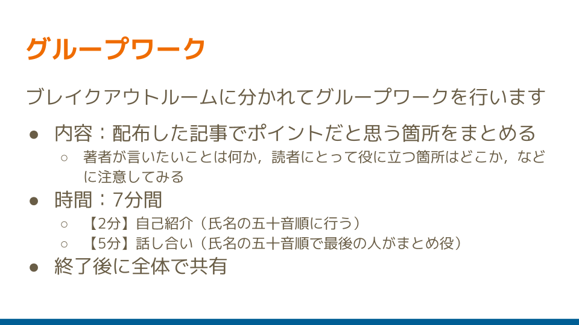
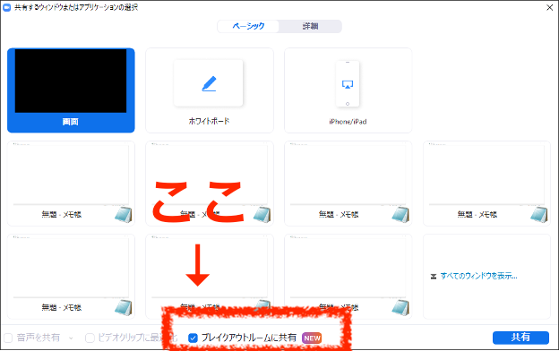

## オンラインのグループディスカッションにはブレイクアウトが便利

Web会議システムを使用したオンライン授業やオンライン会議にてグループディスカッションを実施する際は，参加者をいくつかの部屋に振り分ける機能を利用すると便利です．

例えば，Zoomの「ブレイクアウトルーム」，Google MeetとWebexの「ブレイクアウトセッション」では，参加者らをメインの部屋からグループごとの部屋に移動させて個別にディスカッションさせることができます．（以下，これらの機能を総称して「ブレイクアウト」と呼びます．）

☞ブレイクアウト機能の詳細な使用方法については，下記のページを参照してください．

* Zoom：[Zoom ブレークアウトルーム機能を使う](/zoom/usage/breakout/)｜utelecon
* Google Meet：[Google Meetでブレイクアウトセッションを使用する](https://support.google.com/meet/answer/10099500?hl=ja)｜Google
* Webex：[Webex ミーティング・ウェビナーでできること（開催者・参加者）](/webex/do_webex)｜utelecon

## ブレイクアウトには意外な難点が？

ブレイクアウトによるグループディスカッションは，オンライン授業やオンライン会議で多く取り入れられています．しかし，便利な機能である一方，対面には無い，オンライン特有の難しさがあるようです．

我々[オンライン教育支援サポーター](/about/oes)の活動の一環として，メンバー同士でオンライン授業についての悩みを話し合った中でも，「グループディスカッションで困ったり迷ったりした」という経験談は，頻繁に話題に上りました．

例えば，以下のような感想が寄せられました．

### オンラインのディスカッションでは話し始めづらい

振り分けられた先の部屋に移動すると，大抵，みんながカメラやマイクをミュートした画面になっています．そのような状況では，心理的なハードルが高く，初対面の相手に対して自ら口火を切ることを躊躇してしまうようです．

「相手の様子がよく分からず探り探りの会話になり，思うように話し合いが進まなかった」，極端なケースでは「ついにグループメンバーが誰も口をきくことなく制限時間を迎えてしまった」ということもあるそうです．

### 部屋同士が遮断されていて交流できない

ブレイクアウトの良い点は，それぞれのブレイクアウトルームが独立しており，他のグループの話し声などに干渉されずに議論できることです．しかし，それは同時に，お互いの様子を窺い知ることができないことを意味します．

ここで，対面授業でグループディスカッションをしているところを思い浮かべてみましょう．教員は，教室全体を一望して，途中でヒントやアドバイスを与えたり，スムーズに進行していないグループに参入して会話を促したりすることができます．学生は，議論の最中に黒板やスクリーンに掲示されている課題内容を再確認したり，教員を呼び止めて質問したりできます．消極的であったグループが盛り上がっているグループの雰囲気に触発されて会話が弾むようになり，最終的には教室全体に活気が出ることもあるでしょう．

ブレイクアウトでは，こういったことが簡単にできない環境となります．例えば，前項のように議論が進んでいないグループがあっても，外からは全く気付かれず，フォローされないままになってしまうこともしばしばです．

## 対策案を紹介します

オンライン教育支援サポーターは，主にオンラインで活動しており，ほぼ全てのミーティングをZoomを用いて行ってきました．この章では，普段，我々が活動の際に工夫していることや実践している方法を，先述のようなブレイクアウトの困難を解消する対策の選択肢として紹介いたします．

### 適切な人数でグループを編成する

一般的に，対面でのグループディスカッションを充実した内容にするためには，5〜6人以内に収めると良いと言われます．人数が増えるに従い，1人1人の発言時間が短くなり貢献度が低くなる可能性があるため，また大勢の意見をまとめることが困難になるためです．

オンラインでは特に，相手の顔を知らない状態や勝手が分からない中で開始するケースが多いため，3〜4人程度にしておくと，参加者同士での進行がスムーズになる可能性があります．

ただし，人数を減らしすぎると，Zoomの接続が切れてしまった人や発言しない人がいた場合などに，残された人数が極端に少なくなるリスクが考えられます．

受講する学生の習熟度や授業の目的に合わせて，回を重ねるごとに学生からフィードバックなども参考にし，適切な人数を見極めていくと良いでしょう．

### ブレイクアウト開始前にできる工夫：必要な指示は全て出す

主催者は，ブレイクアウトを開始する前に，できるだけ明確な指示や詳細な説明をしておきましょう．参加者が議論をスムーズに開始しやすくなります．

以下に，事前に説明しておくと良い項目の例を示します．

#### グラウンドルールを提示しましょう

（オンライン授業に限ったことではありませんが）ディスカッションを開始する前に，話し合いをスムーズに行うために参加者が留意すべき方針など，いわゆるグラウンドルールを共有しておくと，参加者はディスカッションにおいてどのような態度が求められているか，理解することができます．

具体的には，以下のようなルールが挙げられます．

* まずは相手の意見をよく聴くこと．
* 建設的なコメントを心がけること．
* できればビデオをオンにすること．

#### 所要時間を示しましょう

議論に与えられた時間および終了時刻をしっかりと認識することで，参加者は時間を有効活用しようという意識を持つことができます．（ブレイクアウトにはタイマー機能（例: [Zoomにおけるタイマー機能について](/zoom/usage/breakout/#オプションの設定)）があり，ブレイクアウトの制限時間を指定することができます．）

#### 求められるアウトプットの形式を伝えておきましょう

ディスカッション終了後に成果をアウトプットすることが求められている場合（例えば，ディスカッション終了後に全体に向けて発表を行う場合や特定のワークを伴う場合など）は，その形式を事前に提示しておくと，参加者は明瞭な見通しを持って議論に参加しやすくなります．

説明不足のまま実施してしまうと，参加者は「全体に共有すると思っていなかったため，ただ漠然と会話してしまった」「何もメモしていなかった」などと後から慌てることがあります．

例えば，「グループで話し合ったことを1分程度で全体に発表して，グループ同士，お互いに批評や質疑応答をしてもらう予定です」という説明があれば，参加者たちは時間内に主要な意見をまとめておいたり，発表者を決めておいたりすることができます．

#### 具体的な進行の方法を指定してあげた方が良いケースがあります

ディスカッションのトピックや課題内容だけではなく，ある程度の進め方を指定した方が，参加者たちが迷いなく話し始めやすいでしょう．

例えば，オンライン授業やワークショップでは以下の方法がよく取り入れられています．

* 初めてグループを組むメンバーであれば，最初の数分間に自己紹介および打ち解けるための雑談などを行うよう指示する．
* 円滑な進行のために，議事進行役や書記などの役割分担を決めておく．

#### ディスカッションの概要を視覚的にも聴覚的にも提示しましょう

参加者の中には，本人の特性により，口頭のみで出された指示を瞬時に理解および記憶することが困難な人，または，視覚的な情報を得ることが困難な人が含まれる可能性があり，オンラインという環境がそれらの特性を助長することがあります．

ディスカッションの概要や指示を，1枚のスライド等の画像にまとめて画面共有で表示しつつ，口頭で同じものを読み上げると親切です．

グループディスカッションについての指示をまとめたスライドの例

#### ディスカッションの概要を各自で保存しておいてもらいましょう

参加者がブレイクアウトに入った先で何をしたらよいか忘れてしまうことが多々あるため，各自で指示のスクリーンショットを撮ったりメモを取ったりしておくように促すとよいでしょう．

または，講師自身が同様の内容をチャットに転記すると，参加者はテキストデータとして自分の手元にコピーすることができるため，便利です．（ただし，ブレイクアウトルームに移動してしまうと，メインルームのチャットを見られなくなります．ご注意ください）．

☞ おまけ：

Zoomであればブレイクアウトに向けて画面共有することができます．

Zoomでは，メインルームから各ブレイクアウトルームに向けて画面共有を行うことができるようになりました（2021年6月に新たに追加された機能です）．

前述のような概要・指示のページや追加の指示のページを画面共有するといった使い方が考えられます．

ブレイクアウトルームに向けて画面共有を行う操作画面

ただし，ブレイクアウトルーム内で画面共有を行っている時にメインルームから画面共有を行うと，ブレイクアウトルーム内での画面共有が消えてしまうので注意しましょう．また，メインルームから画面共有を行っている最中は，ブレイクアウトルーム内の参加者は画面共有を行うことができません．（メインルームからの共有が必要でなくなった際には画面共有を停止することを忘れないようにしましょう．）

### ブレイクアウト中にできる工夫：ワークシートの活用

主催者がメインの会議室にいながらブレイクアウトの議論の進行状況を把握するためには，オンラインでのワークシート（作業用紙）を共有するとよいでしょう．参加者は議論をしながら，クラウドツールを利用したワークシートに，議事録やワークの成果を記入します．主催者は，ワークシートが記入されていく様子をリアルタイムで閲覧することで，各グループの進捗を間接的に把握することができます．

☞「[オンラインのグループディスカッションでワークシートを活用する](/articles/group-discussion-worksheet)」にて，ワークシートの具体的な作成方法および使用方法の例を詳しく紹介しているので，是非ご参照ください．

ディスカッション中にワークシートを閲覧していて，

* なかなか書き込みが進まず，あまり議論が活発に行われていないように見えるグループ
* 興味深い書き込みを行っているグループ

など，気に掛かる点を見つけたら，主催者がグループに介入しても良いでしょう．

### ブレイクアウト中にできる工夫：主催者が介入する

必要に応じて主催者がブレイクアウトに介入する際，以下のような方法が挙げられます．

#### 自らブレイクアウトに参加する

ブレイクアウトを開始した後に，主催者も自ら任意のグループに移動することができます．（Zoom・Webex・Google Meetの全てにおいて可能です．）

#### 自らワークシートにコメントを記入する

クラウドツールのワークシートであれば，主催者も同時に記入できます．気になる記述を見付けてその場でコメントを付けたり，ヒントや追加の指示を投げかけたりと，直接テキストでやりとりすることができるため，チャットの代用となります．

#### 介入する際の注意点

「先生や大学院生の先輩が突然ブレイクアウトに入って来たため，緊張してしまって思うように意見を言えなくなった」というケースもあります．

指導側のメンバー（参加者よりも目上のメンバーなど）がフォローに入ることなどが予定されている場合は，予告しておくと親切かもしれません．

☞ おまけ：

Zoomではブレイクアウトルームにメッセージを送信することができます！

ブレイクアウト中，メインルームやその他のブレイクアウトルームの参加者とチャットでやりとりすることはできません．しかしミーティングのホストであれば，「全員にメッセージを送信」する機能を使い，ブレイクアウトルームにいる参加者も含めた全員に対してテキストメッセージを送信することができます．

ブレイクアウト開始後に「ブレイクアウトルーム」ボタンをクリックして，さらに，ポップアップしたブレイクアウト操作ウィンドウの「全員にメッセージを放送」ボタンをクリックすると，メッセージを送信することができます．

メッセージは，ホストから参加者に対して一方向にのみ送信することができます．参加者からホストに，また参加者同士でメッセージを送ることはできません．メッセージは，チャット欄ではなく参加者のウィンドウ上部に通知として表示されます．

例えば，「残り○○分です．」というアナウンスをしたり，追加でヒントを与えたりするときに使用すると便利です．

## まとめ

以上，この記事では，オンラインでグループディスカッションを実施する際の難点，生じやすいトラブル，そして比較的簡単に実行できる解決策を紹介しました．

適切な実施方法は，会議や授業の形態，議論のテーマ，課題の難易度，学生の人数や性質によって異なってくるため，必ずしも1つの正解が存在するわけではありません．例えば授業であれば，学期を通して学生からのフィードバックをこまめに得つつ，教員と学生の双方にとって快適な形式を模索していけると良いでしょう．

## あわせて読みたい記事

[オンラインのグループディスカッションでワークシートを活用する](/articles/group-discussion-worksheet/)

[GASを使ってGoogleドライブでファイルとフォルダを複製する方法](/articles/gas/copy)

[Zoom ブレークアウトルーム機能を使う](/zoom/usage/breakout/)

[オンライン授業情報交換会 第1回 グループワークをする(1)](/events/luncheon/2020-04-22/)

[オンライン授業情報交換会 第11回 オンライン授業で使えるツール(1)](/events/luncheon/2020-06-24/)

---

執筆: <a href="/about/oes">オンライン教育支援サポーター</a>

