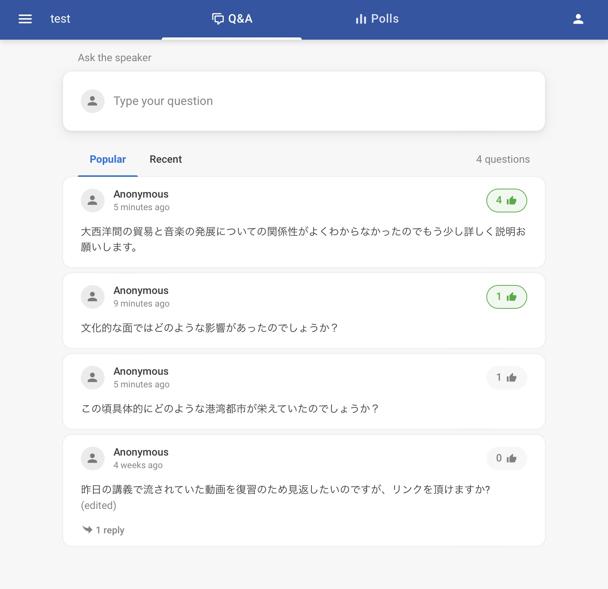
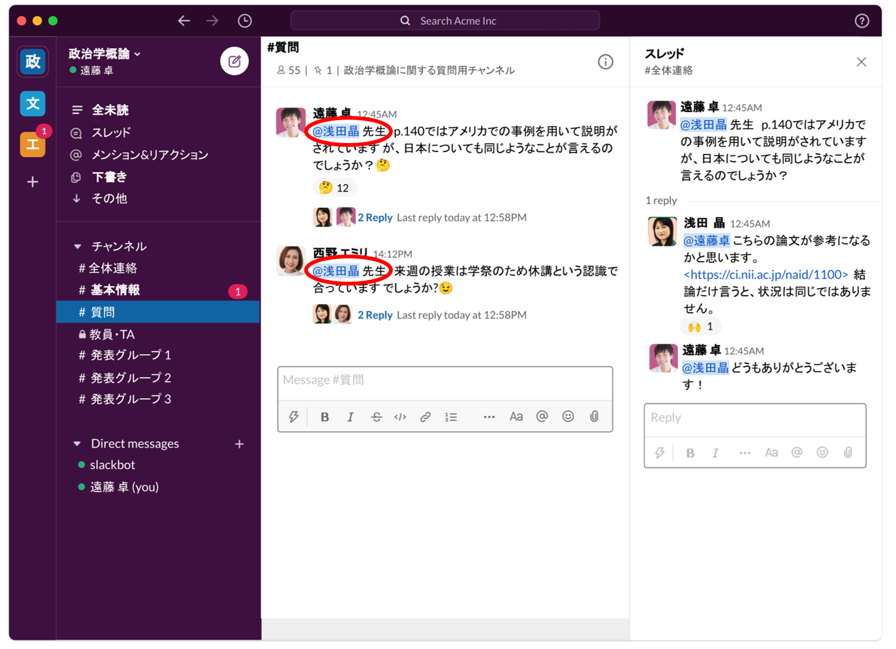

## この記事のハイライト

授業に関する質問を簡単に，効率的に集めるためのツールを紹介，比較しています．  
目的や場面に合わせてそれぞれで役に立つツールを分類し，その特徴を紹介しています．

この記事では，各ツールについて，質問を受け付ける例に絞って記載しています．  
そのため，各ツールの詳しい内容や使い方については，リンクから飛べる当サイト（**utelecon**）の記事，または公式サイトをご参照ください．  
また，一部ツールについては，実際に使う上で便利なコツを「Tips」として紹介したり，実際に東京大学の授業で使われた実践例を紹介する記事のリンクを載せたりしていますので，合わせてご活用ください．

## 授業中にリアルタイムで質問を募集する

ここではオンライン，または対面の授業中に，その場で質問を募集するために便利なツールを紹介します．

### Web会議システムを活用する（授業規模が大きくない場合）

ここでは授業の規模がそこまで大きくなく，大量の質問をさばく必要のないオンライン授業において，Web会議システムをメインに活用して質問を募集するツール・方法を紹介します．

#### ZoomなどのWeb会議システムの活用
{:#web-conf}

Web会議システムの例として，ここではZoomを取り上げます（主なWeb会議システムは[こちら](/online/tools#web-conf)の記事からご参照ください）．

Zoomを用いて質問を募集するには，基本的に発声で質問してもらう方法と，[チャット](/zoom/how/common/chat)で質問してもらう方法があります．  
発声で質問してもらうには，適宜質疑応答のための間を設けたり，[挙手機能](/zoom/how/students/hand_reaction)などを使ったりするとスムーズに行えます．  
チャットを用いる場合，受講者が授業中の好きなタイミングで質問でき，それが文字として残ります．  

<figure>
<figcaption>Zoomのチャットを用いた質疑応答の例</figcaption>

</figure>

（良い点）
* 学生・教員が使い慣れており，新たに何かを導入する必要がない．
* チャットの場合，内容を保存しておくことができる．

（注意点）
* 受講者が多い/質問が活発な場合，発声しにくかったり，被ってしまったりする．
* チャットの場合でも，質問が多いと見逃したり流れてしまったりする場合がある．
* 基本的に名前が表示される．

特に名前が表示される点については，抵抗があり質問しにくいという学生も多いかもしれません．

(Tips)  
上記の「名前が出てしまうので質問しにくい」という問題を解決するため，ダイレクトメッセージを利用してもらうという方法があります．  
上の画像の2つ目の質問のように，赤字で「ダイレクトメッセージ」とあるものは，他の受講者には見えていないので，教員が質問を口頭で読み上げるか，コピーして全体チャットに流すことをお勧めします．

（参考ページ）
* **[Zoom 説明ページ](/zoom/)**：基本的な使い方や様々な機能の使い方をまとめています．
* **[Zoom 公式サイト](https://explore.zoom.us/ja/products/meetings/)**：システムについての概要がまとまっています．

#### CommentScreen
{:#CommentScreen}

CommentScreenは投稿されたコメントを，ZoomなどのWeb会議システムの画面上を横に流れるように表示させることができるサービスです．

質問を投稿してもらうことで，画面上に質問を流すことができるため，スライドなどを共有しながらでも質問を読み，答えることができます．

<figure>
<figcaption>CommentScreenの使用例</figcaption>

</figure>

（良い点）
* Web会議システムを活用できる．
* 匿名でコメントを送信できるため，気軽に質問できる．
* スライド等を共有しながらでも，質問に気づくことができる．
* 質問以外にも感想やリアクションを送ってもらい，表示できる．
* コメントが画面上に流れるため視覚的にも面白く，活発になりやすい．
* 投票機能なども備えている．  

（注意点）
* コメント（質問）が多い場合，多くのコメントが表示されて見にくくなったり質問が流れてしまう．

（参考ページ）
* **[CommentScreenで学生とコミュニケーションをとる](/articles/commentscreen/)**：サービスの概要と基本的な使い方をまとめています．
* **[オンライン授業のグッドプラクティス／杉田直彦先生 生産システム](/good-practice/interview/sugita)**：授業においてCommentScreenを活用して，質問を受け付ける実践例です．
* **[CommentScreen 公式サイト](https://commentscreen.com/)**：システムについての概要がまとまっています．

### 授業規模が大きい・多くの質問を受け付ける場合

ここでは授業の規模が大きく，多くの質問を募集したい場合や，オンデマンド授業・対面授業で質問を募集したい場合に便利なツールを紹介します．  
また，ここで紹介するツールは，受講者の少ない講義でも同様に活用することができます．

#### Slido
{:#Slido}

SlidoはQ&A機能や投票機能を備え，授業や講演会などで参加者との双方向コミュニケーションを活発化することができるWebサービスです．

質問を募集するのに必要な基本機能は無料で利用できますが，東京大学のアカウントでサインインすることで，有料機能（受講者同士で質問に返信できるようにしたり，質問などのデータをエクスポートできるようにしたりできる）も使用することができます（詳細は[こちら](/slido/#%E6%9D%B1%E4%BA%AC%E5%A4%A7%E5%AD%A6%E3%81%AE%E3%82%A2%E3%82%AB%E3%82%A6%E3%83%B3%E3%83%88%E3%81%A8%E3%83%A9%E3%82%A4%E3%82%BB%E3%83%B3%E3%82%B9)をご参照ください）．  
Slidoにはいくつかの機能がありますが，ここでは「Q&A」の機能を用いた質問募集の例に限って紹介します．

<figure>
<figcaption>Slidoで質問を受け付けた例</figcaption>

</figure>

（良い点）
* 匿名で質問できる．
* 質問に対し，受講者が「いいね」をつける機能があるため，質問の優先度が分かりやすい．
* 質問を授業後も残しておける
* 授業時間外でも質疑応答ができる．
* 有料機能を用いれば，受講者同士でも返信しあうことができる．

特に「いいね」機能があることと，質問に返信する機能があることがSlidoの便利な点で，多くの質問を集め，答えるのに適しているといえます．  
「いいね」が多い，つまり多くの受講者が疑問に思っている質問が，優先的に上位に表示されるため（新着順に並べることもできます），質問が多い場合でも特にニーズの高いものを選んで答えることができます．

（注意点）
* サービス自体は日本語版がなく，英語版のみ提供されている．

この点に関しては，英語がわからないという場合でも，uteleconの記事等を参照すれば問題なく登録（主催者のみ必要），利用することができると思われます．

(Tips)  
パソコンなどでZoomの画面を表示したり画面共有をしたりしながらSlidoの画面を見るのはやりにくいという場合，スマートフォンやタブレット端末を別に用意し，それでSlidoを開いておくと，画面の切り替えなどの必要がなく済みます．

（参考ページ）  
* **[Slido 説明ページ](/slido/)**：サービスの概要と基本的な使い方をまとめています．
* **[オンライン授業のグッドプラクティス／四本裕子先生 心理I](/good-practice/interview/yotsumoto)**：授業におけるSlidoを活用した質問募集，及びTipsの実践例です．
* **[オンライン授業のグッドプラクティス／田中庸介先生 解剖学第3(神経)](/good-practice/interview/tanaka)**：授業においてSlidoを活用して質問を募集・回答する実践例です．
* **[オンライン授業のグッドプラクティス／栗田佳代子先生 「学びの場」づくり](/good-practice/interview/kurita)**：授業においてSlidoを活用して質問を募集する実践例です．
* **[Slido 公式サイト](https://www.sli.do/)**：サービスの概要がまとめられています．

## オンデマンド授業や授業外で質問を募集する

ここでは授業録画を公開するオンデマンド授業や授業時間外（試験期間や，受講者が復習や課題を行っているとき）で質疑応答をするために便利なツールを紹介します．

### 授業規模が大きい・多くの質問を受け付ける場合

授業規模が大きく，多くの質問を常時募集し，回答する必要がある場合には，チャットアプリやメッセージングアプリなどと呼ばれるサービスが便利です．

#### Slack
{:#Slack}

Slackは主にビジネスで使われるメッセージングアプリです．

Slackでは，まずグループの「ワークスペース」を作り，その中に複数の「チャンネル」を作成することができます．  
そして，「チャンネル」内でメッセージの送受信を行います．  
そのため，まず授業の「ワークスペース」を作り，その中で質問を募集する「チャンネル」を作成することで，質疑応答を行うことができます．

<figure>
<figcaption>Slackを用いた質疑応答の例</figcaption>

</figure>

（良い点）
* 全員がやりとりできるため，受講者同士で解決しあうこともできる．
* ファイルや画像の送受信も可能であり，文字だけでは伝えにくい質問や回答なども簡単にやり取りできる．
* メンション機能やメッセージに対するリアクション機能など様々な機能を使いこなすと，より使いやすく，活発になる．
* 各質問に対し，「スレッド」で返信することで，質問と回答の階層構造を明確化し，多くの質問が来ても，各質問に対応する回答がどれか分かりやすくなる．
* 各授業回やテーマごとに「チャンネル」を作成すれば，質問がより整理され，多くの質問にも対応しやすくなる．
* 様々な用途の「チャンネル」を作成することで，感想を集める，議論をする，連絡をする，といったことがスムーズにできるなど，汎用性が非常に高い．

特に上記の「チャンネル」を上手く使いこなせば，より分かりやすく，より円滑に，質問を受け付け，コミュニケーションを図ることができます．  
詳しくは[こちら](/articles/slack-communication/#in_class)をご参照ください．

（注意点）
* ニックネームなどで登録することも可能だが，一般的には本名を登録して利用する．
* 全ての学生や教員が普段から利用しているというわけではなく，新規登録の必要が生じたり，慣れないうちは使いにくく感じたりする可能性がある．

(Tips)  
質問の募集は基本的に「チャンネル」で行うのがおすすめですが，名前が出るため質問しにくいと感じる学生や，成績に関してなどの個人的な質問がしたい学生をケアするために，DM（ダイレクトメッセージ）へのメッセージを許可しておくと便利な場合があります．

（参考ページ）
* **[Slack 説明ページ](/articles/slack-communication/)**：サービスの概要と様々な使い方をまとめています．  
* **[オンライン授業のグッドプラクティス／齊藤宣一先生 計算数理I・計算数理](/good-practice/interview/saito)**：Slackを用いて質問を募集する実践例です．
* **[オンライン授業のグッドプラクティス／白石忠志先生 法Ⅰ](/good-practice/interview/shiraishi.html)**：Slackを用いて質問を募集する実践例です．
* **[ゼミ形式の授業でSlackを活用する](/articles/slack-seminar/)**：ゼミ形式の授業でSlackを活用する方法を紹介しています．
* **[Slack公式サイト](https://slack.com/intl/ja-jp/)**：サービスの概要がまとまっています．

#### LINEオープンチャット
{:#LINEopenchat}

LINEオープンチャットでは，友達登録されていない人たちとURLやQRコードを通じてコミュニティを作り，メッセージの送受信などをすることができます．

授業用のルームを作成し，リンクやQRコード等を用いて受講者を招待することで，ルーム内で質疑応答を行うことができます．

<figure>
<figcaption>LINEオープンチャットを用いた質疑応答の例</figcaption>

</figure>

（良い点）  
* 多くの学生が使い慣れているツールである．
* 普段使っているLINEとは別の名前やアイコンを使用する（つまり匿名やニックネームで利用できる）ため，気軽に利用できる．
* 全員がやりとりできるため，受講者同士で解決しあうこともできる．
* メンション機能やリプライ機能を用いると，各質問に対する回答がどれか分かりやすくなる．
* ファイルや画像の送受信も可能であり，文字だけでは伝えにくい質問や回答なども簡単にやり取りできる．
* 投票機能などもあり，質問以外のコミュニケーションをとることもできる．

（注意点）
* 一つのルームでやりとりするため，あまりに多くの質疑応答があると使いにくいことがある．

Slackでは複数の「チャンネル」を作成できるのに対し，LINEオープンチャットでは，やりとりをするルームは一つです．  
そのため，質問が非常に多い，複数の質疑応答が同時並行で行われる，他の連絡をする，といったことが起きると，閲覧しにくくなったり流れてしまったりすることがあるので，注意が必要です．

（参考ページ）
* **[オンライン授業のグッドプラクティス／廣瀬敬先生 固体地球科学](/good-practice/interview/hirose)**：LINEオープンチャットを利用して質問を募集する実践例です．
* **[LINE公式サイト](https://guide.line.me/ja/services/openchat.html)**：サービスの特徴や利用方法がまとまっています．

### 授業規模が小さい・質問の募集は最低限できればよいという場合

ここでは質問を多く集める必要はなく，補助的に行えればよいという授業で活用できるツールを紹介しています．

#### ITC-LMS（東京大学の場合）などの学習管理システム
{:#LMS}

ITC-LMSは東京大学の学習管理システムです．資料・課題の配布や提出，受講者への連絡，テストの実施などの機能があります．

ITC-LMSには掲示板機能があるため，「質問受付」などといったテーマタイトルで掲示板を開設することで，質問を募集できます．

（良い点）
* 全員がメッセージを投稿できるため，受講者同士で解決しあうこともできる．
* 東京大学のオンライン授業には欠かせないツールであり，日常的に使っているため，慣れており，質問にも比較的気づきやすい．

（注意点）  
* 質問の募集がメインのサービスではないため，多くの質問があると閲覧しにくくなる．
* 大講義や初回授業などで多くの学生が一度にアクセスすると，読み込み等が非常に遅くなったり，使えなくなったりする可能性がある（2021年9月現在ではかなり改善され，ほとんど問題なく利用できる）．

（参考ページ）
* **[ITC-LMS 説明ページ](/itc_lms)**：サービスの概要と基本的な利用方法をまとめています．

#### Google Classroom
{:#GoogleClassroom}

Google ClassroomはGoogleの提供する学習管理システムで，資料・課題の配布や提出，クラスへの連絡，テストの実施といった，授業をサポートする様々な機能が備わっています．

「ストリーム」という掲示板のような機能で，受講者に質問を投稿してもらうことで，質問の募集ができます．

（良い点）
* 各投稿に対し，教員は勿論，受講者同士でも返信することができるため，お互いに質問に答え合うことができる．
* 質問の募集以外にも様々な機能がある．

（注意点）
* 質問の募集がメインのサービスではないため，多くの質問があると少し見にくくなる．

（参考ページ）
* **[Google Classroom 説明ページ](/online/tools#google-classroom)**：サービスの概要と基本的な利用方法を紹介しています．
* **[Google公式サイト](https://edu.google.com/intl/ALL_jp/products/classroom/)**：サービスの概要がまとめられています．

#### メール
{:#Email}

メールは質問を募集するのに最も一般的な方法です．

（良い点）
* 多くの学生・教員が日常的に使用しており，慣れている．

（注意点）
* 一部の学生はメールで質問を送ることはハードルが高いと感じる．
* 何度も質問したい場合や多くの質問がある場合に不便．
* メールを見逃してしまう場合がある．
* 学生には，教員がメールを読んだかどうかを確認する方法が，返信を待つ以外にないので，不安に感じる場合がある．
* 質問や回答を他の受講者に共有する必要が生じる場合がある．

**※本記事の作成にあたり，Slack Japan株式会社に画像提供などのご協力を頂きました．ご協力いただき誠にありがとうございました．**
