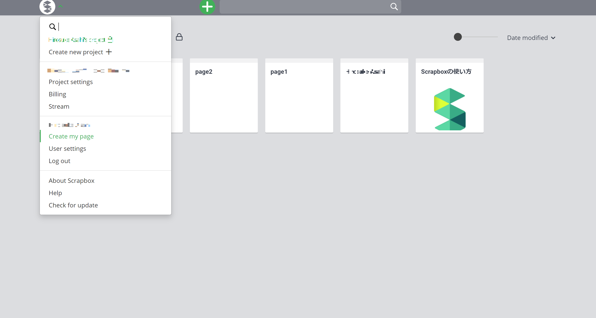
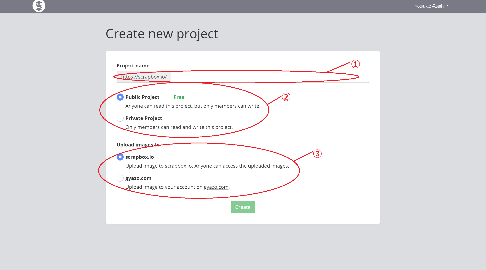
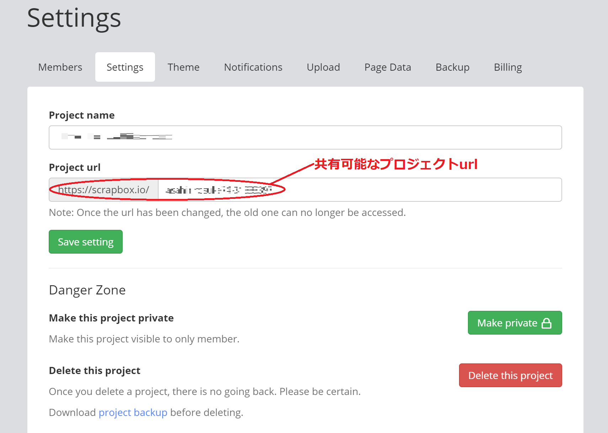
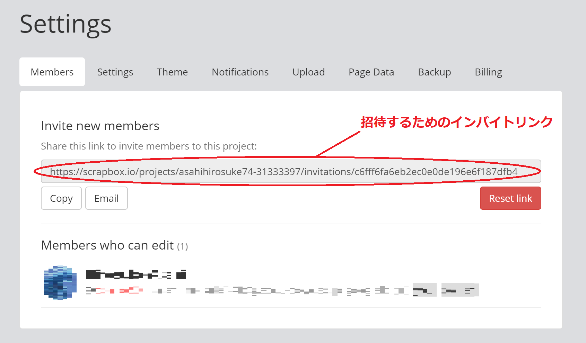

## この記事のハイライト

この記事では，Scrapboxの基本的な使い方を説明します．

### 以下のような場面で使用できます

* 学習しやすいように授業内容をまとめたページを用意したい
* 授業資料を複数人で書き込みながらまとめたい
* 作成した資料を手軽に，即時的に共有したい
* 質問と回答を書き込んでいくような，双方向的なコミュニケーションの場を作りたい
* 学習者が簡単に目的の資料を見つけられるようにしたい

### 以下のようなことはできません

* 学習者に向けて編集と閲覧の権限を独立して与えることができない
* プロジェクト単位での情報共有となり，一つずつのページごとの共有はできない
* デフォルトではページは特に整理されず，作成順などで一覧として並び，自動では資料を構造化できない

## Scrapboxとは

### アプリについての説明

Scrapboxは，Nota Inc.が提供する，オンラインで多数のメモ書きやノートを保存して整理するためのツールです．複数人が共同で同時編集をしたり，URLを使って内容を共有したりすることができます．「リンク」や「タグ」などを使って多数のページを簡単に繋げることができるのが特徴で，これを活用して，オンライン授業で資料をまとめたポータルサイトのように使うことができます．

### 有料版・無料版の差

公開プロジェクトの場合は使用用途・ページ数に制限ありません．プライベートプロジェクトにする場合，大学などの教育用途は常に無料と記されています． \
ビジネス用途を含む場合は100ページを超えると有料になります．

### インストール方法や起動方法

[Scrapbox - チームのための新しい共有ノート](https://scrapbox.io/product)から「Scrapboxを開く」をクリックし，Googleアカウントを用いてログインする

### 操作画面について

* **①ページ作成**：「+」ボタンを押すと，プロジェクト内で新しいページが作成されます．ページでは，文字を打ち込むと自動で保存されます．

* **②メニューボタン**：画面左上の「S」ボタンを押すことで，プロジェクトの設定などに関するメニューが表示されます．
  * **Create new project**：新しいプロジェクトを作成可能
  * **Project settings**：プロジェクトについての様々な設定が可能
    * **Members**：ここに表示されているリンクからプロジェクトメンバーの追加が可能
    * **Settings**：プロジェクトのリンクの変更や公開非公開の変更などのプロジェクトの詳細な設定が可能
    * **Theme**：背景の色などが変更可能
    * **Notifications**：他アプリ（SlackやDiscordなどのチャットアプリ）との連携設定を見ることが可能
    * **Upload**：プロジェクトページや画像のアップロード設定が可能
    * **Page Data**：ブックマーク設定やページのエクスポート・インポートが可能
    * **Backup**：ページの内容が編集された際の履歴のバックアップ設定が可能
    * **Billing**：無料の個人使用か有料のビジネス使用か，プロジェクトの目的の変更が可能

### 本ツールにおける言葉の定義とread/write権限

* **プロジェクト**：プロジェクトとは，情報をまとめるためのスペースの単位です．その単位を検索範囲とし目的とする情報を検索することができます．また，情報共有の単位でもあり，種々の権限は作成者が保有しています．
  * プライベートプロジェクト (private)
      * 非公開のプロジェクトで，承認していないユーザーからはアクセスできません．ページが公開されているURLを外部のユーザーが知っていても，アクセスはできません．認証は，各自が持っているGoogle Account（東大の構成員であれば，ECCSクラウドメールのアカウントが利用できます）の情報により行われます．
      * ユーザがプロジェクトにアクセスするためには，プロジェクト管理者から配られたプロジェクト参加申請用のリンク（インバイトリンク）を押す必要があります．プロジェクトメンバーは「Members who can edit」の中に表示されます．
      * インバイトリンクは，再発行 (reset link) しないかぎり有効で，1つのインバイトリンクで何人もアクセスできます．
      * プライベートプロジェクトの場合，プロジェクトメンバーに対して編集と閲覧の権限は独立して与えることができません．（見るだけで編集できないメンバーは設定できません．）
      * 「Members who can edit」から，adminやownerを指定できます．ownerとはプロジェクトURLを管理している人です．他の人をownerにすることもできます．adminは，ownerの持っている権限のうち，一部（例：インバイトのリンクを作成するなど）を行えます．
  * 公開プロジェクト (public)
    * ページの公開URLを知っていれば，認証なしで誰でもアクセスすることができます．公開URLにアクセスした人は，誰でもページを閲覧できますが，書き込みはできません．
    * また，公開URLとは異なるインバイトリンクが存在し，これを知らせることはページの書き込み権限を与える操作になります．
    * 時間が経つとGoogle 検索にもかかるようにもなります．
* **ページ**：ページとは，プロジェクト内に蓄積されるwikiの単位です．ページ間を階層化するには手動でリンク付けをする必要があり，デフォルトではただ並列した関係として一覧に並びます．

### 本記事おすすめの操作手順

資料共有の流れを説明します．
[Scrapboxのヘルプページ]（https://scrapbox.io/help-jp/）も参考にしてください．

1. プロジェクトを作成する
    1. 半角英数字でプロジェクトネームを定めます．
    2. プロジェクトの公開／非公開を選択します．
    3. 画像のアップロード先を選びます．scrapbox.ioを選べば大丈夫です．
    * 注意事項
      * 入力した文字は表示画面・検索結果に即時的に反映されます．（更新などは不要です．）
      * 書き込みは自動で保存され，同時に時系列に沿ってバックアップされていきます．（過去のバージョンにさかのぼることが可能です．）
      * 文字情報以外に，下記の要素をおくことができます．
          * 画像，動画の埋め込みができます．
          * 数式も書けます．
          * 文字を太字にすることができます．
          * 文字の色を変えることもできます．
      * 読みやすいプロジェクトの作成
        * ページ内やプロジェクトの他のページへのリンクをつくれます．
        * 「学生がアクセスするページ」をリンクを用いて整理し，そこから，各ページへアクセスできるような設計は1つの例です．
        * ページ下部のリンクは，分類して載せる事ができます．
2. プロジェクトを共有する
   * プライベートプロジェクト：
       * インバイトリンクで閲覧権限と編集権限が付与されます．（閲覧と編集の権限を独立して付与することはでき出来ません．)
   * 公開プロジェクト：
       * プロジェクトURLを押せば即時に閲覧することができる．
       * インバイトリンクで編集権限が付与されます．
   * 招待された側の動作：
       * 同時編集は即時的に反映されます．
       * 同時に編集していると，他の人がどこを書いているか，名前入りのカーソルが表示されます．
   * ICT-LMSやUTASへのURLの共有を推薦します．
3. Slackなどのチャットツールに更新を通知する
   1. 左上のmenuから，project settings画面のNotificationsタブを開きます．
   2. 設定画面の「Slack Notification」のリンクを開き，Slack Integrationで「Incoming Webhook」を作成します．（[Slack での Incoming Webhook の利用](https://slack.com/intl/ja-jp/help/articles/115005265063-Slack-%E3%81%A7%E3%81%AE-Incoming-Webhook-%E3%81%AE%E5%88%A9%E7%94%A8) を参照して下さい．）
   3. 「Incoming Webhook」のURL (https://hooks.slack.com~~) を貼り付け，Addを押して下さい．
   * 通知タイミング
       *  Scrapboxへ最後に書き込んだ後，90秒経過すると通知されます．
       *  連続して書き続けている間は通知されません．
   * 他のチャットツールへ通知する
       * Slack以外のURLにも，通知は送信可能です．
       * データフォーマットはSlackと同じものになります．

### （＋α）グッドプラクティス・応用例の紹介

* [白石忠志 先生　法Ⅰ](/good-practice/interview/shiraishi.html)
* [東京都立大学オンライン授業サポートページ（教員用） (scrapbox.io)](https://scrapbox.io/tmu-online-tips/)