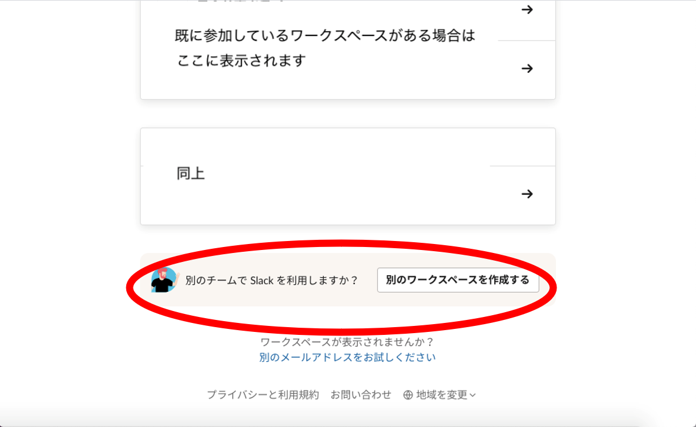
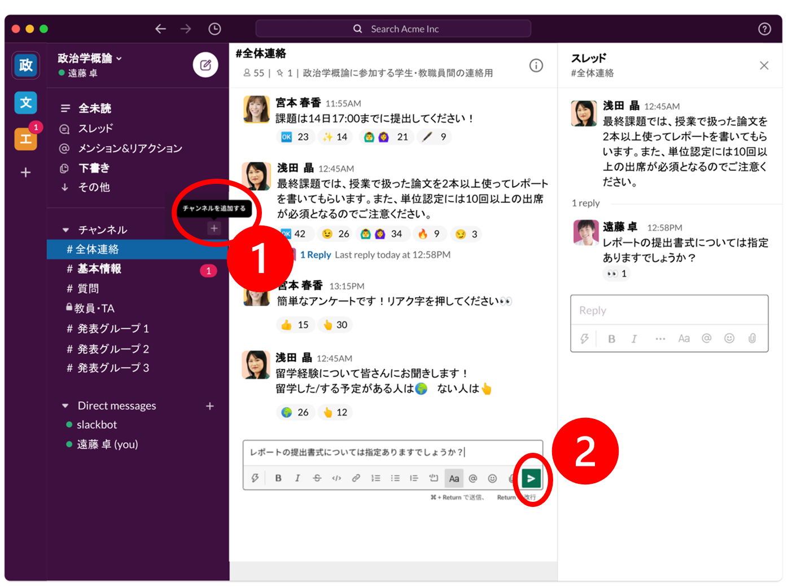

## この記事のハイライト

この記事では，学生とのコミュニケーションなどSlackの活用方法について紹介します．

### こんな場面で使用できます

* （教員）オンデマンド授業やライブ授業で学生から質問をしてもらいたい
* （教員）授業に関連して学生に向けて指示を出したい
* （教員）学生とコミュニケーションをとりたい
* （教員）グループ発表準備のために授業外で学生同士にコミュニケーションをとってほしい
* （学生）履修生やゼミのメンバーとコミュニケーションをとりたい

### こんなことはできません

* 既読した人やその人数が自動で分かる機能はありません（チャットを読んだら絵文字等でリアクション／返信をしてもらうなど，対応策はあります）．
* 無料版では，閲覧／検索できるメッセージは直近10,000件まで，1つのワークスペースに送信できるファイルは計5GBまで，連携できるアプリは10件までなどの制限があります．

## Slackとは

### アプリについての説明

Slackは，リアルタイムでやりとりができるメッセージプラットフォームです．チームメンバーで共有する **「ワークスペース」**と呼ばれるプラットフォームの中で，テーマや関係者ごとに **「チャンネル」**を分けてメッセージのやり取りや運用を行うことができます．

#### ①　チャンネルを使って情報共有できる

テーマや内容ごとに「チャンネル」を作ってコミュニケーションを取ることが可能です（本記事[「授業での使い方―チャンネルの作成方法」](#in_class)で詳述）．チャンネルを分けると，チーム内での情報をテーマごとに共有できるので，情報ややりとりが整理されます（本記事[「授業でのチャンネル活用術」](#for_teachers)で詳述）．

チャンネルには，**通常チャンネル**と**プライベートチャンネル**があり，プライベートチャンネルに設定すると同じワークスペース内でも承認された人以外は検索・参加ができないクローズドな場を作ることができます（本記事[「授業でのチャンネル活用術―教員とTAのみで授業について話したい](#private_channel)」で詳述）．

####   ②　メッセージの送信にはDMやメンション機能を活用

**ダイレクトメッセージ（DM）**で個人的にメッセージを送ることもできます．（本記事[「授業でのチャンネル活用術―個別に学生に連絡を取りたい」](#dm)で詳述）

チャンネル内で特定の相手にコメントしたい場合や相手に通知したい場合は，**メンション（通知）機能**を使うとメッセージを見てもらいやすいのでおすすめです（本記事[「授業でのチャンネル活用術―質問を受ける（#質問）」](#question_teachers)で詳述）．

####  ③　絵文字を使ってカジュアルなコミュニケーションも可能

各メッセージには**絵文字**でリアクションをすることができます．学生に，お知らせを読んだらリアクションをするように頼むことで連絡の未達を防いだり授業内でのアンケートに活用したりすることもできます（本記事[「授業でのチャンネル活用術―授業の連絡や気軽にアンケートを取る」](#announce)で詳述）．

#### 仕様

* 提供元: Slack Technologies Inc．
* 使用可能な環境
    * 端末・OS: PC，タブレット，スマートフォンで使用可能．
    * OS・ブラウザのバージョンについては[こちら（Slack公式ヘルプページ）](https://slack.com/intl/ja-jp/help/articles/115002037526-Slack-%E3%82%92%E5%88%A9%E7%94%A8%E3%81%99%E3%82%8B%E3%81%9F%E3%82%81%E3%81%AE%E6%9C%80%E4%BD%8E%E3%82%B7%E3%82%B9%E3%83%86%E3%83%A0%E8%A6%81%E4%BB%B6)
    * インストールに必要なドライブ容量: ブラウザ版を使用する場合0．アプリダウンロードのサイズは158.1MB
    * 必須またはオプションのアクセサリ: なし
* 運用コスト
    * 費用: 無料（有料プランもあり）
    * 授業を受ける学生側が準備すること
        * メールアドレスでSlackアカウントを作成する
        * 教員からの招待を承認する
        * 必要に応じてアプリをインストールする

## インストール方法・ワークスペース作成方法

### アプリのインストール
* Webブラウザ版を使用する場合は，[Slackホームページ](https://slack.com/get-started#/create)から登録・サインインをします．
* アプリ版を使用する場合は，Slack内ダウンロードページからインストールします．（[Windows](https://slack.com/intl/ja-jp/downloads/windows)の場合）（[Mac](https://slack.com/intl/ja-jp/help/articles/207677868-Mac-%E7%89%88-Slack-%E3%82%92%E3%83%80%E3%82%A6%E3%83%B3%E3%83%AD%E3%83%BC%E3%83%89)の場合）

以下ではアプリ版を使用した手順を紹介します．
（Web版も大きな手順は変わりません）
    
### Slackでワークスペースを作るには？（授業のワークスペースを作る）
1. 「Sign in to Slack」を押します．
2. ブラウザで以下の画面が立ち上がります．「Googleで続行する」を押し，ECCSアカウント（または個人のメールアドレス）でサインインします．
3. ページ下部の「別のワークスペースを作成する」を押します．
4. ワークスペース（例：授業名）を設定します．「社名またはチーム名」はワークスペースの名前になります．授業で使用する場合，ワークスペース名はどの授業か一目で分かる名前にしましょう．ここでは「〇〇ゼミ」というワークスペースとします.
5. 「チームで今取り組んでいること」はワークスペースの中に設置する「チャンネル」の名前になります．授業で使う場合は「基本情報」などのチャンネルを設定しておくと便利です（本記事[『授業でのチャンネル活用術』](#for_teachers)参照）．ここでは「課題についての質問」チャンネルを作成します．
6. 次に先ほど決めたチャンネルの利用者を尋ねる「メールを一番送信する相手は誰ですか」という画面が出てきます.ワークスペースに招待する人のメールアドレスを入力する場面ですが，この工程は後ほど行うのでスキップします．
7. 授業で使うワークスペースが完成しました．

### 招待の方法（学生をワークスペースに招待する）
<figure>

</figure>

* 招待したい学生のメールアドレスを収集できている場合は，学生のメールアドレスに招待を送ります．ダイレクトメッセージの下にある，**「チームメンバーを追加する」**を押し，招待したい学生のメールアドレスを入力します．
* リンクで共有する場合は，招待リンクをITC-LMSなどを通じて授業内で共有します（「[招待リンクの共有方法（Slackヘルプ）](https://slack.com/intl/ja-jp/help/articles/201330256-%E3%83%AF%E3%83%BC%E3%82%AF%E3%82%B9%E3%83%9A%E3%83%BC%E3%82%B9%E3%81%AB%E6%96%B0%E8%A6%8F%E3%83%A1%E3%83%B3%E3%83%90%E3%83%BC%E3%82%92%E6%8B%9B%E5%BE%85%E3%81%99%E3%82%8B#u25307u24453u12522u12531u12463u12434u20849u26377u12377u12427)」）．
    * 招待リンクが外部に流出しないように気をつけると共に，学生にも注意喚起しましょう．
    * 受講者のメールアドレスを公開しない設定を忘れずに行いましょう（設定方法については「[メールの表示の管理（Slackヘルプ）](https://slack.com/intl/ja-jp/help/articles/228020667-%E3%83%A1%E3%83%BC%E3%83%AB%E3%81%AE%E8%A1%A8%E7%A4%BA%E3%82%92%E7%AE%A1%E7%90%86)」を参照してください）．
* 学生は招待メールのリンクからワークスペースに参加します．
    * 招待の承諾の仕方は「[Slackヘルプ](https://slack.com/intl/ja-jp/help/articles/212675257-Slack-%E3%83%AF%E3%83%BC%E3%82%AF%E3%82%B9%E3%83%9A%E3%83%BC%E3%82%B9%E3%81%AB%E5%8F%82%E5%8A%A0%E3%81%99%E3%82%8B)」を参照してください．

## 授業での使い方
{:#in_class}

ここでは架空の授業「政治学概論」を想定して，効果的なSlackの活用方法を紹介します．

<figure>

</figure>

* チャンネルの作成方法 チャンネルは＋アイコン（上図①）からも作成できます．この授業（ワークスペース）では以下のチャンネルを作成しています．
    * ＃全体連絡
    * ＃基本情報
    * ＃質問
    * ＃教員・TA
    * ＃発表グループ1／＃発表グループ2／＃発表グループ3

* メッセージの送信方法 メッセージの送信は各チャンネルの飛行機マーク（上図②）で送信します．必要に応じて太字やイタリックで強調したり、ファイルの添付（クリップマークからファイルを選択）を行うことも可能です．

### 授業でのチャンネル活用術【教員編】
{:#for_teachers}

#### 授業の連絡や気軽にアンケートを取る（#全体連絡）
{:#announce}

<figure>

</figure>

* #generalのチャンネル名を「＃全体連絡」に変更しましょう．
    * 既存のチャンネルのチャンネル名を変更するには，該当チャンネルを開いて右上のⓘマークを押し，パソコンの場合は「その他＞チャンネル名を変更する」を，スマホの場合は「編集する」を押します．
* 授業での課題連絡などを行うチャンネルです．
* アンケートなどもこのチャンネルで実施できます．
    * 絵文字でのリアクションを活用しましょう．
    * 授業が終わってからもアンケートの結果を見られるほか，気軽なコミュニケーションを取ることができます．
        
#### 授業の情報をまとめて一覧性を高める（＃基本情報）
{:#info_list}
* ITC-LMSに載せた授業情報を再掲しましょう．
* 授業資料へのリンクをまとめるなどの活用もできます．

#### 質問を受ける（＃質問）
{:#question_teachers}
<figure>

</figure>

* 学生が授業についての質問や課題についての質問をするチャンネルです．
* リアルタイムで質問を受けるだけでなく録画放映形式のオンデマンド授業での質問にも対応できます．
* 質問を集約して対応が可能なことや授業が終わってからも過去の質問ログを検索できるのが利点です．
* 参考資料などを添付すれば，学生が授業後も深く学べます．
* Slackでの登録名の前に@をつけることで質問をしてきた学生にメンション（通知）することも可能です．

**Tips：質問はチャンネルで受け付けることを推奨**

授業の内容に関する質問などは他の学生も閲覧可能な「チャンネル」でやり取りをすると，教員の個別対応の負担を下げるだけでなく，そこからディスカッションが生まれるなどインタラクティブな学びを深めることが可能です（成績や課題提出などの学生個人に関わる内容に関してはDMを用いたやり取りが推奨されます）．

<figure>

</figure>

#### 教員とTAのみで授業について話したい（🔒教員・TA）
{:#private_channel}
* 教員とTAでクローズドな情報共有をしたい場合はプライベートチャンネルを設置します（[Slackヘルプ](https://slack.com/intl/ja-jp/help/articles/213185467-%E3%83%81%E3%83%A3%E3%83%B3%E3%83%8D%E3%83%AB%E3%82%92%E3%83%97%E3%83%A9%E3%82%A4%E3%83%99%E3%83%BC%E3%83%88%E3%83%81%E3%83%A3%E3%83%B3%E3%83%8D%E3%83%AB%E3%81%AB%E5%A4%89%E6%8F%9B%E3%81%99%E3%82%8B)参照）．
* プライベートチャンネルでは，同じワークスペースの中でも，チャンネルに招待されていない人が，自由に参加したりメッセージの内容を検索したりすることはできません．
* チャンネルを作る際，「プライベートチャンネルにする」をONにすることで，プライベートチャンネルを作成できます．
* プライベートチャンネルに設定した場合，通常チャンネルに戻すことができない点は注意が必要です．

#### グループワークで資料等を共有したい（＃発表グループ1, 2……）
{:#public_channel}
グループワークを行う際などに，文字情報や資料の共有ができます．通常のチャンネルにしておくことで，教員・他グループの学生が（そのチャンネルに参加していなくても）各グループの進捗を把握できます．教員とグループメンバーだけのプライベートチャンネルにすることもできます．

#### 個別に学生に連絡を取りたい（ダイレクトメッセージ）
{:#dm}
課題が提出されていないなど個別に対応が必要な時はDMで連絡を取りましょう．

#### （応用）Zoomと連携する
{:#zoom}
連携の仕方は[こちら（Slack 公式サイト）](https://slack.com/intl/ja-jp/help/articles/115004062463-Slack-%E3%81%A7-Zoom-%E3%82%92%E5%88%A9%E7%94%A8%E3%81%99%E3%82%8B)から確認してください．連携すると，SlackからスムーズにZoomを開始することができます．

### 授業でのチャンネル活用術【学生編】
{:#for_students}
#### 教員に質問をする（#質問）
{:#question_students}

<figure>

</figure>

確実にレスポンスがもらえるように，教員をメンションするとよいでしょう．赤丸のようにSlackでの登録名の前に@をつけることでメンションできます．

#### 履修生同士で雑談をする（＃雑談）
{:#chat}
`#雑談`など，雑談用のチャンネルを作成・活用するといったことも可能です．その他のチャンネルでは授業に関係のない話は避けましょう．

### Tips：運用ルールの作成

※授業でワークスペースを活用する際は，受講者と運用ルールなどを事前に共有すると良いでしょう．特にメールアドレスなど個人情報の取り扱いにはくれぐれも注意してください（[Slack ヘルプ：メールの表示を管理](https://slack.com/intl/ja-jp/help/articles/228020667-%E3%83%A1%E3%83%BC%E3%83%AB%E3%81%AE%E8%A1%A8%E7%A4%BA%E3%82%92%E7%AE%A1%E7%90%86)）．

### グッドプラクティス・応用例の紹介

* [斎藤宣一先生　計算数理Ⅰ](/good-practice/interview/saito)
    * オンデマンド形式の授業でSlackを使用．Slack上で授業内容に関する質問を募り，Slack上で回答を促しました．対面のときよりも質問が盛んだったようです．Slackでは発言を取り消したり修正したりすることができるので，心理的な負担が少ないとのことでした．
* [白石忠志先生　法Ⅰ](/good-practice/interview/shiraishi.html)
    * Slackは任意利用としたため，実際に登録した受講生は1割程度でしたが，DMでは非常に多くの質問や相談が寄せられました．他の人の目を気にせずに連絡を取れるという点も，教員への連絡を取りやすくした理由だとのことです．
    * 授業の5日前にはSlackとITC-LMSに資料をアップロードして，前日の昼までにSlackに質問を送ってもらう工夫をした結果，授業ではその質問への回答や，質問を踏まえた説明ができるようになり，授業の構成にも役立ちました．

### お役立ちリンク集

* [Slackヘルプ](https://slack.com/intl/ja-jp/help)
* [使ってみようSlack入門 〜使い倒して業務効率アップ！](https://ascii.jp/serialarticles/3000637/)

**※本記事の作成にあたり，Slack Japan株式会社に画像提供などのご協力を頂きました．ご協力いただき誠にありがとうございました．**
