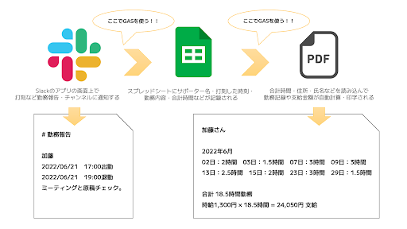

## はじめに

授業の準備や資料の整理などの日常業務に際して，GmailやGoogleドライブなど，Googleの機能を使用する機会がある人は少なくないでしょう．

この記事では，元々**Googleのアプリケーションにおいてメニューやボタンを操作して使用できる機能（Graphical User Interface; GUI）だけではできないことを，簡単なプログラミング技術を使って実現する方法**を紹介します．

「プログラミング」「スクリプト」などと言われると苦手意識を持ってしまう方もいるかもしれませんが，この記事では難しい内容や複雑な内容は一切扱いません．GASがどういったものか，その機能や，簡単に始められる方法のみをご紹介します．ご一読の上，ぜひ簡単なところからチャレンジしてみてください．

## Google Apps Script（GAS）について

Google Apps Script（GAS）は，**Googleが提供しているサービス**（[プログラミングのプラットフォーム](https://developers.google.com/apps-script/overview)）で，Webサイトやシステム開発のためのプログラミング言語であるJavaScriptをベースとしています．

GASを活用することで，各種Googleサービス（Googleドキュメント，Googleスライド，Googleスプレッドシートなど）の機能の拡張，外部の他のサービスとの連携，操作の自動化など，様々なカスタマイズができるようになります．

つまり，**GASを用いることで，従来の基本的な操作（GUI）のみではカバーできない発展的な使い方ができる**ということです．

### GASは例えばどんなことに使える？

まずは，Googleサービス内の機能を拡張したり，サービス同士を連携させたりする例を紹介します．

**〈例1：オンライン講演会の参加者へのメール送信を自動化したい場合〉**

例えば，Googleフォームでオンライン講演会の申し込みを受け付けるとします．フォームで受け取った回答の内容がスプレッドシートの表の形に反映されるところまでは，従来の機能です．

申し込みをした人に対してGmailから招待メールを送信する際，GASを使うと，自分の手で本文を入力したり送信したりせず，宛先・氏名・参加人数・日時・参加費などの情報を表から自動で反映して，自動で送信することが可能です．

実際に，これと同じ仕組みで，学生の課題提出状況の管理と通知を行っている教員がいます．

**〈例2：勤怠管理を自動化したい場合〉**

次に，Googleではない他のサービスとの連携であり，やや発展的な凝った使用例を紹介します．

オンライン教育支援サポーターでは，出勤・退勤時の打刻にGASを組み込んだアプリを使用しています（本アプリはOES関係者が開発したもので公開はしておりません）．Slackに勤務報告アプリをインストールし，打刻画面から出勤／退勤ボタンをクリックすると，Slackの「勤務報告」というチャンネルに打刻履歴が通知されると同時に，Googleスプレッドシートに蓄積されます．

Googleスプレッドシート上では，サポーターごとの勤務の合計時間が自動計算されており，月末に出勤表をPDF形式で自動出力することができます．

### GASを使うとどんな良いことがある？

日々の業務や授業準備などの作業には，同じ単純操作を何度も繰り返す性質のものや，手入力で行うと煩雑で膨大になるものが多く存在します．これらを一部自動化するだけで，**大幅な時間短縮や負担軽減**の一助となり，他の作業に時間を使うことができます．

また，今まで機能的な制限によってできなかったことが実現されるため，**できることの選択肢や可能性が大きく広がる**ことでしょう．

## スクリプトについて

これらのことを実現させるためには，ひと手間，**スクリプトの用意が必要**となります．

スクリプトは，下の画像のような見た目をしています．

それぞれの単語・数字・記号の部分にはそれぞれ決まった意味があり，これらを規則的に組み合わせることによって，「このボタンをクリックした場合は，この部分がこうなる」というように，命令の詳細な内容や作用する先などを決めています．

### スクリプトは全て自分で書かなくてもよい

このような複雑な文字列を見ると心配になってしまうかもしれませんが，スクリプトにはある程度決まった型があり，**応用ができるため，必ずしも一から全てを自分で書く必要はなく，全てのコードの意味を理解している必要もありません．**

スクリプトの**見本を掲載しているブログサイトや掲示板などがたくさんあります**から，そこで公開されている見本をそのまま流用したり，自分のやりたいことに合わせて少々アレンジを加えたりすることから始めてみましょう．

まずは，「（やってみたいこと）」＋「スペース」＋「gas」／「apps script」で検索してみてください．

また，特に[Qiita](https://qiita.com/tags/googleappsscript)や[Zenn](https://zenn.dev/topics/gas)などのようなページには，GASの使用事例やスクリプトの書き方などの情報が集まっているため，参考になるでしょう．

（これらのスクリプト1つ1つや，その組み合わせであるプログラムには著作権があるため，他者が作成したスクリプトを使用する際には，利用規約を確認しましょう．基本的には，まるで自分で考案したもののように他の場所で転載・配布することや販売することはできません．）

### スクリプトは何度も再利用できる

一度作成・保存したスクリプトは，スクリプトファイルを開き，数字・URLなどの条件を必要に応じて書き換えれば，**繰り返し，何度も使用することができます．**

https://script.google.com/ から，自分が作成したスクリプトの一覧を確認することができます．

### スクリプトを書けるようになるには

ご自分でスクリプトを書いたり，何が書かれているかを理解したりできるようになりたいという方は，ぜひ，もっと深くGASを学んでみてください．

自分でスクリプトを書ければ，より自分のやりたいことに近いこと・より発展的なことを実現できるようになります．

いくつかGASを学ぶための方法があります．

* GASを専門に扱った参考書を参照して自習する．
* インターネット上で，GASについて指南するWebサイトやブログサイトなどを閲覧して自習する．
* 専門の講座などを受講する．

ご自分に向いている方法をお試しください．

## utelecon上のGASに関連した記事一覧

uteleconでは，GASを活用して，オンライン授業の準備の負担を軽減する方法を紹介しています．

[Googleドライブでファイルとフォルダを複製する方法](/articles/gas/copy)  
他，準備中

## あわせて読みたい記事

[Googleドライブでファイルとフォルダを複製する方法](/articles/gas/copy)  
[オンライン授業情報交換会 第11回 オンライン授業で使えるツール(1)](/events/luncheon/2020-06-24/)
