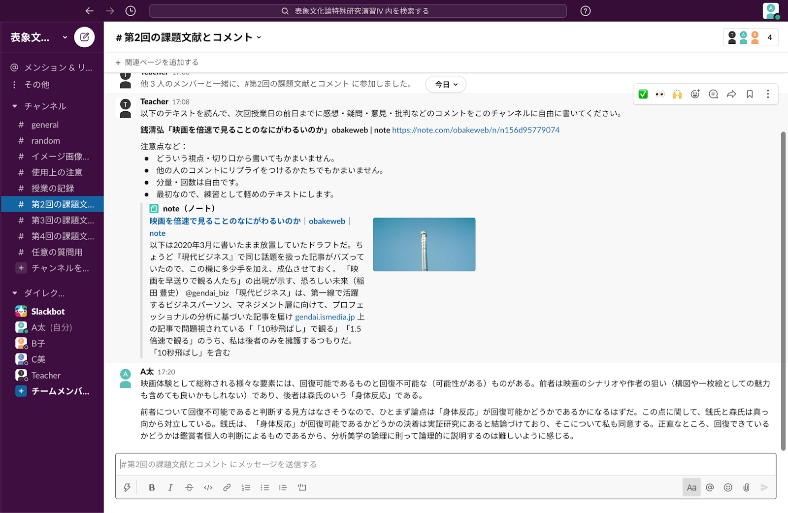
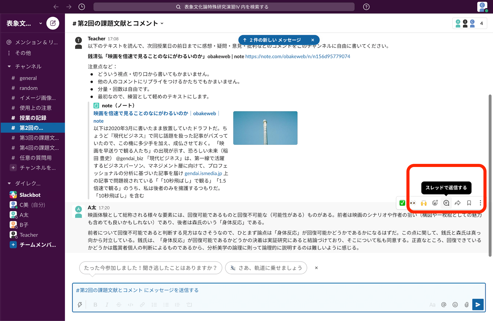
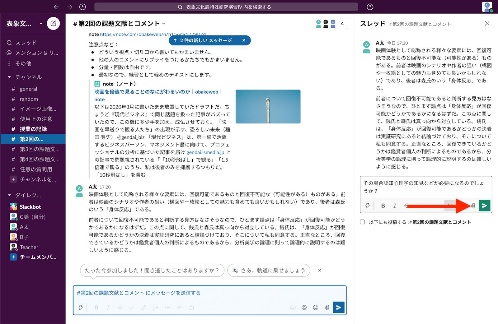
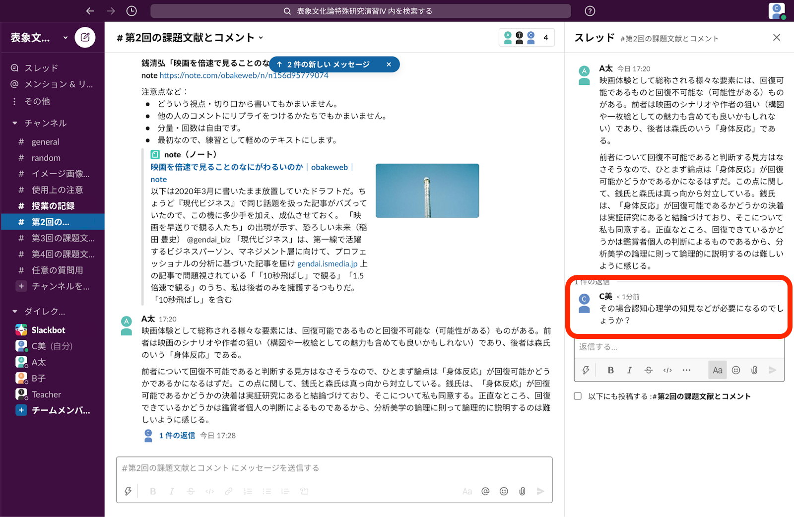
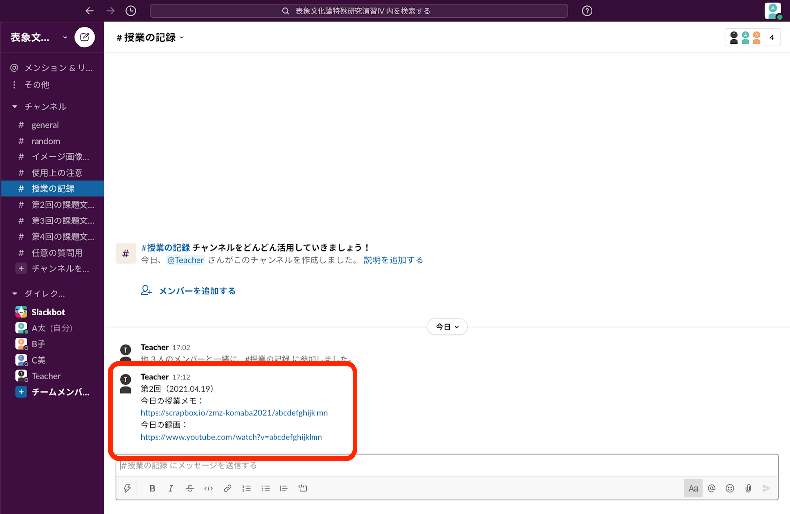



## この記事のハイライト

* この記事では，Slackを用いたゼミ形式の授業の進行方法について紹介しています．
* 実際にSlackを用いたゼミ形式の授業の実例を元にしながら，Slackの活用法を紹介します．
* Slackについての詳細，インストール方法，授業での使い方に関しては「[Slackで学生とコミュニケーションを取る方法](/articles/slack-communication)」の記事も併せてご確認ください．

### こんな場面で使用できます

*   事前に課題文献を提示する
*   授業回別に学生からの意見・感想を募る
*   授業の録画・授業メモを提示する
*   学生からの質問を受け付ける
*   期末課題を提示する

### Slackの使用に適した授業例

*   学生が課題文献に対して意見・感想を発表する授業
*   課題文献について様々な観点から意見を出すディスカッション形式の授業（特定の正解が存在しない）

## Slackとは

Slackは，リアルタイムでやりとりができるメッセージプラットフォームです．

チームメンバーで共有する **「ワークスペース」** と呼ばれるプラットフォームの中で，テーマや関係者ごとに **「チャンネル」** を分けてメッセージのやり取りや運用ができるのが特徴です．

詳細は「[Slackで学生とコミュニケーションを取る方法](/articles/slack-communication)」も確認してください．

## ゼミ形式の授業でのSlack利用

### メリット

*   課題文献の提示やそれに対するコメント，授業録画の配信，期末課題の提示など，授業に関する全ての情報をひとつのプラットフォームで管理することができます．
*   LMSなどと異なり，その都度ログインする必要がありません．
*   課題文献についてのコメントを事前に受け付けられるため，論点を明確にさせておくことができます．
*   授業時間の制約がないため，全ての学生が課題文献に対する自分の意見を提示できます．

### デメリット・リスク

*   大学側が提供するサービスではありません．
*   情報流出のリスクがあります．
*   参加学生全員をワークスペースに登録する手間があります．
*   Slackの使用に慣れていない学生への配慮が必要です．

## Slackを用いた授業の実例

教員：松永伸司先生　京都大学大学院文学研究科准教授　東京大学教養学部非常勤講師 
授業名：表象文化論特殊研究演習Ⅳ 
対象：学部生・大学院生 
学生数：約25名

### 授業形式

課題文献を授業の1週間前に提示し，授業前までにその文献に対するコメントをSlackの専用チャンネルに書き込んでもらいます．  
事前に学生が書き込んだコメントを，共通した要素を持つものごとに教員が分類し，重要な箇所をScrapbox \*に書き写します．

授業では，Scrapboxのまとめを軸にして各学生のコメントを確認していきます．学生から口頭で直接コメントの詳細を説明してもらいながら議論を進めます．  
（授業中にSlackを使うことはあまりないですが，場合によってはリプライなどで議題に上がっているコメントに反応することもあります．）

#### \*Scrapboxについて

Scrapboxは，Nota株式会社が運営する情報共有サービスです．ページ間のリンク機能があり，階層構造を持った情報を簡単に記入することができます．詳細は「[Scrapboxの基本的な使い方](/articles/scrapbox/)」を確認してください．   
（Scrapboxを活用した別の事例としては，グッドプラクティス「[白石忠志先生の授業：法Ⅰ（教養学部前期課程約400名）](/good-practice/interview/shiraishi)」をご確認いただけます．）

### 用意するチャンネル

#### 各回の授業用チャンネル

1. 課題文献ごとにひとつのチャンネルを用意します．授業の1週間前に課題文献をスレッドの形で提示します． 
2. 授業前までに学生に課題文献に対するコメントを，以下の手順でスレッドの形で記入してもらいます．（他の学生のコメントに対し返信する形で意見することも可能です）
    1. 返信したいコメントにカーソルを合わせ，「スレッドで返信する」を選択します． 
    2. 返信を入力し，送信ボタン（右下の緑色のボタン）をクリックします． 
    3. コメントがスレッドとして投稿されます． 
3. 授業前に，授業に使用するScrapboxページへのリンクを提示します．

#### 授業の記録チャンネル

授業に使用したScrapboxページと授業録画のリンクを，各回の授業後にまとめて投稿します．

#### 任意の質問用チャンネル

課題文献に関係ない質問などを受け付けます．

#### 使用上の注意チャンネル

授業を受ける際の注意点をまとめて掲示します．

## 別のやり方でSlackを用いた授業の提案

実例のように授業時間外にSlackを用いるのではなく，授業時間内にSlackを用いる授業を設計することもできます．学生が発表する授業で，発表者に対する他の学生のコメントをSlack上で行えば，より多くの人が意見を表明することができ，論点もはっきりしやすいです．
