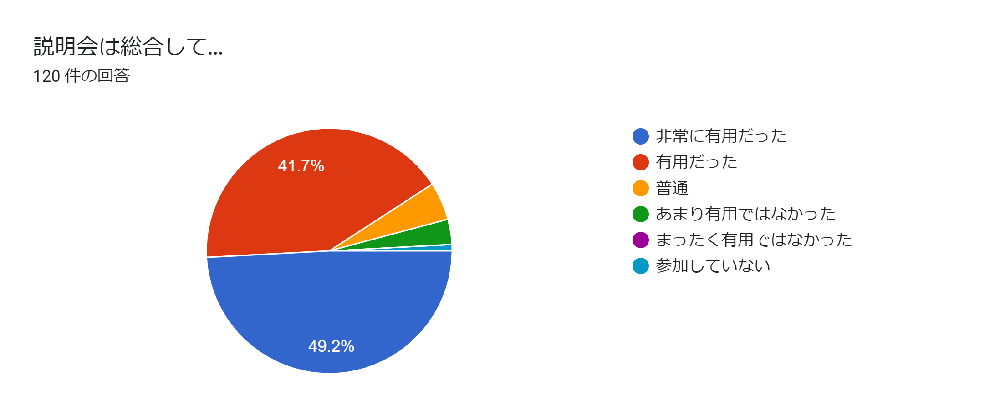

　An online workshop on  "How to use Zoom in online courses in mind" was conducted on March 19, 2020, from 15:00 to 17:00. 
  
  
　We first described the main types of online teaching, and the basic flow of a simple online class using Zoom (how to create a room, how to enter and exit, etc.). After that, as a practical part, microphone and camera settings, participant management (mute control), screen sharing (material presentation), chat (question and answer), raising hand (question and answer), polling (question from teacher) , Breakout (group work) and other functions were introduced.  
  
  
　We are sorry for those who could not participate because the meeting exceeded 1000 people immediately after the start. We released a recorded video of the workshop, so if you are interested, please watch it.  
　Also, thank you for those who participated on the day. Even after the basic course, individual consultation time was set up, and 500 people remained for about 30 minutes from the end of the workshop, and 200 people remained for about 1 hour and 30 minutes from the end. Thank you for your participation. 
  
[Handouts](workshop_how_to_use_zoom.pdf)  
  
## How we ran the workshop
　Two instructors had roles in the workshop: one instructor explained along with the slide, and the other instructor constantly checked the chat, sharing important questions and comments as needed. In addition, Dr. Taura, Director of the Information Technology Center, responded to questions that came up by chat.   
    
## What we have learned from the online course with 1000 participants
　We designed the workshop to make people be able to get to know about various functions while actually their experiencing Zoom.  
In addition, because it is difficult for participants to work together only with Zoom, we used Google Spreadsheets, so participants could share information on copyright-free materials and their own experience using Zoom in classroom. 

* What worked well
  * The workshop proceeded without audio and video troubles (some participants commented that the audio could not be heard, but it was due to the device settings on the participant side) 
  * We were able to use the chat without any problems (the chat screen became a little heavier in the second half).
  * The hand-raising function also worked well.  
  * The poll function (function for asking multiple-choice questions from the instructor to the participants) was used without any problems. However, it seemed that some participants could not answer the poll.
  * Recording was also fine (2 hours 30 minutes mp4 file, size 376MB, was generated). 
 
* What did not work
  * Google SpreadSheets did not work.
    * Participants could not write on the sheet. The error message was "Some tools might be unavailable due to heavy traffic in the file."
    * We are currently analyzing the access log to find out what is the limit of people able to access and edit the file at the same time (as of March 19, 2020, it seems difficult for 1000 people to collaborate on spreadsheets).
  * Breakout session did not work
    * Pressing "Start All Sessions" after assigning sessions resulted in no response from the system.
    * After the workshop, we had been doing individual consultations, and the breakout room function worked well in classes with 200 participants.
 
 
    
## Questionnaire results
　120 participants answered the questionnaire.  
　80% percent of the participants were faculty members, and more than 90% of the respondents answered that the online workshop was useful.  
　Although there is room for improvement, the instructors were relieved with the feedback. 

  

  

    
## In conclusion
It was our first attempt on an online workshop for 1000 people. We are happy that the course went well and without any big problems. We hope this report will be especially useful for those who are giving large online courses.　
We appreciate all the participants and many people who are involved in the construction of the portal site.
We would like to continue trying to provide meaningful workshops and information in the future. Thank you for your kind support.

(Lui Yoshida，Kayoko Kurita)