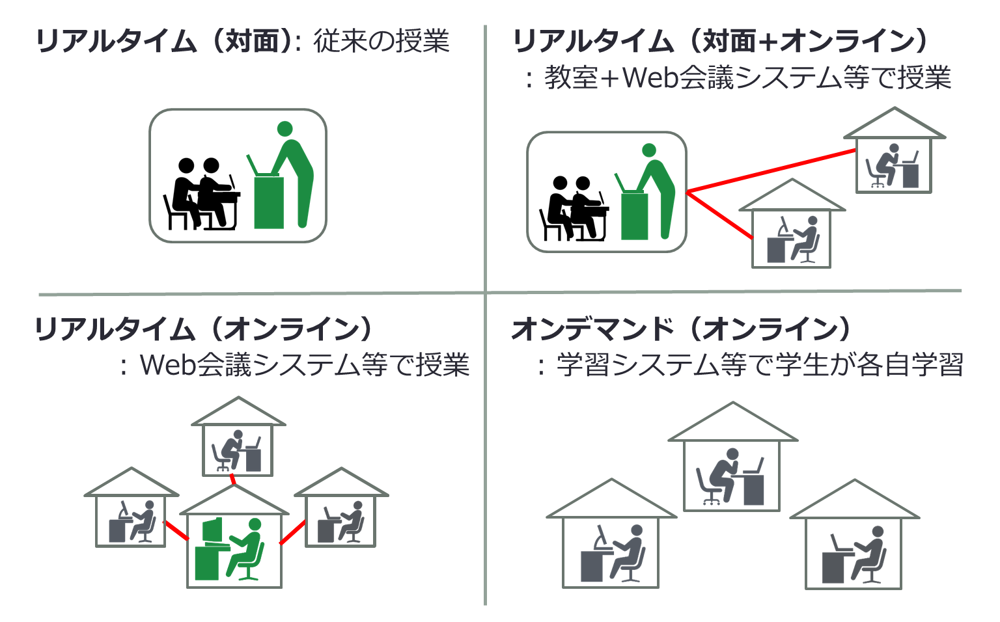

## Introduction  

The University of Tokyo has decided to introduce online classes in the S semester of the 2020 academic year. Throughout the S semester classes, students and faculty members have realized that the online classes have many advantages and should not be only for the quarantine period. On the other hand, we have re-confirmed the importance of in-person classes and face-to-face contact. Students often say that they feel the pain and sadness of not being able to go to the campus and not being able to see their friends, and they feel the burden and loneliness of not knowing how to complete a larger amount of assignments than usual.

We believe that this A semester should be a period of time when all layers, universities, faculties and graduate schools, and departments/majors are working on the following issues: adopting face-to-face (hybrid) methods for some classes, combining on-campus classes with measures to prevent the spread of infection (e.g., managing the number of students on campus, conducting face-to-face classes with some online learning activities, etc.), and understanding and sharing the burden of students among faculty members. [<a href="https://www.nii.ac.jp/event/other/decs/" target="_blank" rel="noopener">A cyber symposium to share initiatives on university online classes starting in April.</a> <a href="https://www.nii.ac.jp/event/upload/20200911-08_Fukuda.pdf" target="_blank" rel="noopener">The University of Tokyo’s approach to balance COVID-19 infection prevention and education</a>].

It is clear from the reactions of students and faculty to online classes in S semester that having all classes in a face-to-face format is not the endpoint the university is aiming for.[<a href="/events/2020-09-11/" target="_blank" rel="noopener">9/11 Briefing</a> の <a href="/events/2020-09-11/slides/02-review-last-semester.pdf" target="_blank" rel="noopener">Part 2 of the 9/11 information session: reflection on S Semester, video</a>, <a href="https://youtu.be/sKRoV_Y9tUI" target="_blank" rel="noopener">Video</a>] . Here are our goals for the future: Balancing the benefits of online classes with the in-person activities some classes require, and most importantly, getting back the values of the campus as a place for people to meet - thereby creating an environment that allows students to grow to their best human and academic potential. The A Semester is the first step to free students from the loneliness and suffering they have experienced during the S Semester, while at the same time taking advantage of the benefits of online classes that we have discovered during the S Semester.

We believe that this portal will become a community for achieving high quality online courses. The results of the teachers' efforts will be gathered and shared on this portal, which we anticipate will help to maintain or improve the quality of the learning environment for students.

This page provides the basic information about the educational ICT system and the key points of the various teaching methods in the university.

From faculty members participating in this portal 

## How to use ICT for education at the University of Tokyo

The whole picture is shown below.
* Clicking the system name to move to the sign-in page for each system.
* The arrows indicate dependencies, A -> B means that you need to get A enabled first to use B. (For example, to use Zoom, you need to have G Suite available, and to activate G Suite you need a UTokyo Account). 
* Systems marked "activation required" require some initial setup to be used for the first time. Click the "activation required" button to go to that page.
* For more details, please refer to the <a href="/events/2020-09-11/" target="_blank" rel="noopener">9/11 説明会</a>の<a href="/events/2020-09-11/slides/01-ict-overview.pdf" target="_blank" rel="noopener">Information Session on 11th September, Part 1: Overview of the ICT system for the class</a> (<a href="https://youtu.be/GyakfzUL1Vs" target="_blank" rel="noopener">video</a>).

<svg
   xmlns:dc="http://purl.org/dc/elements/1.1/"
   xmlns:cc="http://creativecommons.org/ns#"
   xmlns:rdf="http://www.w3.org/1999/02/22-rdf-syntax-ns#"
   xmlns:svg="http://www.w3.org/2000/svg"
   xmlns="http://www.w3.org/2000/svg"
   xmlns:xlink="http://www.w3.org/1999/xlink"
   xmlns:sodipodi="http://sodipodi.sourceforge.net/DTD/sodipodi-0.dtd"
   xmlns:inkscape="http://www.inkscape.org/namespaces/inkscape"
   width="927.33325"
   height="472.33334"
   overflow="hidden"
   version="1.1"
   id="svg203"
   sodipodi:docname="utokyo_ict_overview.svg"
   inkscape:version="0.92.5 (2060ec1f9f, 2020-04-08)"
   style="overflow:hidden">
  <metadata
     id="metadata207">
    <rdf:RDF>
      <cc:Work
         rdf:about="">
        <dc:format>image/svg+xml</dc:format>
        <dc:type
           rdf:resource="http://purl.org/dc/dcmitype/StillImage" />
        <dc:title></dc:title>
      </cc:Work>
    </rdf:RDF>
  </metadata>
  <sodipodi:namedview
     pagecolor="#ffffff"
     bordercolor="#666666"
     borderopacity="1"
     objecttolerance="10"
     gridtolerance="10"
     guidetolerance="10"
     inkscape:pageopacity="0"
     inkscape:pageshadow="2"
     inkscape:window-width="1842"
     inkscape:window-height="882"
     id="namedview205"
     showgrid="false"
     inkscape:zoom="1.0519445"
     inkscape:cx="530.53284"
     inkscape:cy="237.16667"
     inkscape:window-x="72"
     inkscape:window-y="29"
     inkscape:window-maximized="0"
     inkscape:current-layer="svg203"
     fit-margin-top="0"
     fit-margin-left="0"
     fit-margin-right="0"
     fit-margin-bottom="0" />
  <defs
     id="defs5">
    <clipPath
       id="clip0">
      <path
         d="M 30,190 H 963 V 664 H 30 Z"
         id="path2"
         inkscape:connector-curvature="0"
         style="clip-rule:evenodd;fill-rule:evenodd" />
    </clipPath>
  </defs>
  <a
     id="a1111"
     xlink:href=""
     transform="translate(-0.83343416,-1.833335)">
    <rect
       x="1.5000992"
       y="408.5"
       width="925"
       height="65"
       stroke-miterlimit="10"
       id="rect7"
       style="fill:#daedfb;stroke:#311731;stroke-width:1.33333004;stroke-linejoin:round;stroke-miterlimit:10" />
  </a>
  <a
     id="a4817"
     xlink:href="https://utacm.adm.u-tokyo.ac.jp/webmtn/LoginServlet"
     target="_blank"
     transform="translate(59.166566,-1.833335)">
    <text
       y="451"
       x="149.101"
       font-weight="700"
       font-size="27"
       id="text25"
       style="font-weight:700;font-size:27px;font-family:'Meiryo UI', 'Meiryo UI_MSFontService', sans-serif;fill:#0066ff">UTokyo<tspan
   x="261.04102"
   y="451"
   id="tspan9">Account</tspan>
<tspan
   font-weight="400"
   x="374.80801"
   y="451"
   id="tspan11"
   style="font-weight:400;fill:#000000">:</tspan>
<tspan
   font-weight="400"
   font-size="21"
   x="395.30801"
   y="451"
   id="tspan13"
   style="font-weight:400;font-size:21px;fill:#000000">個人に付与される大学アカウント(数字10桁)</tspan>
</text>
  </a>
  <path
     style="fill:#0066ff;fill-rule:evenodd"
     inkscape:connector-curvature="0"
     id="path27"
     d="m 207.78757,452.42067 h 226 v 1 h -226 z" />
  <rect
     style="fill:#daedfb;stroke:#311731;stroke-width:1.33333004;stroke-linejoin:round;stroke-miterlimit:10"
     id="rect29"
     stroke-miterlimit="10"
     height="200"
     width="189"
     y="168.66667"
     x="0.66666502" />
  <a
     id="a4838"
     xlink:href="https://utas.adm.u-tokyo.ac.jp/"
     target="_blank"
     transform="translate(-0.83343416,-1.833335)">
    <text
       y="225"
       x="58.524101"
       font-weight="700"
       font-size="27"
       id="text31"
       style="font-weight:700;font-size:27px;font-family:'Meiryo UI', 'Meiryo UI_MSFontService', sans-serif;fill:#0066ff">UTAS</text>
  </a>
  <path
     style="fill:#0066ff;fill-rule:evenodd"
     inkscape:connector-curvature="0"
     id="path33"
     d="m 57.844066,226.33367 h 36.9995 37.000004 v 1 h -37.000004 -36.9995 z" />
  <text
     style="font-weight:400;font-size:19px;font-family:'Meiryo UI', 'Meiryo UI_MSFontService', sans-serif"
     id="text39"
     font-size="19"
     font-weight="400"
     x="46.924065"
     y="314.16666">シラバス登録<tspan
   id="tspan35"
   y="336.16666"
   x="57.344067">履修登録</tspan>
<tspan
   id="tspan37"
   y="358.16666"
   x="57.344067">成績</tspan>
登録</text>
  <rect
     style="fill:#daedfb;stroke:#311731;stroke-width:1.33333004;stroke-linejoin:round;stroke-miterlimit:10"
     id="rect41"
     stroke-miterlimit="10"
     height="200"
     width="189"
     y="168.66667"
     x="195.66656" />
  <a
     id="a4841"
     xlink:href="https://itc-lms.ecc.u-tokyo.ac.jp/"
     target="_blank"
     transform="translate(-0.83343416,-1.833335)">
    <text
       y="225"
       x="231.08299"
       font-weight="700"
       font-size="27"
       id="text45"
       style="font-weight:700;font-size:27px;font-family:'Meiryo UI', 'Meiryo UI_MSFontService', sans-serif;fill:#0066ff">ITC<tspan
   x="279.81628"
   y="225"
   id="tspan43">-</tspan>
LMS</text>
  </a>
  <path
     style="fill:#0066ff;fill-rule:evenodd"
     inkscape:connector-curvature="0"
     id="path47"
     d="m 230.11657,226.33367 h 40 40 40 v 1 h -40 -40 -40 z" />
  <text
     style="font-weight:400;font-size:19px;font-family:'Meiryo UI', 'Meiryo UI_MSFontService', sans-serif"
     id="text57"
     font-size="19"
     font-weight="400"
     x="242.52957"
     y="291.16666">レポート回収<tspan
   id="tspan49"
   y="314.16666"
   x="252.61627">出席管理</tspan>
<tspan
   id="tspan51"
   y="336.16666"
   x="258.69626">お知らせ</tspan>
<tspan
   id="tspan53"
   y="358.16666"
   x="252.61627">教材</tspan>
<tspan
   id="tspan55"
   y="358.16666"
   x="289.94955">配布</tspan>
</text>
  <path
     style="fill:#92278f;fill-rule:evenodd;stroke:#6a1a68;stroke-width:1.33333004;stroke-miterlimit:8"
     inkscape:connector-curvature="0"
     id="path59"
     stroke-miterlimit="8"
     d="m 66.666666,385.66667 33.999904,-17 34,17 h -17 v 17 H 83.666566 v -17 z" />
  <path
     style="fill:#92278f;fill-rule:evenodd;stroke:#6a1a68;stroke-width:1.33333004;stroke-miterlimit:8"
     inkscape:connector-curvature="0"
     id="path61"
     stroke-miterlimit="8"
     d="m 257.66657,385.66667 34,-17 34,17 h -17 v 17 h -34 v -17 z" />
  <path
     style="fill:#92278f;fill-rule:evenodd;stroke:#6a1a68;stroke-width:1.33333004;stroke-miterlimit:8"
     inkscape:connector-curvature="0"
     id="path63"
     stroke-miterlimit="8"
     d="m 491.66657,385.66667 34,-17 34,17 h -17 v 17 h -34 v -17 z" />
  <path
     style="fill:#92278f;fill-rule:evenodd;stroke:#6a1a68;stroke-width:1.33333004;stroke-miterlimit:8"
     inkscape:connector-curvature="0"
     id="path65"
     stroke-miterlimit="8"
     d="m 764.66657,385.66667 34,-17 34,17 h -17 v 17 h -34 v -17 z" />
  <path
     style="fill:#92278f;fill-rule:evenodd;stroke:#6a1a68;stroke-width:1.33333004;stroke-miterlimit:8"
     inkscape:connector-curvature="0"
     id="path67"
     stroke-miterlimit="8"
     d="m 748.66657,150.16667 34,-17.5 34,17.5 h -17 v 17.5 h -34 v -17.5 z" />
  <rect
     style="fill:#daedfb;stroke:#311731;stroke-width:1.33333004;stroke-linejoin:round;stroke-miterlimit:10"
     id="rect69"
     stroke-miterlimit="10"
     height="132"
     width="194"
     y="0.66666502"
     x="731.66656" />
  <a
     id="a4875"
     xlink:href="https://utelecon.webex.com/"
     target="_blank"
     transform="translate(-0.83343416,-1.833335)">
    <text
       y="45"
       x="781.5"
       font-weight="700"
       font-size="27"
       id="text71"
       style="font-weight:700;font-size:27px;font-family:'Meiryo UI', 'Meiryo UI_MSFontService', sans-serif;fill:#0066ff">WebEx</text>
  </a>
  <path
     style="fill:#0066ff;fill-rule:evenodd"
     inkscape:connector-curvature="0"
     id="path73"
     d="m 781.11357,46.547665 h 31.667 31.666 31.667 v 1 h -31.667 -31.666 -31.667 z" />
  <text
     style="font-weight:400;font-size:19px;font-family:'Meiryo UI', 'Meiryo UI_MSFontService', sans-serif"
     id="text75"
     font-size="19"
     font-weight="400"
     x="789.80658"
     y="111.16666">Web会議</text>
  <path
     style="fill:#b5dbf8;fill-rule:evenodd"
     inkscape:connector-curvature="0"
     id="path77"
     d="m 735.16657,4.999665 c 0,-2.117 1.716,-3.833 3.833,-3.833 h 89.334 c 2.117,0 3.833,1.716 3.833,3.833 v 15.334 c 0,2.117 -1.716,3.833 -3.833,3.833 h -89.334 c -2.117,0 -3.833,-1.716 -3.833,-3.833 z" />
  <a
     id="a4872"
     xlink:href="/webex/create_utelecon_account"
     target="_blank"
     transform="translate(-0.83343416,-1.833335)">
    <text
       y="19"
       x="754.72699"
       font-weight="400"
       font-size="15"
       id="text79"
       style="font-weight:400;font-size:15px;font-family:Meiryo, Meiryo_MSFontService, sans-serif;fill:#0066ff">要有効化</text>
  </a>
  <path
     style="fill:#0066ff;fill-rule:evenodd"
     inkscape:connector-curvature="0"
     id="path81"
     d="m 753.47957,19.115665 h 14.75 14.75 14.75 14.75 v 1 h -14.75 -14.75 -14.75 -14.75 z" />
  <a
     id="a4852"
     xlink:href="https://www.office.com/"
     transform="translate(-0.83343416,-1.833335)">
    <rect
       x="392.5"
       y="170.5"
       width="264"
       height="200"
       stroke-miterlimit="10"
       id="rect83"
       style="fill:#daedfb;stroke:#311731;stroke-width:1.33333004;stroke-linejoin:round;stroke-miterlimit:10" />
  </a>
  <a
     id="a4878"
     target="_blank"
     xlink:href="https://www.office.com/"
     transform="translate(-0.83343416,-1.833335)">
    <text
       y="225"
       x="426.85101"
       font-weight="700"
       font-size="27"
       id="text87"
       style="font-weight:700;font-size:27px;font-family:'Meiryo UI', 'Meiryo UI_MSFontService', sans-serif;fill:#0066ff">Microsoft<tspan
   x="566.85803"
   y="225"
   id="tspan85">365</tspan>
</text>
  </a>
  <path
     style="fill:#0066ff;fill-rule:evenodd"
     inkscape:connector-curvature="0"
     id="path89"
     d="m 426.35757,226.33367 h 48.5 48.5 48.5 48.5 v 1 h -48.5 -48.5 -48.5 -48.5 z" />
  <text
     style="font-weight:400;font-size:19px;font-family:'Meiryo UI', 'Meiryo UI_MSFontService', sans-serif"
     id="text99"
     font-size="19"
     font-weight="400"
     x="478.19055"
     y="291.16666">ファイル共有<tspan
   id="tspan91"
   y="314.16666"
   x="504.35727">文書</tspan>
<tspan
   id="tspan93"
   y="336.16666"
   x="487.52386">アンケート</tspan>
<tspan
   id="tspan95"
   y="358.16666"
   x="484.38391">Web</tspan>
<tspan
   id="tspan97"
   y="358.16666"
   x="524.32385">会議</tspan>
</text>
  <path
     style="fill:#b5dbf8;fill-rule:evenodd"
     inkscape:connector-curvature="0"
     id="path101"
     d="m 394.16657,173.49967 c 0,-2.393 1.94,-4.333 4.333,-4.333 h 247.334 c 2.393,0 4.333,1.94 4.333,4.333 v 17.334 c 0,2.393 -1.94,4.333 -4.333,4.333 h -247.334 c -2.393,0 -4.333,-1.94 -4.333,-4.333 z" />
  <a
     id="a4845"
     xlink:href="https://utacm.adm.u-tokyo.ac.jp/webmtn/LoginServlet"
     target="_blank"
     transform="translate(-0.83343416,-1.833335)">
    <text
       y="188"
       x="407.677"
       font-weight="400"
       font-size="15"
       id="text111"
       style="font-weight:400;font-size:15px;font-family:Meiryo, Meiryo_MSFontService, sans-serif;fill:#0066ff">要有効化<tspan
   font-size="13"
   x="469.51031"
   y="188"
   id="tspan103"
   style="font-size:13px;font-family:Cambria, Cambria_MSFontService, sans-serif;fill:#1480d1">(Office 365ProPlus利用許諾)</tspan>
</text>
  </a>
  <path
     style="fill:#0066ff;fill-rule:evenodd"
     inkscape:connector-curvature="0"
     id="path113"
     d="m 406.59657,188.03267 h 29.5 29.5 v 1 h -29.5 -29.5 z" />
  <rect
     style="fill:#daedfb;stroke:#311731;stroke-width:1.33333004;stroke-linejoin:round;stroke-miterlimit:10"
     id="rect115"
     stroke-miterlimit="10"
     height="200"
     width="265"
     y="168.66667"
     x="661.66656" />
  <a
     id="a4861"
     xlink:href="https://mail.google.com/a/g.ecc.u-tokyo.ac.jp"
     target="_blank"
     transform="translate(-0.83343416,-1.833335)">
    <text
       y="226"
       x="673.12097"
       font-weight="700"
       font-size="27"
       id="text121"
       style="font-weight:700;font-size:27px;font-family:'Meiryo UI', 'Meiryo UI_MSFontService', sans-serif;fill:#0066ff">G <tspan
   x="702.62097"
   y="226"
   id="tspan117">Suite</tspan>
<tspan
   x="792.34802"
   y="226"
   id="tspan119">(Google)</tspan>
</text>
  </a>
  <path
     style="fill:#0066ff;fill-rule:evenodd"
     inkscape:connector-curvature="0"
     id="path123"
     d="m 672.23457,227.33367 h 60.75 60.75 60.75 60.75 v 1 h -60.75 -60.75 -60.75 -60.75 z" />
  <text
     style="font-weight:400;font-size:19px;font-family:'Meiryo UI', 'Meiryo UI_MSFontService', sans-serif"
     id="text131"
     font-size="19"
     font-weight="400"
     x="749.06757"
     y="293.16666">ファイル共有<tspan
   id="tspan125"
   y="315.16666"
   x="775.23419">文書</tspan>
<tspan
   id="tspan127"
   y="338.16666"
   x="758.40088">アンケート</tspan>
<tspan
   id="tspan129"
   y="360.16666"
   x="755.26086">Web</tspan>
会議</text>
  <path
     style="fill:#b5dbf8;fill-rule:evenodd"
     inkscape:connector-curvature="0"
     id="path133"
     d="m 666.16657,173.33367 c 0,-2.301 1.866,-4.167 4.167,-4.167 h 223.666 c 2.301,0 4.167,1.866 4.167,4.167 v 16.666 c 0,2.301 -1.866,4.167 -4.167,4.167 h -223.666 c -2.301,0 -4.167,-1.866 -4.167,-4.167 z" />
  <a
     id="a4855"
     xlink:href="https://utacm.adm.u-tokyo.ac.jp/webmtn/LoginServlet"
     target="_blank"
     transform="translate(-0.83343416,-1.833335)">
    <text
       y="188"
       x="685.52802"
       font-weight="400"
       font-size="15"
       id="text141"
       style="font-weight:400;font-size:15px;font-family:Meiryo, Meiryo_MSFontService, sans-serif;fill:#0066ff">要有効化<tspan
   font-size="13"
   x="747.36133"
   y="188"
   id="tspan135"
   style="font-size:13px;font-family:Cambria, Cambria_MSFontService, sans-serif;fill:#1480d1">(ECCSクラウドメール)</tspan>
</text>
  </a>
  <path
     style="fill:#0066ff;fill-rule:evenodd"
     inkscape:connector-curvature="0"
     id="path143"
     d="m 684.94757,188.03267 h 29 29 v 1 h -29 -29 z" />
  <path
     style="fill:#92278f;fill-rule:evenodd;stroke:#6a1a68;stroke-width:1.33333004;stroke-miterlimit:8"
     inkscape:connector-curvature="0"
     id="path145"
     stroke-miterlimit="8"
     d="m 650.66657,151.16667 34,-17.5 34,17.5 h -17 v 17.5 h -34 v -17.5 z" />
  <rect
     style="fill:#daedfb;stroke:#311731;stroke-width:1.33333004;stroke-linejoin:round;stroke-miterlimit:10"
     id="rect147"
     stroke-miterlimit="10"
     height="133"
     width="194"
     y="1.6666651"
     x="525.66656" />
  <a
     id="a4869"
     xlink:href="https://zoom.us/"
     target="_blank"
     transform="translate(-0.83343416,-1.833335)">
    <text
       y="47"
       x="582.97498"
       font-weight="700"
       font-size="27"
       id="text149"
       style="font-weight:700;font-size:27px;font-family:'Meiryo UI', 'Meiryo UI_MSFontService', sans-serif;fill:#0066ff">Zoom</text>
  </a>
  <text
     style="font-weight:400;font-size:19px;font-family:'Meiryo UI', 'Meiryo UI_MSFontService', sans-serif"
     id="text153"
     font-size="19"
     font-weight="400"
     x="583.12158"
     y="113.16666">Web会議</text>
  <path
     style="fill:#b5dbf8;fill-rule:evenodd"
     inkscape:connector-curvature="0"
     id="path155"
     d="m 528.16657,6.999665 c 0,-2.117 1.716,-3.833 3.833,-3.833 h 89.334 c 2.117,0 3.833,1.716 3.833,3.833 v 15.334 c 0,2.117 -1.716,3.833 -3.833,3.833 h -89.334 c -2.117,0 -3.833,-1.716 -3.833,-3.833 z" />
  <a
     id="a4866"
     xlink:href="/zoom/create_account"
     target="_blank"
     xlink:type=""
     xlink:role=""
     xlink:arcrole=""
     xlink:title=""
     xlink:show=""
     xlink:actuate=""
     transform="translate(-0.83343416,-1.833335)">
    <text
       y="21"
       x="547.69702"
       font-weight="400"
       font-size="15"
       id="text157"
       style="font-weight:400;font-size:15px;font-family:Meiryo, Meiryo_MSFontService, sans-serif;fill:#0066ff">要有効化</text>
  </a>
  <path
     style="fill:#0066ff;fill-rule:evenodd"
     inkscape:connector-curvature="0"
     id="path159"
     d="m 546.44957,20.702665 h 14.75 14.75 14.75 14.75 v 1 h -14.75 -14.75 -14.75 -14.75 z" />
  <g
     id="g125"
     transform="translate(-100.83343,-1.833335)">
    <path
       d="m 526.00003,236.167 c 0,-1.749 2.51323,-3.167 5.61312,-3.167 h 158.92216 c 3.09989,0 5.61312,1.418 5.61312,3.167 v 12.666 c 0,1.749 -2.51323,3.167 -5.61312,3.167 H 531.61315 c -3.09989,0 -5.61312,-1.418 -5.61312,-3.167 z"
       id="path161"
       inkscape:connector-curvature="0"
       style="fill:#ccffcc;fill-rule:evenodd;stroke-width:1" />
    <text
       y="246"
       x="540.42999"
       font-weight="400"
       font-size="14"
       id="text165"
       style="font-weight:400;font-size:14px;font-family:Cambria, Cambria_MSFontService, sans-serif;fill:#00b050">10桁@utac<tspan
   id="tspan120"
   style="font-size:10.66666698px">.u-tokyo.ac.jp</tspan>
</text>
  </g>
  <g
     id="g3864"
     transform="translate(-120.83343,-1.833335)">
    <path
       d="m 825.00002,236.167 c 0,-1.749 2.62409,-3.167 5.86071,-3.167 h 164.08133 c 3.23662,0 5.86074,1.418 5.86074,3.167 v 12.666 c 0,1.749 -2.62412,3.167 -5.86074,3.167 H 830.86073 c -3.23662,0 -5.86071,-1.418 -5.86071,-3.167 z"
       id="path167"
       inkscape:connector-curvature="0"
       style="fill:#ccffcc;fill-rule:evenodd;stroke-width:1" />
    <text
       y="246"
       x="841.80402"
       font-weight="400"
       font-size="14"
       id="text173"
       style="font-weight:400;font-size:14px;font-family:Meiryo, Meiryo_MSFontService, sans-serif;fill:#00b050">文字列@g.ecc<tspan
   id="tspan3859"
   style="font-size:10.66666698px">.u-tokyo.ac.jp</tspan>
</text>
  </g>
  <path
     style="fill:#ccffcc;fill-rule:evenodd"
     inkscape:connector-curvature="0"
     id="path175"
     d="m 267.16657,233.49967 c 0,-1.841 1.492,-3.333 3.333,-3.333 h 57.334 c 1.841,0 3.333,1.492 3.333,3.333 v 13.334 c 0,1.841 -1.492,3.333 -3.333,3.333 h -57.334 c -1.841,0 -3.333,-1.492 -3.333,-3.333 z" />
  <text
     style="font-weight:400;font-size:14px;font-family:Cambria, Cambria_MSFontService, sans-serif;fill:#00b050"
     id="text179"
     font-size="14"
     font-weight="400"
     x="284.54456"
     y="244.16667">10桁</text>
  <path
     style="fill:#ccffcc;fill-rule:evenodd"
     inkscape:connector-curvature="0"
     id="path181"
     d="m 63.166566,233.49967 c 0,-1.841 1.4924,-3.333 3.3334,-3.333 h 58.333604 c 1.841,0 3.333,1.492 3.333,3.333 v 13.334 c 0,1.841 -1.492,3.333 -3.333,3.333 H 66.499966 c -1.841,0 -3.3334,-1.492 -3.3334,-3.333 z" />
  <text
     style="font-weight:400;font-size:14px;font-family:Cambria, Cambria_MSFontService, sans-serif;fill:#00b050"
     id="text185"
     font-size="14"
     font-weight="400"
     x="80.880562"
     y="244.16667">10桁<tspan
   style="font-family:Meiryo, Meiryo_MSFontService, sans-serif"
   id="tspan183"
   y="244.16667"
   x="96.547264" />
</text>
  <g
     id="g108"
     transform="translate(-52.833434,4.166665)">
    <path
       d="m 583.262,49.846 h 39.5 39.5 v 1 h -39.5 -39.5 z"
       id="path151"
       inkscape:connector-curvature="0"
       style="fill:#0066ff;fill-rule:evenodd" />
    <path
       d="m 588.00001,54 c 0,-1.657 3.07929,-3 6.87853,-3 h 158.20623 c 3.79925,0 6.87854,1.343 6.87854,3 v 12 c 0,1.657 -3.07929,3 -6.87854,3 H 594.87854 c -3.79924,0 -6.87853,-1.343 -6.87853,-3 z"
       id="path195"
       inkscape:connector-curvature="0"
       style="fill:#ccffcc;fill-rule:evenodd;stroke-width:1" />
    <text
       y="64"
       x="601.026"
       font-weight="400"
       font-size="14"
       id="text199"
       style="font-weight:400;font-size:14px;font-family:Cambria, Cambria_MSFontService, sans-serif;fill:#00b050">10桁@g.ecc<tspan
   id="tspan102"
   style="font-size:10.66666698px">.u-tokyo.ac.jp</tspan>
</text>
  </g>
  <g
     transform="translate(155.16657,2.166665)"
     id="g118">
    <path
       style="fill:#0066ff;fill-rule:evenodd"
       inkscape:connector-curvature="0"
       id="path110"
       d="m 583.262,49.846 h 39.5 39.5 v 1 h -39.5 -39.5 z" />
    <path
       style="fill:#ccffcc;fill-rule:evenodd;stroke-width:1"
       inkscape:connector-curvature="0"
       id="path112"
       d="m 588.00001,54 c 0,-1.657 3.07929,-3 6.87853,-3 h 158.20623 c 3.79925,0 6.87854,1.343 6.87854,3 v 12 c 0,1.657 -3.07929,3 -6.87854,3 H 594.87854 c -3.79924,0 -6.87853,-1.343 -6.87853,-3 z" />
    <text
       style="font-weight:400;font-size:14px;font-family:Cambria, Cambria_MSFontService, sans-serif;fill:#00b050"
       id="text116"
       font-size="14"
       font-weight="400"
       x="601.026"
       y="64">10桁@g.ecc<tspan
   style="font-size:10.66666698px"
   id="tspan114">.u-tokyo.ac.jp</tspan>
</text>
  </g>
  <path
     d="m 2.666665,412.66667 c 0,-2.393 1.4429311,-4.333 3.2227901,-4.333 H 189.85107 c 1.77985,0 3.22279,1.94 3.22279,4.333 v 17.334 c 0,2.393 -1.44294,4.333 -3.22279,4.333 H 5.8894551 c -1.779859,0 -3.2227901,-1.94 -3.2227901,-4.333 z"
     id="path3832"
     inkscape:connector-curvature="0"
     style="fill:#b5dbf8;fill-rule:evenodd;stroke-width:0.99999994" />
  <a
     transform="translate(-400.21056,239.7137)"
     id="a4845-3"
     xlink:href="https://utacm.adm.u-tokyo.ac.jp/webmtn/LoginServlet"
     target="_blank">
    <text
       y="188"
       x="407.677"
       font-weight="400"
       font-size="15"
       id="text111-6"
       style="font-weight:400;font-size:15px;font-family:Meiryo, Meiryo_MSFontService, sans-serif;fill:#0066ff">要有効化<tspan
   font-size="13"
   x="469.51031"
   y="188"
   id="tspan103-7"
   style="font-size:13px;font-family:Cambria, Cambria_MSFontService, sans-serif;fill:#1480d1">(初期パスワード設定)</tspan>
</text>
  </a>
</svg>

Below is a brief description of what you need to do to use each system. If you find a problem during the following tasks (e.g. the system does not work as described on this page), please contact our chat support that  appears on this page. If the chat support doesn't help you, contact our support team.

1. **UTokyo Account:** The account on which all other services are based.
 * Every teacher who has ever offered a class at U-Tokyo should own this account.
 * Full-time teachers should receive it automatically when they join the school.
 * In principle, part-time lecturers are also issued this card if required. If you have not issued your account yet, please ask the administration of your department.
 * **Request:** If you have never used your account before,<a href="https://utacm.adm.u-tokyo.ac.jp/webmtn/LoginServlet" target="_blank" rel="noopener">please change your initial password</a>. <a href="https://youtu.be/tTpAlqVhEXQ" target="_blank" rel="noopener">Procedure video</a>
1. **UTAS (UTokyo Academic affairs System):** This system is used to register the syllabus and input the grades of the classes.
 <!-- * **作業(サインイン):** UTokyo Accountで<a href="https://utas.adm.u-tokyo.ac.jp/campusweb/campusportal.do?page=main" target="_blank" rel="noopener">UTAS</a>にサインインし, 「現住所等変更入力」から, あなたに確実に届くメールアドレスを「E-MAIL 1」に登録して下さい (**手順動画作成中**). 在学生でやった覚えのない人も, ある人も, この機会に確認して下さい. -->
1. **ITC-LMS (Learning Management System):** This system is used to inform students, collect assignments, and take attendance in your class.  <a href="/faculty_members/url_2020_a">The information about the URLs of the online classes should be also given to the students using this system. Looks similar to UTAS, which is confusing, but roughly speaking, UTAS is used before the start of a class (registration) and after (grade checking), while ITC-LMS is used during the class period.
 * **Sign in:** Please sign in to the <a href="https://itc-lms.ecc.u-tokyo.ac.jp/" target="_blank" rel="noopener">ITC-LMS</a>with your UTokyo Account.
 *  <a href="/lms_lecturers/">Learn more about ITC-LMS...</a>, <a href="/events/2020-09-11/">Sept. 11 briefing</a> (<a href="/events/2020-09-11/slides/03-using-ict.pdf" target="_blank" rel="noopener">PPT</a>, <a href="https://youtu.be/DwPtqldvBpg" target="_blank" rel="noopener">Video</a>)
1. **Microsoft 365:** A service from Microsoft. You can use it to create lecture materials, presentations, and many other things.
 * **Activation:** Go to <a href="https://utacm.adm.u-tokyo.ac.jp/webmtn/LoginServlet" target="_blank" rel="noopener">the UTokyo Account User Menu</a> and accept the "Office 365 ProPlus License" to activate your Microsoft 365  (<a href="https://youtu.be/OYl5P67mDYI" target="_blank" rel="noopener">Procedure video</a>).
  * After you activate your account, please wait for up to 3 hours during the day and up to 11:00 in the evening until you can actually use applications such as Excel, etc. (To be precise, the permissions you have given so far will be reflected at 11:00, 14:00, 17:00 and 20:00).
  * **Sign in:** After your permissions are reflected, please sign in at<a href="https://www.office.com/" target="_blank" rel="noopener">www.office.com</a>. If you have a UTokyo Account, you will be able to sign in. Just make sure that when Microsoft asks you to "Email, Phone, or Skype" on the Sign-In page before you sign in to the UTokyo Account, you need to enter xxx@utac.u-tokyo.ac.jp (this will bring you to the UTokyo Account sign-in page ). You can use any character in replacement for the xxx part  (Instructions <a href="https://youtu.be/cqQlaDLD9v0" target="_blank" rel="noopener">PC</a>, <a href="https://youtu.be/https://youtu.be/IeGju3cb2E4" target="_blank" rel="noopener">Smartphone</a>). If you have already signed in with another account (e.g. your usual account), sign out and sign in again with your university account (Instructions <a href="https://youtu.be/SiOS0M9FChk" target="_blank" rel="noopener">PC</a>, <a href="https://youtu.be/https://youtu.be/QZGGHcQvUXU" target="_blank" rel="noopener">Smartphone</a>).
  * **Practice:** once you have signed in with your university account, create an Excel book(<a href="https://youtu.be/PcHlb-t2Dr8" target="_blank" rel="noopener">Video</a>)
1. **G Suite for Education (Google):** A service from Google. It can be used for email (Gmail), calendaring, report and presentation writing, and much more.
  * **Activation:** Go to <a href="https://utacm.adm.u-tokyo.ac.jp/webmtn/LoginServlet" target="_blank" rel="noopener">the UTokyo Account user menu</a> and enter your account name at "ECCS Cloud Mail" and then enter your password at "ECCS Cloud Mail (Change Password)" to activate your G Suite for Education (<a href="https://youtu.be/89_fjWDdzQ4" target="_blank" rel="noopener">Procedure video</a>).
  * Please wait for up to 1 hour until you are actually able to use G Suite for Education (i.e. you can sign in to Google). 
  * **Sign in:** After waiting up to one hour, sign in to <a href="https://google.com/" target="_blank" rel="noopener">Google</a>and take a look.
    * PC: <a href="https://youtu.be/rFciRfoU2KA" target="_blank" rel="noopener">Sign in with your ECCS cloud mail</a>if you're not already signed in to Google. If you are already signed in to Google with another account,<a href="https://youtu.be/I0yL_9sqdjs" target="_blank" rel="noopener">sign out and then sign in with ECCS Cloud Mail</a>.
    * Add an <a href="https://youtu.be/cl8QBaVCaxo" target="_blank" rel="noopener">Android</a> Google account.
    * Add an<a href="https://youtu.be/APvrKzxHmLc" target="_blank" rel="noopener">iPhone</a> Google account.
  * **Practice:** check out what apps you can use and create one Google spreadsheet (like Excel) (<a href="https://youtu.be/mVMPFpTuemY" target="_blank" rel="noopener">Video</a>)
1. **Zoom:** A web conferencing system. A lot of online classes are held using Zoom.
  * **Activation:** Please follow the instructions on <a href="/zoom/#create_account">how to create a university Zoom account</a>.
  * For teachers who want to explain Zoom to their students in their classes (and would like to have some slides for that purpose), here is a set of slides (<a href="files/Zoom-how.pptx">pptx</a>, <a href="files/Zoom-how.pdf">pdf</a>)
1. **WebEx:** another web conferencing system. If you want to use this system in your class, you need to activate it beforehand.
  * **Activation:** Follow <a href="/webex/create_utelecon_account">the Create a WebEx account and login</a>page to get your university WebEx account.

**Note:** Many of you may be already using Microsoft and Google on your own. Even so, you should still be able to **use them with your university account**and learn how to switch between your account and the university's account (see the instructional video above: <a href="https://youtu.be/SiOS0M9FChk" target="_blank" rel="noopener">Microsoft</a>, <a href="https://youtu.be/5WJvv3aaOwE" target="_blank" rel="noopener">Google</a>) In your online lectures, you may often share important information exclusively with your university members. By using your university account, you can create a document which can be shared only among the university members.

The "ECCS cloud mail" is the name of the G Suite for Education in the University of Tokyo.

## Main forms of online classes
　In this section, we will introduce three main forms of online classes in comparison to traditional classes, explaining each form and the requirements for online classes. The main points of each format are also explained in the <a href="/events/2020-09-11/slides/04-course-types.pdf"  target="_blank" rel="noopener">part 4 "The main points of each format"</a> (<a href="https://youtu.be/O2g44UTeiwU" target="_blank" rel="noopener">video</a>) of the <a href="/events/2020-09-11/">9/11 Briefing</a>.

　Traditional classes are conducted in real time, face-to-face. On the other hand, there are three main types of online classes: real-time face-to-face and online (synchronous hybrid), real-time online only (synchronous online), and self-paced (on-demand) learning (asynchronous online).

Each of these is described below.
  
  
* Real-time (face-to-face + online) (synchronous hybrid)
  * This is a form of teaching that takes place in an actual classroom and transmits the content of the class via a web conferencing system.  
  * The requirement for this form of online class (media class) is that it must be simultaneous and interactive. A web conferencing system allows for chat and voice communication to meet this requirement. Even if you choose a pre-recorded video delivery style, the class can still meet the requirements if the system has the ability to accept comments, etc.
  * Note:  How to prepare for a real-time (face-to-face + online) (synchronous hybrid) model (in progress）
  * Reference: [Online Basic Course "How to use Zoom to get your classes online](/events/2020-03-19/)
   
   
* Real-time (Online) type (Synchronous Online type)
  * In this type of class, all instructors and students are connected online via a web conferencing system at the same time. 
  * The requirement for this form of online class (media class) is that it must be simultaneous and interactive, and a web conferencing system allows for chat and voice communication to meet this requirement. Even if you choose a pre-recorded video delivery style, the class can still meet the requirements if the system has the ability to accept comments, etc.
  * Note: How to prepare for the real time (online) type (synchronous online type) (in progress)）
  * Reference: [Online Basic Course "How to use Zoom to get your classes online](/events/2020-03-19/)
   
     
* On-demand (online) type (asynchronous online)
  * Students study individually based on textbooks prepared by professors in a learning management system. For example, the following methods are possible．

    * Students are required to watch video materials prepared by the instructor or existing video materials such as OCW (OpenCourseWare) and MOOC (Massive Open Online Course) within their weekly schedule, and submit assignments and answer questions on the discussion board.
    * OR, students will be able to watch a recording of the class conducted in real time using the web conferencing system later. Students will also submit assignments and answer questions on the board.
  * There are two following requirements for this form of online class (media class). For example, faculty members can provide a web bulletin board (ITC-LMS has this function) to encourage students to exchange their opinions with each other, and they can conduct quizzes and questions and answers about the course content as appropriate to meet these requirements.
    1. Adequate instruction (such as quizzes, corrective guidance, and question-and-answer sessions) should be provided using either of the following two methods.
      * The teaching assistant meets the students at a location other than the classroom when conducting each class.
	  * **OR**，the teacher or teaching assistant must provide guidance to the students via the Internet or other appropriate methods promptly after the class ends.
  
    1. It is necessary to ensure that students have the opportunity to exchange their opinions about the class (this can be achieved with the bulletin board function of the ITC-LMS learning management system).
  * Note: How to prepare for the on-demand (online) type (asynchronous online type) (in progress)
  * Reference: [Online Basic Course "How to create an on-demand online class using video and textbooks, not live streaming" ](/events/2020-03-27/)

## How to moving your teaching methods online (in progress)

* Online Question and Answer Session
* [Online Hand Writing](how_to_teach_online_handwriting)
* Online Reading Circle
* Online Group Work

## How to use tools

* How to create a learning environment
  * [How to use the ITC-LMS](../lms_lecturers/)
  * [How to use Google Classroom (external site)](https://sites.google.com/a/hi-tech.ac.jp/cai-liao-li-xue-xiangkeyoutube-dong-hua/s/google-classroomno-shii-fang)
    
* How to create your teaching materials
  * Please refer to the[Online Basic Course "How to create an on-demand online class using video and textbooks, not live streaming"](/events/2020-03-27/), which explains each topic.
  * [How to use Google Docs speech recognition for quick text input (external site)](http://google.tku.ac.jp/docs/4/6)
  * [How to make a video using PowerPoint (external site)](https://kagakucafe.com/202004095777.html)
  * [How to create a video with Zoom (external site)](https://media.tebiki.jp/022)
    
* How to share a video file
  * [How to upload and share video files to Google Drive](how/google/share_video)
  * [How to record and share to the Zoom cloud](/zoom/how/faculty_members/recording_cloud)
    
* How to use web conferencing systems
  * [Zoom](/zoom/)
  * [Webex](/webex/)
  * [Google Meet](/meet/)

## Materials, practices, and reference information shared with us (call for more information)

### Introduction

Here are some of the materials that were shared with us. Thank you very much for sharing this information with us.   

And if you'd like to share further material, please contact us at [utelecon-inquiries@googlegroups.com](mailto:utelecon-inquiries@googlegroups.com). Or if you are familiar with Github, fork [the utelecon Github](https://github.com/utelecon/utelecon.github.io/), add your information to the **What's New** area below and send us a pull request. We will sort out and publish the information in the **What's New** area.   

### What’s New 
If you would like to send us new information, please contact us here.

### A comprehensive resource for conducting online classes

* **That's all you need to teach! Self-study package for teachers ** [\[PowerPoint(Google Drive)\]](https://drive.google.com/file/d/1u1lpIx56wkBRUL1LliV5rh0vcGiowv7g/view) (Graduate School of Agricultural and Life Sciences, Prof. Tanoi, Prof. Nakashima Professor)："Set Up ECCS cloud mail," "Set Up ZOOM," "ZOOM usage," "ITC-LMS usage," "Information sharing between faculty members before taking classes," and "Omnibus lecture," each of which are explained in a compact and easy-to-understand slide presentation.

* **Faculty of Agriculture/Graduate School of Agricultural and Life Sciences_Learning Seminar for Online Lecturer**  [\[Video List\]](https://www.youtube.com/playlist?list=PL77zY9Ue8XbaL1lqxT0zzKLLfIjaj6a7V)  (Graduate School of Agricultural and Life Sciences, Prof. Tanoi, Prof. Nakashima, Prof. Sasabe, Prof. Nakanishi)：This is a list of four videos of the workshop held in Graduate School of Agricultural and Life Sciences. The course covers a wide range of topics, such as the explanation of the basic forms of online classes and the requirements for a class.

* **Department of Urban Engineering - Online Course Manual** [\[PDF\]](materials/online_lecture_20200331_2.pdf)  (Department of Urban Engineering) : This is an online course manual compiled by the Department of Urban Engineering. A series of slides summarizes the process from setting up a university account to giving a lecture using Zoom.

* **Zoom User's Guide 0.3** [\[PDF\]](materials/zoom_v03.pdf)(Prof. Aida, Graduate School of Engineering): This is a comprehensive instructional document (40 pages) that explains carefully how to use Zoom, from installation to operation in the classroom, with many screenshots of a Mac.

* **How to Teach and Learn Online Classes in Psychology**[\[Website\]](https://note.com/inext/n/nc852e556efcf?magazine_key=m71869b115aa0)(Prof. Shimoyama, Prof. Kitahara, Graduate School of Education) The feature article in iNEXT, a clinical psychology magazine published by Shimoyama Laboratory, explains how to use Zoom and, in particular, how to teach online classes in the field of clinical psychology.

* **Guide to Online Lectures Using Educational Campuswide Computing Research Division**[\[Website\]](https://www.ecc.u-tokyo.ac.jp/announcement/2020/09/09_3206.html)(Information Technology Center, Campus-wide Computing Research Division) This is a compilation of useful information for those who want to switch their lectures from the training rooms of the Educational Campus Wide Computing System to online lectures using Zoom.

### Considerations for Online Classes

* **Accessible Online Lectures for Students with Visual Impairments**[\[Website\]](https://psylab.hc.keio.ac.jp/AOL4SVI/)[\[Website\]](https://psylab.hc.keio.ac.jp/4vi/)(Prof. Kato, Graduate School of Medicine) This is a website for the purpose of collecting and publishing information for students with visual impairments, especially for new students, by the Association to Support Online Classes for Students with Visual Impairments.

### Board and handwriting in online classes

* **How to deliver a handwritten lecture on a PC using a smartphone and a document camera** [\[PDF\]](materials/doc-cam-lecture.pdf) (Prof. Koseki): This article explains how to deliver a handwritten lecture with a document camera using an A4 sheet of paper as a substitute for a real time writing board. The site provides information on specific tools and videos of actual filming.

* **How to give a lecture as if you were writing on a blackboard with a PC and a tablet** [\[PDF\]](materials/pc+ipad.pdf) (Prof. Kumada and Prof. Suzuki): This book introduces a method of writing on a tablet (iPad) as if it were a whiteboard, and also of switching the tablet screen to slides and PDF documents.

* **A practical example of online writing on a tablet or electronic whiteboard**[\[Website\]](http://noneq.c.u-tokyo.ac.jp/online_lecture.html)(Prof. Sagawa, Graduate School of Engineering) This paper summarizes the advantages and disadvantages of using tablets and electronic whiteboards in a class.

* **Online Lecture with a Laptop** [\[Powerpoint\]](materials/online_example_1pc.pptx) [\[動画(MPEG4)\]](materials/online_example_1pc.mp4) (Prof. Kawahara, Graduate School of Engineering): This tutorial explains how to conduct a board lecture online with a video.

### How to enrich your online classes

* **How to use a Windows tablet (e.g. Surface, etc.) with pen touch capability to handwrite on materials** [\[Video(YouTube)\]](https://www.youtube.com/watch?v=gj-xBZEgt-A) (Graduate School of Information and Technology, Kawahara Laboratory, a PhD student, Sasatani-san): Introduces how to write to a shared pdf file and how to write directly to a shared file such as OneNote.

* **An example of group work using Google meet** [\[PDF\]](materials/google_meet_groupwork.pdf)  (Prof. Yanagisawa): This is an example of how to do group work online. Zoom breakouts do not allow the teacher's voice to be heard, but this is an innovative method to overcome this problem.

* **A simple way to hold a VR conference with cluster**[\[Website\]](https://vr.u-tokyo.ac.jp/instructionvrsns/) (Virtual Reality Educational Research Center, Prof. Aizawa): This is not for serious meetings or classes, but it's a fun way to have a different kind of fun than Zoom. Cluster is a free tool. This page was used in the[VR graduation ceremony organized by student volunteers in March this year](https://www.youtube.com/watch?v=6Yij2rj59do). 

* **Environment for Computer Lab** [\[Website\]](https://utphys-comp.github.io) (Department of Physics, Faculty of Science): This site provides information on how to prepare the environment for simulation practice at home.

* **Pre-registration in Zoom** [\[PDF\]](materials/zoom_v04.pdf) (Prof. Aida): This is an introduction to the pre-registration function of Zoom, if you want to control the participation right strictly.

### How to make your work more efficient
* **How to automatically create multiple files in a Google spreadsheet with sequential numbers and get a list of "shareable links" URLs ** [[PDF](materials/saito_gas.pdf), [Script](materials/saito_script.txt)] (Graduate School and College of Arts and Sciences, Prof. Saito)

### Reference Information for Online Classes

* **Data traffic of online lectures** \[[Website](https://scrapbox.io/utdh/%E3%82%AA%E3%83%B3%E3%83%A9%E3%82%A4%E3%83%B3%E8%AC%9B%E7%BE%A9%E3%81%AE%E9%80%9A%E4%BF%A1%E9%87%8F)\] (Graduate School of Humanities and Sociology, Prof. Omukai)：This page provides the data traffic of online lectures categorized by situations, such as lectures using screen sharing, chatting using camera video, audio-only lecture, and when participants are allowed to speak.

### Examples of online classes
* **An example of the Zoom lecture at Eindhoven University of Technology** \[[PDF](materials/lecture_example_Technische_Universiteit_Eindhoven.pdf)\]  (Prof. Ohnishi, Graduate School of Engineering): Read Prof. Ohnishi’s impressions of the Zoom lecture at Eindhoven University of Technology which he actually took. The flow, the management system, and the concerns of the lecture are described on this page.

## Links（call for more links）

* [Graduate School of Agricultural and Life Sciences, Online Lectures](https://www.a.u-tokyo.ac.jp/online_lectures/)
