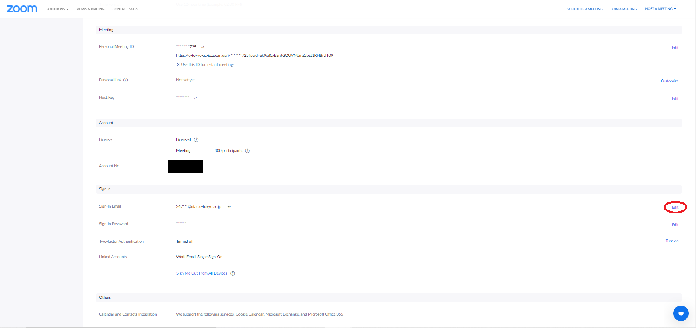
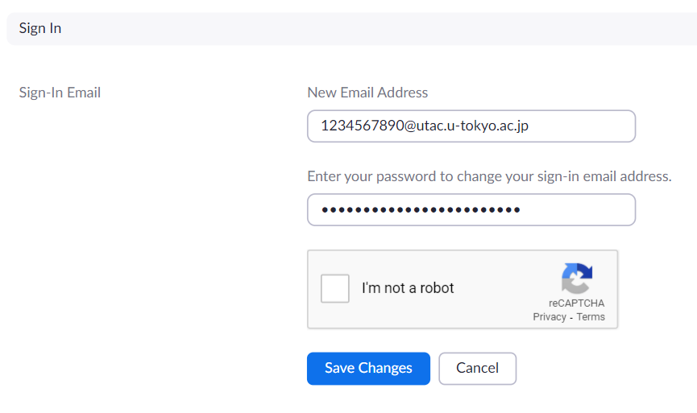
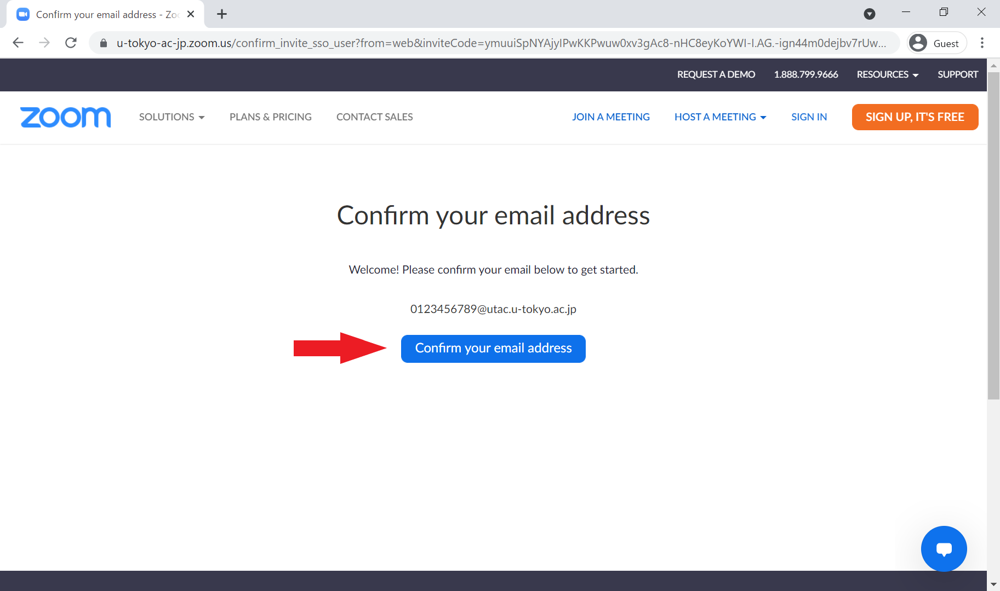

<!-- ↑”Signing in to Zoom”の記事内で、本記事を参照している箇所あり。本記事のタイトルを変更する場合は、そちらにも変更を反映することが必要。-->

This page is for UTokyo Zoom users who are currently **NOT signing in to Zoom using their UTokyo Account**. 
Such users include those using ECCS Cloud Email addresses setup with the username of their choice (`xxxx@g.ecc.u-tokyo.ac.jp`).

Accounts that do not use UTokyo Account for sign-in will soon be completely disabled due to the unification of the UTokyo Zoom sign-in method.   
**Please follow the instructions below to switch to a Zoom account that uses UTokyo Account for sign-in (account whose sign-in email address is `[10-digit Common ID]@utac.u-tokyo.ac.jp`, e.g. `1234567890@utac.u-tokyo.ac.jp`).**

    
If you are signing in using your ECCS Cloud Email address beginning with your 10-digit Common ID (e.g. <code>1234567890@<em>g.ecc</em>.u-tokyo.ac.jp</code>)

    Your Zoom account sign-in email address, e.g. <code>1234567890@<em>g.ecc</em>.u-tokyo.ac.jp</code>, should have automatically changed to <code>1234567890@<em>utac</em>.u-tokyo.ac.jp</code> in the <a href="/en/change2021s/">System Changeover for Spring 2021</a>. Sign-in with the changed email address should already be recognized as a UTokyo Account sign-in. Therefore, the below manual changes are not necessary.   
    However, if you have manually created a new Zoom account using <code>1234567890@<em>g.ecc</em>.u-tokyo.ac.jp</code> as the sign-in email address after the System Changeover, the system will no longer let you sign in with it. Please follow the steps below to switch to an account that uses your UTokyo Account for sign-in.

## If You No Longer Need Your Current Zoom Account
{:#existing-account-is-unnecessary}

In the case that your account that uses non-UTokyo Account sign-in (e.g. accounts that use ECCS Cloud Email addresses setup with the username of your choice, `xxxx@g.ecc.u-tokyo.ac.jp`) is no longer necessary, you can just abandon it and follow the instructions on the [Sign-in Methods for Zoom](/en/zoom/zoom_signin.html) page to start using the new Zoom account which uses UTokyo Account for sign-in.

<!--
The administrator will help delete your old account. Please submit the [UTokyo Zoom Unnecessary Account Declaration Form](https://forms.office.com/Pages/ResponsePage.aspx?id=T6978HAr10eaAgh1yvlMhHUY5ws7h1xGr9koV-KGC8RUNTBGSjJPN0ZWN0RIVFI2TVZZODZNT0xRRy4u).
-->

## If You Want to Transfer Data to Your New Zoom Account 

Any UTokyo Zoom account that does not use a UTokyo Account for sign-in (e.g. a Zoom account that uses your ECCS Cloud Email with the username of your choice, `xxxx@g.ecc.u-tokyo.ac.jp`) will soon be completely disabled. 

For a while, you will still be able to sign in to such accounts, but **please switch to your new Zoom account that uses UTokyo Account sign-in at the earliest possible**.

Steps for non-UTokyo Account sign-in are explained in the next section.

### Method of non-UTokyo Account Sign-in

For a while, you may still use Zoom with non-UTokyo Account sign-in after the [System Changeover for Spring 2021](/en/change2021s/) (such as accounts using your ECCS Cloud Email address with the username of your choice, `xxxx@g.ecc.u-tokyo.ac.jp`).   
To use Zoom with such accounts, please **visit the usual Zoom sign-in page, https://zoom.us/signin, and enter your previous sign-in email address and Zoom password**.

    
If you cannot find your previously saved meeting information (meeting room, cloud recording, etc.) after sign-in 

    This occurs when you use the new sign-in method instead of the aforementioned method for UTokyo Accounts. When you use the new sign-in method, a new Zoom account for UTokyo Account sign-in is automatically created, and you will be signed into this new account. You are not seeing your previously saved meeting information because the new account does not inherit the previous account's data.   
    To access your previous data, sign out of the new account, go to the usual Zoom sign-in page at <a href="https://zoom.us/signin">https://zoom.us/signin</a>, and sign in using the previous sign-in email address and Zoom password. 

### Switching to Sign-in with your UTokyo Account
{:#change-procedure}

If you are currently signing in to Zoom using the ECCS Cloud Email with the username of your choice (`xxxx@g.ecc.u-tokyo.ac.jp`), please visit the [one-stop migration site](https://sites.google.com/g.ecc.u-tokyo.ac.jp/utelecon-zoom-checker/home) and follow the instructions to switch to UTokyo Account sign-in. Once the migration is completed, you will be able to sign in to Zoom using your UTokyo Account. The sign-in procedure can be found on the [Sign-in Methods for Zoom](/en/zoom/zoom_signin) page.   

    
If you currently sign in using other email addresses

    If you currently sign in using (1) an ECCS Cloud Email address that begins with your 10-digit Common ID (e.g. <code>1234567890@g.ecc.u-tokyo.ac.jp</code>), or (2) an email address other than your ECCS Cloud Email address, please follow the instructions below to manually switch to sign-in using your UTokyo Account.
    <ol>
        <li>
            Access the <a href="https://zoom.us/profile">Zoom profile page</a> (sign in if necessary), and click “Edit” next to “Sign-in Email”. 
            
        </li>
        <li>
            Enter <code>[10-digit Common ID]@utac.u-tokyo.ac.jp</code> (e.g. <code>1234567890@<em>utac</em>.u-tokyo.ac.jp</code>) as your new sign-in email address. 
            
            

                
If you see the message "The email address "1234567890@utac.u-tokyo.ac.jp" is already in use"

                An account using <code>1234567890@utac.u-tokyo.ac.jp</code> already exists. This account needs to be deleted. 
                Please fill out and submit the <a href="https://forms.office.com/Pages/ResponsePage.aspx?id=T6978HAr10eaAgh1yvlMhHUY5ws7h1xGr9koV-KGC8RUOUJaRDVGUEdDVERDNVozSUw1WEJTSE9ONi4u">Zoom Account Delete Request Form</a>. 
                After you receive an email confirming that deletion is completed, restart from step 1 to change your sign-in email address. 
            

        </li>
        <li> An email will be sent to your ECCS Cloud Email to confirm your sign-in email address change. Click the confirmation button in the email. </li>
        <li> Access your <a href="https://zoom.us/profile">Zoom profile page</a> again and click the profile picture in the top right corner (the profile picture is either a default human icon or a picture you added earlier). Click “SIGN OUT” to sign out of Zoom. </li>
        <li> 
            Access the UTokyo Zoom page, https://u-tokyo-ac-jp.zoom.us/, press “Config”, and sign in with your UTokyo Account. 
            (This is the same procedure as described in the <a href="/en/zoom/signin#browser">Signing in from the UTokyo Account Zoom Webpage section on the Sign-in Methods for Zoom page</a>.)
            
            

                
If you see the message "Confirm your email address” right after you sign in 

                
                You need to perform email confirmation to switch to UTokyo Account sign-in. 
                Click the “Confirm your email address” button, and wait for an email to be sent to your ECCS Cloud Email. 
                Follow the instructions in the received email. 
            

        </li>
        <li>
            Access your <a href = "https://zoom.us/profile">Zoom profile page</a>. 
            If the “License” field is set to “Licensed     Meeting  300 participants”, you have successfully switched to UTokyo Account sign-in.  
            

                
If your “License” field is “Basic”

                It usually takes 5 minutes for licenses to be granted after switching accounts. Please refresh the screen after a while and check again.
            

        </li>
    </ol>

    
If the above procedure does not work, please contact the [Technical Support Desk](/en/support/).  
