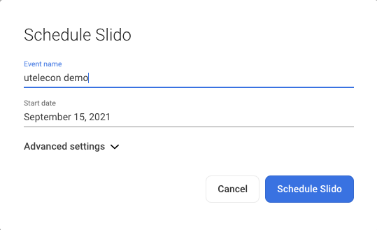
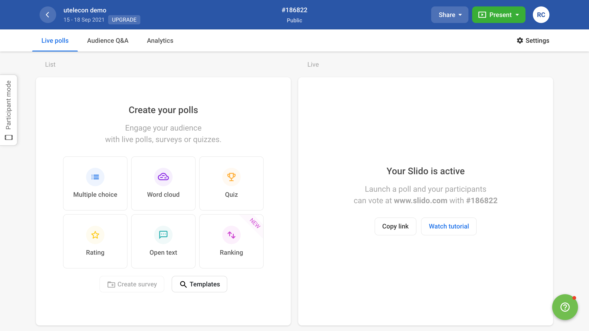

This page describes how to create an event using Slido.

1. Log in to Slido and go to “[Events](https://admin.sli.do/events).”
* Slido is free, but if you log in to a UTokyo account, you can use its paid features. It is recommended that you log in with your UTokyo account when using Slido in class.
2. Select “Create Slido” or “New Slido” on the screen, and then enter the “Event name” and “Start date.”
* Select “Advanced settings” to set the “End date,” “Event code” (a string of characters to distinguish an event, similar to the Zoom meeting ID), and “Invite collaborators” (members who comanage the event, similar to the Zoom co-host). 
3. Click “Create Slido” or “Schedule Slido” to create an event. Click the “Share” button on the upper right of the event screen to copy the URL of the event to the clipboard. Please share the copied URL with event participants. Participants can join the event by accessing the URL. The event information can also be shared as follows:
* Share by QR code: Hover your mouse over the “Share” button on the upper right of the event screen to display the “Download QR Code” button. Click this button to save the QR code that participants can scan to join the event.
* Share by event code: Share the 6-digit number starting with `#`shown at the top of the event screen with the participants. Participants can join the event by typing the event code on the [Slido website](https://app.sli.do/).

After creating an event, you can access the event settings page to configure more advanced settings. For more information, please see “[Change Event Settings in Slido](change_event_settings)” .

