## Introduction
{:#introduction}

In order to improve the security of UTokyo's IT systems, multi-factor authentication will be available for UTokyo Accounts starting September 27, 2021.

This page provides information about multi-factor authentication for UTokyo Accounts. Please check this page for any updates.

### Multi-Factor Authentication
{:#introduction-about}

Multi-factor authentication (MFA) is a security process in which users prove their identity by at least two pieces of evidence. In addition to passwords, users are asked to verify their identity via SMS, authentication applications, and other methods when signing in to their accounts.

MFA assures the user’s identity at a higher level and improves the account security. This reduces the risk of unauthorized sign-ins even if your password has been compromised.

## Implementation of Multi-Factor Authentication for UTokyo Accounts
{:#implementation}

MFA will be available for all UTokyo Accounts after the MFA launch date. Users can then set up MFA for their accounts following the procedure in the next section. Once MFA is enabled, users will be required to verify their identity via SMS or an authentication application every time they sign in to their UTokyo Accounts.

It is recommended to have MFA set up for better security of your UTokyo Account. However, MFA setup is not mandatory at this time, and you can continue to use your UTokyo Account without MFA. The only exception is users of the new UTokyo VPN for faculty members. The new UTokyo VPN will require MFA, so faculty members who wish to use the system will need to set up MFA. (For more information about UTokyo VPN, please refer to the [UTokyo Portal page (for faculty members only)](https://univtokyo.sharepoint.com/sites/utokyoportal/wiki/d/UTokyo_VPN.aspx).)

## MFA Initial Setup Procedure
{:#initial}

<strong class="box--alert">2021-10-18 The procedure has changed significantly, such as changing the order.</strong>

### Step 1: Set Up the First Verification Method
{:#initial-first.mfa-initial-step-heading}

<!-- 「本人確認方法」は"verification method"を採用 -->

First, set up the verification method for MFA.
Here you will add the first verification method (the second and subsequent methods will be added in Step 3). The first verification method will become the default (automatically selected) method, so it is best to register the method you will use most often.

1. Access the [Security info page](https://account.activedirectory.windowsazure.com/proofup.aspx?proofup=1&whr=utac.u-tokyo.ac.jp).
1. Enter your UTokyo Account username (10-digit Common ID) and password and click “Sign in”.
1. Click “Next” in the “More information required” page. 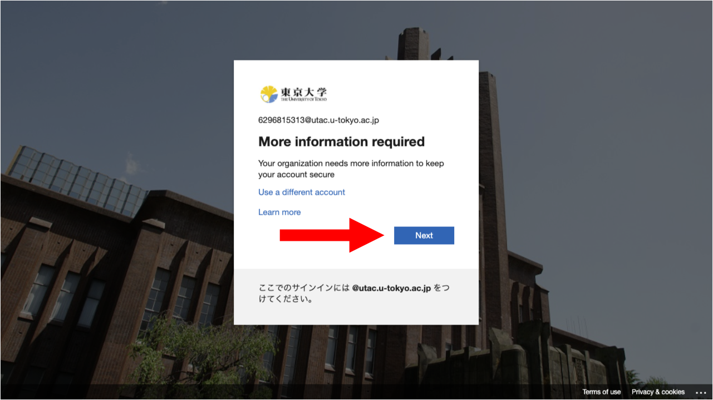
1. Add the first verification method in the setup page. The setup procedure varies depending on the verification method you add. 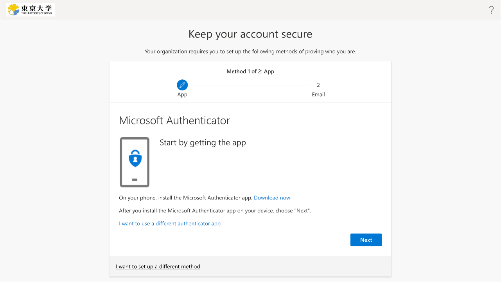
    - **Microsoft Authenticator App**:
        "Microsoft Authenticator" is an MFA authentication application provided by Microsoft. Using this app is convenient 
        since UTokyo Account's MFA adopts Microsoft's system. 
        

        
Setup Procedure

        <ol>
        <li>
            Install the Microsoft Authenticator app on your smartphone.
            The Android version can be downloaded from 
            <a href="https://play.google.com/store/apps/details?id=com.azure.authenticator">Google Play</a> 
            and the iPhone version from 
            <a href="https://apps.apple.com/app/microsoft-authenticator/id983156458">App Store</a>. </li>
        <li>After installing the app, go back to the setup page. Click "Next" to continue setup for the Microsoft Authenticator app. </li>
        <li>
            The next procedure differs by the device that you are working on.
              
            <ul>
                <li><strong>Smartphone (the same device where you installed the Microsoft Authenticator app)</strong>：
                    <ol>
                        <li>Click "Pair your account to the app by clicking this link".</li>
                        <li>Check that your UTokyo Account appears in the 
                            Microsoft Authenticator app.
                            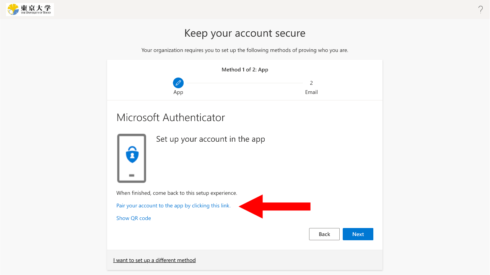</li>
                    </ol>
                </li>
                <li><strong>Other Devices (PC etc.)</strong>
                    <ol>
                        <li>Read the instructions and  
                            click "Next" to go to the QR code page.  
                            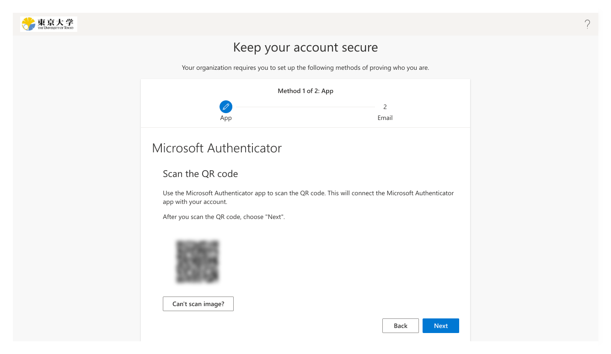</li>
                        <li>Open the Microsoft Authenticator app on your smartphone, 
                            select "+" from the icon in the upper-right, 
                            then "Work or school account", and "Scan QR code".
                            </li>
                        <li>Scan the QR code with your device's camera.</li>
                        <li>Check that your UTokyo Account appears on the app. 
                            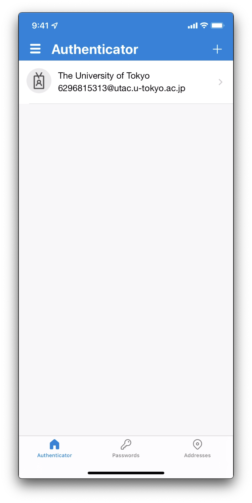</li>
                    </ol>
                </li>   
            </ul>
            {{ MSAuthenticatorSetupByDevice }} <!-- render caputured content -->
        </li>
        </ol>
        

    - **Other Authenticator Apps**: 
        If you already use other authenticator apps, such as "Google Authenticator", 
        you may also use it for your UTokyo Account authentication. 
        

            
Setup Procedure

            <ol>
                <li>Click "I want to use a different authenticator app" in the middle of the setup page. 
                    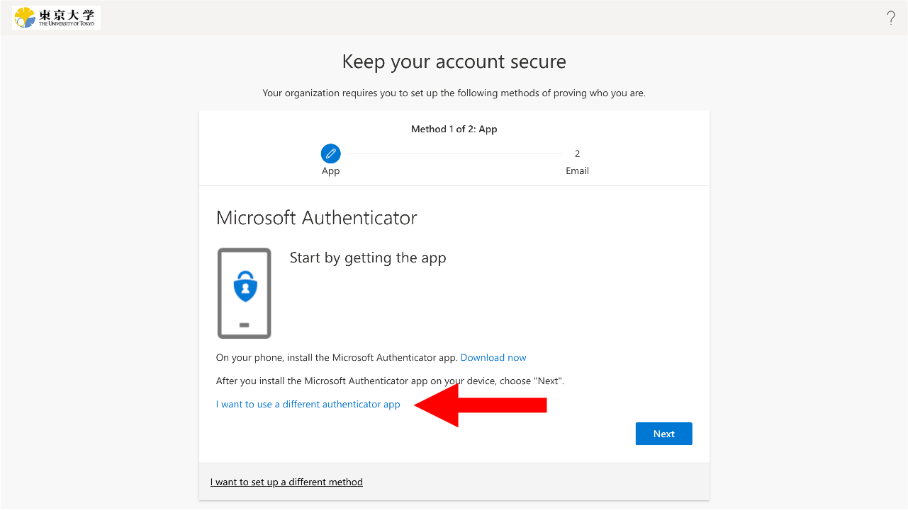</li>
                <li>Follow the instructions until you reach the QR code page. </li>
                <li>Scan the QR code with your authenticator app and 
                    complete the setup procedure. 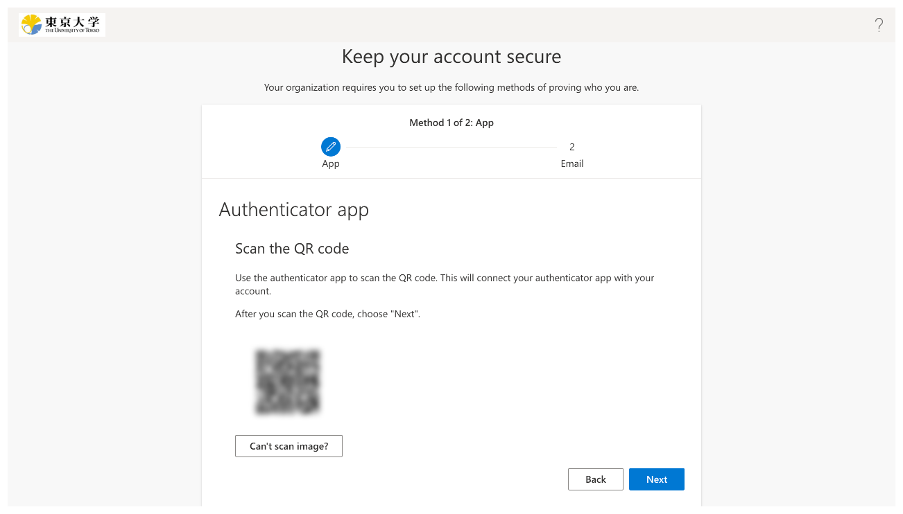</li>
            </ol>
        

    - **Phone Number**: 
        You can add your phone number and receive a call or text message to verify your identity．
        

            
Setup Procedure

            <ol>
                <li>Click "I want to use a different authenticator app" in the middle of the setup page.                     
                   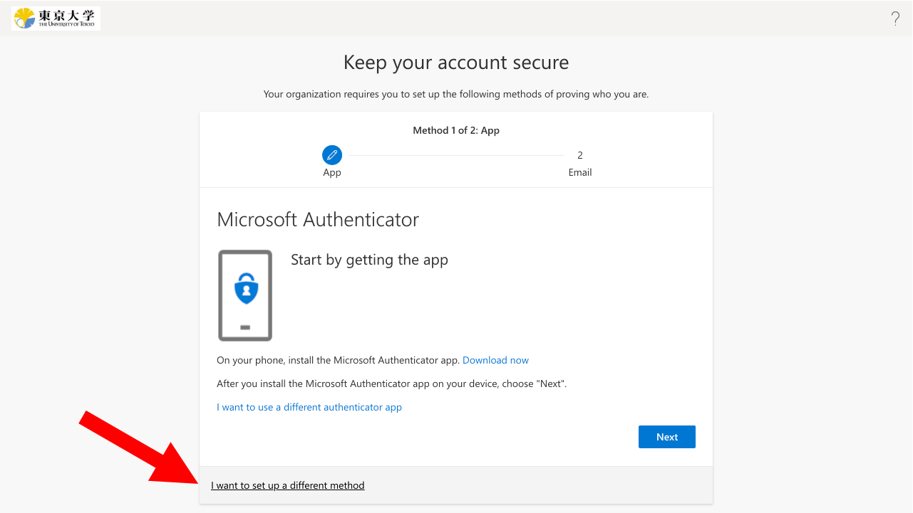</li>
                <li>For "Which method would you like to add?", select "Phone", 
                    and then click "Add".
                    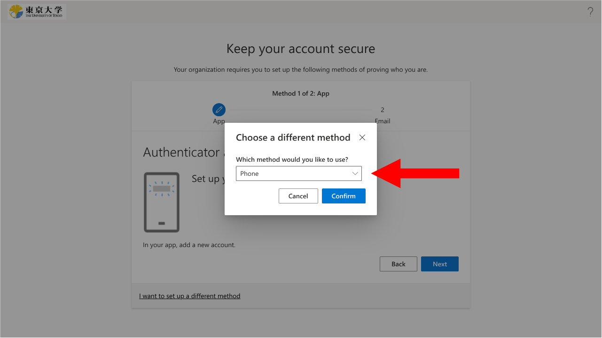</li>
                
                <li>For "What phone number would you like to use?", 
                    select the appropriate country code (+81 for Japan) and 
                    input your phone number. Also choose to either 
                    receive a text message with a verification code ("Text me a code") 
                    or a phone call ("Call me"). 
                    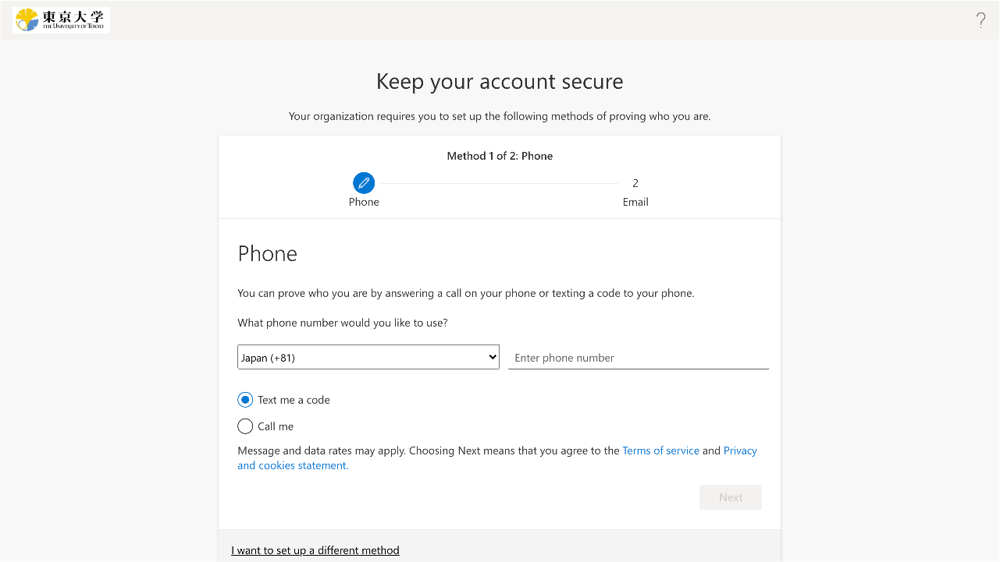</li>
                <li>Click "Next".</li>
                <li>You will receive a text or call on your phone to verify your identity. 
                    If you selected "Text me a code", you will receive an SMS message 
                    with a 6-digit verification code. Input the code in the setup page. 
                    If you selected "Call me", you will receive a phone call asking you press the pound key (#) on your phone to verify your identity. 
                    Press the key and end the call.（To display the pound key on your smartphone during the call, press the "keypad" button.) </li>
                
                {{ PhoneNumberSetup }} <!-- render captured content -->
            </ol>
        

1. You will be prompted to enter your email address (if you haven't already done so).
   Please enter an email address OTHER THAN your ECCS Cloud Email if possible, 
    and click "Next".
    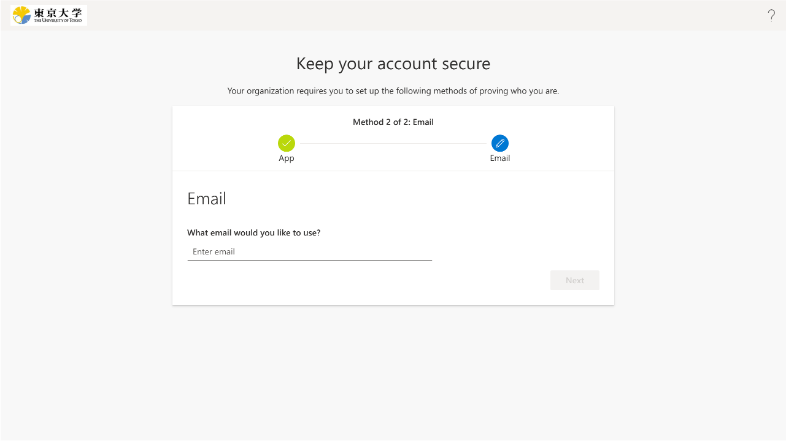
    Enter the 6-digit code sent to your email address, and click "Next".
1. Next you will be taken to the "App Password" page, and asked to enter your "app password name". 
    (The system may skip this step.) Enter any name you like using alphanumeric characters 
    and click "Next".（This "App Password" is used when signing in to apps or devices that don't 
    support MFA. It will not be used for signing in with UTokyo Accounts.) 
1. A screen showing that you have successfully set up your security information will appear. Click "Done".
1. If you are taken to the "UTokyo Account Service Directory", your setup has been successfully completed. 
{:.mfa-initial-procedure}

### Step2: Add Alternative Verification Methods
{:#initial-alternative.mfa-initial-step-heading}

<!-- 「多要素認証の設定画面」は画面トップに"Security info"と書いてあるので、"Security info page"と訳した。-->
Next, add alternative verification methods (second and subsequent methods) from the **[Security info page](https://mysignins.microsoft.com/security-info?domain_hint=utac.u-tokyo.ac.jp)**. 

**We recommend that you add more than one verification method.**
MFA works with just one verification method, but having only one verification method puts you at risk of getting completely locked out of your UTokyo Account when your verification method does not work (due to malfunction, phone number change, etc.). Adding multiple verification methods reduces this risk.

Below are the procedures to add different verification methods.

- **Microsoft Authenticator App**: Using the Microsoft Authenticator app is convenient 
        since UTokyo Account's MFA adopts Microsoft's services. If you possess more than one smartphone,
        you may add those phones as alternative verification methods. 
    

           
Setup Procedure

            <ol>
                <li>
                    Install the Microsoft Authenticator app on your smartphone 
                    (if you haven't already done so).
                    The Android version can be downloaded from 
                    <a href="https://play.google.com/store/apps/details?id=com.azure.authenticator">Google Play</a> 
                    and the iPhone version from 
                    <a href="https://apps.apple.com/app/microsoft-authenticator/id983156458">App Store</a>. </li>
                <li>Click "Add method" in the 
                    <a href="https://mysignins.microsoft.com/security-info?domain_hint=utac.u-tokyo.ac.jp">Security info page</a>.
                    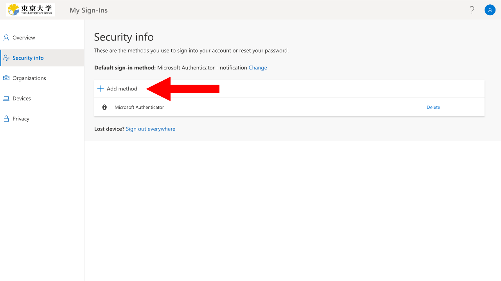</li>
                <li>For "Which method would you like to add?", 
                    select "Authenticator app", and click "Add".</li>
                <li>Click "Next" on the "Start by getting the app" screen. 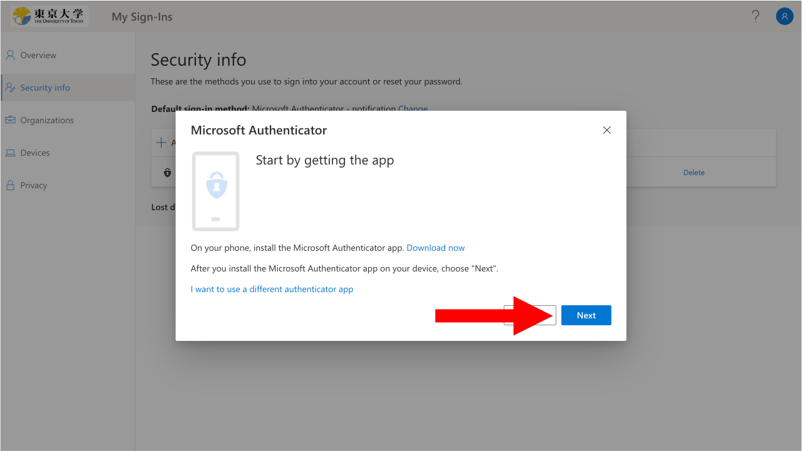</li>
                <li>
                    The next procedure differs by the device that you working on.
                    {{ MSAuthenticatorSetupByDevice }} 
                    <!-- Reusing the same explanation in Step2 -->
                </li>
            </ol>
        

- **Other Authenticator Apps**: 
    

        
Setup Procedure

        <ol>
            <li>Click "Add method" in the 
                <a href="https://mysignins.microsoft.com/security-info?domain_hint=utac.u-tokyo.ac.jp">Security info page</a>.
                </li>
                <li>For "Which method would you like to add?", 
                    select "Authenticator app", and click "Add".</li>
            <li>Click "I want to use a different authenticator app".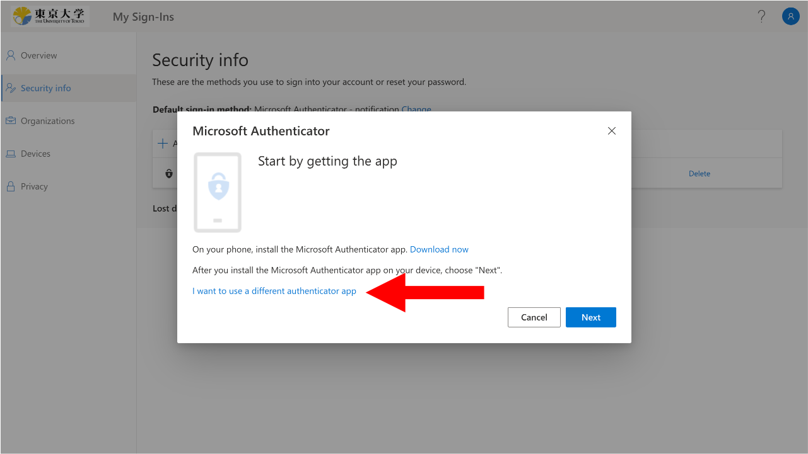</li>
            <li>Follow the instructions until you reach the QR code page. </li>
            <li>Scan the QR code with your authenticator app and 
                complete the setup procedure. 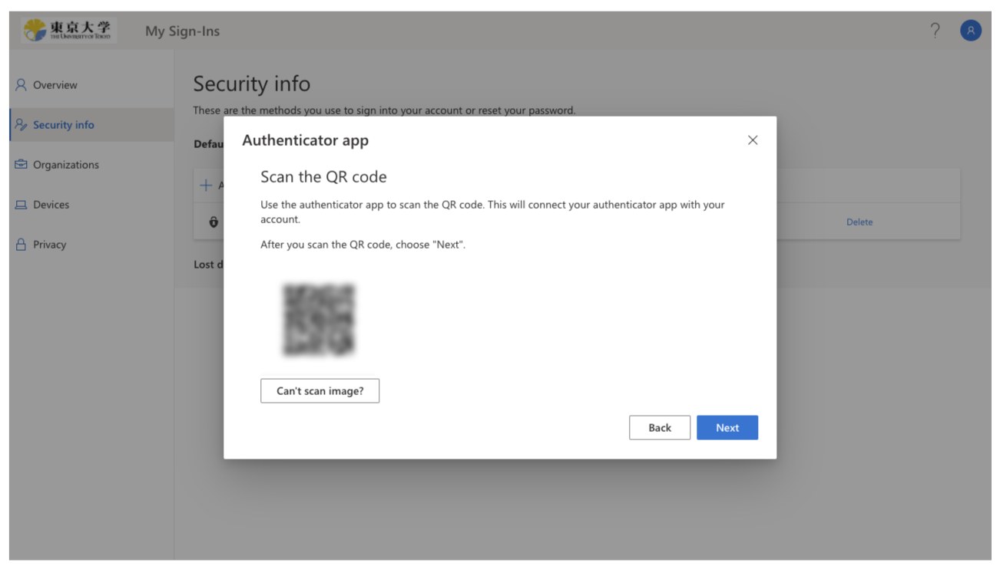</li>
        </ol>
    

- **Phone Number**:
    You can add your phone number and receive a call or text message to verify your identity. 
    There are three types of phones that can be added- "Phone", "Alternate phone", and "Office phone". You may add one phone number for each type 
    (i.e. a total of three phone numbers can be added as your verification method). 
    The description of each phone type is as follows: 
    - **Phone**：This is your main phone, such as your mobile phone. You can verify your identity either by receiving an SMS message or phone call. If you added your phone number as your first verification method, it should automatically become "Phone".
    - **"Alternate phone"**：This is a backup phone you can add, such as your landline. You can only receive phone calls (SMS unavailable) to verify your identity using this phone.
    - **Office phone**：This is another backup phone you can add, such as your company (university)
         phone. You can only receive phone calls (SMS unavailable) to verify your identity 
         using this phone. You can add your extension number (a short number that you input after
         calling main office number to reach a specific person, team, etc. within the office). 
    

        
Setup Procedure

        <ol>
            <li>Click "Add method" in the 
                <a href="https://mysignins.microsoft.com/security-info?domain_hint=utac.u-tokyo.ac.jp">Security info page</a>.
                </li>
            <li>For "Which method would you like to add?", 
                select "Authenticator app", and click "Add".</li>
            {{ PhoneNumberSetup }} <!--  reuse the same content in Step2 -->
        </ol>
    

{:.mfa-initial-procedure}

<!-- 

    
<mark>ヘルプ：「多要素認証の設定ページ」にアクセスする際にサインインを求められ，多要素認証の本人確認が求められる場合</mark>

    TODO

 -->

In the screen that appears after clicking "Add method", "App password" and "Email" will also show up as choices for "Which method would you like to add?". However, please be aware that these cannot be used for identity verification upon sign-in (they are for other purposes).

### Step 3: Try Signing In
{:#initial-try.mfa-initial-step-heading}

The next step is to check that you can sign in to your UTokyo Account using MFA.

1. Access the [UTokyo Account Sign-out Page](https://univtokyo.sharepoint.com/sites/utokyoaccount/_layouts/15/SignOut.aspx).
2. Wait for the “You signed out of your account” message to appear.
3. Access the [Security info page](https://mysignins.microsoft.com/security-info?domain_hint=utac.u-tokyo.ac.jp).
4. Enter your UTokyo Account username (10-digit Common ID) and password in the sign-in page.
5. Verify your identity using MFA. The procedure differs by the verification method you use. Please follow the instructions on your screen. 
    - **Microsoft Authenticator App**: A notification will be sent to your phone to approve the sign-in request in the app. Click "Approve". 
    - **Other Authenticator Apps**: You will see a 6-digit code for your account in the authenticator app. Enter the code in the sign-in page. 
    - **Phone Number (verification via text)**: An SMS message with a 6-digit code will be sent to your phone. Enter the code in the sign-in page and click "Verify". 
    - **Phone Number (verification via call)**: You will receive a phone call, asking you to press the pound key (#) on your phone. Press the key and end the call.（To display the pound key on your smartphone during the call, press the "keypad" button.)
6. If you are taken to the “Security info” page, you have successfully signed in.
{:.mfa-initial-procedure}

Note that one of the added verification methods (usually the first method added) will automatically become your "default sign-in method". When you sign in, the system will ask you to verify your identity using the default sign-in method. If you wish to sign in with a different method, click the “Use a different verification option” or “Having trouble? Sign in another way” link.
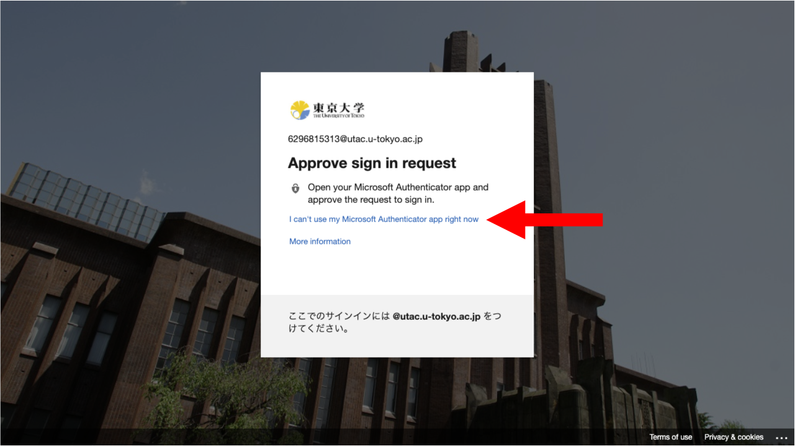
The default sign-in method can also be changed by following the procedure described below in the "[Changing the Default Sign-in Method](#change-default)" section.

### Step 4: Apply for MFA Use
{:#initial-apply.mfa-initial-step-heading}

The last step of the initial setup procedure is to submit an application.

1. Access the [UTokyo Account User Menu](https://utacm.adm.u-tokyo.ac.jp/webmtn/LoginServlet).
2. Sign in with your UTokyo Account username (10-digit Common ID) and password if prompted. 
3. Click "multi-factor authentication setting" in the left menu. 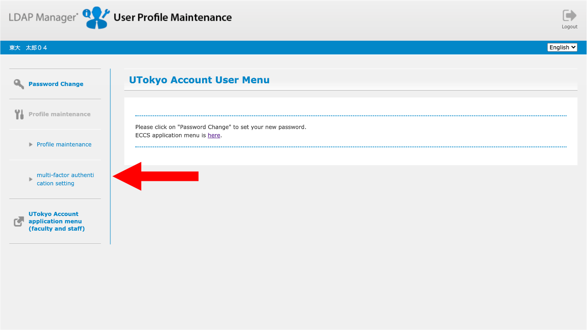
4. Read the MFA instructions carefully, and find "Use MFA" at the bottom of the page. Answer "Yes" and click "SAVE". 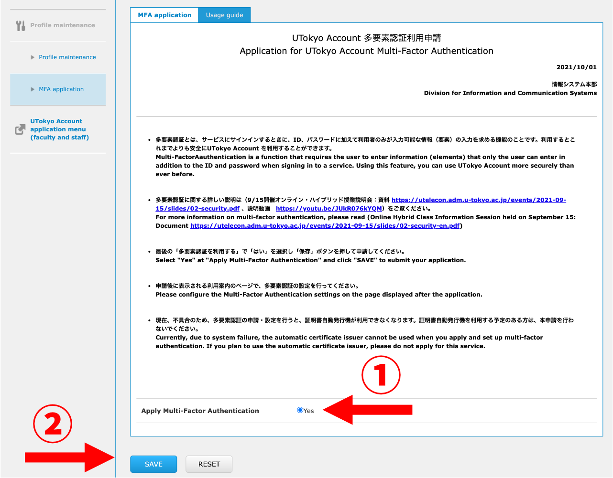
{:.mfa-initial-procedure}

## Changing MFA Settings
{:#change}

Below are the procedures for changing the settings of your verification methods.

**If your default sign-in method will be disabled due to phone number change, etc., please make sure to add an alternative verification method BEFORE the default sign-in method is disabled.**
If you do not change your verification method beforehand, neither the authenticator app nor the old phone number can be used any more for identity verification.
Identity verification is necessary even to change your verification method.
**It is crucial that you change your settings in advance to avoid getting completely locked out of your UTokyo Account.**

Settings can be changed in the **[Security info page](https://mysignins.microsoft.com/security-info?domain_hint=utac.u-tokyo.ac.jp)**.

### Adding More Verification Methods
{:#change-add}

In the [Security info page](https://mysignins.microsoft.com/security-info?domain_hint=utac.u-tokyo.ac.jp), you can add more verification methods by following the procedure in "[Step 2: Add Alternative Verification Methods](#initial-alternative)" under "MFA Initial Setup Procedure".

### Changing the Default Sign-in Method
{:#change-default}

One of your verification methods (usually the first method added) will become your "default sign-in method". When you sign in, the system will automatically choose the default sign-in method as your verification method. 
The default sign-in method can be changed following the steps below.

1.  Find "Default sign-in method:" on the [Security info page](https://mysignins.microsoft.com/security-info?domain_hint=utac.u-tokyo.ac.jp).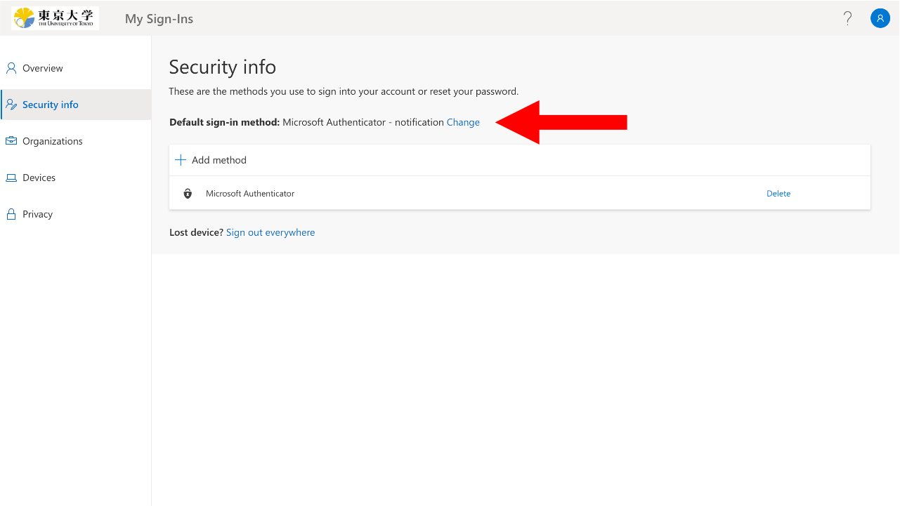
2. Click "Change" on the right of the default sign-in method.
3. For "Which method would you like to use to sign in?", select the verification method you wish to use, and click "Confirm".

### Editing Verification Methods 
{:#change-edit}

The verification methods, "Phone", "Alternate phone", and "Office phone" can be edited by following the steps below.

1. Find the method you wish to edit in the list of verification methods on the [Security info page](https://mysignins.microsoft.com/security-info?domain_hint=utac.u-tokyo.ac.jp), and click "Change" on the right of the specific method. 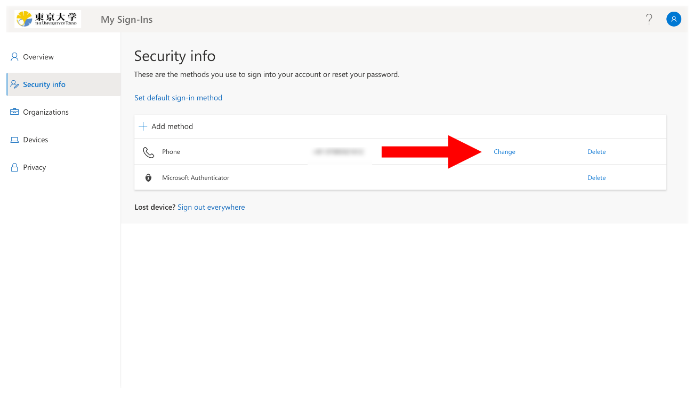
2. Enter your new phone number in the popup screen, and click "Next".
3. Verify your phone number (via text or call). Follow the same procedure as when adding a new phone number. 

Note that authenticator apps, such as Microsoft Authenticator and Google Authenticator, do not have a "Change" screen. If you wish to change the settings of an authenticator app, add a new authenticator app with new settings and then delete the old authenticator app.

### Deleting Verification Methods
{:#change-delete}

Please follow the steps below to delete verification methods you no longer want to use.

1. Find the method you wish to edit in the list of verification methods on the [Security info page](https://mysignins.microsoft.com/security-info?domain_hint=utac.u-tokyo.ac.jp), and click "Delete" on the very right of it. 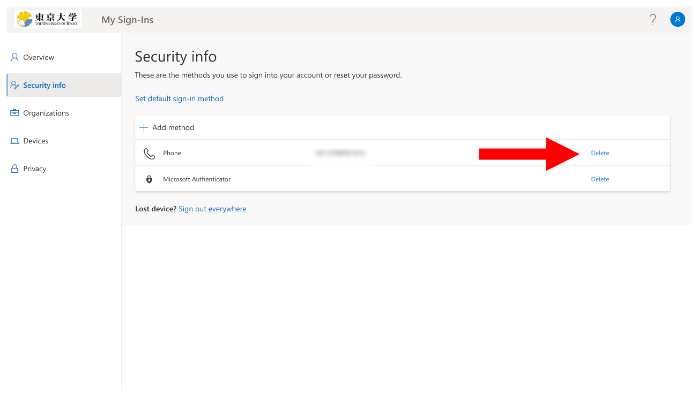
2. For "Are you sure you would like to delete this method for your account?", click "Yes".

Note that if you delete all the verification methods (i.e. all authenticator apps and phones) on the list, you will be prompted to go through the initial setup procedure upon the next sign-in. (Even if "Email" and "App password" are left in the list, they do not work as verification methods.)

## Troubleshooting MFA Verification and Account Lockout Issues
{:#troubleshooting}

Below are procedures to recover your UTokyo Account when you cannot sign in using MFA due to malfunction, phone number change, etc.

Once you have recovered your account, it is strongly recommended that you change your MFA settings so that multiple verification methods are available.
Your settings can be changed in the [Security info page](https://mysignins.microsoft.com/security-info?domain_hint=utac.u-tokyo.ac.jp) as explained in the above "[Changing MFA Settings](#change)" section. 

### Use Alternative Verification Methods
{:#troubleshooting-alternative}

If other verification methods are already set up, first try signing in with those methods. 

To sign in with other verification methods, click the “Having trouble? Sign in another way” or “Use a different verification option” link in the verification screen that appears (after entering your password). A list of verification methods that you set up (including the default sign-in method) will be displayed. 

- If any of the verification methods in the list are available for use, you can use the method to sign in to your UTokyo Account.
- If none of the methods in the list are available, you need to reset your MFA settings. Please read the "Reset your MFA Settings" section below.

### Reset your MFA Settings
{:#troubleshooting-reset}

If none of the verification methods that you set up are available for use, you need to reset your MFA settings. Please contact the office of academic affairs of your faculty/graduate school (for students) or your division's human resources team (for faculty members) for reset.

When you sign in to your UTokyo Account for the first time after the reset, you will be prompted to go through the initial setup procedure again. Please follow the instructions of "[Step 1: Set up the First Verification Method](#initial-first)" and "[Step 2: Add Alternative Verification Methods](#initial-alternative)" in the "MFA Initial Setup Procedure" section to set up new verification methods, and sign in to UTokyo Account using them going forward.

## Others
{:#others}

### How to Cancel MFA Application / Terminate MFA Use

We strongly recommend that you use MFA for security reasons, but if you need to terminate MFA use for unavoidable circumstances, please contact the office of academic affairs of your faculty/graduate school (for students) or your division’s human resources team (for faculty members).

If you cannot verify your identity using MFA and are locked out of your account, you can resolve the issue by resetting your MFA settings as mentioned in the above [Troubleshooting MFA Verification and Account Lockout Issues](#troubleshooting) section. In this case, there is no need to terminate MFA use.   

### Different Identity Verification Procedures at Sign-in

The normal procedure of signing in using MFA is first entering your password and then verifying your identity using your MFA verification method.

However, the identity verification procedure at sign-in may differ as follows.
- MFA identity verification is requested twice in a row.
- Password is not required (password input step is skipped), and only MFA identity verification is requested. 
- Password is required, but MFA identity verification is not.  
Such difference in procedures is due to the linkage process between systems related to the UTokyo Account. Please follow the instructions on the screen to sign in to your UTokyo Account. 
