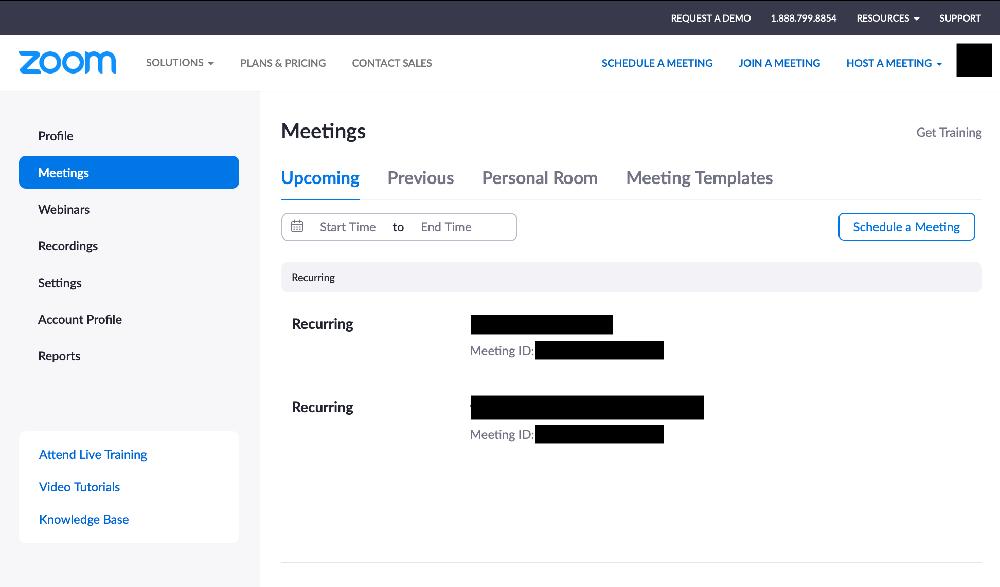
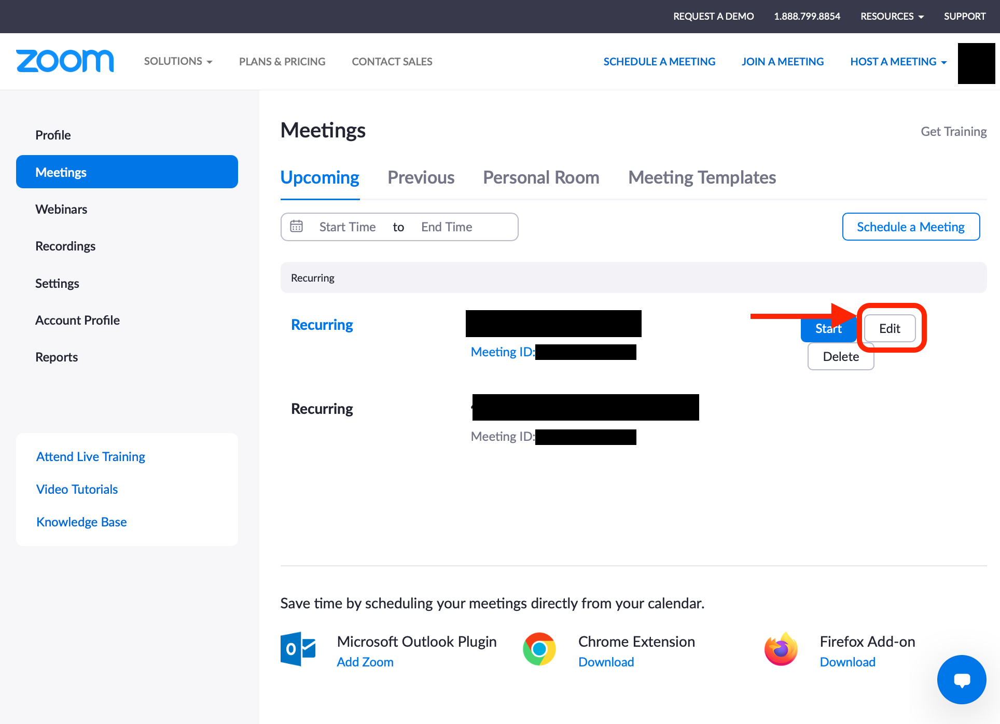
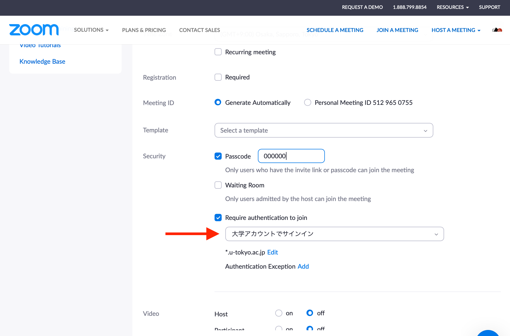
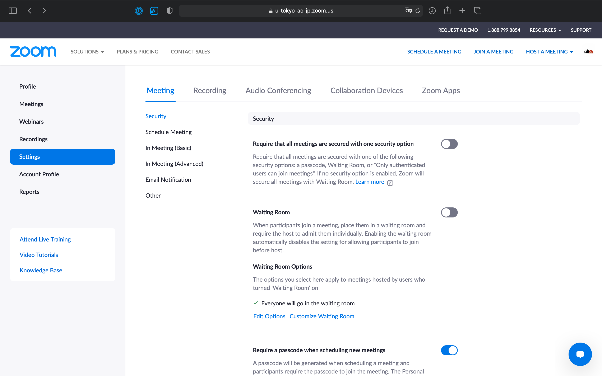
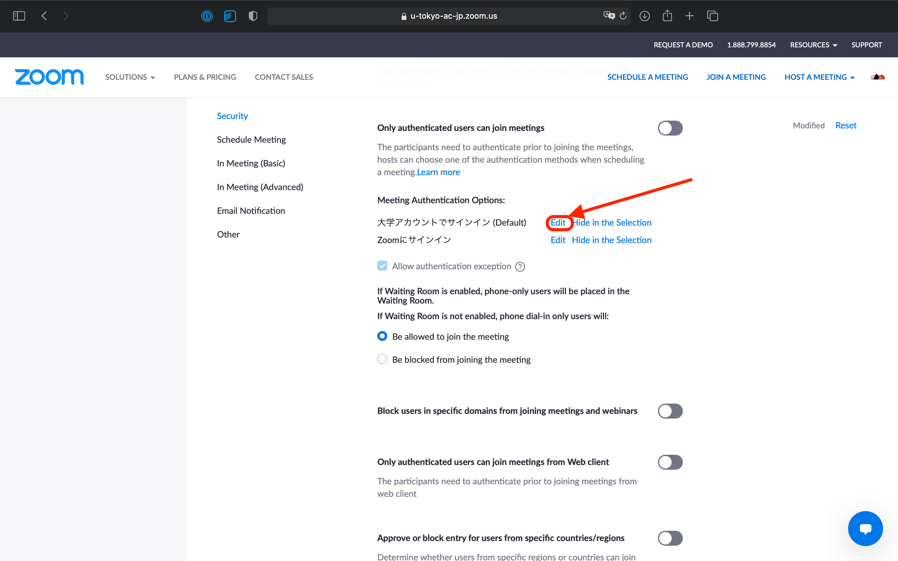
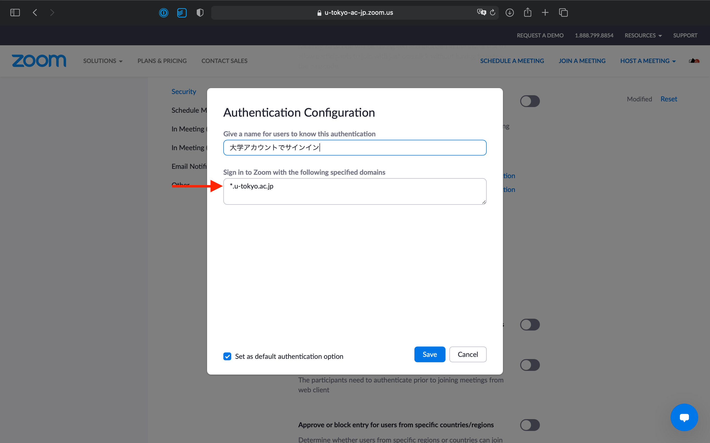

Authentication profiles allow hosts to restrict Zoom meeting participants to users whose email address matches a certain domain. If the option "大学アカウントでサインイン(Sign in with university account)" is selected, participants will be asked to sign in with their UTokyo Zoom account to join the meeting.

In the case that participants are not used to signing in with their UTokyo account (especially at the beginning of a semester), it is recommended to turn off such settings. See also “[Restricting access to the Zoom conference room for classes (Japanese only)](/en/faculty_members/zoom_access_control)” for more information about the settings.

If you continue with the old settings after the <a href="/en/change2021s/">System Change for Spring 2021</a>, it is possible that participants who have correctly signed into the UTokyo Zoom account fail to join the meeting. Please read the instructions on this page and confirm your settings.

## Setting up Individual Meetings

1. Open the [Zoom “Meetings” page](https://u-tokyo-ac-jp.zoom.us/meeting#/upcoming) on your web browser.
{:.medium}

2. Go to the meeting settings page.
    - To create a new meeting, click “Schedule a Meeting”.
    - To check or modify the settings of previously scheduled meetings, hover your mouse over the meeting in the list and click the "Edit" button on the right side.
{:.medium}

3. Configure the settings under “Require authentication to join” in “Security”. If you turn it on and select “大学アカウントでサインイン(Sign in with university account)”, only participants who have signed in to their UTokyo Zoom account are able to join the meeting. Additionally, please check that the domain shown under “大学アカウントでサインイン(Sign in with university account)” is set to `*.u-tokyo.ac.jp`
(if not, click “Edit” and change it to `*.u-tokyo.ac.jp`).
{:.medium}

<strong class="box--alert">
After the <a href="/en/change2021s/">System Change for Spring 2021</a>, the domain of UTokyo Zoom accounts is changed to <code>@utac.u-tokyo.ac.jp</code>. If you previously set the domain as <code>@g.ecc.u-tokyo.ac.jp</code>, participants who have correctly signed into the UTokyo Zoom account may not be able to join the meeting. Please make sure to change the domain to <code>*.u-tokyo.ac.jp</code> following the procedure above.
</strong>

## Changing the Default Settings
It is also possible to change the default settings for newly scheduled meetings.

1. Open the [Zoom “Settings” page](https://u-tokyo-ac-jp.zoom.us/meeting#/upcoming) on your web browser.
{:.medium}
2. Click the “Edit” button under “Meeting Authentication Options-大学アカウントでサインイン (Default) (Sign in with university account (Default))”
{:.medium}
3. Check that the domain is set to `*.u-tokyo.ac.jp` in the field of “Sign in to Zoom with the following specified domains”. If not, please change it to `*.u-tokyo.ac.jp` and save your settings.
{:.medium}
