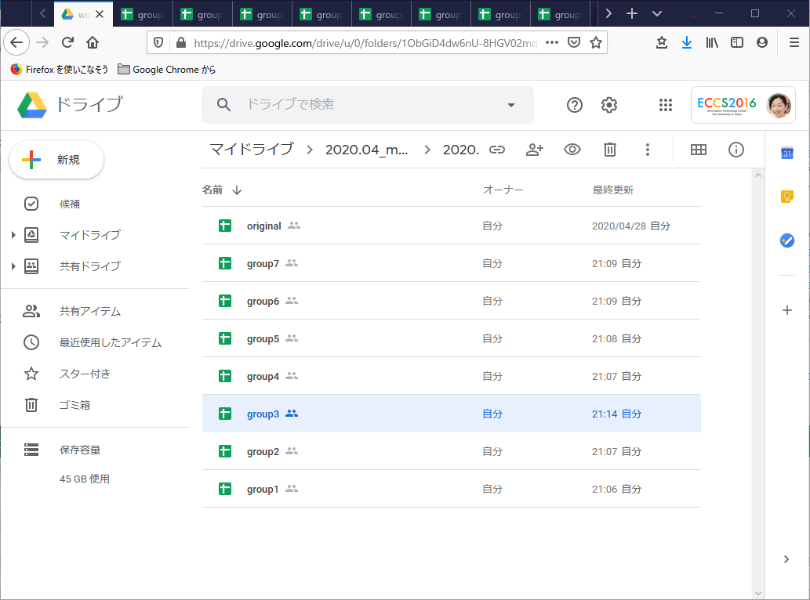
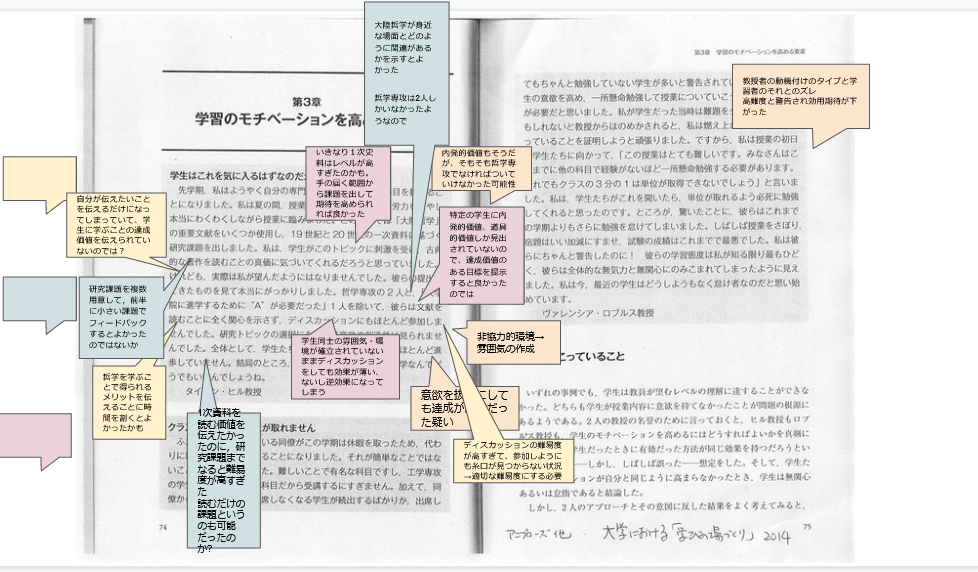
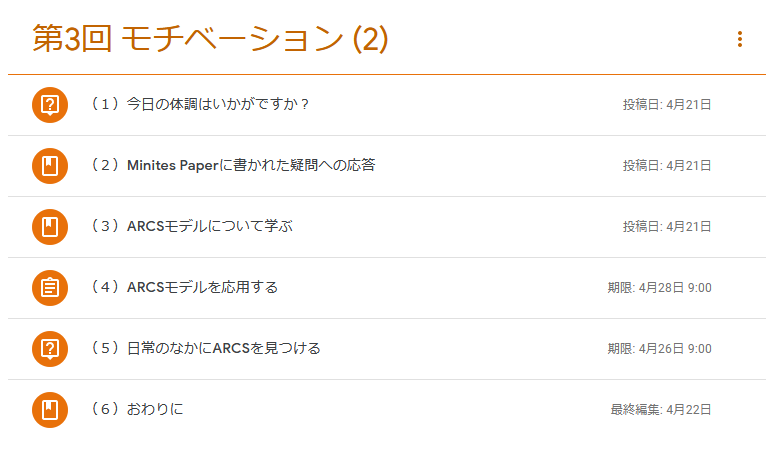

## 授業の基本情報

授業名　　:　「学びの場」づくり 
開講部局　:　教育学部 
対象　　　:　学部生・大学院生 
学生数　　:　約 20 名 
形態　　　:　11 回リアルタイム、2 回オンデマンド 
利用したツール　:

- Google Classroom: 学習管理システム（教材や課題の提示、連絡などで利用）
- Zoom: Web 会議室システム（リアルタイムの授業を行うために利用） 
- Slido: 質問投稿 Web サービス（質疑応答で利用） 
- Google Documents, Sheets, Slides, Forms: 文書作成、表計算、プレゼンテーション、アンケートの Web サービス（グループワーク、質疑応答で利用） 

## 教員の基本情報

栗田佳代子 先生 
教育学研究科、大学総合教育研究センター 
准教授

## 学生の感想: この授業の良かったところ

**学生 A のコメント**

- 授業内容や資料が丁寧にデザインされておりわかりやすい。適度に学生同士のディスカッションなどがあり刺激的である。課題の量や、アサイン・提出の方法が適切である。

**学生 B のコメント**

- ライブでの討論などが不必要な場合はオンデマンド受講にするなど、形態に最適な授業を練ってくださったから。

**学生 C のコメント**

- 講義とグループワークの両方を取り入れていた．
- 講義で使うツールの使い方を始めの頃は非常に丁寧に説明していたため，授業の受け方に困ることがなかった．
- グループワークのやり方の指示がとても丁寧に行われ，毎回自己紹介から始めたり自分の考えを話す順番が指示されていて混乱したりすることがなく，他の授業よりも円滑に学習できた．
- 学生の負担を考慮した課題設定になっていた．
- 不調の多い ITC-LMS ではなく，Google Classroom を使って課題提出や資料配布，告知をしていたため，非常に安心感があった．
- 授業の初めに体操の時間があり，集中して取り組むことができた．休み時間に自主的にやれば良いのではないかとも思われるが，オンライン授業では授業が伸びがちでほとんど休み時間がないことが多かったので，授業時間内で時間が確保されていることが良かった

## 授業をオンライン化するにあたって心がけたこと

対面での授業でも心がけていますが、学生が主体的に考える仕組み作りをオンラインの環境で実現することを意識しました。学生さんもオンライン授業が不安であろうと思いましたので、オンライン授業が楽しく可能性の大きいものであることを感じてもらえるよう多様な学び方を体験してもらいたいと思って設計しました。この授業自体が「学びの場づくり」というテーマですので、これが「つまらない」と言われてしまっては面目ない、という気持ちもありました（笑）

そのため、Slido、zoom のチャット機能および Google Forms を用いた回答収集と共有、zoom のブレークアウト機能を使った学生同士のグループワーク、そして、グループワークの成果物の共有などを積極的に行いました。
ITC-LMS はアクセス集中が心配だったので、Google Classroom を使ってみることにしました。もともと Google Drive や Google Docs などはよく使っており、親和性が高そうだと思ったのも理由の一つです。

また、運動する機会が少なくなる現状でしたので、体を動かしてもらいたいと思っていました。そこで、簡単なストレッチを毎回の授業冒頭に行いました。場の空気も和んだように思います。

## 工夫したところ

### Slido や zoom のチャット機能を利用して質疑応答を促した

学生が躊躇せず質問できる環境を作りたかったので、まず「匿名」で質問できる Slido というサービスを用いました。zoom のチャット機能だと名前が表示されてしまいますが、匿名であることによって安心して質問ができていたようです。

ただ、授業の前半では Slido による匿名の質問が多かったですが、後半になるにつれて次第に zoom のチャット機能や直接声を使って質問してくれるようになったので、使わなくなっていきました。

### zoom のブレークアウト機能と Google Slides を組み合わせて教員も進捗管理ができるグループワークを行った

学生同士が互いに学び合う機会を多く設けたかったため、zoom のブレークアウト機能 [^1] を積極的に使いました。ブレークアウト機能だけだと各グループの進捗がわからず、話し合いが漫然となりやすいため、Google Slides 等を併用してグループワークを行いました。

具体的には、事前に Google Slides でワークシートをグループの数だけ、グループ番号をファイル名に付けて用意しました。そして、ブレークアウトルームにわかれたとき、グループ番号と同じ番号のワークシートに対してグループごとに作業してもらいました。

Google Slide は複数人数が同時に編集が可能であり、教員はその作業状況をリアルタイムに確認することができます。そのため、ブレークアウト中に各グループのワークシートを巡回して閲覧し、進捗が遅れているところにはコメントしたり、巡回時に（とても良い活動ができているワークシートなどに）目をつけておいて後でメインルームにおいて全体に共有するなど、のファシリテーションができました。

[^1]: 参考: [Zoom ブレークアウトルーム機能を使う](/zoom/usage/breakout/)

以下が具体的な方法です。

- 授業前

  - Google Slides や Google Sheets などで作成したワークシートをグループ数分用意する

ワークシートが入った Google Drive のフォルダ

- 授業中

  - zoom のメインルームにて、ワークの方法を伝える。全員にワークシートの入っているフォルダを共有する
  - ブレークアウト機能を使いグループを作る（1 グループ 3-4 名が話しやすい）
  - 各グループはそのグループの番号と同じ番号のワークシートを使って作業する
  - ブレークアウト中教員は、フォルダにある各ワークシートを確認して進捗を把握し、滞っていそうであれば、ワークシートにコメントを残すなどして支援を行う
  - ブレークアウトセッション終了後は、ワーク中に把握した進捗や内容を参考に、全体で共有したほうが良さそうな成果物（Google Slides などのワークシート）をピックアップし、それを作ったグループの学生に説明してもらう + 教員も発展的あるいは補足的なコメントを行う

Google Slide を用いたワークシート例 学生の書き込みあり

### グループワークをするときは明確な指示出しをする

グループワークをするときは、何をどれぐらいの時間で、どのような手順で行うのかについて学生が理解して自律的に活動できるような明確な指示出しが重要だと思いました。

例えば、上記に挙げたグループワークの場合、次のような指示出しをしました。

- Google Slides のワークシートを画面共有で見せて、操作方法を説明する
- どの Google Slides を使えばよいのかを、ブレークアウトセッションのグループ分けを見せながら、伝える
- やるべきことをパワーポイントの画面共有で説明しながら、やるべきことの箇条書きを、あらためてチャットに貼る（こうすることでブレークアウトセッションにわかれても、指示を確認できる）
  「互いに敬意をもって取り組む」などのグラウンドルールを確認し、話す順番（あいうえお順）も伝える
- 何人グループで、何分の時間が与えられるかを伝える
- 困ったら呼んでくださいと伝える

### 体をほぐすためにストレッチを導入した

緊急事態宣言もあったことから、学生のみなさんは外にも出られないことが多く、オンライン授業を受け続けるのは辛いだろうと思っていました。そこで、毎授業の冒頭では必ずストレッチをする時間を 5 分ほど設けて、全員で体をほぐしました。運動不足を少し解消してもらいたいという考えに加えて、授業を受ける前に少しリラックスしたり、場の雰囲気をよくしたいという考えもありました。

実際、学生からも評判がよかったです。ストレッチを行うことで、緊張がとけて授業に集中しやすかったのかもしれません。私自身も気持ちよく授業をはじめられました（笑）

### オンデマンド授業では一人でも学べるように構成を工夫した

この授業ではオンデマンドを 2 回とりいれました。一人の学習はモチベーションをあげるのもなかなか大変だと思いましたので、自然と学べるような構成を工夫しました。たとえば、第 3 回はモチベーションについてさらに学ぶ回でしたが、体調について答える「つかみ質問」にはじまり、前回の質問への解説動画、理論についての説明動画、レポート課題２つ、振り返り、という構成としました。MOOC（Massive Open Online Course）の作成経験があったので、時間の短い複数の動画とクイズを組み合わせるという一般的な MOOC の流れを参考にしました。

第 3 回（オンデマンド）の授業内容（Google Classroom）

## 苦労したところ

### zoom から落ちやすい学生がいたため、通信量に配慮した授業に変更

毎回、少数ながら zoom から落ちてしまう学生がいました。原因の一つとして通信環境が考えられたことから、途中から通信量に配慮するようにしました。具体的には、共有画面となるモニタの解像度を低く設定し、fps（フレーム毎秒）を 1 に設定しました（参考: [https://www.nii.ac.jp/event/upload/20200529-4_Yoshida.pdf](https://www.nii.ac.jp/event/upload/20200529-4_Yoshida.pdf)）。

そうすると、落ちる学生が少なくなったように思います。学生の通信環境に配慮した授業運用も重要だと実感しました。以降、通信量には気をつけています。

### オンデマンドは準備が大変だったので完璧を目指さないことにした

うまくいかなかったわけではないのですが、オンデマンド授業はリアルタイム授業に比べて準備がとても大変でした。リアルタイムよりも動画やクイズ、資料などを学習の流れにしたがって綿密にデザインする必要があります。また、リアルタイムだと授業時間が終わればそれでその授業の回は終わりですが、オンデマンドだと動画は撮り直しができてしまうので、教材の完成度を高めるためにいくらでも時間をかけることができます。最初は、何度も撮り直しましたが途中で完璧を求めることは諦め、噛んだり、説明不足である部分があっても録画を止めず、訂正や補足をすぐにすることで対応しました。リアルタイムの授業でもよく噛みますので、そのようなものだと割り切ったことで、授業内容が伝われば良いという気持ちになり、オンデマンド教材開発が少し楽になりました。

## 今後のオンライン授業に向けて

オンライン授業をやってみて、対面のときと同じ、あるいはそれ以上の学びの環境をつくれるという手応えを感じました。リアルタイムの場合、問いかけに対して Google Forms でほぼ全員からの考えを集め、その結果をリンクで共有すれば、互いの意見が効率よく共有できます。数人から意見を聞くだけになりがちな対面授業の場合よりも、一人一人の参加度や他者との意見共有という点でリアルタイムのオンライン授業は優れています。

また、準備に非常に時間がかかりますが、オンデマンドの良さも感じました。じっくり考えてもらいたい、あるいは学習において個人差が大きいと思われる内容については、オンデマンド教材が適していると感じました。

オンライン授業は、授業方法の一つに過ぎず、今後も選択肢の一つとして定着していけばよいと思います。しかし、良いオンライン授業をするには学習目的に応じたツールに習熟していることが不可欠なので、今後もよりよいツールについては勉強していきたいと思っています。

また、今後は対面授業とオンライン授業の組み合わせも必要になってくると思うので、この授業実施方法についてもできるようになっておきたいと思います。

## 参考情報

### 本授業の概要（シラバスより）

よりよいティーチングについて学ぶため、『大学における「学びの場づくり」－よりよいティーチングのための７つの原理』（玉川大学出版部）を題材にして教え方の原理を丁寧に理解していきます。「ティーチングのため」に紹介されている原理ですが、社会において人に何かを伝え理解してもらうという機会は誰もが持ちうるものです。また、これは学習者側にとっても役に立つ原理です。各原理について、紹介事例について考え、研究知見を理解し、自分なりの行動指針として昇華していくという方法で学びます。

### 授業内容

- 授業のガイダンス、各種ツールの操作方法
- 学生のモチベーションを高める要因 (1)
- 学習のモチベーションを高める要因 (2)
- 学生の先行知識が学習におよぼす影響
- 知識の体系化の方法が学習におよぼす影響 (1)
- 知識の体系化の方法が学習におよぼす影響 (2)
- 学生が熟達するには
- 学習を強化できる練習とフィードバック (1)
- 学習を強化できる練習とフィードバック (2)・中間レポート改善
- 学生の発達レベルと授業の雰囲気が学生の学習にとって重要な理由 (1)
- 学生の発達レベルと授業の雰囲気が学生の学習にとって重要な理由 (2)
- 自律的な学習者になってもらうために
- まとめと振り返り

### 具体的な授業 1 回分（第 3 回）の流れと方法

この回では、学習において重要なモチベーションについて理解を深めてもらいました。まずモチベーションに関する基本的な知識を学んでもらったあと、その知識を応用するグループワークを 2 つ行いました。

| 時間  | カテゴリ       | 説明                                                                                                                                                                                                                                                       |
| ----- | -------------- | ---------------------------------------------------------------------------------------------------------------------------------------------------------------------------------------------------------------------------------------------------------- |
| 5 分  | ストレッチ     | 体をほぐすためのストレッチを行う                                                                                                                                                                                                                           |
| 5 分  | はじめに       | 授業のグラウンドルールの確認、ツール（Slido、Google Slides、Google Classroom）の使い方確認、授業の目的・目標確認を行う                                                                                                                                     |
| 40 分 | モチベーション | モチベーションとは何かについて説明したのち（5 分）、モチベーションのモデル（期待価値理論）について説明する（35 分）。  適宜（おおよそ 10 分に 1 回ほど）Slido やチャットを用いて質疑応答を行って学生の疑問に答える                                      |
| 25 分 | ワーク 1       | ある授業実践の失敗例について、学んだ知識を使って何がモチベーションを下げる要因だったのかをグループで検討する 検討したあとはワークシートを全体で共有しながら、学生に発表してもらい、適宜教員もコメントを行う                                             |
| 25 分 | ワーク 2       | モチベーションが上がらなかった授業を思い出してもらって、なぜモチベーションが上がらなかったのか、どうすればモチベーションが上がるかについて、まず 1 人で考えてもらい（10 分）、そのあとグループで共有してもらい（8 分）、そして全体で共有してもらう（7 分） |
| 5 分  | まとめ         | 内容の復習と次回の内容を紹介する                                                                                                                                                                                                                           |

### 評価方法

本授業では、授業への参加・貢献度 2 割、中間レポート 4 割、期末レポート 4 割で評価しました。

中間レポートは、以下の内容で、第 6 回授業後にアナウンスし、第 9 回授業前を〆切としました。教育プログラムのデザインで予め一日のスケジュールが書き込めるようなワークシートを Google Classroom を使い配布しました。

また、期末レポートは当初は中間レポートとは独立した課題を出そうと思っていました。しかし、「オンライン授業になって課題がやたら多い」という問題が全学的にあがってきたため、方針を変更して中間レポート提出以降さらに学んだことを、自分の中間レポートに反映させて、ブラッシュアップしたものとしました。第 9 回授業でアナウンスして、第 13 回授業の 3 週間後を〆切としました。

> （中間レポート）以下の条件にみあう１日の教育プログラムをデザインしてください
>
> 対象：小学 5 年生
>
> 目的：47 都道府県の位置をいえる
>
> 評価：１ヶ月後に都道府県の筆記テストをする
>
> 条件：
> こどもが楽しく学べるプログラムであること
> 以下に配慮した、１日のスケジュール、教える内容や活動をまとめて提出
>
> - 既有知識
> - モチベーション
> - 知識の体系化
>
> 定員は最大で 20 名
> お手伝いは最大で 5 名
