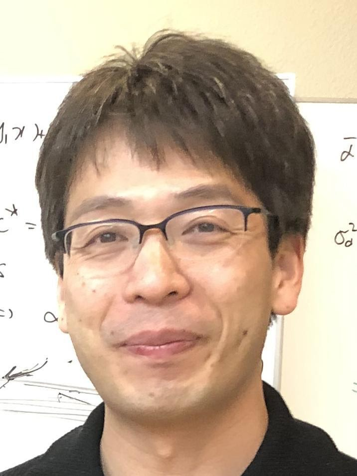
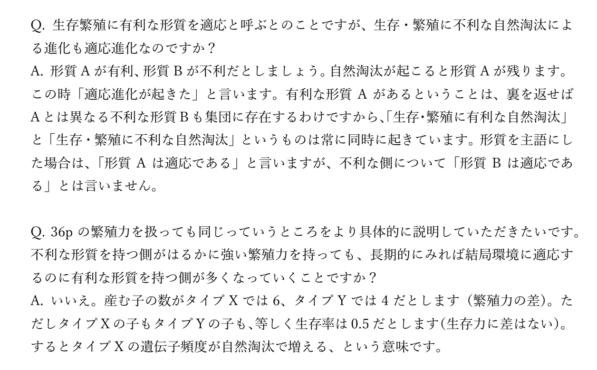

このグッドプラクティスは，2020年度<a href="/events/luncheon/2021-01-15/">オンライン授業情報交換会「第26回 大人数のオンライン授業の実施とテストの工夫」</a>にて，大槻先生にご登壇いただき，内容をご紹介いただきました．学内限定でランチョンの映像を公開しておりますので，ぜひご活用ください．

## 授業の基本情報

授業名　　:　適応行動論 
開講部局　:　教養学部（前期課程） 
対象　　　:　学部 1 ～ 2 年生 
学生数　　:　約 670 名（例年と同様） 
形態　　　:　全てリアルタイム 
利用したツール　:

- ITC-LMS: 学習管理システム（講義資料の共有、課題提出等の管理）
- Zoom: オンライン会議システム（リアルタイム授業）
- Google Forms: フォーム作成 Web サービス（小テストに使用）
- UTAS: 東京大学オンライン講義検索システム（授業情報の共有）
- Google Drive: オンラインストレージサービス（講義動画の共有）

## 教員の基本情報

大槻 久 先生 
総合研究大学院大学 先導科学研究科 
准教授 

## 学生のコメント: この授業が良かった理由

**学生 A のコメント**

ライブ形式の授業。事前に授業資料を配布して、ライブ授業は音声のみなので、通信量負担も少ない。授業資料は充実しており、最低限の内容は資料だけでも追うことが可能。 授業音声は授業後に Google Drive 経由で聴けるようにしてくれる（設定でダウンロードは出来ないようにされていた）。途中で 5 分程度の休憩を入れてくれるので集中が保てる。 授業時間中にチャットで質問すると、先述した休憩時間や授業後にまとめて口頭で回答してくれる。授業の 2 日程度あとに、口頭で回答しきれなかった質問も含めた全質問の回答 PDF を配布してくれる。

**学生 B のコメント**

あらゆるトラブルを想定して動いてくださった。具体的には、教員が複数アカウントで入って共同ホストになることで学生がホストになることを防ぐこと、授業の録音を全員に公開することなど。特に良かったのがテスト方式で、全教員従ってほしい。 話し方も明るくゆっくりでオンラインでも問題なく聞き取れる数少ない教員だった。

**学生 C のコメント**

週ごとに資料が用意されていて、とても見やすかったし、復習がしやすかった。 小テストのやり方が非常に洗練されていた。A 方式などの他のオンライン試験の方式と違って、テスト以外の要因によって集中が阻害されることがなく、とても快適に試験を受けることができた。レポート 1 回、小テスト 2 回という、とてもバランスの良い評価方法もありがたかった。課題の多さに疲弊することなく、学問的な興味を維持したまま、高いモチベーションも持って臨むことができた。完成したレポートは、今でも時折眺めることがあるほど満足度の高いものを作成できた。授業中に short brake があり、これもありがたかった。 授業中にでた質問への回答を後日 ITC-LMS に上げてくださっていたが、これがとても充実していた。何より、講義全体を通して、学生への配慮が感動的であった。「雑に扱われているな」と感じざるを得ない講義もあった中で、これほどまでに我々学生のことを考えてくださっている先生の存在は、セメスターを通して心の支えですらあった。

## 授業をオンライン化するにあたって心がけたこと

一番初めに「オンライン授業になる」と聞いたときは本当に何を心がけたら良いかすら、分からない状態でした……(笑）　教養学部としては「一人の学生も切り捨てない」という方針で行く、というお話があったので、ネットの回線や接続が最も悪い学生がついて来られるような授業にしようということを心がけていました。話に聞いていたところによると、スマホのテザリング機能による回線で授業を受ける学生や、一部にパソコンを持っていない学生もいるということだったので、なるべくそういった学生にも対応できるように、音声を中心とした通信量の少ない授業の形を模索していました。また、ネット環境が整っている学生であっても、日によってネットが繋がらなかったりトラブルが起こったりすることも念頭に置いて、もしリアルタイムで授業に参加出来なくても後日授業を受けられるようにしました。具体的には、授業の録画を Google Drive で共有したり、質疑応答の内容をまとめたものを pdf にして配布したりしました。

質疑応答をまとめた pdf ファイル（一部抜粋）

## 工夫したところ

### スライドの情報量を調節した

この講義はもともと PowerPoint のスライドを使って授業をしていたので、授業内容自体をオンライン向けに大きく変更する必要はありませんでした。ただ、通信量の制約があったので、画像＋音声で授業したかったところを音声のみでやらざるを得ない部分もあったので、対面時に比べて授業で扱う内容を減らし、授業時間に合う分量に調節しました。また、技術的な話になりますが、スライドにアニメーションを使えると、上から一つずつ文章を提示できるので 1 枚のスライドにたくさん文章を載せられるのですが、Zoom ではアニメーションが使えなかったので一度に全部の文章が出てしまい、認知的負荷が大きくなって分かりにくくなってしまいます。そのため、1 枚のスライドに載せる文量を削ったり、スライドを分割したりすることで対応しました。

### 小テストの時間制限・公平性の設計を工夫した

小テストには Google Forms のテスト機能を利用しました。小テストを行う上で、「制限時間を設けるか設けないか」というところでまず悩みましたが、授業の性質上、知識として覚えておく事項が多いので、時間をかけて資料を見てしまえばほとんどの問題は解けてしまいます。そこで、制限時間を設けてテストを行うことに決めました。具体的には、2 回の小テスト（いずれも選択式の問題のみ）を行い、そのうち 1 回目は 18 問 12 分で行いましたが、これは「解答時間が短すぎる！」と学生から不評でした。そこで、2 回目は 18 問 20 分で行ったところ、1 回目よりは上手くいったかな、という感触を持ちました。

また、試験の公平性をどう担保するかというところもかなり考えました。小テストの開始・終了は私の方で Google Forms の回答受付可否のボタンを ON /OFF にすることでコントロール出来ます。その際、試験の終了時間ぴったりに私が回答の受付を終了してしまうと、通信の混雑状況によっては試験時間内に回答を送信したにもかかわらず、回答が提出できずに 0 点になってしまう学生が出てしまう可能性がありました。では、単純に試験終了時間を過ぎても回答を提出できるようにすればいいのかというと、それだと制限時間を厳密に守った人が不利な条件になってしまい公平でなくなってしまいます。そこで、試験終了時間よりも遅れて回答を提出できるようにする代わりに、遅れて提出した分の時間に従ってペナルティがかかるという仕組みを導⼊することにしました。具体的な⽅法を⾊々と考え、自分が最も公平と考える方法を用いて評価しましたが、最後の細かい部分の評価は結局教員の裁量次第なのかなという結論に⾄りました。

ITC-LMS のテスト機能では問題のランダム化もできるので、ITC-LMS が使えれば良かったのですが、約 670 名という大人数のアクセス負荷に耐えられるか不安があったので、Google のシステムを利用しました。今後 ITC-LMS がアップデートされていけば、そちらを使ってもいいのかなと思っています。

## 苦労したところ

### 減ってしまった授業内容をどう埋め合わせるかが難しかった

コロナ対応で、オンラインでは音声中心の授業形態だったため、どうしても扱える内容が少なくなってしまいました。できる限り、普段扱っている内容を満遍なく学生に伝えたいと思っていたので、例年第 1 回目の講義で扱う内容を、今回はレポート課題という形の自主学習にし、残りの内容から全体的に少しずつ間引かざるを得ませんでした。ただ、毎年授業内容にはアップデートを加えていて、今年は削減しなければいけない部分はあったものの、例年のように新しい内容を新たに加えることができました。準備は大変でしたが、授業全体として見ると、授業内容はいくらか削減しつつも、ある程度の質は確保できたのではないかな、と思っています。

### 小テストを実施するタイミングの決定に苦慮した

約 670 名の学生をレポート課題だけで評価するのはほとんど不可能だと感じていたので、テストを行うのは最初の段階でほぼ確定していましたが、いつのタイミングでテストを行えばいいかというのはかなり難しい問題でした。選択肢としては、定期試験期間内と授業時間内の 2 つがありましたが、もし定期試験期間にテストを実施してトラブルが発生した場合、約 670 名の学生に対して採点が間に合わない可能性が高かったり、そもそも再試験の日程を確保するのがほぼ不可能であったりということが分かりました。その点を考慮して、授業時間内に小テストを 2 回行うという形にすることにしました。

もし小テスト中にトラブルが発生してやむを得ずテストが受けられなかった学生がいたら、その旨を申告してもらい、私自身が後日 Zoom による口述試験を行うということで対応しました。小テスト 2 回のうち再試験になったのは 10 人以下で、十分対応できる範囲だったので、ある程度テストの公平性を保つことができたのではないかと思っています。

## 今後のオンライン授業に向けて

### 試験、成績評価について

授業開始当初は「例年のように試験が実施できるとは思わないでほしい」と教養学部の方から言われていたので、レポート 1 回（5 月末締切、A4 2 枚）と小テスト 2 回で評価することにしました。レポート課題を出したのは、万が一試験が実施できなかった場合、確実に評価できるようなものを残しておきたかったからです。ただ、このレポートの採点には本当に多くの時間がかかりました。約 600 名分のレポートを私一人で採点したのですが、5 月末の締め切りから 7 月上旬くらいまで毎晩 1 時間程度を費やして漸く終わったという具合で、流石に大変だったので、他の人にはおすすめできません(笑)　じゃあレポートの分量を減らして A4 1 枚にすれば良かったのかと言うと、A4 1 枚程度ではほとんど中身のあることを書けないので、それでは意味がありません。次回以降、またオンライン授業で評価することになったら、レポート課題は現実的ではなく、オンライン試験を活用していきたいと思っています。

東大には進学選択という制度があるので、駒場の前期教養の学生にとって成績が公平に評価されることは重要な問題ですし、学生はそのことに関して非常に敏感です。教員側が学生を技術的にサポートできる体制を構築したり、教員側の背景情報を学生に共有したりと、学生側に寄り添った姿勢を見せることが、結果的に学生のより良い学びに繋がるのではないかと思っています。

### 本当は講義に動画を利用したい

通信環境が整っていない学生にも授業を提供したかったので、音声メインの授業形態を採用しましたが、やはり PowerPoint のプレゼンテーション機能を使って授業をしたかったな、という部分があります。授業中に静止画をこちらの任意のタイミングで表示したり、Zoom のホワイトボード機能を使って理解の助けになるような図を描いたりすることは、授業をより良いものにするためにはやはり必要だなと感じました。Zoom の設定によっては通信量を抑えて動画を表示できるようなので、その点は次回以降の授業に活かせればいいな、と思っています。

### 大学と教員の情報共有について

正直、今回のオンライン授業に関しては最小限の責任を全うしただけだと感じていて、「上手くいった」という感触はありません。私自身、非常勤講師なので、どうしても駒場の状況がすぐ手にとるように分かるわけではなく、毎回大学に問い合わせる必要がありました。もしこの状況が今後も続くようであれば、非常勤講師の方に向けて「大学のシステムでは、何ができて何ができないのか」という情報をまとめたマニュアルを提供していただけると良いのではないかな、と思いました。

ただ、大学総合教育研究センターなどのセミナーに出ていたおかげで、オンライン授業のやり方などの面でかなり救われた思いがしたので、センターの方と鶴見先生には大変感謝しております。

## 参考資料

### 本授業の概要（シラバスより）

本講義の⽬標は、⼈間の⾝体や⾏動および⼼理の特性を進化の観点から理解することである。全ての⽣物種は進化という途⽅もなく⻑いプロセスを経て現在地球上に存在している。従って⼈間を⼀つの⽣物種である「ヒト」として捉えた時、我々の体や⼼も決して進化とは無縁でなく、そこには進化の痕跡が数多く残されていると考えられる。このような観点から⼈間の⾏動を理解する学問は⼈間⾏動進化学、⼼理を理解する学問は進化⼼理学と呼ばれ、近年⽬覚ましい発展を遂げている。またヒトの疾患の存在理由を進化的に理解する学問は進化医学と呼ばれる。

本講義では進化論が近現代の⼈間観・世界観に与えたインパクトを解説した後、進化⽣物学の基本的な概念を学習する。次に霊⻑類の特徴や⼈類の進化史を学び、⽣物としてのヒトの理解を深める。これらの内容を踏まえた上で、進化が我々の⾝体や⾏動そして⼼理に及ぼしている影響について様々な例を挙げて解説する。具体的にはヒトの⽣活史、社会性、配偶⾏動を取り上げる。「⼈間とは何か」という⼤きな問題に対し、従来の⼈⽂科学や社会科学にはなかった新しい⽂理融合的アプローチによって迫りたい。

### 授業内容

- ⾃然淘汰の仕組み
- 遺伝⼦から⾏動へ
- 種の保存と群淘汰の誤り
- 霊⻑類の⽣態と形態
- ⼈類の進化
- ヒトの⽣活史戦略
- ⾎縁淘汰と⾎縁者間の葛藤
- ヒトの社会性
- 性淘汰とヒトの配偶戦略

### 具体的な授業 1 回分の流れと方法

| 時間| 説明|
| 5 分| 連絡事項の伝達・前回の補足|
| 50 分| 授業（学生はチャットに質問する）|
| 5 分| 質疑応答（回答は後日 pdf 化）|
|45 分| 授業|
| 10 ～ 20 分| 授業後に残った学生との質疑応答（質疑応答の内容は後日 pdf 化） 質問は直接または、メールで受け付け（ITC-LMS の掲示板はそこまで活用されず）|

### 評価方法

レポート課題 1 回、小テスト 2 回で評価しました。

**レポート課題**

例年はレポート課題を出していませんでしたが、万が一試験が実施できなかった場合に評価対象となるものを残しておきたかったので、今年はレポート課題を課しました。課題の内容は、「進化論と宗教論の関係について」自分で調べた内容を A4 2 枚にまとめるというもので、5 月末の締め切りとしました。

前述しましたが、600 名以上のレポート課題を一人で採点するのは予想以上に大変な作業だったので、受講者が多い授業でレポート課題というのはあまり現実的ではないようにも感じました。

**小テスト**

授業時間中に、Google Forms のテスト機能を利用して小テストを 2 回実施しました。

1 回目は全 18 問 12 分（授業第 8 週冒頭に実施）、2 回目は全 18 問 20 分（授業第 13 週冒頭に実施）で行い、いずれも問題は選択式問題のみとしました。オンラインでの試験は初めてのことだったので匙加減が分からず、初回はやや厳しい制限時間設定になってしまいましたが、2 回目は上手くいったように感じました。

また、監視のないオンライン試験では資料を見たりインターネットで検索したりすることを確実に防止することはできないので、資料やインターネットの閲覧を禁止にしませんでしたが、他の人と相談して試験に取り組むことは厳に慎むように、学生に伝えました。
