---
title:
    2020年度Aセメスター 
    オンライン授業に関するアンケート結果概要（学生版）  
sitemap: false
---
## はじめに
2020年度Aセメスターの授業は，新型コロナウイルスの感染拡⼤防止と学生の学習効果の観点から，オンラインのみで行う授業・対面で授業を行う授業・オンラインと対面の両方の要素行う授業を組み合わせることで実施されました．   
このアンケートは，2021年1月30日から2月15日にかけて，本学の学部生，大学院生，聴講生，研究生を対象に実施されたもので，Aセメスターのオンライン教育に対する評価や感想などの回答を，合計2,413名から得ることができました．今回の結果概要では，本アンケートに関して数値化できる回答の集計結果を中心にご紹介いたします．  
  
## 調査⽅法について  
- アンケート実施期間：2021年1月30日～2021年2月15日  
- アンケートの実施形式：オンライン（Microsoft Forms）上での実施  
- アンケートの対象者：東京⼤学の学⽣（学部⽣，⼤学院⽣），聴講⽣，研究生
  
## 結果の表示について 
- 対象者のうち合計2,413名から得られた回答を，集計および分析したものです．  
- 数値化できる回答の集計結果を中心とし，自由記述の回答については一部抜粋してご紹介します．  
- 2020Sセメスターアンケートでの区分に合わせ，必要に応じ「学部1年生」「学部2年生」「学部3年生以上」「大学院生」「その他」に分けて示しました．  
- グラフ中の数字は回答者数を表しています．  
- それぞれのグラフの説明⽂中に記されているパーセンテージは，⼩数点以下を四捨五⼊しているため，合計しても100%にならない場合があります．また，複数回答可の問題においても，合計が100%にならない場合があります．  
   
## 分析結果の要点 
- 全体として，Aセメスターのオンライン授業への評価は，0〜10の11段階評価において平均6.6でした（2020Sセメスターより0.1ポイント増）．また，多くの設問については，2020Sセメスターと傾向が似ていましたが，対面授業が再開したことによる影響（心理的な不安の解消や授業形式別の満足度の変化），課題の量が適正化されたという意見が目立ちました．   
- Zoomなどによるライブのオンライン方式（教員による講義中心）の授業が最も多く，全体で6.5コマ（最大は学部1年生で11.2コマ）受講していました．一方，対面授業は全体で1.2コマでした．Aセメスターの授業が行われた期間中（およそ70日の平日が存在）の登校した日数については，平均で15.2日となりました．多くの学生がオンラインでの受講を継続していることがわかりました，    
- 授業形式について，満足度に関する選択肢を1～5点で得点換算し尺度得点を計算したところ，もっとも学習者の評価が良かったのは，対面授業で（尺度得点は4.0），次いで，ライブ形式のオンライン授業（教員による講義中心）（同3.7），オンデマンド授業（同3.7），ハイフレックス方式（同3.6），ライブ形式のオンライン授業（学生のグループワークや議論中心）（同3.5）という結果になりました．特に学部1年生では対面を希望する場合が多く，ハイフレックス（教員が教室におり，学生は教室で受けても学外から受けても良い）形式で出席場所がオンラインか教室か選べる場合，「75%以上の機会で教室から参加した」と答えた学生が64%となりました．   
- 反面，授業内容や行う形式によって「オンラインか対面か」が適切に選択されることへの期待も大きいようです．主要な授業形式について，オンラインと対面授業の，いずれの形式が望ましいかを質問したところ，座学の授業（特に，大人数の講義）についてはオンライン化への期待が⼤きい（オンライン授業に肯定的な回答が65%）一方，実験，演習，グループワークなどインタラクションが多く見込まれる授業については，対面授業が望まれやすい傾向が見受けられました（対面授業に肯定的な回答が49%以上）．
- オンライン授業による心理的影響について，2020Sセメスターと2020Aセメスターを比較する質問を行っいました．オンライン授業に伴う「不安や苦痛」を感じていた，という声が，2020Aセメスターでは多くの設問・区分で減少していました．特に，「友達との交流が少なくなることについてどの程度不安を感じていたか」という設問は，学部1年生で大きな変化があり，Sセメスターでは「（不安や苦痛を）かなり感じていた」，「深刻に感じていた」という回答が72%であったのが，Aセメスターでは54%に減りました．一方で，「授業についていけていないのではないかという不安・苦痛」については，学部1年生では，「（不安や苦痛を）かなり感じていた」，「深刻に感じていた」という比率は11ポイント減少した一方，学部2年生では18ポイント増加しており，環境の変化が不安・苦痛に繋がりやすいことがわかりました．しかし，不安・苦痛を感じているという回答もまだ多く，今後も取り組みが必要だといえます．      
- 技術面・ツール面においては，2020Sセメスターと同様，端末やソフトウェアの使用に困難を感じなかったという回答が多数となりました．使用する端末やツールの比率も，ほぼ変化しませんでした．   
  
## 回答者の属性  
### 学年・身分   
アンケート実施期間内に回答した2,413名のうち，47%が学部生，31%が修⼠課程学生，20%が博⼠課程学生でした．その他，研究⽣，ポスドク研究員などからも回答を得ました．本学学⽣の全数は，学部が14,010名，修⼠課程学⽣が7,207名（専門職学位課程を含む），博⼠課程が5,794名なので（2020年11月現在），各区分の回答率は8～10%程度ということになります．  

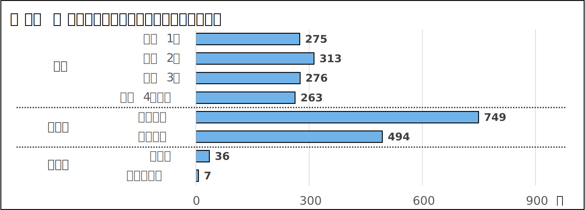

### 所属  
回答者の所属は次の通りです．  

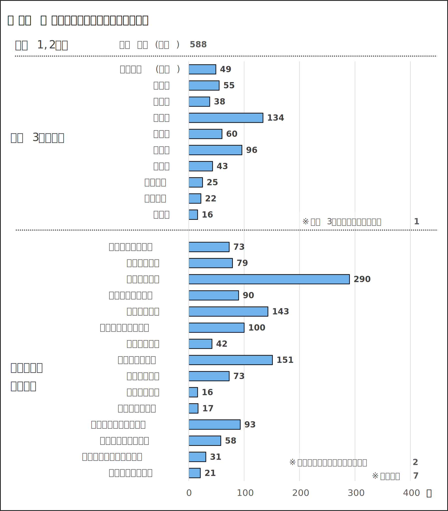

## 授業の履修環境に関する質問  
### 場所：オンライン授業や研究などのために，主にどこからインターネットに接続していましたか？  
全体のうち，40%が⼤学に近い実家，35%が⼀⼈暮らしの自宅から接続していました．⼤学から遠い実家は7%，寮などの下宿先は8%，キャンパス内は8%と比較的少数でした． 
2020Sセメスターに実施したアンケートに比べ，特に学部1年生について，⼤学から遠い実家を選択した人は15ポイントの減少となりました．その分，⼀⼈暮らしの自宅との回答が，学部1年生について14ポイント増加しています．キャンパス内での講義が始まったことにより，学部1年生を中心に一人暮らしを開始した学生が増えたことが見て取れます．      
一方，キャンパス内での受講について，全数（n = 191）のうち86%が大学院生からの回答であり，受講場所としては研究室が84%を占めていました．学部1，2年生からのキャンパス内という回答は3%に満たず，多くの学部生がキャンパス外からの受講を行っていたようです．図書館や教室と答えた割合は，全数のうち，13%でした．   
  
「その他」の自由記述欄には，一人暮らし以外の自宅，キャンパス外の研究室，カフェ・図書館などに加え，海外からという回答が寄せられました．  

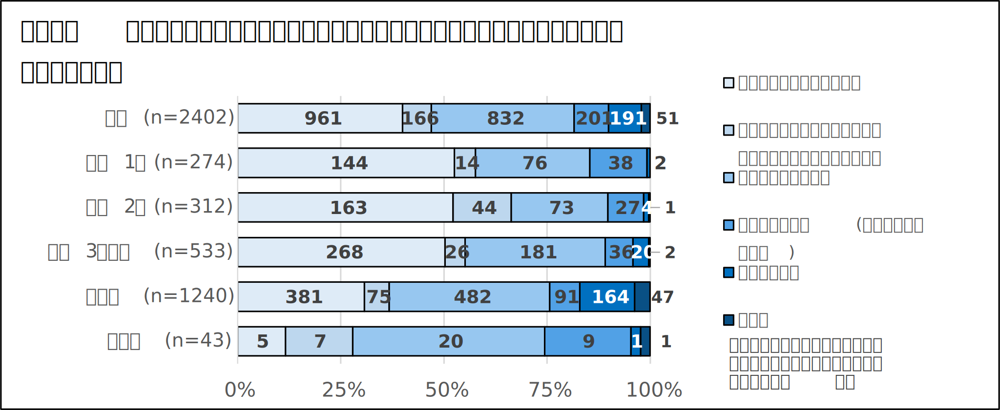

### 使用した機器：オンライン授業や研究などのために，どの機器を使ってインターネットに接続していましたか？（複数選択可）  
91%がノートPCを使用していました．スマートフォンからの接続が18%，タブレット端末が16%と，PC以外の使用も一定数見られました．   
使用する端末として，ノートPCが9割を超える一方，PC以外の端末の使用もあり，様々な画面サイズでの受講が想定されます．この設問については，2020Sセメスターアンケートとほぼ同様の結果となりました．   

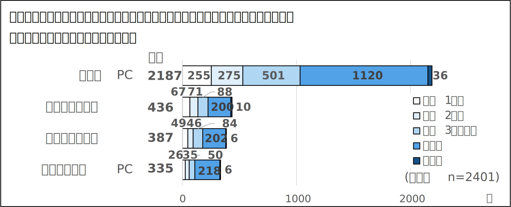

### 回線環境：オンライン授業や研究などのために，どのインターネット環境を使っていますか？
全体的に約60%が⾃宅や寮などに備えられた回線から接続しており，50GB以上の無線回線の使用は各学年の19～27%程度でした．大学の回線を使用している比率は全体で7%，⼤学から貸与されるモバイルルーターで4%程度でした．  
通信量不足の可能性がある，無線契約（携帯回線，モバイルルータで通信量月50GB未満）を使用している，という回答は各区分の3~5%程度でした．

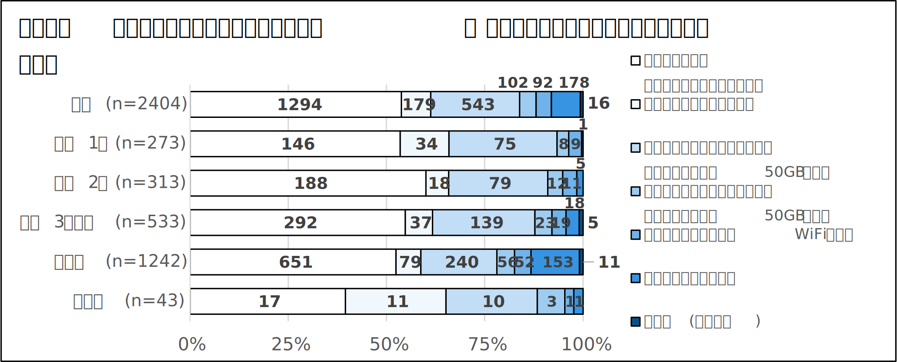

  
## 学習実態に関する質問  
学習実態に関する質問の中で，授業形式以降の問いには，今学期にオンライン授業の受講経験がある学生のみが回答しています．   

### 授業履修の有無：今学期に授業を1つ以上受けていますか？
Aセメスターにオンライン授業を1つ以上受けた経験を持つ学生は，学部生で93%以上，⼤学院生では64%でした．  

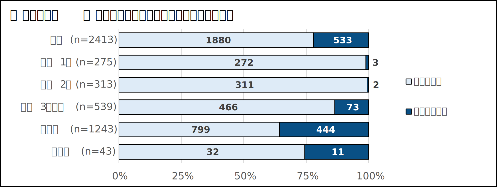

### 授業形式：週に受けているオンライン授業のコマ数（ほとんど出席していないものは除く）を，形式ごとに教えてください．
注意：以下の設問について，授業の進行に伴い方式が変わった場合にはそれぞれの割合でカウントするように指示しています．例えば，ハイブリッド授業の形式で，半分対面で半分オンラインであれば，「対面0.5, オンライン0.5」と数えて加算することで，回答を得ています．

まずは，学年を区別せずに，受講した授業数として報告されたコマ数を形式別に示します．
受けている授業の形式としては，教員の講義を中⼼とするオンライン授業が最も多く，次いで，グループワークを中心とするオンライン授業，事前に録画した講義ビデオを配布するオンデマンド授業（非同期型），対面授業が多くなっていました．その他の形式については，少数でした．

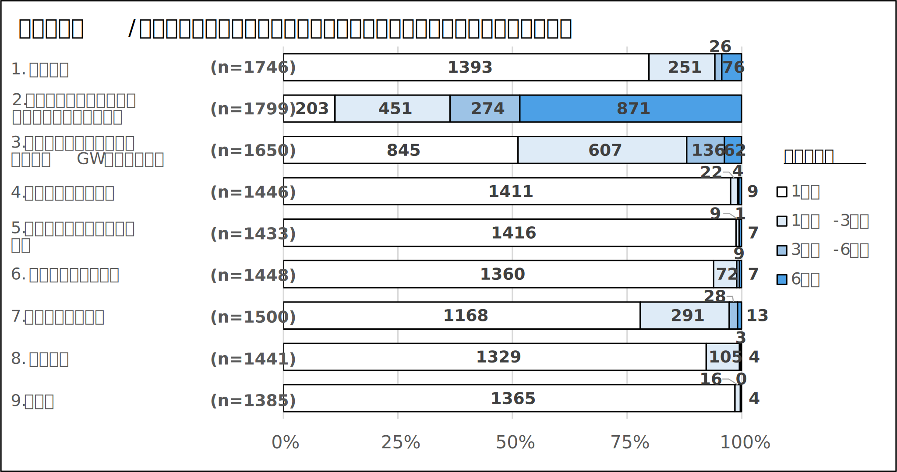

#### 1. 対面方式（教員も学生も教室にいる）  
この形式は，オンライン授業になる前に最も一般的な講義形式であった，教室での対面授業を指します．   
オンライン授業のライブ形式などに比べると少なく，学部1年⽣は平均1.6コマ，学部2年⽣は平均1.1コマ，学部3年生以上は平均1.8コマ，⼤学院生は平均0.7コマの講義を受講していました．
実験などの演習が多いと考えられる学部1年生や3年生以上の区分での回答が多くなっていました．  
※平均値の算出には回答区分の中位値と，最上位区分の最⼩値を⽤いました．以下全て同様に計算しています．   

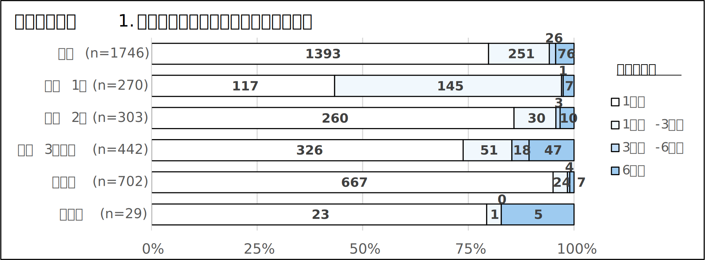

#### 2. ライブのZoomなどによるオンライン方式（教員による講義中心）
この形式は，オンライン授業のうち，教員が講義を行いそれを学生がライブで受講するものを指します．   
この形式の授業は2020Sセメスターに引き続き，最も多くの回答を占めました．学部1年⽣は平均11.2コマ，学部2年⽣は平均10.8コマ，学部3年以上は平均6.7コマ，⼤学院生は平均3.0コマの講義を受講していました．

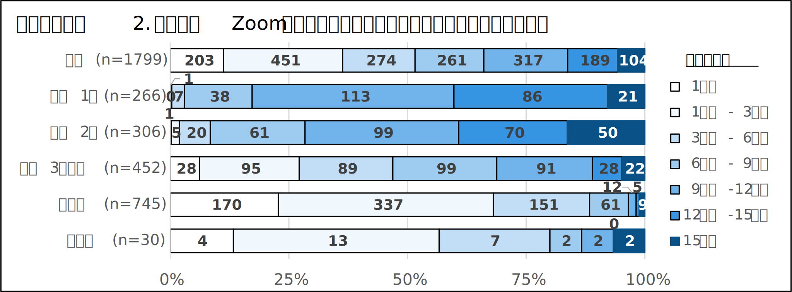

#### 3. ライブのZoomなどによるオンライン方式（学生のグループワークや議論中心）
この形式は，オンライン授業のうち，学生のグループワークや議論を中心とするものを指します．   
この形式の授業はどの学年の学生も経験していたものの，講義中心のオンライン授業に⽐べて少数でした．学部1年⽣は平均1.5コマ，学部2年⽣は平均1.4コマ，学部3年以上と⼤学院生は平均1.8コマの講義を受講していました．2020Sセメスターに比べ，学部1年生では1.1コマ，学部3年生以上では0.4コマの減少が見られました．   

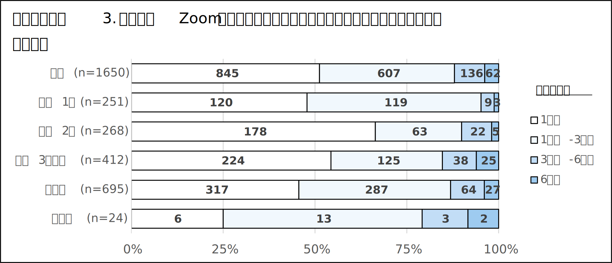

#### 4. コールセンター方式
この形式は主に語学の授業で想定され，学生は教室にPCとヘッドセットを持って集まり，別室にいる教員のZoomに接続します．語学の授業が多い学部1年生で見られました．

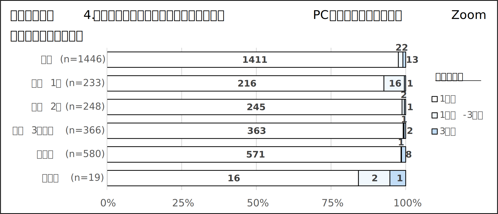

#### 5. パブリックビューイング方式
この形式は，学生は教室に集まり，別室にいる教員の授業を教室内のプロジェクタとスピーカーに流すものです．この形式の授業は，ほとんど見られませんでした．

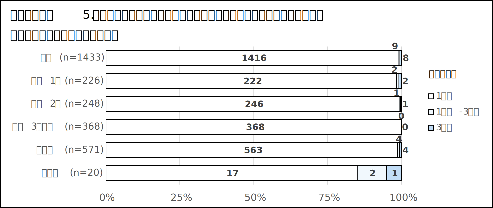

#### 6.ハイフレックス方式  
この形式は，教員が教室で授業し，学生は教室での受講するか（対面授業），オンラインで受講するか（教室での講師の授業をオンラインに配信したもの），選択できるようにしたものです．   
どの学年の区分でも，5%以上の学生が，ハイフレックス授業を1コマ以上，経験していました．

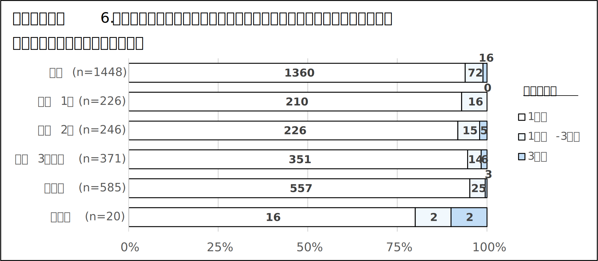

#### 7.オンデマンド方式  
この形式はオンラインの講義形式ではありますが，同時（ライブ）配信ではなく，事前に教員が録画してアップロードした講義ビデオを学生が後から視聴するものです．   
学部1年生では40%の学生が，学部2年・3年以上では25%強の学生が，大学院では11%の学生がオンデマンド形式の授業を1コマ以上，経験していました．

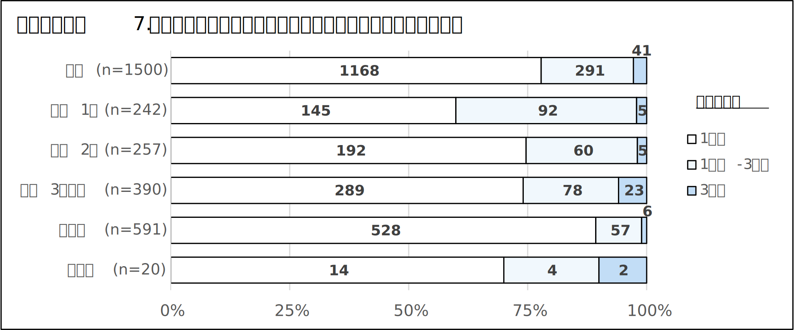

#### 8.自習方式の授業  
この形式の授業は，ほぼ資料配信と課題提示のみで対面でのレクチャーやビデオを使わない形式のものです．   
この形式の実施は，1年生を除き少数でした．  

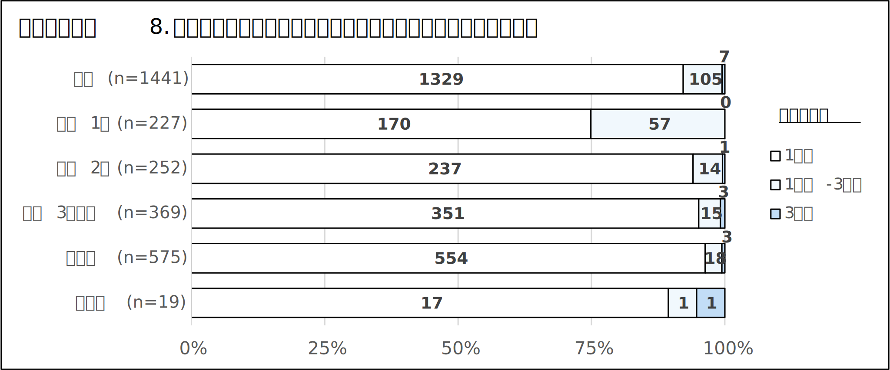

#### 9.その他   
1〜8の形式の組み合わせや，どれにも該当しない形式の授業を「その他」としましたが，少数でした．    

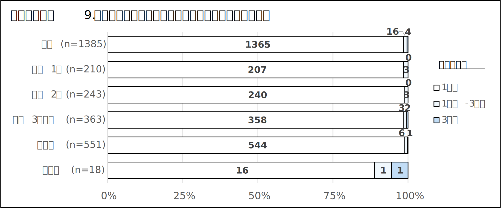

### 出席率：ライブのZoomなどによるオンライン方式で行われている授業の出席率（実際にライブで聞いている割合）は，だいたいどのくらいの割合でしょうか？  
多くの学生がライブで配信されている授業に80〜100%出席したと回答しました．区分別には，学部1年生の90%，学部2年生・学部3年生以上の85%，大学院生の90%が80〜100%出席したと回答しました．

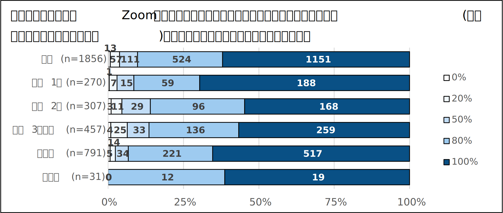

### 出席の選択：ハイフレックス（教員が教室におり，学生は教室で受けても学外（主に自宅）から受けても良い）形式の授業について，あなたは主にどのように参加しましたか？
受講場所について，教室かオンラインかを選択できる授業を受講したという学生は，全体の17% （学部1年生は21%，学部2年生以上・大学院では15%程度）でした．教室での受講を選択する比率は学年が若いほど多いという結果になりました．特に，学部1年生では，教室かオンラインか選択できる場合には教室を選択する場合が多く，「75%以上の機会で教室から参加した」と答えた学生が64%となりました．   

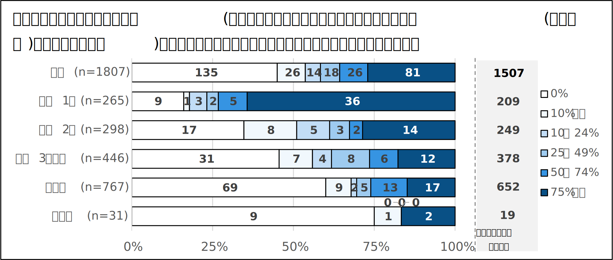

### 登校日数：Aセメスタの授業が行われた期間中（およそ70日の平日があります）のうち，およそ何日くらい登校しましたか？授業のため研究のためなど，理由は問いません．   
学部1年生と学部三年生以上と大学院の学生が，多く登校していました．平均の登校日数は，学部1年生が15.2日，学部2年生が7.0日，学部3年生以上が15.6日，大学院が18.4日となりました．学部3年生以上と大学院の学生について登校日数が多いのは学科での実験・演習や研究室での活動があるため，学部1年生が多いのは必修の授業で対面を選んでいることが多いためと考えられます．    

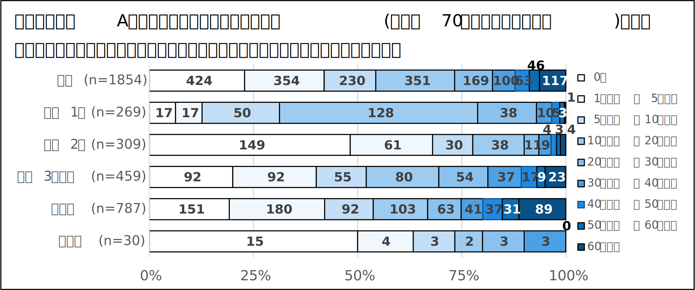

### 授業外学習時間：授業に参加している以外（予習，復習，課題など）で平均週何時間を⼤学の勉強に使いましたか？  
学生が授業時間外で学習にかけた時間の平均値は，学部1年⽣が13.2時間，学部2年⽣が11.8時間，学部3年生以上が13.3時間，⼤学院生が14.0時間となりました．

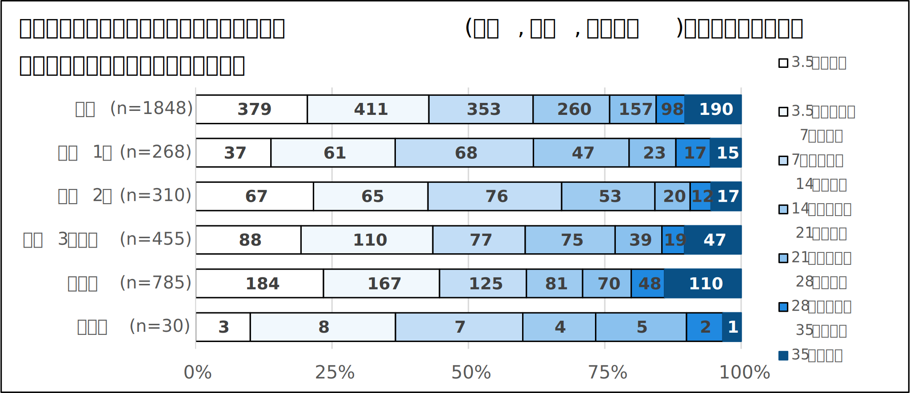

## オンライン授業の質と評価に関する質問  
### 授業方法別の評価  
授業形式ごとに，実際に受講してどのように感じたか，その評価をたずねました．   
5件法の尺度に，「大変良かった」を「5点」，「全く良くなかった」を「1点」として得点換算し，尺度得点を計算しました．対面授業が最も評価が高く（4.0），次いで，ライブ形式のオンライン授業（教員による講義中心）（3.7），オンデマンド授業（3.7），ハイフレックス方式（3.6），ライブ形式のオンライン授業（学生のグループワークや議論中心）（3.5）という結果になりました．   
一方，パブリックビューイング形式，コールセンター形式はともに2.7となり，低い評価になりました．教員の講義形式と学生の受講形式（教室での対面かオンラインか録画か）が同じだと，満足度が高くなるようです．   
なお，同様に2020Sセメスターのアンケート結果を得点化すると，ライブ形式のオンライン授業（教員による講義中心）は3.7，ライブ形式のオンライン授業（学生のグループワークや議論中心）は3.5，オンデマンド授業は3.5であり，ライブ形式の授業の満足度は同程度，オンデマンド授業の満足度は0.2ポイント増加していました．   

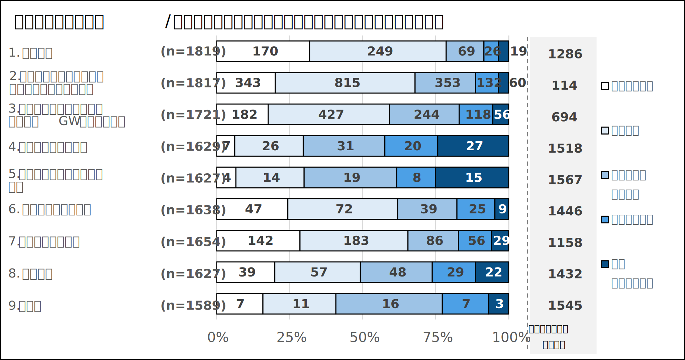

#### 1.対面方式（教員による講義中⼼）
学生の満⾜度は⾼く，「その他」以外の区分では70%以上が「⼤変良かった」「良かった」と回答しています．特に，学部2年生は顕著で，88%の学生が，「⼤変良かった」「良かった」と回答していました．

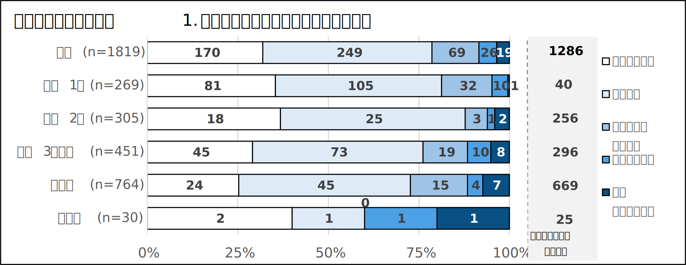

#### 2. ライブのZoomなどによるオンライン方式（教員による講義中心）
この形式も学生の満⾜度は⾼く，68%が「⼤変良かった」「良かった」と回答しています．ただし2020Sセメスターと同様に，学年が上がるほど満⾜度が上がる傾向があり，「大変良かった」「良かった」と答えた学生は，大学院では77%（前期より2ポイント増）にのぼりますが，学部1年⽣では58%（前期より3ポイント増）にとどまっていました．

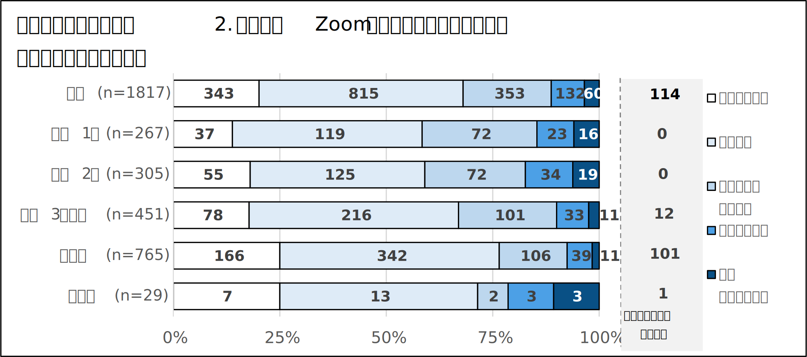

#### 3.ライブのZoomなどによるオンライン方式（学生のグループワークや議論中心） 
全体で59%（学部1年⽣：43%，学部2年⽣：49%，学部3年生以上：58%，⼤学院生：69%）が，「大変良かった」「良かった」と回答しました．しかし，この設問は，2020Sセメスターとは値の分布がかわっており，学部1年生・2年生の満足度は7~8%減少，学部3年生以上と大学院生は5~6%上昇となっていました．  

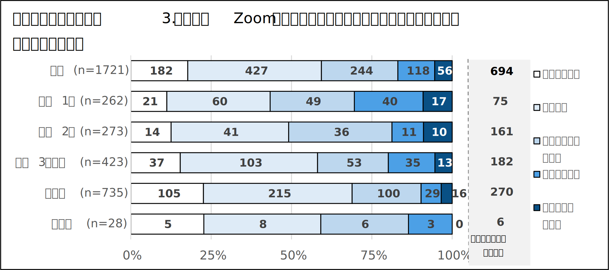

#### 4. コールセンター方式
全体で30%（学部1年⽣：32%，学部2年⽣：0%，学部3年生以上：44%，⼤学院生：28%）が，「大変良かった」「良かった」と回答しました．    
※但し，この形式の授業を受けたという学生は全数の7%で，回答数が少なくなっています．   

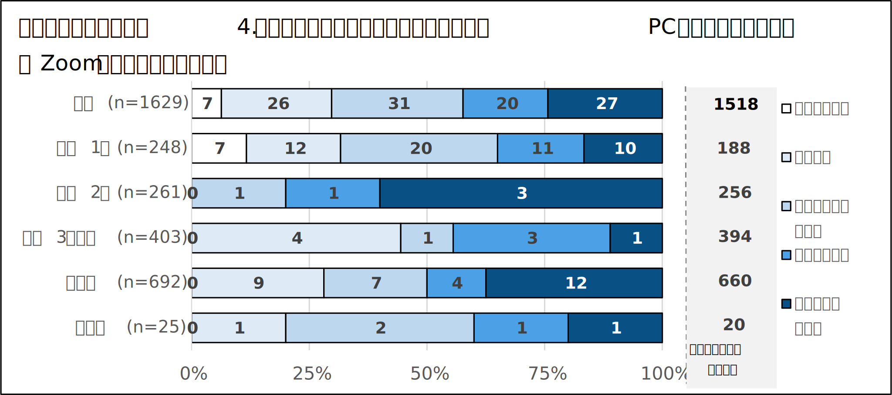

#### 5. パブリックビューイング方式
全体で30%（学部1年⽣：29%，学部2年⽣：100%，学部3年生以上：14%，⼤学院生：31%）が，「大変良かった」「良かった」と回答しました．    
※但し，この形式の授業を受けたという学生は全数の4%で，回答数が少なくなっています．   

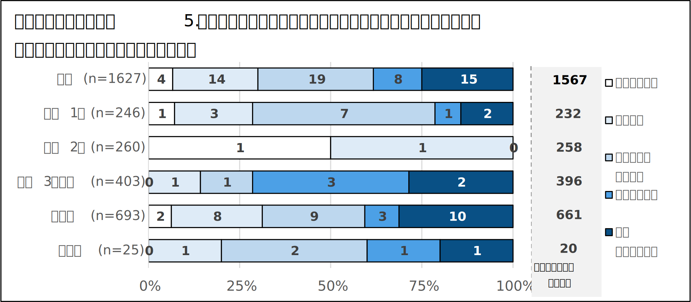

#### 6.ハイフレックス方式  
全体で62%（学部1年⽣：73%，学部2年⽣：66%，学部3年生以上：64%，⼤学院生：53%）が，「大変良かった」「良かった」と回答しました．    

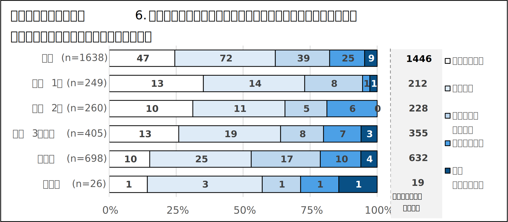

#### 7.オンデマンド方式  
全体で66%（学部1年⽣：60%，学部2年⽣：61%，学部3年生以上：75%，⼤学院生：66%）が，「大変良かった」「良かった」と回答しました．2020Sセメスターでは，全体で54%（学部1年⽣：50%，学部2年⽣：51%，学部3年生以上：57%，⼤学院生：57%）の回答が「大変良かった」「良かった」と回答していたため，全体的に満足度の向上が目立った設問でした．    

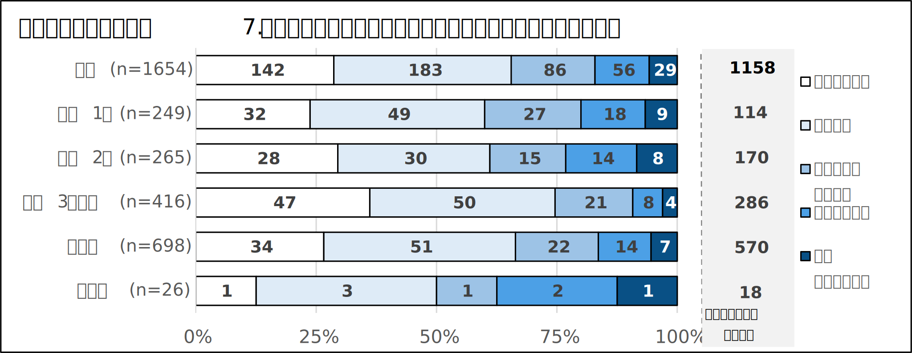

#### 8.自習方式の授業  
全体で49%（学部1年⽣：52%，学部2年⽣：65%，学部3年生以上：41%，⼤学院生：46%）が，「大変良かった」「良かった」と回答しました．
学部3年生以上と大学院生の満足度は2020Sセメスターから変化なかったものの，学部1年生での満足度は16ポイント，学部2年生での満足度は38ポイント上昇していました．

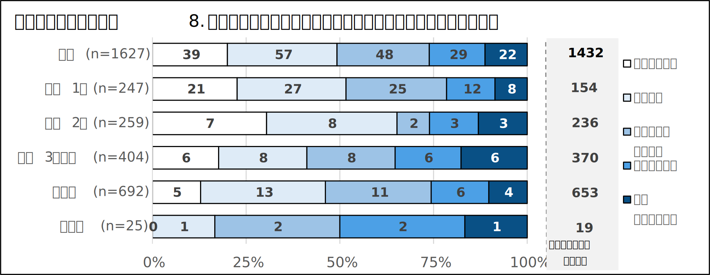

#### 9.その他   
全体で41%（学部1年⽣：25%，学部2年⽣：100%，学部3年生以上：50%，⼤学院生：32%）が「大変良かった」「良かった」と回答しました．   
※但し，この形式の授業を受けたという学生は全数の3%で，回答数が少なくなっています．   

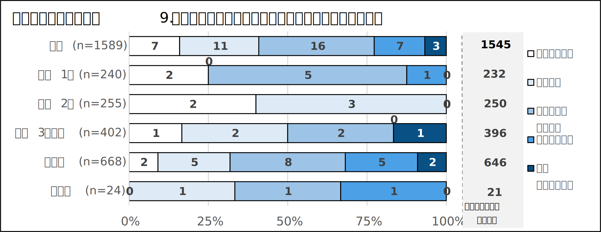

### メリット：オンライン授業が対⾯授業より良いと感じた点にチェックをしてください．（複数選択可）  
ここでは，授業がオンライン化されたことにより，対面授業と比較してどのようなメリットを感じたかを回答してもらいました．  
全体的な傾向は，2020Sセメスターのアンケート結果と同様でした．   
最も多い回答は「通学時間が不要」という点で，94%という多数がメリットとして挙げました．また，移動に関するものでは，「キャンパス間の移動が不要なので授業選択の幅が広がった」という点を49%の学生が上げていました．予習や復習などに関しては，「講義資料が電子化され, 予習復習や確認がしやすい」という回答が61%，「講義の録画が見られて, 復習や確認がしやすい」という回答が42%あげられました．授業中の受講しやすさという点では，「（教室の黒板と比べて）PCの画面のほうが資料などが見やすい」という点が52%，「（教室と比べて）先生の声が聞き取りやすい」という点が28%あげられていました．

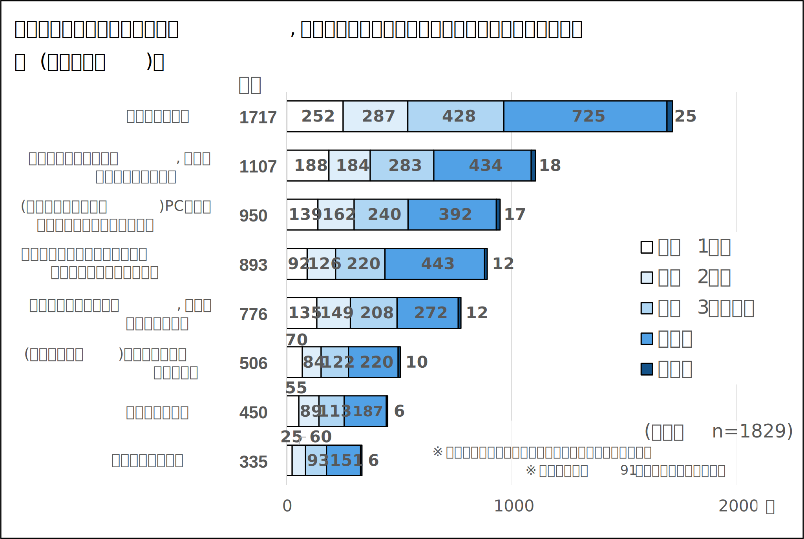

### デメリット：オンライン授業を受けてみて感じたデメリットをチェックしてください．（複数選択可）  
この問では，オンライン授業のデメリットだと感じる点を挙げてもらいました．
  
2020Sセメスターともっとも差が目立ったのは，「課題が多く出る傾向にあった」という回答で，この回答数は前期より15ポイント少なくなっていました．その他の傾向は，2020Sセメスターと同様でした．    
最も多い回答は「他の学⽣とコミュニケーションがない（少なくなる）」という点で，全体の73%でした（2ポイント上昇）．学部1年⽣では何らかの回答を行った学生のうち，79％がこの点をデメリットとして上げていました（2020Sセメスターの1年生の回答に比べると5ポイント減少）．続いて，「⽬の疲労や肩こりなど，⾝体的に疲れた」などの身体的不調（2020Sセメスターより2%減）が65%，「通信環境などのせいで映像や⾳声が途切れることがあった」が63%（2020Sセメスターと同数），「授業に集中できなかった」（2020Sセメスターより3%減）が42%，と続いていました．   
Web会議システムなどソフトウェアの使⽤に関する技術的な問題をデメリットとしてあげた学生の比率はいずれも25%以下で，2020Sセメスターよりも数ポイントずつ減少していました．   

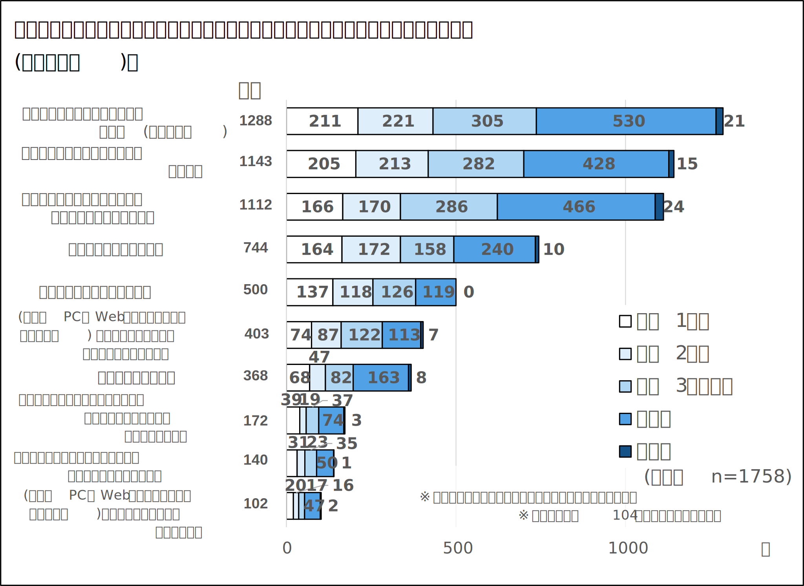

  
### やめてほしいと思った点：受講したオンライン授業で実際に経験し「やめてほしい」と思ったことがあればチェックしてください．（複数選択可）  
 
最も多い回答は「講義録画が提供されなかった（見るための手順が面倒で見られなかった）」で58%（2020Sセメスターよりも10ポイント増）で，次いで，「講義資料が提供されなかった」という回答が42%（同12ポイント増）でした．一方，「課題の量が多すぎた」という回答は2020Sセメスターから15ポイント減少しており，33 %でした．「授業時間が守られなかった（授業が延びるなど）」（25%），「常時カメラオンを求められた」（20%）が続きました．  

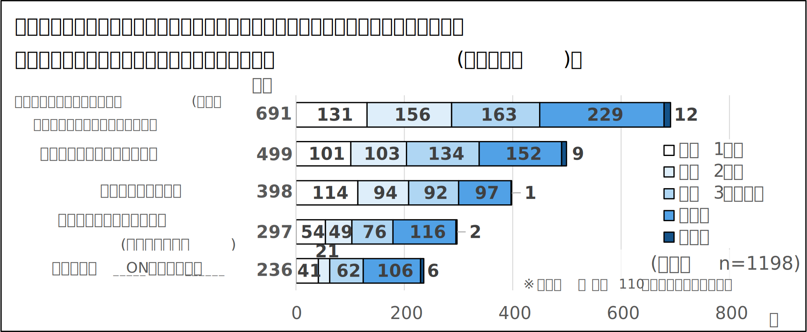

  
### Aセメスターの授業に対する評価：この3か⽉間の授業（対面・オンラインの双方含む）に対する，あなたの総合的な評価を教えてください（10を最⾼とし，0を最低とする11段階評価）．
2020Aセメスターの授業全体（対面・オンラインの双方を含む）に対して，11段階で評価してもらいました．また，回答から平均点を算出しました．数字が⼤きいほど満⾜度が⾼いことを⽰しています．全体では平均6.6でした（2020Sセメスターより0.1ポイント増）．大きく変わったのは，1年生の回答で，2020Sセメスターより，0.8ポイント増えていました．一方，学部2年・学部3年以上では，0.3~0.4ポイント減少していました．  

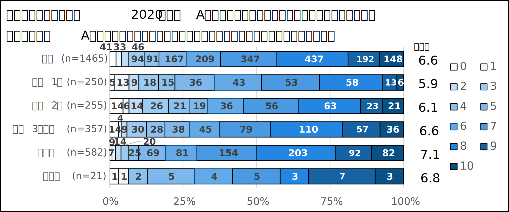

  
## オンライン授業で用いたツールに関する質問
### ツール：あなたが受講したオンライン授業で使⽤したツールは何でしたか？（複数選択可）
オンライン授業を受講する際に使⽤したツールについて質問しました．全体の傾向は，2020Sセメスターと同様でした．    
ほぼ全ての回答者が，Zoomを利用していました．次いでITC-LMSの利⽤率は59%でした．そして，ECCSクラウドメール（Google Drive，Google ドキュメントなどのサービス）の利用は33%，UTokyo Microsoft Office（OneDrive，Word，PowerPointなどのサービス）が17%．その他，Webex（Cisco Webex Meeting）やGoogle MeetなどのWeb会議システムの使用は他と比較すると少数となりました．  

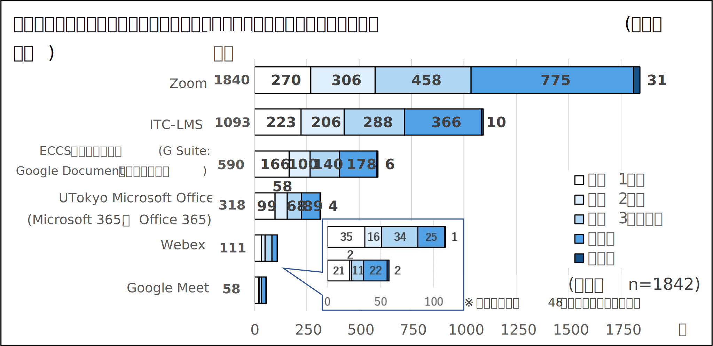

## 今後のオンライン授業に対する印象の質問
ここでは，いくつかの主要な授業形式について，オンラインと対面授業，いずれの形式が望ましいかを質問しました．

2020Sセメスターのアンケートと同様に，座学の授業についてはオンライン化への期待が⼤きい⼀⽅，少⼈数のクラス，グループワーク，演習，実験などインタラクションが多く見込まれる授業については，対面授業が望まれやすい傾向が見受けられました．   
※2020Sセメスターアンケートにおいて，この項目は表現が異なっており，「今後，オンライン授業を授業形態の1つとして取り⼊れてほしいですか？」という設問にて聞いています．なお，選択肢は，「確実にオンライン授業にしてほしい」，「オンライン授業にしてほしい」，「どちらでもよい」，「オンライン授業にしてほしくない」，「絶対にオンライン授業にしてほしくない」という5件法でした．結果を比較していますが，表現が異なることが回答に影響している可能性があります．  

### 教員による講義中心の授業（大人数）について，どの程度オンライン授業にしてほしいですか？
「原則オンライン授業にしてほしい」「なるべくオンライン授業にしてほしい」の合計は，全体で65%（学部1年⽣：52%，学部2年⽣：56%，学部3年生以上：68%，⼤学院生：71%）でした．特に，学部1年生でSセメスターより11ポイント増加していました．

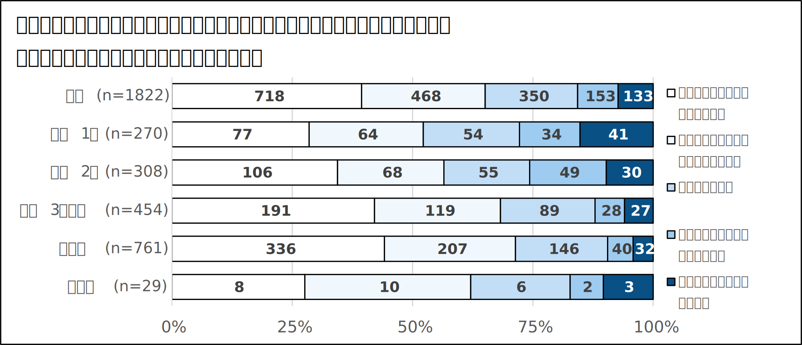

  
### 教員による講義中⼼の授業（少⼈数）について，どの程度オンライン授業にしてほしいですか？  
全体として見るとオンラインを希望する意見と対面を希望する意見が37%ずつで拮抗していますが，学年によって内訳に差が見られました．学年が高くなるほど，この形式についてオンラインを希望する比率が多くなっていました（学部1年⽣：21%，学部2年⽣：30%，学部3年生以上：37%，⼤学院生：71%）．なお，2020Sセメスターと比べると，学部3年生以上の区分を除き，オンライン授業を希望する比率は8~9ポイント増加していました．   
一方で，学部1年生の56%は，「なるべく対面の授業にしてほしい」，または「原則対面の授業にしてほしい」と答えていました．

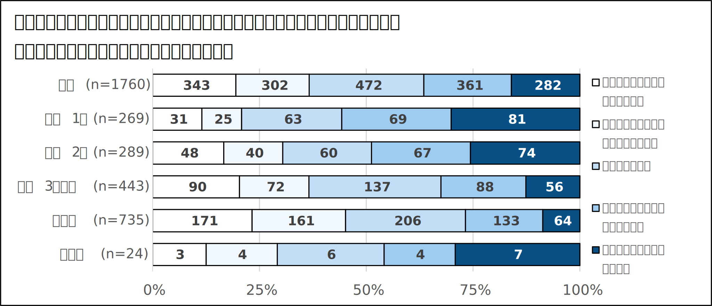

### 学生のグループワークや議論中心の授業について，どの程度オンライン授業にしてほしいですか？
対面を希望する意見が多数になりました．「確実にオンライン授業にしてほしい」「オンライン授業にしてほしい」は全体で20%（学部1年⽣：9%，学部2年⽣：14%，学部3年生以上：19%，⼤学院生：28%）でした．   
一方で， 「なるべく対面の授業にしてほしい」，または「原則対面の授業にしてほしい」という回答は，全体で58%（学部1年⽣：72%，学部2年⽣：69%，学部3年生以上：63%，⼤学院生：45%）でした．特に，学年が低いほど，対面を希望する回答が多くなっていました．

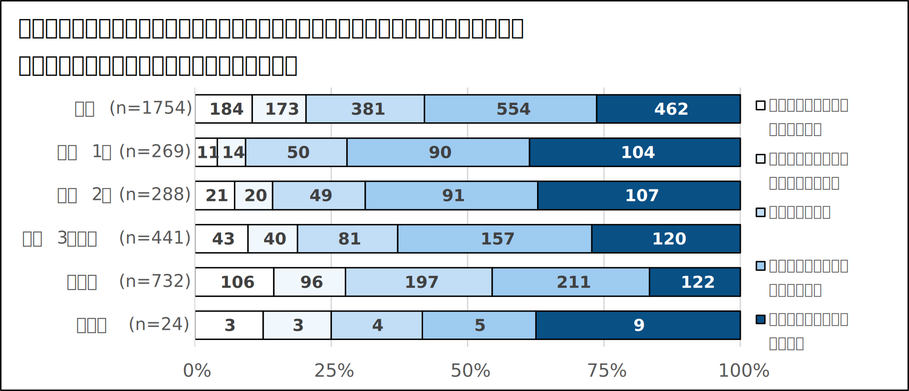

  
### 演習について，どの程度オンライン授業にしてほしいですか？
この設問でも，対面を希望する意見が多数になりました．「確実にオンライン授業にしてほしい」「オンライン授業にしてほしい」は全体で23%（学部1年⽣：27%，学部2年⽣：20%，学部3年生以上：22%，⼤学院生：24%）にとどまりました．   
一方，「なるべく対面の授業にしてほしい」，または「原則対面の授業にしてほしい」という回答は，全体で49%（学部1年⽣：47%，学部2年⽣：56%，学部3年生以上：51%，⼤学院生：46%）でした．

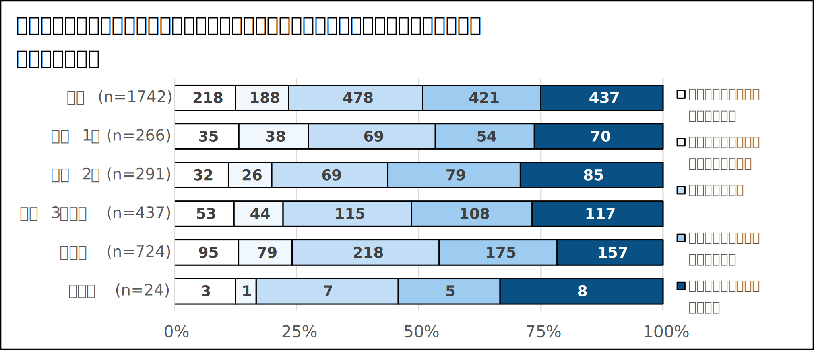

### 実験について，どの程度オンライン授業にしてほしいですか？
この設問では，対面を希望する意見にかなり偏りました．「確実にオンライン授業にしてほしい」「オンライン授業にしてほしい」は全体で9%（学部1年⽣：6%，学部2年⽣：8%，学部3年生以上：8%，⼤学院生：12%）でした．     
一方，「なるべく対面の授業にしてほしい」，または「原則対面の授業にしてほしい」という回答は，全体で70%（学部1年⽣：77%，学部2年⽣：76%，学部3年生以上：74%，⼤学院生：62%）でした．   

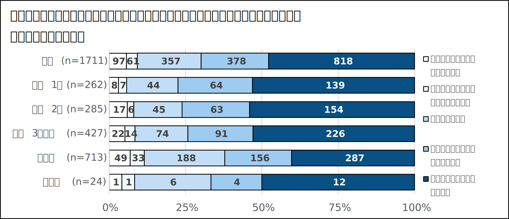

## オンライン授業が心理面に与える影響に関する質問
ここでは，「オンライン授業」により不安・苦痛を感じる，という意見が多い5項目について，「2020Sセメスターを振り返ってどうだったか」，と「2020Aセメスターを振り返ってどうだったか」を比較して回答してもらいました（回答時期は，いずれも2020Aセメスタ後であることに留意してください）．    
各項目について，2020Sセメスターについて上部に，2020Aセメスターについて下部に結果を示します．
### 心理面の印象：友達との交流が少なくなることについて，不安・苦痛をどれだけ感じていたかについて教えてください．
回答者の全区分に対して，「（不安や苦痛を）かなり感じていた」・「深刻に感じていた」という比率は，Sセメスターで53%，Aセメスターで51%でした．一方，学部1年生については変化が大きく，Sセメスターでは「（不安や苦痛を）かなり感じていた」，「深刻に感じていた」という回答が72%であったのが，Aセメスターでは54%に減少しました．   

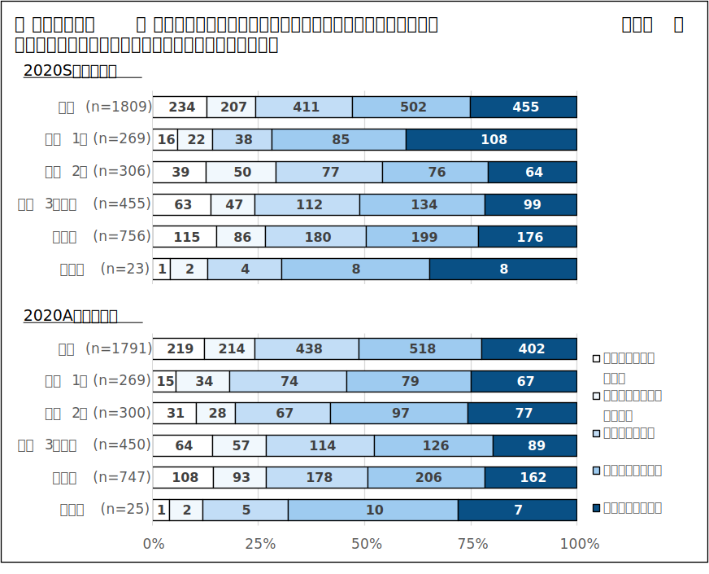

### 心理面の印象：先生との交流が少なくなることの不安・苦痛をどれだけ感じていたかについて教えてください．
回答者の全区分に対して，「（不安や苦痛を）かなり感じていた」・「深刻に感じていた」という比率は，Sセメスターで35%，Aセメスターで36%でした．多くの区分でSセメスター・Aセメスターでの変化はありませんでしたが，学部2年生については，Aセメスターになって，6ポイント，不安や苦痛を感じた人が増えていました．これは，学科所属の影響が大きいものと考えられます．   
不安や苦痛を感じると答えた学生が多かった区分は，学部1年生と大学院生で，ともに40%程度でした．

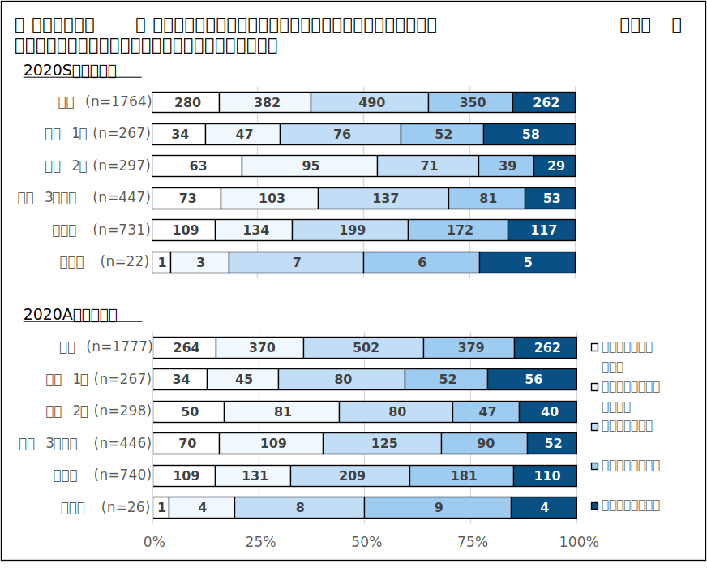

### 心理面の印象：課外活動が出来ないことの不安・苦痛をどれだけ感じていたかについて教えてください．
回答者の全区分に対して，「（不安や苦痛を）かなり感じていた」・「深刻に感じていた」という比率は，Sセメスターで47%，Aセメスターで43%でした．学部生で大きく値が変化しており，「（不安や苦痛を）かなり感じていた」・「深刻に感じていた」という比率は，2020AセメスターではSセメスターに対し，学部1年生で8ポイント，学部2年生で5ポイント，学部3年生以上で4ポイント，減少していました．

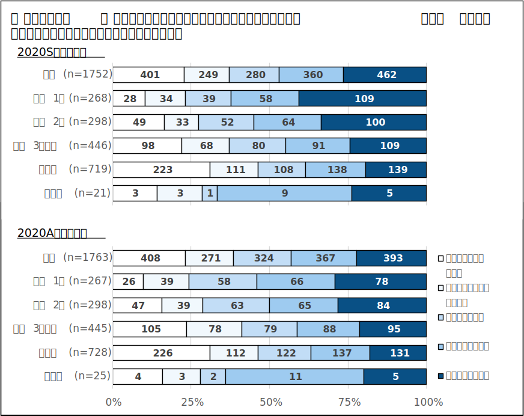

### 心理面の印象：課題が重いことへの不安・苦痛をどれだけ感じていたかについて教えてください．
回答者の全区分に対して，「（不安や苦痛を）かなり感じていた」，「深刻に感じていた」という比率は，Sセメスターで31%，Aセメスターで26%でした．特に，学部1年生について大きな変化があり，Sセメスターでは「（不安や苦痛を）かなり感じていた」，「深刻に感じていた」という回答が67%あったのが，Aセメスターでは49%に減りました．同様に，学部3年生以上でも，7ポイント減少していました．一方，学部2年生では，6ポイント増加していました．   

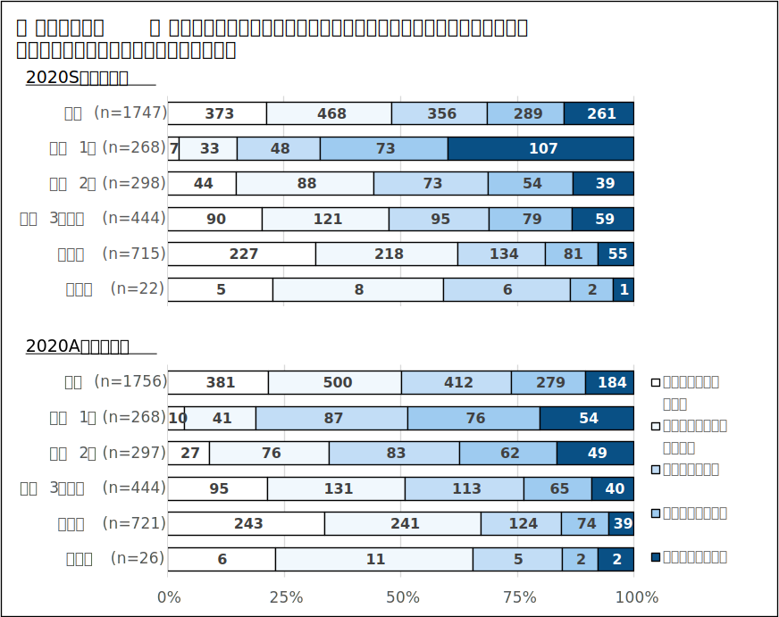

### 心理面の印象：授業についていけていないのではないかという不安・苦痛をどれだけ感じていたかについて教えてください．
回答者の全体について，「（不安や苦痛を）かなり感じていた」，「深刻に感じていた」という比率は，Sセメスターで22%程度，Aセメスターで21%程度でした．しかし，区分ごとに変化に差があり，学部1年生では，「（不安や苦痛を）かなり感じていた」・「深刻に感じていた」という比率は11ポイント減少した一方，学部2年生では18ポイント増加していました．

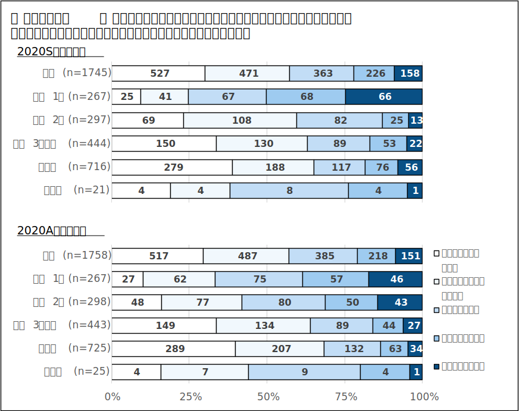
