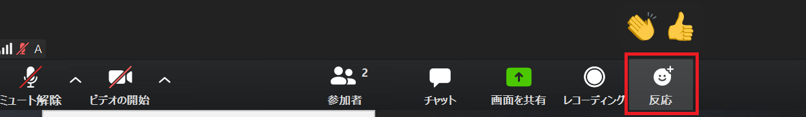
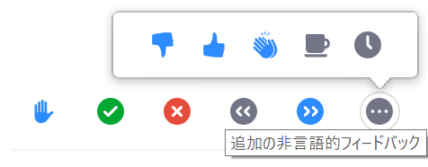
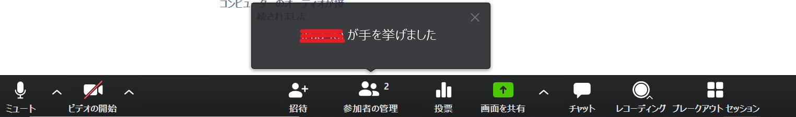
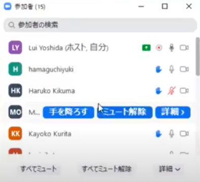
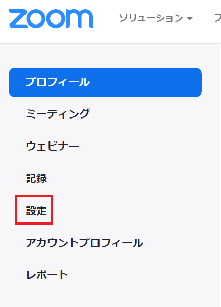
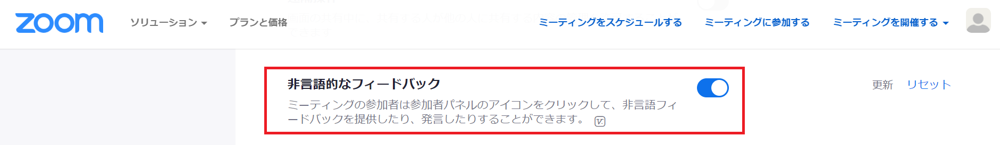

## 参加者向け

Zoomでは，参加者は，「リアクション」の機能を用いることで，実際に手を挙げたり声を出したりすることなく，主催者に対して合図を送ることができます．

### 手の挙げ方，降ろし方

1. 画面下に表示されるメニューの［リアクション］を押します.
2. リストの下にある［手を挙げる］を押します.
3. 手を降ろす場合は，［リアクション］の中にある［手を降ろす］を押します.

ショートカットキーを利用して手を挙げたり降ろしたりすることもできます.  
* Windows: Alt+Y
* Mac: オプション+Y

### リアクションの使い方

画面下に表示されるメニューの［リアクション］を選択すると,「拍手」や「賛成」のサインを送ることができます. 
これらの反応は10秒後に自動的に消えます．

### 「非言語フィードバック」機能の使い方（オプショナル）
主催者が「非言語フィードバック」機能を有効にしている場合, 参加者はさまざまなサイン（非言語フィードバック）を送ることができます. 非言語フィードバックは, 「手を挙げる」と同様, 「リアクション」ボタンから送ることができます. 非言語フィードバックは主催者の指示にもとづいて使用するようにしてください.

## 主催者向け

オンライン授業では学生の反応が分かりづらく，双方向的なやり取りが難しいですが，「手を挙げる」や「反応」の機能を効果的に用いることで，質問や発言を活性化させ，臨場感のある授業を行うことができます．

### 「手を挙げる」機能
「手を挙げる」機能を用いることで，参加者は，実際に手を挙げたり声を出したりすることなく，主催者に対して合図を送ることができます．手を挙げた人や順番を容易に特定できる，参加者がカメラやマイクをオフにした状態であっても合図を送ることができる，などのメリットがあります．

### 手を挙げる機能の有効な使い方
手を挙げる機能には，たとえば次のような使い方があります。
* 授業の開始時に「質問がある人は手を挙げる機能を用いて合図してください」と確認しておくと，学生は質問をしやすくなります．
* 授業中に課題を課す場合，「課題が終わった人は手を挙げる機能を用いて知らせてください」と伝えておくと，課題の進捗を容易に確認することができます．
* 教員から学生に質問を行う際，少人数の授業で，かつ質問が簡単な場合には，投票機能の代わりに手を挙げる機能を用いることができます（「Yesだと思う人は手を挙げる機能を用いて手を挙げてください／Noだと思う人は手を挙げる機能を用いて手を挙げてください」など）．  

投票機能を用いて質問をする場合には事前に質問と選択肢を入力しておく必要があるのに対して，手を挙げる機能を用いて質問を行う場合にはそのような必要はないため，準備の手間がかからない，リアルタイムで質問を行うことができる，などのメリットがあります．他方，大人数の授業の場合や，質問が簡単でない場合には、投票機能を用いることが推奨されます。

### 挙げた手の確認方法
* 通知によって確認する場合
画面に参加者のリストが表示されていない状態で参加者が手を挙げると，画面下の「参加者の管理」の上に「◯◯が手を挙げました」と通知されます．画面に参加者リストが表示されている場合，通知は行われません．

* 参加者のリストから確認する場合
画面下に表示されるメニューの［参加者の管理］を押すと，参加者のリストが表示され，誰が手を挙げているかを確認することができます．手を挙げている人の横には手のマークが表示されます．

  参加者は次の順序で表示されます．
  1. 発言を許可された参加者．
  2. 手を挙げている参加者．手を挙げた順に上から表示されます．
  3. 手を挙げていない参加者．

  手のマークのあたりにカーソルを合わせると，青いメニューボタンが表示されます．
  * ［手を降ろす］ボタンを押すと，手を降ろすことができます．
  * ［ミュート解除］ボタンを押すと，参加者には，ミュートを解除するかミュートのままにするかを確認するメッセージが表示されます．
  * 参加者リストの下部にある「詳細」から［すべての手を降ろす］をクリックすると，挙がっている手をすべて降ろすことができます．

これらの機能は共同ホスト（TAなど）も用いることができます．

### 「反応」機能
画面下に表示されるメニューの［反応］を選択すると，「拍手」や「賛成」のリアクションを送ることができます．学生の発表が終わった後などにこれらのリアクションを行うようにすれば，臨場感が出ます．

拍手や賛成の反応は10秒後に自動的に消えます．

### 「非言語フィードバック」機能（オプショナル）
主催者が「非言語フィードバック」機能を有効にすると，参加者は「手を挙げる」以外にも，次のようなさまざまなサイン（非言語フィードバック）を送ることができるようになります．

### 非言語フィードバック機能を有効にする方法
1. Zoom ウェブポータルにサインインし，［マイアカウント］をクリックし，［設定］（[https://zoom.us/profile/setting](https://zoom.us/profile/setting)）をクリックします．

2. ［非言語フィードバック］を有効にします．

