## Highlights
{:#highlight}

* This article introduces how to write on GoodNotes 5 as a digital whiteboard.
* GoodNotes 5 can be used in the following situations:
  * Notetaking inWriting during real-time classes
  * Conducting classes while writing on the materials (PDF, PowerPoint, Word, etc.) prepared in advance.
  * Correcting assignments submitted by students
* However, GoodNotes 5 does not support Windows OS (the app is only available for iPhone, iPad, and Mac).

## Basic Information
{:#basic_info}

GoodNotes 5 is a note-taking/drawing application that allows you to annotate imported slides and documents (PDF, Power Point, Word, etc.) with your handwriting. By using it in combination with Zoom, you can conduct lectures while handwriting on the board.

GoodNotes 5 can be used on an iPad, iPhone, or Mac, but we recommend using it on an iPad when writing on the board. The small screen size of an iPhone makes it difficult to write detailed notes on the board, even with a stylus. Likewise, it is possible to write on the board with a Mac with a separately purchased graphic tablet, but it is not possible to write by  directly touching the screen like on an iPad.

You can purchase this app from [App Store](https://apps.apple.com/app/goodnotes-5/id1444383602#?platform=ipad).

This article provides information on how to use GoodNotes 5 on iPads using Apple Pencil (sold separately).

Note: Apple Pencil is the genuine Apple stylus and is only compatible with iPad. As of November 2021, Apple Pencil is not compatible with iPhone or Mac.

* Source
  * Time Base Technology Limited
  * Official Site　[https://www.goodnotes.com/](https://www.goodnotes.com/)
* Available environment
  * Device and OS 
    * iPad：iPadOS 12.0 and later
    * iPhone or iPod touch：iOS 12.0 and later
    * Mac：MacOS 10.15 and later
    * the app is incompatible with Windows OS
  * Required or optional accessories
    * Apple Pencil is strongly recommended, although not required.
    * For online classes, a video conferencing tool such as Zoom is required.
* Operational Cost (as of September 2021)
  * Cost
    * Purchase GoodNotes 5 application with 980 yen.

    * Using either of the following styluses is recommended for iPads.
      * Apple Pencil (1st generation) 10,800 yen (tax excluded)
Apple Pencil (2nd generation) 14,500 yen (tax excluded)
      * Apple Pencil (2nd generation) 14,500 yen (tax excluded)
    * (Not recommended) If you are using an iPhone, you can use a touch pen (about 100 yen to 5,000 yen), and if you are using a Mac, you can use a pen tablet (about 5,000 to 20,000 yen).
* What students have to prepare for the class
  * None

## Basic usage
{:#tools}

For information about basic operation, see [GoodNotes 5 official website](https://support.goodnotes.com/hc/en-us/articles/360000690095-Getting-started-with-GoodNotes-5) (only available in English, simplified Chinese, traditional Chinese).

Below is a brief description of how to use the basic tools.

### Pen tool  

The Pen tool is the most basic handwriting tool on the page. You can choose from three pen options: fountain pen, ball pen and brush pen.

The handwriting of each pen is as shown in the images below.

As shown in the image below, you can change the pen color and pen thickness.

### Eraser

The Eraser lets you erase text or lines drawn by the pen tool or the highlighter(described below).

By double-tapping the Eraser icon, an option menu will appear as shown in the image below. If you enable the options, it allows you to erase the entire stroke or only erase the highlighting.

### Highlighter
  
With the Highlighter, you can draw over and emphasize original drawings or PDF text. The line will show through the drawing or text.

By double-tapping the Highlighter icon, an option menu with the option “Draw in Straight Line” will appear as shown in the image below. If it is enabled, lines you draw will be straightened automatically even if it is slightly blurred.

As with the Pen tool, you can change the color and the thickness of the Highlighter, as shown in the images below.

### Shape tool

Shape tool allows you to draw geometric shapes on the page.

When the tool is used to draw an eclipse, circle, rectangle, triangle, etc. It will automatically correct the shape to a close match, as shown in the image below.

### Lasso tool

This tool allows you to select and move drawn text and graphics, as well as to resize them.

(Example) The image below shows the lasso tool moving an ellipse created with the Shape tool. The lasso tool is selecting the ellipse by circling it.

### Image tool

This tool allows you to select and insert images on the page, which can be selected from "Photos" or "Files" on your iPad.

### Camera tool

The Camera tool allows you to insert photos from the camera directly onto the page.

### Text tool

The Text tool allows you to insert text using the keyboard.
   
As shown in the image below, you can change the word font/size, paragraph, text color, and text box style.

### Pointer tool 

The Pointer tool displays a pointer at the touched position.

Two types of pointers are available: one is a pointer that follows the touch operation, while the other displays a trail that remains after the touch operation until the Apple Pencil is released from the screen.

↓the pointer that follows the touch operation

↓the pointer that displays a trail remaining after the touch operation, until the Apple Pencil is released from the screen

## How to use in class
{:#in_class}

### Preparation
#### Preparing as a whiteboard

By writing on a blank page in real time, GoodNotes 5 can reproduce the writing on a whiteboard or blackboard in a face-to-face class.

The following section explains how to create a new notebook.

1. Open GoodNotes 5 and select "Documents" at the bottom of the screen.
2. Navigate to the folder where you want to create a new notebook, and tap “New…”. 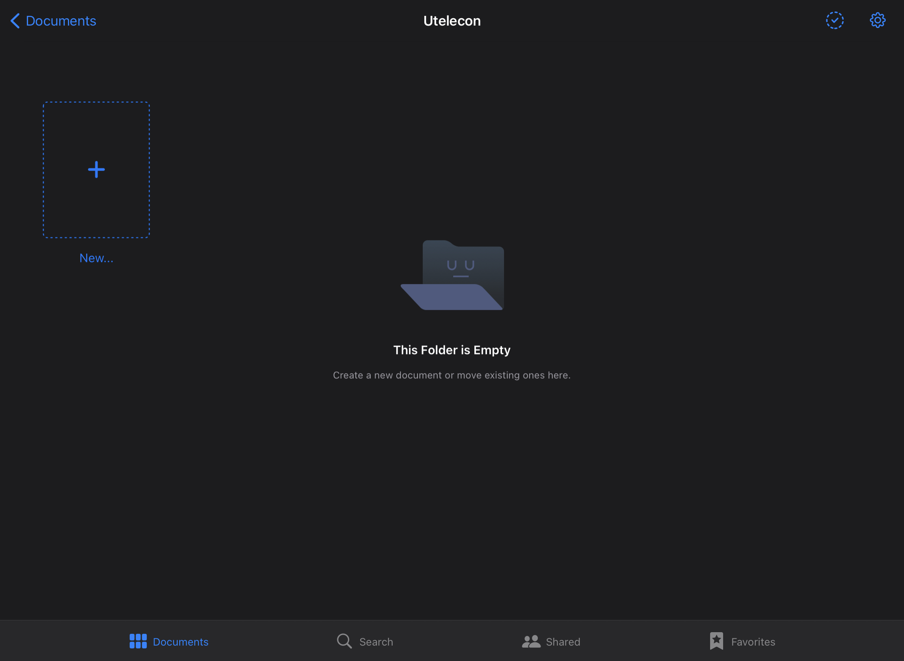
3. Tap "Notebook" from the menu that appears. 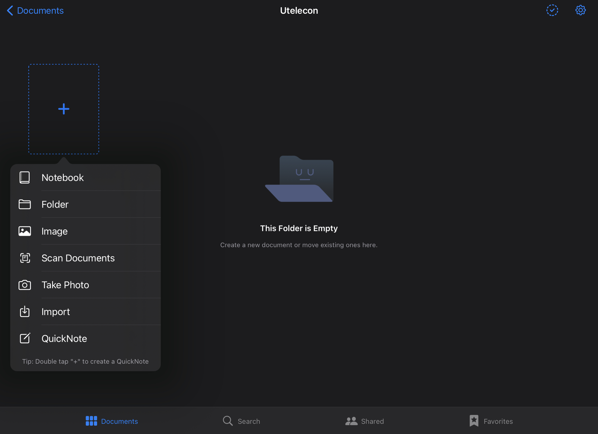
4. Select whether or not you want a cover, and choose the paper size, color, layout, and borderline type, etc.. Tap "Create" when you are done. 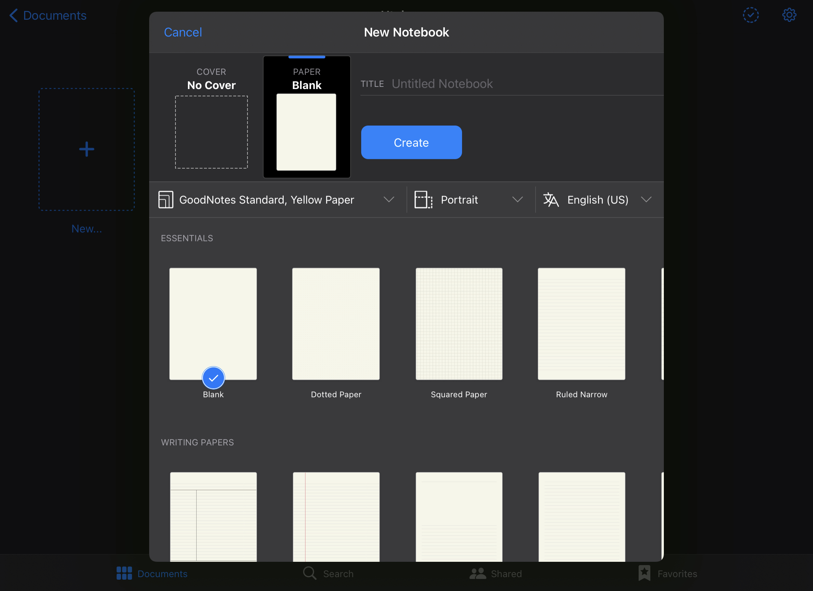
5. A blank notebook will be created.

#### Importing pre-prepared PowerPoint or PDF files

In GoodNotes 5, you can import PowerPoint, Word, PDF, and various image files, and write on them.

The following section explains how to import files saved on Google Drive into GoodNotes5.

1. Save the file you want to import into GoodNotes 5 to your Google Drive. For instructions, see “[Basic usage of Google Drive](/articles/google-drive/)”.
2. Open Google Drive on your iPad.
   * You can install Google Drive from [App Store](https://apps.apple.com/jp/app/google-%E3%83%89%E3%83%A9%E3%82%A4%E3%83%96-%E5%AE%89%E5%85%A8%E3%81%AA%E3%82%AA%E3%83%B3%E3%83%A9%E3%82%A4%E3%83%B3-%E3%82%B9%E3%83%88%E3%83%AC%E3%83%BC%E3%82%B8/id507874739).
3. Navigate to the folder that contains the file you want to open in Google Drive (PDF, Power Point, or Word file), and tap the "..." button next to the file name of the file. 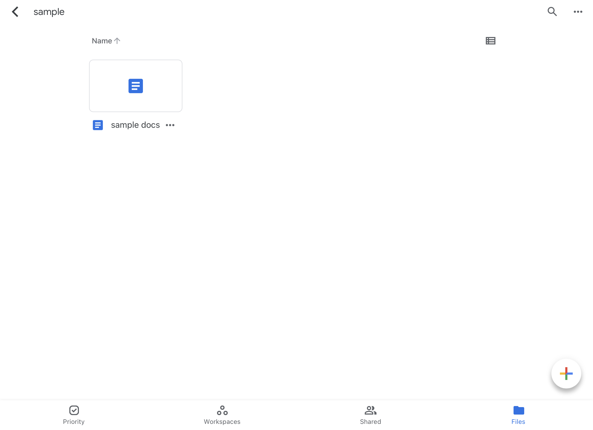
4. Tap "Open in" from the menu that appears．
5. The message "Preparing to export" will be displayed. Wait until the download is ready. 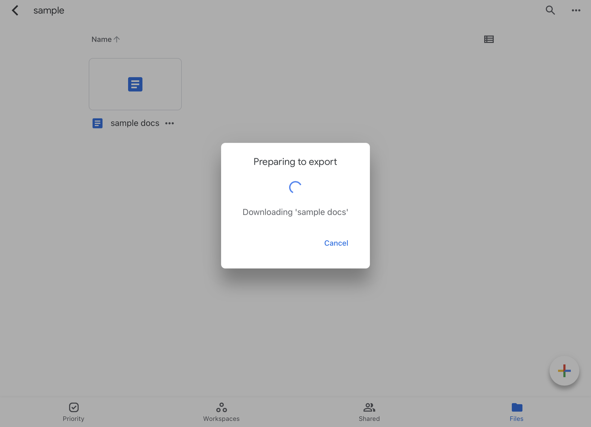
6. Tap “Open in GoodNotes” from the menu that appears. 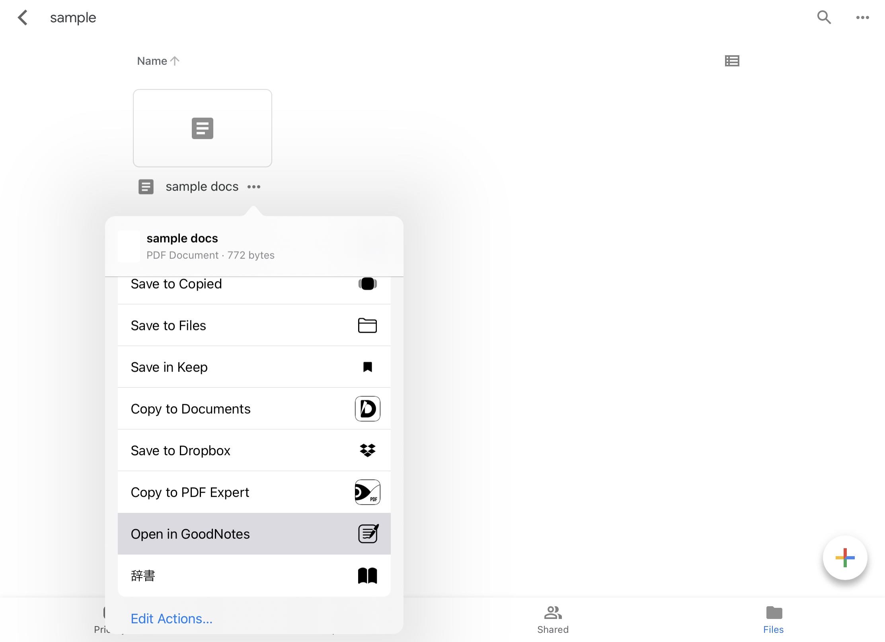
7. A confirmation screen will appear asking, "Do you want to open this file in GoodNotes?" Tap "Open". 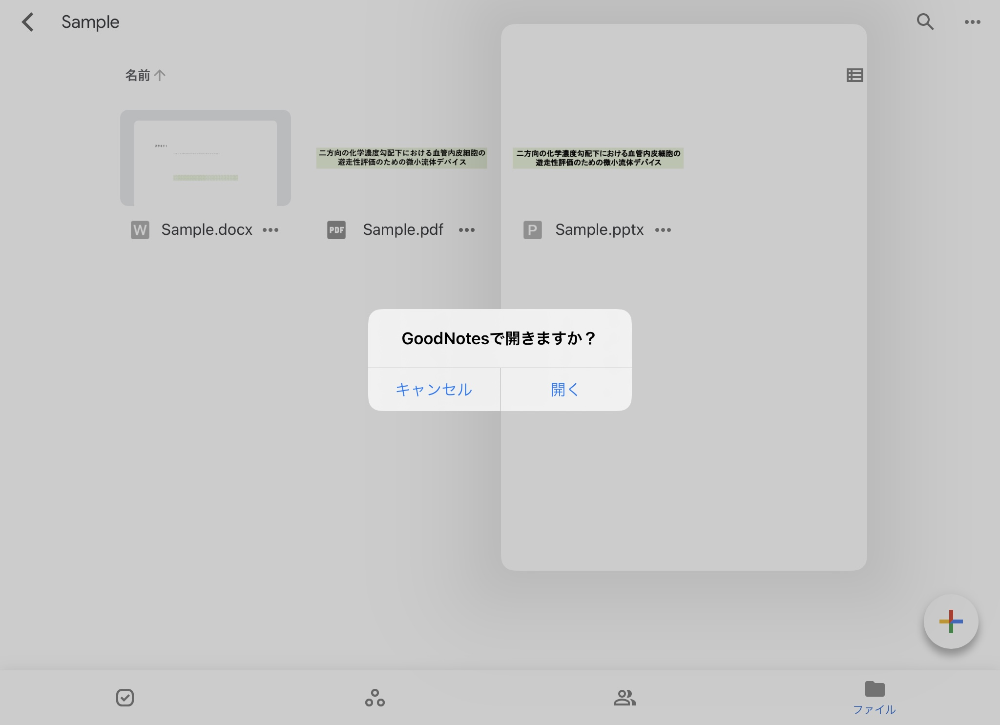
8. GoodNotes 5 will open automatically with the screen "Import to GoodNotes" appearing. Select the location where you want to save the file in GoodNotes 5, and tap “Import as New Document".

(Note) If you have opened another file in GoodNotes 5, you will see the option "Import into Current Document" in addition to "Import as New Document''. If you want to combine the document currently opened in GoodNotes 5 with a premade document, select "Import into Current Document".

### Screen Sharing
{:#with_zoom}

The simplest way to share the handwriting with students in real time is to share the GoodNotes 5 screen with Zoom.

For general information on how to use Zoom, please refer to "[Zoom](/en/zoom/)".

1. Join the Zoom meeting with your iPad. Tap “Share Content” from the menu bar and select ”Screen”. 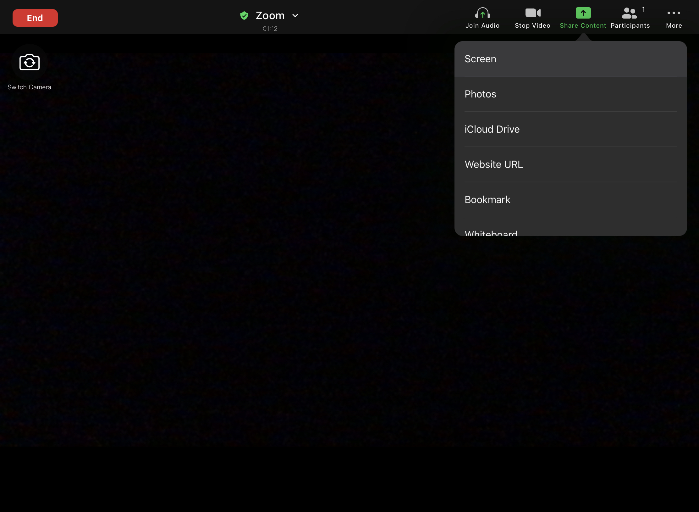
2. Tap “Start BroadCast”. 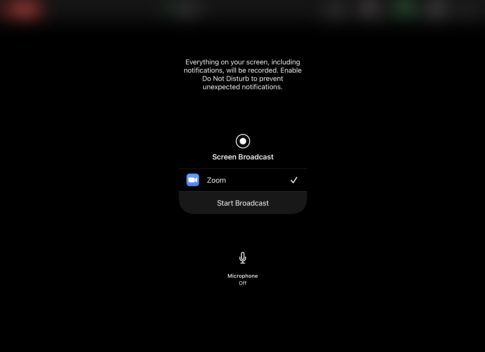
3. The message “You are sharing your screen” will be displayed. 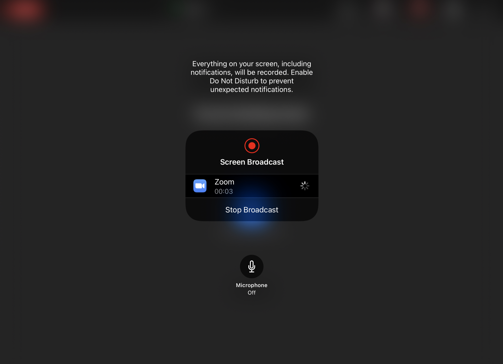
4. When you switch the application from Zoom to GoodNotes 5, the screen of GoodNotes 5 will be shared. A red mark will appear in the upper right corner of the screen while the screen is being shared. 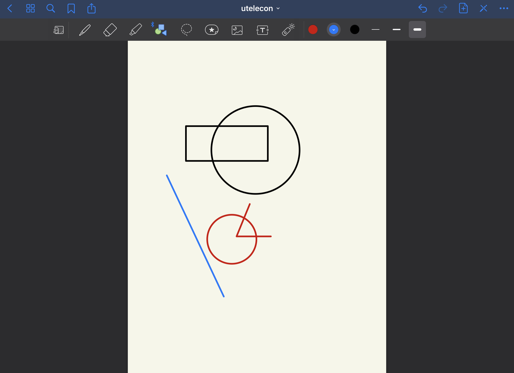

Although not described in detail in this article, it is also possible to share the iPad screen from a Mac or Windows PC by using a method such as screen sharing using "AirPlay (or its screen mirroring software)".

### Writing 

After preparation and sharing the screen, you can now conduct the class.

You can write on Goodnotes using the tools introduced so far.

The following video shows a demonstration of real-time writing during a class, where the shared screen projects  the teacher’s handwriting with GoodNotes 5 onto students’ iPad screens. See how the Highlighter, Pen tool, Eraser tool, and Text tool are used.

## Examples of good practices and application (Japanese Only)
{:#advanced}

* [Professor Tadashi Shiraishi: Law I](/good-practice/interview/shiraishi)
  * Professor Shiraishi's class was a large class with about 400 students. He used GoodNotes 5 for handwriting during the lecture. After the lecture, images of the handwriting were uploaded to Scrapbox.
* [Professor Norikazu Saito: Numerical Mathmatics I・Computational Mathmatics ](/good-practice/interview/saito)
  * Professor Saito's class was a medium-sized lecture with about 70 students. He used GoodNotes 5 for handwriting during the lecture, and shared the images of the handwriting as PDF files with the students after the lecture.

The following are some of the tips shared by the professors.

### Tips: Converting the handwriting in GoodNotes 5 into documents

By exporting the notes to PDF or image files (.jpeg), you can share the notes with your students as a review material after the class. The following is a description of the procedure for creating a document.

1. Tap "Share and Export", and then tap "Export All" or "Export This Page". If you select "Export All", all pages will be documented. If you select "Export This page", you can export only the page you are viewing as a document.
2. Select the file format you want to export from among PDF, image (.jpeg), and GoodNotes files. Enter a file name in the "FILENAME" field, and tap "Export".
3. Tap the application you want to open the exported file. You can save the exported file to Google Drive, or send it as an attachment via Slack or email. In this article, we will show you how to save the file to Google Drive.
4. Select the destination folder in Google Drive, and tap "Save here".
5. Tap “Upload”.
