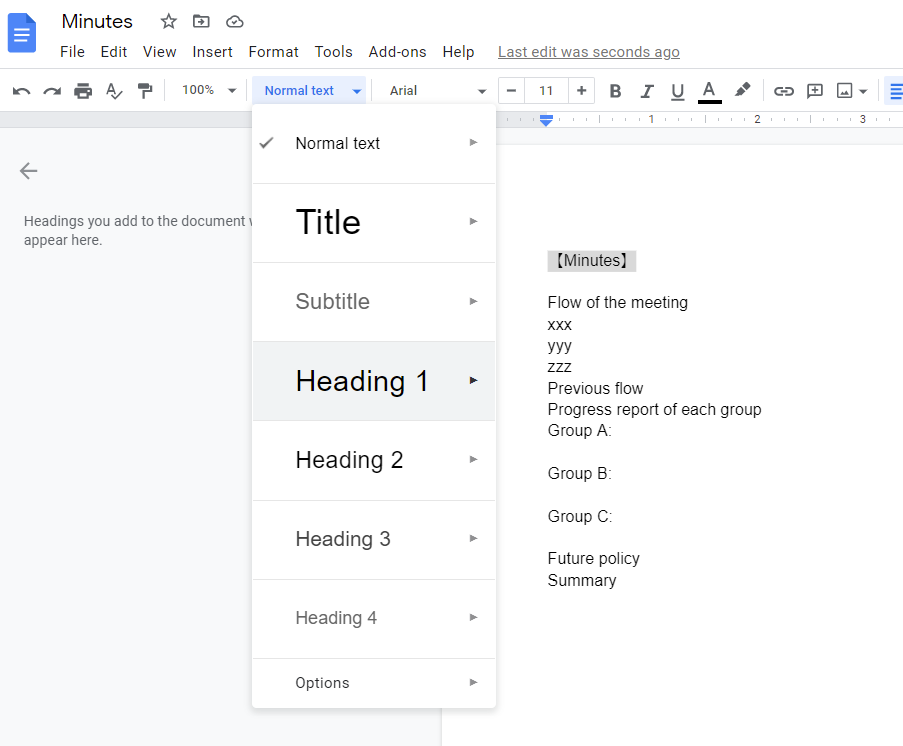
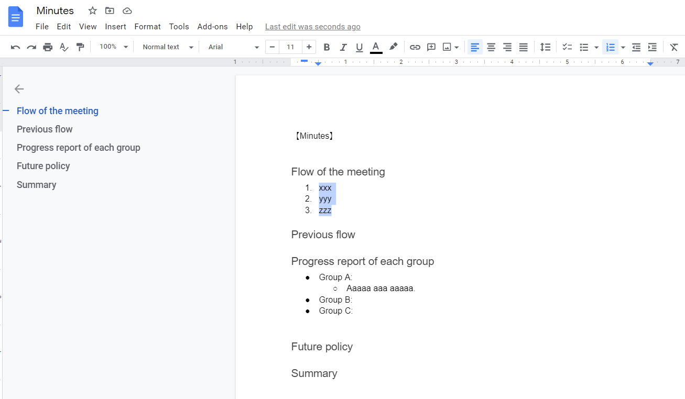
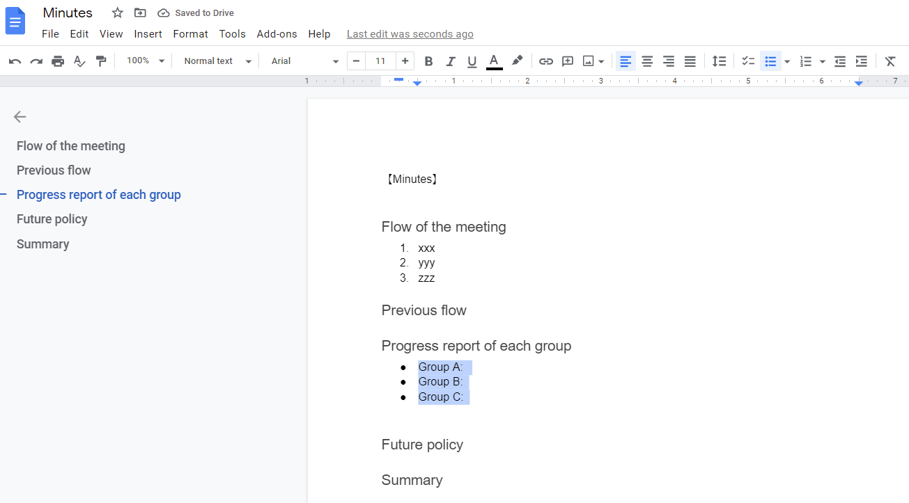
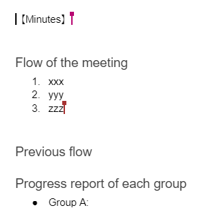
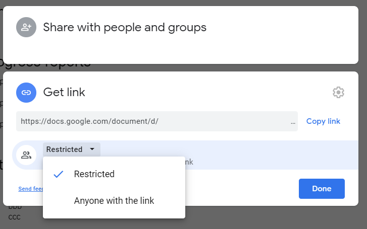
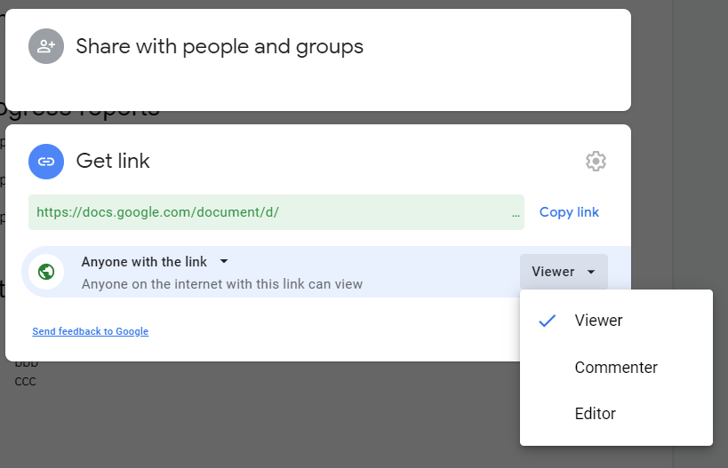

## Highlights of this Article
This article introduces the basic use of Google Docs.

## Applicable situations:
- (Faculty member) To take minutes of seminar-style classes.
- (Student) To take minutes of study groups and club activities.
- (Student) To edit text.

## What is Google Docs?
Google Docs is a software that enables you to create and edit documents online. Since it saves text in the cloud, multiple people can collaborate on editing work.

## Specifications
- Provider: Google LLC
- Available Environment:
    - Device/OS: PC, tablet, and smartphone
    - For more information about supported OS and browser versions, please refer to [here (Google Drive official help page)](https://support.google.com/drive/answer/2375082?co=GENIE.Platform%3DDesktop&hl=en&oco=1).
- Operational Cost
    - Cost: Free (There is usually a fee to add storage. However, the ECCS Cloud Email account offers unlimited capacity.)

## How to Install
To create and share Google Docs documents, you need a Google account. (For more information on how to create a Google account, please refer to the [official Google account help page](https://support.google.com/accounts/answer/27441?hl=en).

If you are a UTokyo member, we recommend that you sign in with your ECCS Cloud Email account, which grants you unlimited storage and functions such as restricted sharing among UTokyo account holders. For more information on how to use ECCS Cloud Email, please check "[ECCS Cloud Email (Google Workspace)](/en/eccs_cloud_email)".

You can use the visitor function to view and edit documents shared by others, even if you do not have a Google account.

### Using Google Docs on a Smartphone
To edit Google Docs documents on your smartphone, you need to download the application. (To browse only, you can open it with a browser.)  
Please install the Google Docs application.

### Using Google Docs on a PC
If you use Google Docs on your PC, you can create a document using a web browser.
Open the [Google Docs Home Page](https://docs.google.com/document/).

## How to Create a Document
## Using a Smartphone

Open the Google Docs application on your device.
Tap the New icon in the bottom right corner. Tap [Choose template].  
Tap the template you want to use.

### Using a PC
Open [Google Docs Home Page](https://docs.google.com/document/). A new document can be created by selecting a template in the “Start a new document” section at the top of the page.

## How to Use
Write your content in the same way as on document editors such as Microsoft Word.  
  

### Setting Headings
Setting captions enables you to unify the appearance of headings and construct your document hierarchically.  
Select the part you want to mark as heading, and click on "Normal Text".  
You will see the following options. Choose the appropriate heading and set the heading.  

 
  
In the above example, "[Minutes]" is set to "Heading 2", and "Flow of the meeting", "Previous flow", "Progress report of each group", "Future policy", and "Summary" as "Heading 3" respectively.  
You can also use the shortcut keys "Ctrl+Alt+(1-6)" on Windows and "⌘+option+(1-6)" on Mac to create headings.

### Setting Lists
#### Numbered List
Select the area you want to number and choose "Numbered list" from the menu.  
Alternatively, you can use the shortcut “Ctrl+Shift+7” on Windows or “⌘+Shift+7” on Mac to set up a numbered list.  

#### Bulleted List
Select the area you want to bullet and select "Bulleted list" from the menu.  
Alternatively, you can use the shortcut keys “Ctrl+Shift+8” on Windows or” ⌘+Shift+8” on Mac to set the bulleted list.  
  
To add a deeper level of bullets, press the Enter key to add a bullet, then press the Tab key.  
To add a bullet with a shallower level of detail, press the Shift key and the Tab key.  
  

### Sharing Your Document
You can share your Google Docs document to collaborate with others.  
  

When you share a document and edit it at the same time, the other users’ cursors appear in different colors so that you can see who is editing where.

You can also grant different permissions (editor, viewer and commenter) for users you are sharing with.  
We will introduce how to share documents and grant permissions. There are two types of sharing methods: "Share with people and groups" and "Get link".

#### Share With People and Groups
Click "Share" in the upper right corner of the screen.  
  
In the "Share with people and groups" field, enter the email addresses or registered names of users you want to share with, and click "Done".  

Select whether or not you want to send a notification email to users you shared the document with. 
You can also select the type of editing permission you give to each user (either "Viewer", who cannot edit the document, or "Commenter", who can only comment, or "Editor", who can edit everything).  

One "Editor" has been added. The editing permission of an added user can be changed at any time. You can also make a user an owner or remove a user.

#### Get Link
You can share a document by sharing a link to access the document.  
  
Under “Get link”, select the range of users to be granted access (either "Restricted", which grants access only to added users, or "東京大学ECCSクラウドメール” (University of Tokyo ECCS Cloud Email), which grants access to users of UTokyo’s ECCS Cloud Email, and "Anyone with link", which grants access to all users you share the link with).  
  
Select the type of editing permission to be granted for users who the link is shared with.  
