## Highlights 

* This article is about how to write on OneNote.
* The main uses of OneNote are:
    * Real-time writing in class (as digital whiteboard and notes)
    * Reading and writing on PDFs and PowerPoint documents that have been prepared separately
    * Creating class materials and board pages in advance
    
## Explanation of the Application
OneNote is one of the applications provided by Microsoft, and it is equipped with the function of a digital notebook. It can be used in class for real-time writing on the board, and for handwriting on imported slides and documents such as PDF, PowerPoint, Word and other supported formats.

In this article, we will mainly introduce how to use a tablet and a stylus to write on the board and documents.  

### Specifications
* Source
    * Microsoft 
    * Official site: [Microsoft OneNote digital note application](https://www.microsoft.com/ja-jp/microsoft-365/onenote/digital-note-taking-app)
* Available environment
    * Device and OS (For details, please refer to the [Official site](https://www.microsoft.com/ja-jp/microsoft-365/microsoft-365-and-office-resources).)
        * Windows (PC, Tablet, Phone, etc.)
        * iOS (Mac, iPad, iPhone, etc.)
        * Android (Smartphone)
        * Web 
    * Required or optional accessories
        * Tablet (iPad, Surface, etc.) and a special stylus (Apple Pencil, Surface Pen, etc.) are strongly recommended, although not required.
        * For online classes, a video conferencing tool such as Zoom is required.
    * Drive space required for installation
        * Windows 10: 156.01MB
        * macOS: 481.7MB
        * iOS: 212.5MB
* Operational costs
    * Costs
        * Microsoft applications are free with a university license.
        * Tablets and stylus are available separately.
        * The following are examples of prices for Apple Pencil, Surface Pen
        * Apple Pencil (2nd generation) 15,950 yen (incl. tax)
        * Surface Slim Pen: 17,490 yen (tax included)
    * What students need to prepare for the class
        * In principle, none.
        * Depending on the sharing method, students may need to log in to Microsoft with their university account.

## How to Install

OneNote can be installed in one of the following ways.

* (For macOS) Install Microsoft365 from [Microsoft's official website](https://www.microsoft.com/en-us/microsoft-365/onenote/digital-note-taking-app)
* (For iOS, Android) Install from various download apps (Play Store, App Store, etc.)
* (For Windows) For devices with Windows 10, "OneNote for Windows 10" is initially installed.
* Also available from the [web version site](https://www.onenote.com/hrd?omkt=us-EN)

## How to Use - Basics

### About the Tools
The basic operations of OneNote can be found on the official website.
* [Basic tasks in OneNote for Windows 10](https://support.microsoft.com/en-us/office/basic-tasks-in-onenote-for-windows-10-081573f8-2e8f-45e5-bf16-0900d4d3331f)
* [Basic tasks in OneNote for Mac](https://support.microsoft.com/en-us/office/basic-tasks-in-onenote-for-mac-0206acf2-77da-42ab-a2e8-b69ae450f6a0)
* [Basic tasks in OneNote Online](https://support.microsoft.com/en-us/office/basic-tasks-in-onenote-for-the-web-80b7e897-88df-49e7-8bfe-a3467a428da0)
* [Basic tasks in OneNote for iOS (iPhone and iPad)](https://support.microsoft.com/en-us/office/basic-tasks-in-microsoft-onenote-51bcc28e-8778-4632-b702-0c61b24c9917)
* [Basic tasks in OneNote for Android](https://support.microsoft.com/en-us/office/microsoft-onenote-for-android-46b4b49d-2bef-4746-9c30-6abb5e20b688)

In the next section, we will briefly introduce the tools needed for board writing and how to use them.  

The tool images included in this article are based on the use of OneNote for iOS with an iPad. There may be some differences in the design and functions depending on the device used.  

#### Drawing on a Note

##### Pen, Highlighter

These are the most basic tools used for handwriting. The two types of handwriting tools, the pen and highlighter, can be used just like a real pen or highlighter. You can also change the colour and thickness of the pen and highlighter.  

The following images show examples of using the pen and highlighter, and how to change the colour and thickness of the pen/highlighter. 

[Using the pen and highlighter]

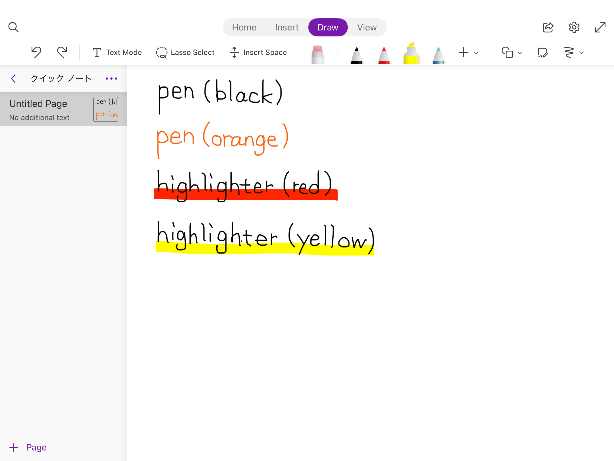

You can change the thickness and colour of the pen and highlighter by touching the pen icon.  

[How to change the colour and thickness]

  
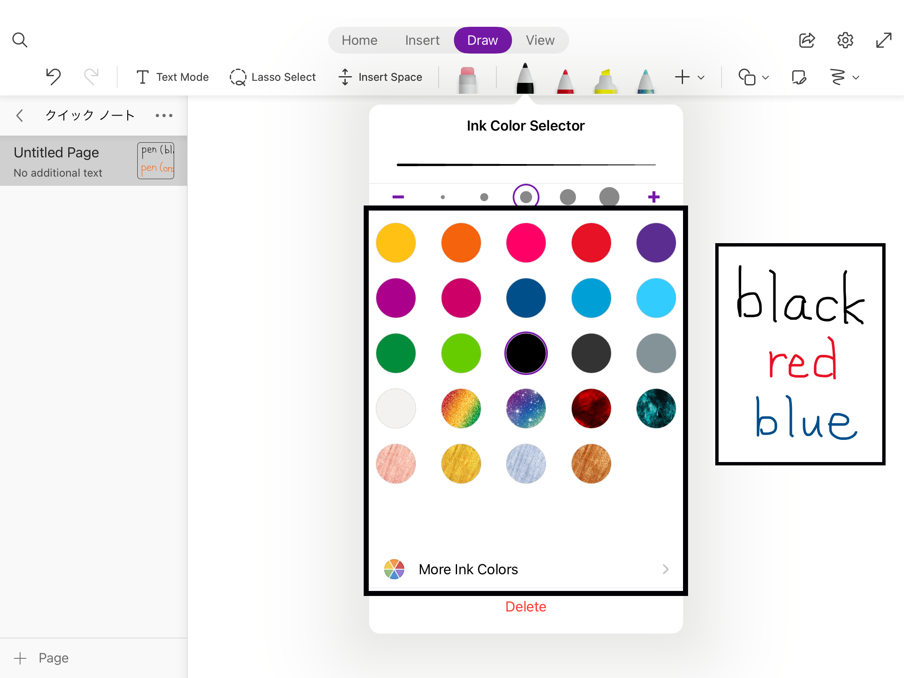

##### Eraser

You can erase text and lines drawn with a pen or highlighter. You can use this tool just like a real eraser.  

Click on the eraser icon to switch from the pen or highlighter to the eraser. By touching the eraser icon again, you can change the size of the eraser (the area to be erased). You can erase only one stroke by touching the "Stroke" icon.  

The following shows how to change the size of the eraser.  

[Changing the eraser size]  

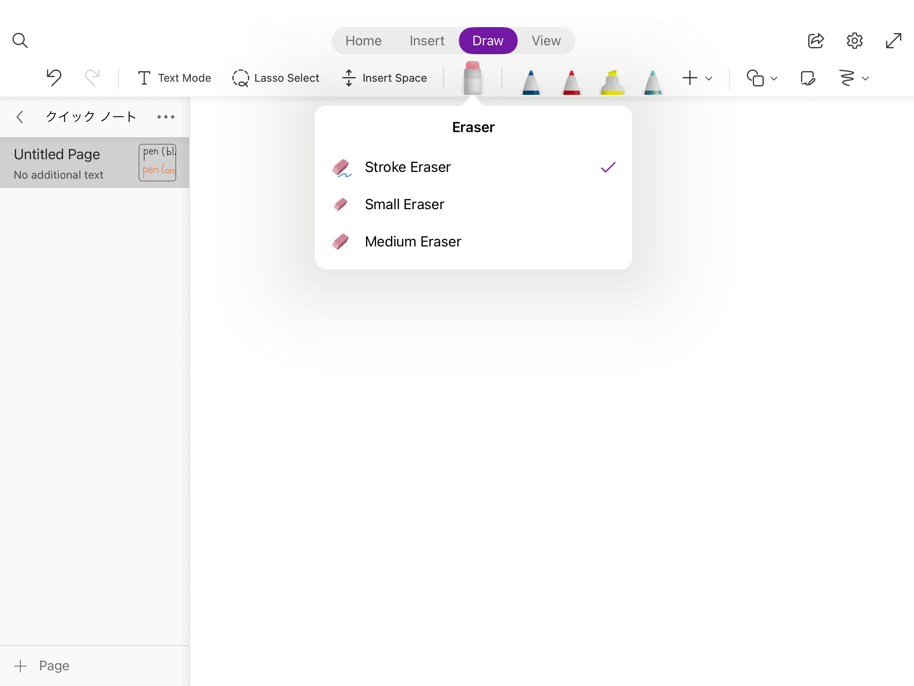

 

##### Text Mode

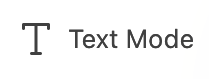

In text mode, you can select any place on the note and type text there using the keyboard. This function is similar to the text box in Word and PowerPoint, which are also Microsoft applications.  

You can change the colour, size and other settings of the text entered from the home page.  

The following shows a scene of text input and the editing screen.  

[Text input]

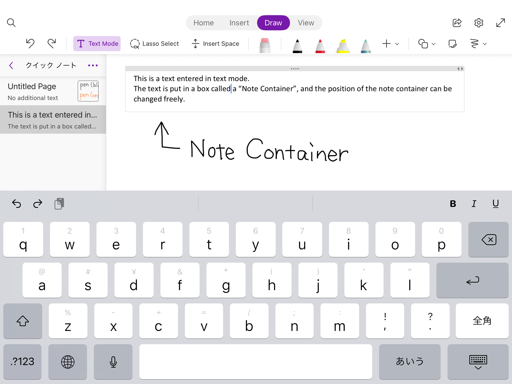

[The edit screen of the text]

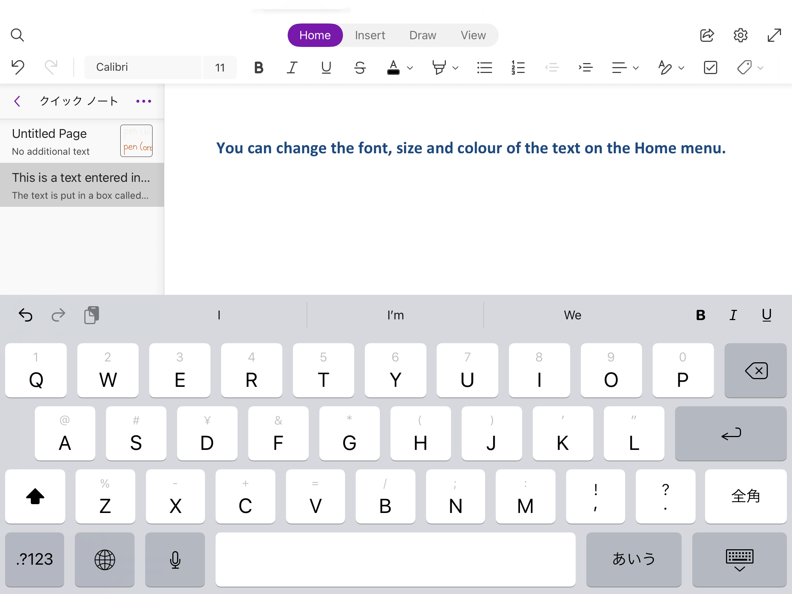

 

##### Lasso Selection

You can move, zoom in and out, and copy and paste all the text you have entered or drawn.  
These operations can only be applied to the area you want to manipulate.  
The following is an example of using the Lasso Selection.  

[How to use the Lasso Selection]

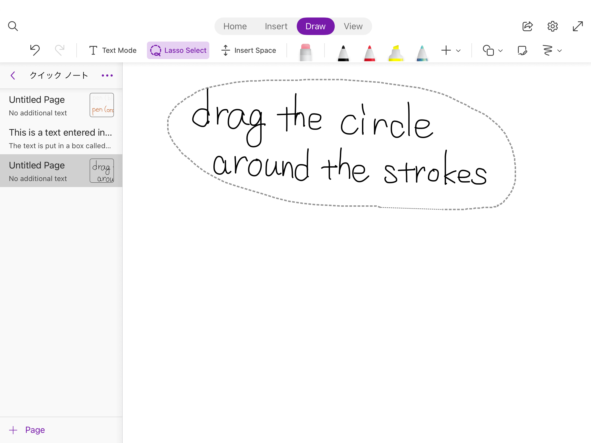
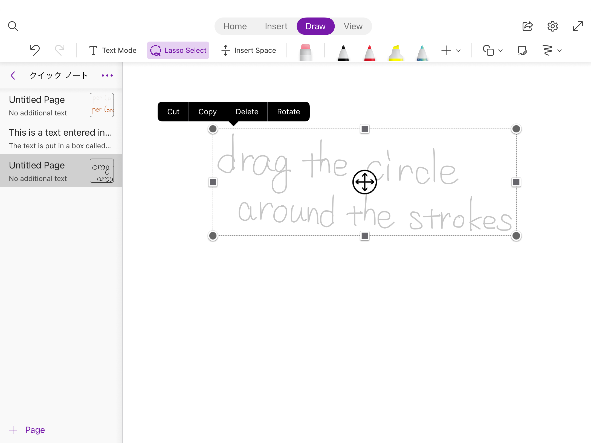

 

##### Figure

You can draw straight lines, circles and other shapes nicely by using the Shape tool in the drawing.  

You can draw straight lines, arrows, circles and others as shown in the following image. After touching the pen, touch the "Shape" button to select a shape, and you can draw the shape in the specified colour.  

[Drawing a shape using the shape tool]

If you draw a circle or a triangle with "Convert Ink to Shape" selected, it will be perfected in great shape.  

[Handwritten shape before conversion]

[Figure corrected by "Ink to Figure"]

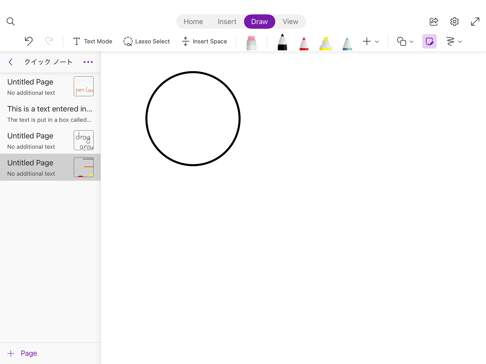

 

### Changing the Paper Design

#### Page Design

You can change the colour and style of the paper from the View tab (plain by default). If you touch the "Paper colour" or "Paper style" tabs, you can choose between different paper colours and styles.  
The following image shows how page design is changed.  

[Change paper colour]

[Change paper style]

 

#### Paper Size

Basically, OneNote does not allow page size setup (e.g. customize paper size to A3 or A4). However, as an exception, if you have the desktop version of OneNote installed, you can change the page size.   

If you wish to customize page size, installation of the desktop version from official site is required. Please note that the initially installed OneNote for Windows 10 does not support page size setting. Installation of the aforementioned desktop version is necessary to set page size.  

In the desktop version, select "Paper Size" from the View tab to set the page size and orientation.   

Please refer to the following image for how to set the page size using the desktop version on a Windows PC.  

<ol>
   <li> Select the "View" tab. 
      
   </li>
   <li> After selecting the View tab, select "Paper Size". 
      
   </li>
</ol>

### Setting up Notebook Sections and Pages

Pages are where you actually write your notes, and Notebook Sections are the categories you use to manage your pages.  

A page is the smallest unit. A section is a collection of pages, and a notebook is a collection of sections. Organizing pages in this way makes it easier to manage them.  

You can use it in any way you like. The following image provides an example.  

[Example of notebook, section and page classification]  

You can insert various images and files by selecting the desired position and choosing the "Insert" tab.  

 

#### Image

If you select "Image", you can insert an image saved on your device. You can also use "Online Images" to search images on the Internet and insert them. (Please be aware of copyright infringement.)

 

#### Files, PDF

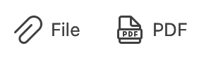

From "File", you can insert not only images and movies but also documents.  

You can also insert a PDF file by touching the "PDF" icon. The PDF file will be inserted while the file is open, so you can write on it.  

The following image shows how a file is inserted.  

[Inserting a PDF file]

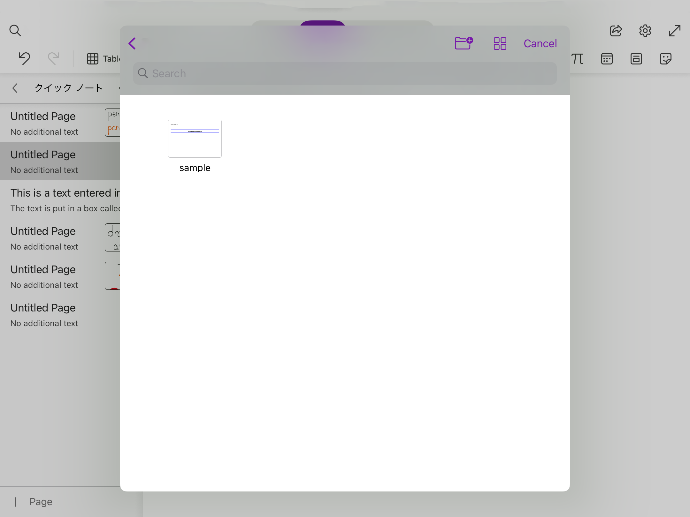  

When you select the file you want to insert, it will be inserted as shown in the above image.  

 

## How to Use in Class

### Preparation

#### Board Writing

By writing on a blank page in real time, you can reproduce the writing on a whiteboard or a blackboard in a face-to-face class on OneNote. In this case, you can basically start from the initial state. If you want to change the thickness of the pen or the style of the paper, you can do so before the class.

#### Import PowerPoint or PDF Files You Have Prepared in Advance
        
In OneNote, you can import PowerPoint or PDF files and write on them. To import files, please refer to the procedure described above. The following image shows how to write on a prepared document in class.

[An example of reading and writing on a prepared document]
<figure>
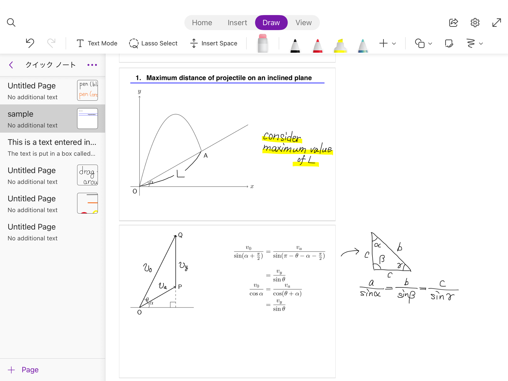
<figcaption> </figcaption>
</figure>

#### Create a OneNote Page in Advance

It is possible to create class materials in advance using OneNote. If you have a lot of notes to write on the board, you can write a rough outline before the class to reduce the burden of writing in class. It is also possible to create materials with many illustrations and diagrams by using the tools introduced so far.  

### Screen Sharing

The easiest way to share your notes with students in real time is to share your OneNote screen in Zoom.

Please refer to "[Screen Sharing](/zoom/usage/screen_sharing)" of utelecon on how to screen share via Zoom.  

The following image shows the Zoom screen sharing of OneNote.

[Zoom-based screen sharing]
<figure>

<figcaption> </figcaption>
</figure>

If you are using OneNote with an iPad, you can also use "AirPlay (or other mirroring software)" for screen sharing, although it is not described in detail in this article.

### Writing on the Board

Once you have prepared and shared your work, you can actually teach.  
You can write on the board freely using the tools we have introduced so far.   
Please also refer to the [official video](https://support.microsoft.com/en-us/office/video-draw-and-sketch-in-onenote-e5d9e43e-96a0-442a-85e9-298e029aa76c?wt.mc_id=otc_onenote).  

### Distributing Materials

Distributing course materials is very useful in online classes, as it is difficult to see how students are doing.  
Here we show you how to distribute materials by sharing a link or as a pdf.

#### Sharing a Link

By sharing a link, students can open the OneNote screen from it. Even if the students do not have OneNote installed, they will have no problem opening the link from their browser.  

One advantage of this method is that once the link is shared, the students will be able to see the notes and changes made in subsequent lessons without having to share the link each time (although they will still need to be reminded to update). Also, if you share the links before class, students can see the parts that were lost when they cannot keep up with the board.  

See the image below for instructions on how to share a link.  

[How to send a link]
<figure>
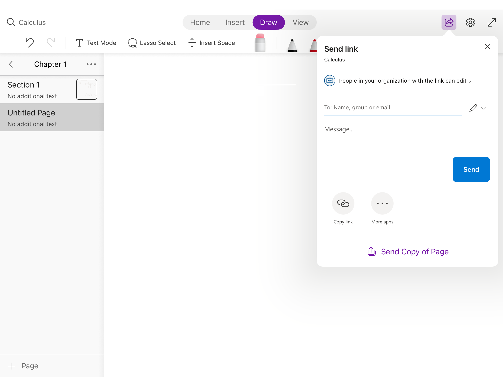
<figcaption> </figcaption>
</figure>

[Publication scope and editing permissions]
<figure>
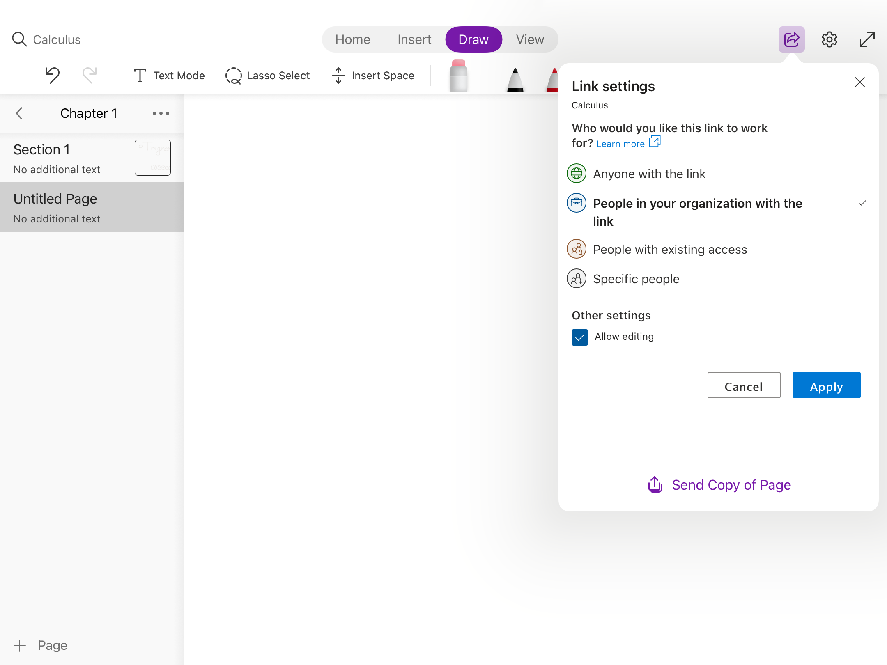
<figcaption> </figcaption>
</figure>

#### Distributing as PDF

OneNote screens can also be exported and distributed as PDFs.  
The advantage of distributing them as PDFs is that they are easier to manage and use, as students are likely to be familiar with them.   
You can share or save a PDF by clicking on "Send a copy of the page" in the image below.  

[Distribute as PDF]
<figure>

<figcaption> </figcaption>
</figure>

 

## Examples of Good Practices and Application

* [Professor Kaoru Irie: Mathematical Statistics I, II (Japanese Only)](/good-practice/interview/irie)
  * OneNote is used as a digital whiteboard and shared via Zoom.  
    * Microsoft Surface and SurfacePen are used to write on the board.
    * To cover the inconvenience of pointing to specific pieces of information, the marker function is utilized.
    * Vertical orientation is adopted in consideration of the little amount of text displayed in one  time and fast scrolling with horizontal orientation.
    * Despite that the text became smaller in portrait mode, it can be solved by using Zoom's screen magnification function.
