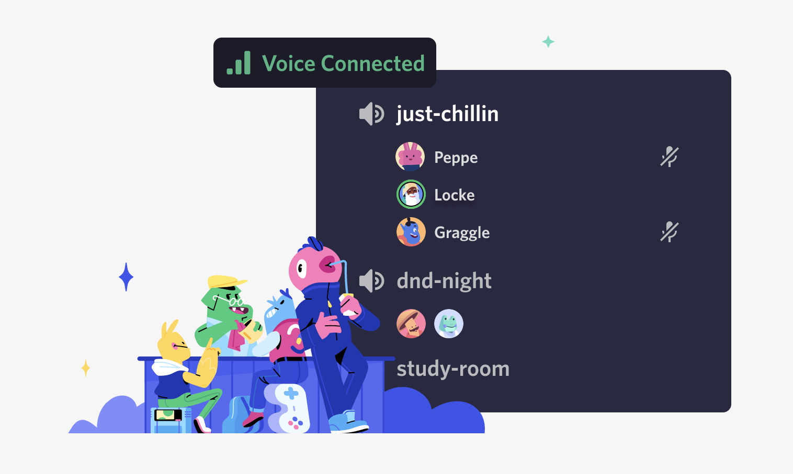
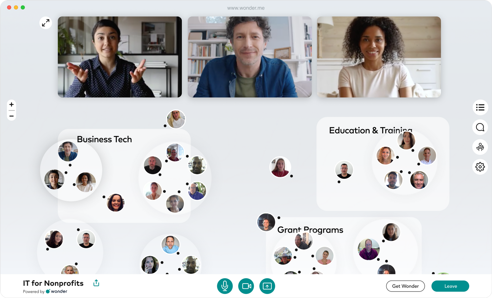
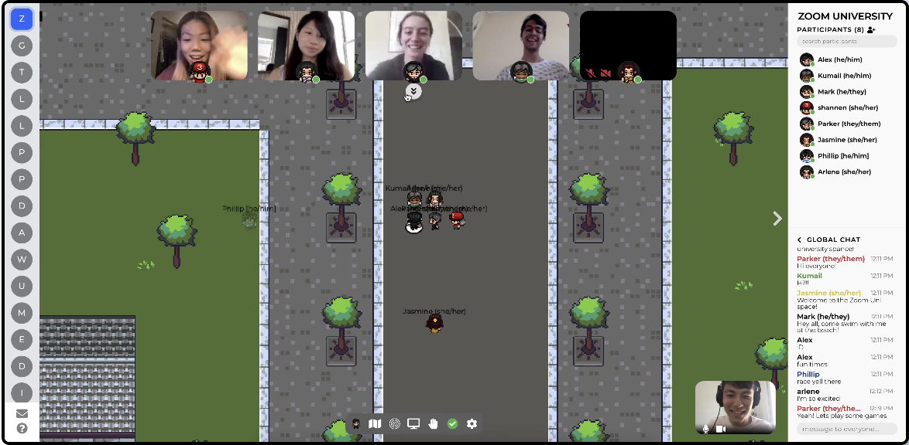
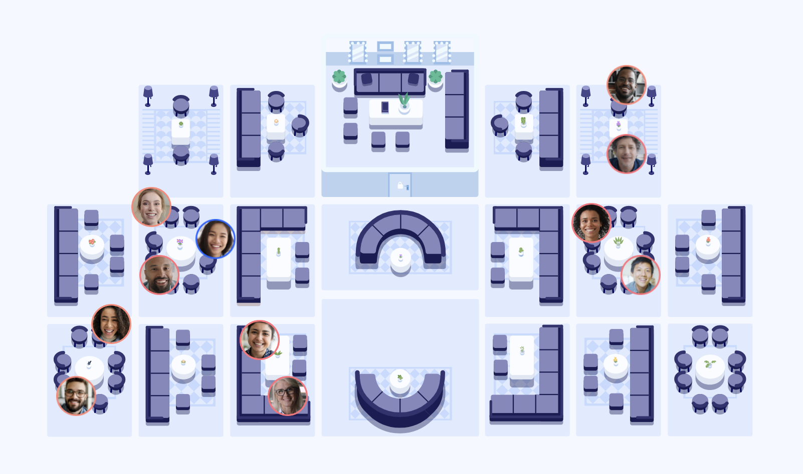

## Highlights of This Article

A comparison of online interaction tools that may be useful for online conferences and meetings.

**Recommended for students and teachers who:**
* Want to discuss matters with other teachers, but are unsure what services to use
* Want to share ideas and facilitate online meetings, but are unsure what tools to use
* Want to be able to assign rooms more easily and intuitively, as assigning breakout sessions in Zoom is difficult

In the following sections, we will compare four meeting tools to help you organize online meetings and conferences: Discord, Wonder, Gather, and Remo.

## Discord

<figure>

</figure>

### What Is Discord?

Discord is a tool for online voice chat (conversation through voice). It can be used not only for individual chatting, but also for multiple people talking as well as exchanging text, images and videos. It is often used as a chat application during gameplay, but it is also a very useful tool for general calls.

<figure>  </figure>
 <figure> 
</figure>

### Basic Usage of Discord

1. Go to the [Discord homepage](https://discord.com) on your browser, install the app, and create an account.
2. Press the + button on the left side of the screen to create a server (a room where you can chat). We recommend that you set the server name to the name of your community or organization. 
3. Invite your friends to the server and start chatting.

### What You Can Do in Discord

1. **Voice chat**: You can create a voice channel and enjoy voice calls with multiple people. Noise reduction and easy grouping are available. 
2. **Text chat**: You can also use the text channel to conduct a text conversation.
3. **Screen sharing**: During voice chat, you can share your computer screen with your caller by clicking on the TV icon. 
4. **Video chatting**: You can use video chatting not only between individuals, but also between multiple people by setting up a group DM in advance.
5. **Shortcuts**: In order to use these functions, shortcut keys are adopted, for example, "Alt+&uarr;" or "Alt+&darr;" to move between channels, "Ctrl+Enter" to answer incoming calls, and so on. This allows you to take quick actions when you are taking minutes or doing other tasks, and helps to facilitate meetings.

### References

* Discord - [https://discord.com](https://discord.com)
* Discord Support - [https://support.discord.com/hc/en-us](https://support.discord.com/hc/en-us)

## Wonder

<figure>

</figure>

### What Is Wonder?

Wonder is a relatively new conference tool that allows you to intuitively move between rooms (equivalent to breakout rooms in Zoom) by moving your icon on the screen. You can also create rooms with hundreds of people, and within those rooms, individuals can talk to everyone. The main advantage is that you can intuitively change who you are talking to by moving your icon on the screen.

<figure> 

</figure>

### Basic Usage of Wonder

1. Go to the [Wonder site](https://www.wonder.me/), click the "Get a room" button, register your name and email address, and create a room. 
2. Share the URL with the person you want to chat with, and ask them to enter the room. 
3. In addition to the normal chatting function, you can divide a room into smaller rooms, and a specific person can speak to all the audience.

### Things You Can Do With Wonder

1. **Large meetings**: Wonder can hold up to 1500 participants at once. You can create a room and then create a smaller room called Circle, so you don't have to deal with too many participants. 
2. **Smooth room movement**: Participants can see who is talking to whom, and can join other conversations by moving between Circles. You can also invite specific participants to your Circle. 
3. **Screen sharing**: You can share your computer screen as in other services. 
4. **Broadcast**: You can talk to everyone in the room. Up to six participants can use this feature at the same time, making it useful for panel discussions. 
5. **Text chat**: You can send messages to specific individuals directly, to participants within the Circle and to all participants, which is useful for note taking ideas in the circle, reminding people of the time during group discussions, and many others.

### References

* Wonder - [https://www.wonder.me/](https://www.wonder.me/)
* Wonder Help - [https://help.wonder.me/en/](https://help.wonder.me/en/)

## Gather

<figure>

</figure>

## What Is Gather?

Gather is an online communication tool with a playful retro-game style UI, where you can control your avatar to move freely between rooms and virtually experience going to work or working in an office. It is a part of the Virtual Office service, which creates a real office environment on the Internet.

<figure>

</figure>

### Basic Usage of Gather

1. Go to the [Gather website](https://www.gather.town/) on your browser and create a room by inputting your name and the purpose of using the office. You do not need to sign in to create a room.
2. Create your own avatar and join the Gather world.
You can move your avatar around the space you have created, work in your own private space, or go to a conference room to talk and discuss with others.

### What You Can Do in Gather

1. **Playful virtual office experience**: Gather's unique dot-graphic UI makes you feel as if you are actually working in an office. 
2. **Group chat**: Enjoy the benefits of a real office, such as the ability to go into a meeting room and make a video call if you have a topic you want to discuss, or sit around a table in the cafeteria and chat.
3. **Screen sharing**: You can enter a specific room in the office with other people and have a video chat, voice call or even a discussion using screen sharing.
4. **Recreate your own office**: You can use the "mapmaker" feature to create your own space, your ideal office or a space that closely resembles your own workplace.

### References

* Gather - [https://www.gather.town/](https://www.gather.town/)
* Gather Media Kit - [https://drive.google.com/drive/folders/1YRefTkMZmT5mq4ItVdbX8NT850JcnZLw](https://drive.google.com/drive/folders/1YRefTkMZmT5mq4ItVdbX8NT850JcnZLw)
* Video tutorial for new Gather users[ - https://youtu.be/89at5EvCEvk](https://youtu.be/89at5EvCEvk)
* Gather’s update information[ - https://gathertown.canny.io/changelog](https://gathertown.canny.io/changelog) 
* Gather Town product hunt video (SLIGHTLY OUTDATED)[ - https://youtu.be/8orexZsFRxs](https://youtu.be/8orexZsFRxs)

## Remo
<figure>

</figure>

### What is Remo?

Remo is an online communication tool that allows you to enter a virtual room with many tables surrounded by six chairs, and to conduct a meeting by talking at each table or by the organizer talking to everyone.

<figure>

</figure>

### Basic Usage of Remo

1. Go to the [Remo site](https://remo.co/) on your browser and register your name, email address, organization name and other information to create a room. 
2. Once you are in the room, you can sit down at one of the tables and start a conversation.

### What You Can Do With Remo

1. **In-table conferencing**: Remo provides most of the basic tools that are built into conferencing tools such as Zoom, including video calling, voice chat, text chat, conference recording, whiteboard tools, raising hands, and more. 
2. **Event creation**: You can set up events on Remo in advance, and invite others to them by getting and sharing an invitation URL.
3. **Presentation**: The organizer can give a presentation, using tools such as screen sharing, video sharing, whiteboard, timer, and many others.

### References

* [Document] Remo guide: [https://hi.remo.co/deck-jp](https://hi.remo.co/deck-jp)
* [Guide] Remo Helpdesk: [https://help.remo.co/en/support/home](https://help.remo.co/en/support/home)
* [Video] Remo 101:  [https://www.youtube.com/watch?v=iXdefdYMJlE&list=PL0OTlNhIJiS2FBg7UT93w1w51dUUmSUSs&index=1](https://www.youtube.com/watch?v=iXdefdYMJlE&list=PL0OTlNhIJiS2FBg7UT93w1w51dUUmSUSs&index=1)

## Comparison of the Four Tools

The features of the four tools introduced so far are summarized in the table below.

<table> 
  <tr>
   <td></td>
   <td>Discord</td>
   <td>Wonder</td>
   <td>Gather</td>
   <td>Remo</td>
  </tr>
  <tr>
   <td>Prices</td>
   <td>Free</td>
   <td>Free</td>
   <td>Free</td>
   <td>Free</td>
  </tr>
  <tr>
   <td>Access</td>
   <td>Downloading application</td>
   <td>On web browser</td>
   <td>On web browser</td>
   <td>On web browser</td>
  </tr>
  <tr>
   <td>Voice and video calls</td>
   <td>&check;</td>
   <td>&check;</td>
   <td>&check;</td>
   <td>&check;</td>
  </tr>
  <tr>
   <td>Screen sharing</td>
   <td>&check;</td>
   <td>&check;</td>
   <td>&check;</td>
   <td>&check;</td>
  </tr>
  <tr>
   <td>Whiteboard</td>
   <td>x</td>
   <td>x</td>
   <td>&check;</td>
   <td>&check;</td>
  </tr>
  <tr>
   <td>General notification</td>
   <td>Text channels</td>
   <td>Broadcast function</td>
   <td>x</td>
   <td>Presentation function</td>
  </tr>
  <tr>
   <td>Recommended practice </td>
   <td> When audio-only meeting is appropriate, or when you want to have a meeting while viewing documents separately.</td>
   <td>For meetings with a large number of people or when changing room assignments frequently</td>
   <td>When you want to feel that you are working with your colleagues in a playful UI</td>
   <td>For workshops and other activities with groups of about four people</td>
  </tr>
</table>

