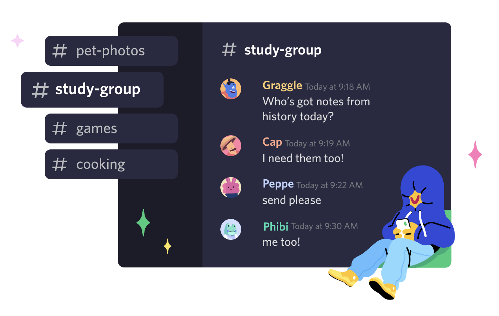

## Highlights of This Article

This article compares several online interaction tools that may be useful during online conferences and meetings.

**Recommended for students and instructors who:**

* Want to hold a discussion with other instructors, but are not sure which service will facilitate the discussion
* Want to share ideas and facilitate online meetings, but are not sure of what tool to use
* Want to make it easier and more intuitive to divide up breakout sessions, since it currently takes a long time to assign participants to different rooms when zooming

Here is a comparison of four tools for online meetings and conferencing: Discord, Wonder, Gather, and Remo.

## Discord

<figure>

</figure>

### What is Discord?

Discord is a tool for online voice chat (conversation through voice). It is characterized by its ability to allow for chatting not only between individuals, but also between multiple people simultaneously, exchanging text, images, and videos. It is often used as a chat application during game play, but it is also a very useful tool for general calls.

<figure>

</figure>

<figure>

</figure>

### Basic Instructions on How to Use Discord

1. Go to the [Discord homepage](https://discord.com/) on your browser, install the application, and create an account.
2. Press the + button on the left side of the screen to create a server (a room for chatting). It is recommended to set the server name to the name of your community or organization.
3. Invite your friends to the server and start chatting.

### What You Can Do With Discord

1. **Voice Chat**: You can create voice channels and enjoy voice calls with multiple people. Noise reduction and the ability to easily divide the chat group into different groups ensure high-quality calls.
2. **Text chat**: A text channel is also available for text-based conversations.
3. **Screen sharing**: Click the TV icon during a voice chat session to share your computer screen with the person you are chatting with.
4. **Video Chat**: In addition to individual video chats, you can also set up a group DM in advance to enable video chats with multiple people.
5. **Shortcuts**: Shortcut keys are provided to use these features, such as "Alt+↑" or "Alt+↓" to move between channels, "Ctrl+Enter" to answer incoming calls, etc. This allows you to work more efficiently while taking minutes or doing other tasks, helping to facilitate meetings.

### Reference Materials

* Discord - <https://discord.com>
* Discord Support - <https://support.discord.com/hc/en-us>

## Wonder

<figure>

</figure>

### What is Wonder?

Wonder is a relatively new conferencing tool that allows users to intuitively move around the room (which is similar to a breakout room in Zoom) by moving their own icons on the screen. You can also create a room with several hundred people, and within that room, each person can speak to everyone else. A major advantage of this tool is that you can intuitively change who you are talking to by moving your icon on the screen.

<figure>

</figure>

### Basic Instructions on How to Use Wonder

1. This is not an app-based service, but a service that can be used on a browser, so access Wonder's site (<https://www.wonder.me/>), click the "Get a room" button, register your name and email address, and create a room.
2. When you create a room you will receive a URL, which you can share with the person you wish to chat with so they can enter the room.
3. In addition to the normal chat function, a room can be further subdivided into smaller rooms within a room. A specific person can also speak to the entire room.

### What You Can Do With Wonder

1. **Large group meetings**: Wonder can accommodate as many as 1,500 people at a time. You can create a room and then create a smaller room called a Circle, so you can avoid having too many people in a room and losing control.
2. **Smooth room movement**: Participants can see who is talking with whom and can move from Circle to Circle to join other people's conversations. You can also invite other specific people to the Circle you are in.
3. **Screen sharing**: As with other services, you can share your computer screen.
4. **Broadcast**: This function allows you to talk to everyone in the room. Up to six people can use this feature at the same time, making it useful for panel discussions.
5. **Text Chat**: Direct messages can be sent between individuals, to other people in the Circle, or to the whole group. You can use this feature to brainstorm ideas with Circle members, remind people of the time during group discussions, and so on.

### Reference Materials

* Wonder - <https://www.wonder.me/>
* Wonder Help - <https://help.wonder.me/en/>

## Gather

<figure>

</figure>

### What is Gather?

This online communication tool features a playful UI in the style of retro games. Users can control their avatars to move freely between rooms and virtually experience going to work and working in an office. This is one of the virtual office services that create an actual office environment on the Internet.

<figure>

</figure>

### Basic Instructions on How to Use Gather

1. Access the [Gather website](https://www.gather.town/) in your browser and create a room by entering your name and the office you will use. You can create a room without signing in.
2. Create your avatar and join the Gather world.
3. You can move your avatar around within the created space and work in your own private space, or go to a conference room to talk and discuss with others.

### What You Can Do With Gather

1. **Playful virtual office experience**: The unique UI with pixel art allows users to feel as if they are working in an office.
2. **Group chat**: Gatherers can enjoy the benefits of a real office, such as the ability to casually enter a conference room for a video call when there is an agenda to discuss or to chat around a table in the cafeteria.
3. **Screen sharing**: You can enter a specific room in the office with other people and have a discussion using screen sharing, as well as video chat and voice chat.
4. **Recreate your own office**: Using the "mapmaker" feature, you can make your own space; for instance, creating your ideal office or recreating your actual workplace.

### Reference Materials

* Gather - <https://www.gather.town/>
* Tutorial videos for new users - <https://youtu.be/89at5EvCEvk>
* Gather product updates - <https://gathertown.canny.io/changelog>
* Gather's product promotion videos (some of the information is outdated) - <https://youtu.be/8orexZsFRxs>

## Remo

<figure>

</figure>

### What is Remo?

Remo is an online communication tool that allows users to enter a virtual room with many tables, each surrounded by six chairs, and to carry on a meeting by having conversations at each table or by having the organizer address everyone.

<figure>

</figure>

### Basic Instructions on How to Use Remo

1. Go to the [Remo website](https://remo.co/) in your browser, register your name, email address, and the name of the organization that is holding the meeting, and create a room.
2. Once in the room, you will be placed at one of the tables and can start a conversation.

### What You Can Do With Remo

1. **In-table meetings**: Remo provides most of the same basic functions that are found in conference tools such as Zoom, including video calls, voice chat, text chat, meeting recording, a whiteboard tool, and a hand-raising function.
2. **Event Creation**: Events can be set up in advance on Remo, and you can invite others by generating an invitation URL and sharing it.
3. **Presentations**: Organizers can give presentations using tools such as screen sharing, video sharing, a whiteboard, and a timer.

### Reference Materials

* [Official website] <https://remo.co/>
* [Remo Guide] <https://hi.remo.co/deck-jp> (in Japanese)
* [Guide] For organizers: [Remo Event Guide for Hosts](https://hi.remo.co/hosts-guide)
* [Guide] For participants: [Remo Event Guide for Guests](https://hi.remo.co/guests-guide)
* [Guide] For speakers: [Remo Event Guide for Speakers](https://hi.remo.co/speakers-guide)
* [Manual] Sponsor use: [Remo Event Guide for Sponsors](https://hi.remo.co/sponsors-guide)
* [Video] Join an Event: [How to Register for a Remo Event as a Guest](https://www.youtube.com/watch?v=v7HW3Emb3BA&list=PL0OTlNhIJiS2u-Csz3NoOdW8vnGDHleRR&index=1)
* [Video] Create your event: <https://youtu.be/NP6DJodI53s> (in Japanese)
* [Video] How to make a banner: [How to Design a Sponsor Banner in Remo Virtual Conference](https://www.youtube.com/watch?v=KSHAhr61ZJw)
* [Video] Troubleshooting:  <https://www.youtube.com/watch?v=r5WVj07y4mU> (in Japanese)

## Comparison of 4 Tools

The following table summarizes the characteristics of the four tools introduced so far.

<table>
  <tr>
   <td></td>
   <td>Discord</td>
   <td>Wonder</td>
   <td>Gather</td>
   <td>Remo</td>
  </tr>
  <tr>
   <td>Charge</td>
   <td>Free</td>
   <td>Free</td>
   <td>Free</td>
   <td>Free</td>
  </tr>
  <tr>
   <td>Access</td>
   <td>Application Download</td>
   <td>Browser</td>
   <td>Browser</td>
   <td>Browser</td>
  </tr>
  <tr>
   <td>Voice/Video Chatting</td>
   <td>◯</td>
   <td>◯</td>
   <td>◯</td>
   <td>◯</td>
  </tr>
  <tr>
   <td>Screen Sharing</td>
   <td>◯</td>
   <td>◯</td>
   <td>◯</td>
   <td>◯</td>
  </tr>
  <tr>
   <td>Whiteboard</td>
   <td>×</td>
   <td>×</td>
   <td>◯</td>
   <td>◯</td>
  </tr>
  <tr>
   <td>General Notification</td>
   <td>Text Channel</td>
   <td>Broadcast Function</td>
   <td>×</td>
   <td>Presentation Function</td>
  </tr>
  <tr>
   <td>Recommendation</td>
   <td>When using voice is sufficient, or when you want to have a meeting while viewing documents separately</td>
   <td>When meeting with a large group or changing room assignments frequently</td>
   <td>When you want to feel like you're working with your peers in a playful UI</td>
   <td>When you want to host a workshop with around four people, etc.</td>
  </tr>
</table>
