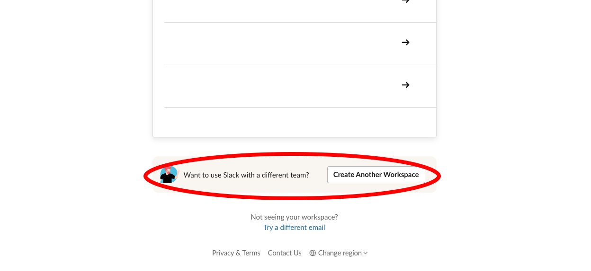
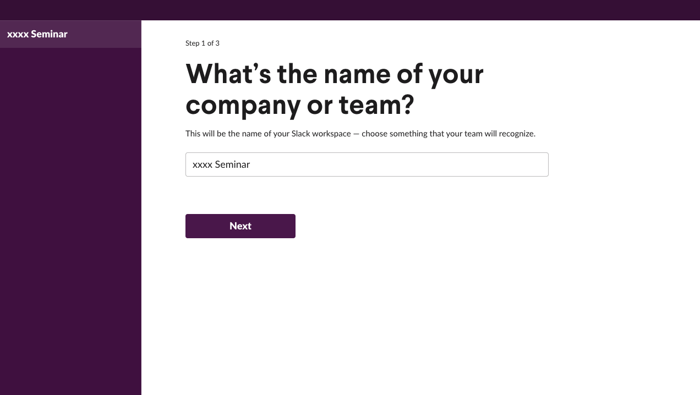
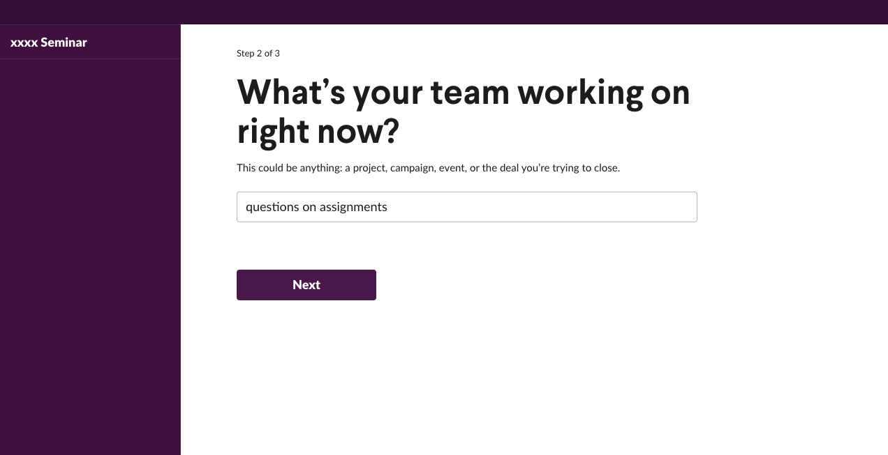
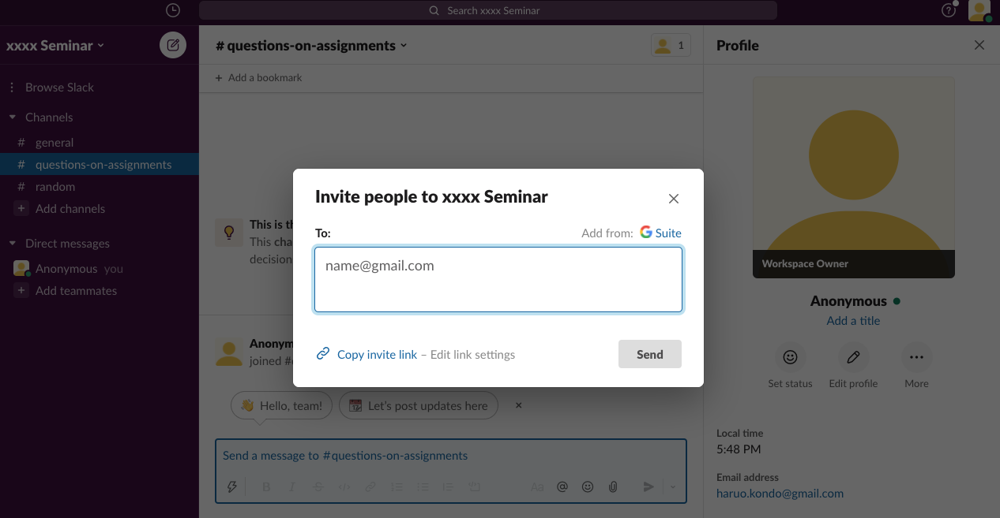
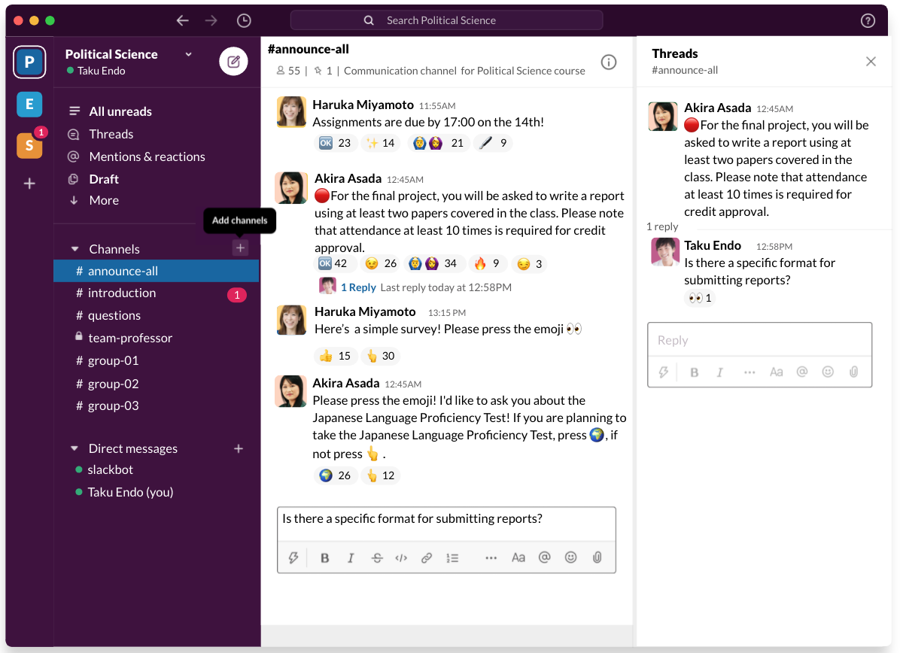
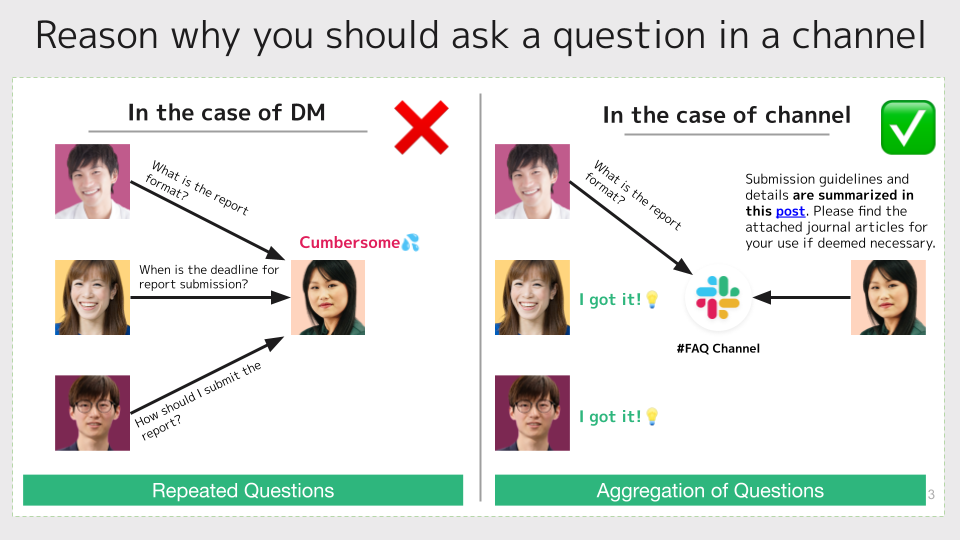

## Highlights of This Article

This article introduces how to use Slack to communicate with students and more.

### Applicable Situations
* (Faculty member) Prompt students to ask questions in on-demand or live classes
* (Faculty member) Give class instructions to students
* (Faculty member) Increase student-teacher interaction
* (Faculty member) Facilitate student communication outside class for better group work
* (Student) Communicate with other students and seminar members

### Limitations of Slack

* Slack embeds no mark-as-read bot that the sender would get no notification on who and how many recipients have read the message. However, you might request recipients to react/reply with emoji when they read your message).
* In the free version, you can only read/search the last 10,000 messages, send up to 5GB of files to one workspace, and link up to 10 apps.

## What is Slack?

### App Description

Slack is a messaging platform that allows you to communicate in real time. In the platform called **"Workspace"**, you can exchange and manage messages in separate **"Channels"** for different topics and people.

#### (1) Sharing Information via Channels

You can create a "channel" for each theme or content to communicate (see the ["How to use in class - how to create a channel"](#in_class) section for details). Separate channels allow you to share information within your team by topic, and organize information as well as interactions (see more in this article [How to use channels in class](#for_teachers)).

There are two types of channels: **public channels** and **private channels**. If you set a channel to private, you can create a closed space where only authorized users can search and join in the same workspace (see this article [How to use channels in class -Want to talk about the class only with teachers and TAs](#private_channel)").

#### (2) Using DM and Mention Functions to Send Messages

**You can also use direct messages (DM)** to send private messages. (See this article ["How to use the channel in class - contacting students individually"](#dm) for details)

If you want to respond to a specific person in the channel, or if you want to notify them, you can use the **mentions** function to make it easier for them to see your message (see this article ["Using the channel in the classroom - taking questions (#questions)"](#question _teachers).

#### (3) Using Emoji for Casual Communication

**emoji** can be added to react to a message. You can ask students to react when they read an announcement, which can be used to prevent communication from going unanswered or to conduct surveys in class (see this article ["How to use the channel in class - contacting the class and taking casual surveys"](#announce) for more details). .

#### Specifications

* Provided by: Slack Technologies Inc.
* Available Environment.
    * Devices and OS: Available for PCs, tablets and smartphones.
    * For more information about OS and browser versions [click here (Slack official help page in English)](https://slack.com/help/articles/115002037526-System-requirements-for-using-Slack)
    * Drive space required for installation: 0MB for web browser and 158.1MB for app download.
    * Required or optional accessories: None
* Operating costs
    * Cost: Free (paid plans available)
    * Preparations for students taking the class:
        * Create a Slack account with your email address
        * Accept invitations from faculty
        * Install the app if needed

## How to Install Slack and Create a Workspace

## Install the Slack App
* If you use the web browser version, register and sign in from the [Slack homepage](https://slack.com/get-started#/create).
* If you wish to use the app version, install it from the Slack download page. (In the case of [Windows](https://slack.com/downloads/windows) ([Mac](https://slack.com/downloads/mac))

Below, we will show you how to use the app version.
(The procedure is mostly the same for the web version)
    
### How to Create a Workspace in Slack (Creating a Workspace for Your Class)
1. Click "Sign in to Slack".  
2. You will see the following screen in your browser. Press "Continue with Google" and sign in with your ECCS Cloud Email account (or your personal email address).  
3. Press "Create another workspace" at the bottom of the page.  
4. Set up the workspace (e.g. class name). The "company or team name" will be the name of the workspace. If you use the workspace for a class, the workspace name should be easily recognizable. In this demonstration, the workspace is named "Seminar".  
5. "What the team is working on now" is the name of the "channel" in the workspace. If you use it in class, it is useful to set up a channel such as "Basic Information" (see this article ["How to use channels in class"](#for_teachers). Here we will create a "Ask me about my assignment" channel. 
6. Next, you will see a screen that asks you who are the users of the channel you have just created, "Who do you email most about?” This is where you enter the email addresses of the people you want to invite to your workspace. Steps on sending invitations will be introduced later. 
7.The class workspace setup is now complete. 

### How to Invite New Members (Inviting Students to Your Workspace)
<figure>

</figure>

* If you have collected the email addresses of the students you want to invite, send the invitation to their email addresses. Below the direct message, press **"Add a team member"** and enter the email addresses of the students you want to invite.
* If you wish to share by link, share the invitation link to your class through ITC-LMS or other means ("[How to share an invitation link (Slack help)](https://slack.com/intl/ja-jp/help/articles/201330256-%E3%83%AF%E 3%83%BC%E3%82%AF%E3%82%B9%E3%83%9A%E3%83%BC%E3%82%B9%E3%81%AB%E6%96%B0%E8%A6%8F%E3%83%A1%E3%83%B3%E3%83%90%E3%83%BC%E3%82%92%E6%8B %9B%E5%BE%85%E3%81%99%E3%82%8B#u25307u24453u12522u12531u12463u12434u20849u26377u12377u12427)".
 * Ensure no invitation link leakage and remind students to be careful.
 * Remember to set your students' email addresses invisible (see "[Manage email visibility (Slack Help)](https://slack.com/intl/ja-jp/help/articles/228020667-%E3%83%A1%E3% 83%BC%E3%83%AB%E3%81%AE%E8%A1%A8%E7%A4%BA%E3%82%92%E7%AE%A1%E7%90%86)").
* Students would join the workspace via the link in the invitation email.
* For instructions on how to accept the invitation, see "[Slack Help](https://slack.com/help/articles/360049769934-Accept-an-invitation-to-join-another-companys-channel)".

## How to Use Slack in Lectures
{:#in_class}

Here we introduce how to use Slack effectively in existing lectures "Introduction to Political Science".

<figure>

</figure>

* How to create a channel Channels can also be created from the + icon ((1) in the above figure). In this class (workspace),  five channels are created.
    * \# General communication
    * \# Basic information
    * \# Questions
    * \# Teachers/TAs
    * \# Presentation group 1 / # Presentation group 2 / # Presentation group 3

* How to send a message To send a message, use the aeroplane symbol (② above) on each channel. You can also use bold or italic text to emphasize your message, or attach a file (select the file from the clip symbol) if necessary.

### How to Use Channels in the Classroom (for teachers)
{:#for_teachers}

#### Class Communication and Casual Surveys (#General Communication)
{:#announce}

<figure>

</figure>

* Change the channel name of #general to "#general contact".
    * To change the channel name of an existing channel, open the relevant channel and press the ⓘ symbol in the top right corner, then press "More > Change channel name" on your computer, or "Edit" on your phone.
* This is the channel for communicating class assignments.
* You can also use this channel to conduct surveys.
    * Make use of the pictogram reactions.
    * This is the channel where you can see the results of the questionnaire and communicate with other students after class.
        
#### Compilation of Class Information to improve the list (#Basic Information)
{:#info_list}
* Class information on the ITC-LMS

#### Take questions (#questions)
{:#question_teachers}
<figure>

</figure>

* This is a channel for students to ask questions about the class or assignments.
* This channel is not only for real time but also on demand questioning.
* The benefit of such a setup is that you can aggregate your questions and search the question log after the class is over.
* You can attach reference materials for students to learn more after class.
* You can also mention students who have asked questions by prefixing their registered name in Slack with @.

**Tips: We encourage you to ask questions in the channel**.

If you have a question about the class, you can ask it in "channel" where other students can also see it.

<figure>

</figure>

#### I would like to talk about the class only with teachers and teaching assistants (🔒 teachers and TAs).
{:#private_channel}
* If you want to share information only with faculty and TAs, you can set up a private channel ([Slack help](https://slack.com/help/articles/213185467-Convert-a-channel-to-private)).
* In a private channel, only people of the same workspace who are invited to the channel can freely join or search the message content.
* You can create a private channel by turning on the "Make private channel" option when you create a channel.
* Once a channel is set as a private channel, it cannot be changed back to a public channel.

#### I want to share materials within groups (#Presentation group 1, 2......)
{:#public_channel}
You can share text and documents within groups. Through public channels, teachers and students of other groups can follow the progress of each group (even if they are not in that channel). It can also be made a private channel for teachers and group members only.

#### To contact a student individually (direct message)
{:#dm}
If you need to contact a student individually, such as when an assignment has not been submitted, you can do so via DM.

#### (Application) Connecting with Zoom
{:#zoom}
You can find out how to connect here ([Slack official site](https://slack.com/help/articles/115004062463-Zoom-for-Slack)). If you connect, you can start Zoom smoothly from Slack.

### How to Use Channels in the Classroom (for students)
{:#for_students}
#### Ask a question to a teacher (#question)
{:#question_students}

<figure>

</figure>

To make sure you get responded, it is a good idea to mention the teacher. You can do this by putting @ in front of your Slack display name as shown in the red circle.

#### Chatting with other students (#chat)
{:#chat}
You can also create channels for casual chat among students.

### Tips: Creating operational rules

When using workspace in a class, it is a good idea to share the operation rules with students in advance. In particular, please be careful about handling personal information such as email addresses ([Slack Help: Manage Email Display](https://slack.com/help/articles/228020667-Manage-email-display)).

### Good Practices and examples of applications

* [Dr. Nobukazu Saito, Computational Mathematics I](https://utelecon.adm.u-tokyo.ac.jp/good-practice/interview/saito, Japanese Only)
    * We used Slack in an on-demand style class; we elicited questions regarding class content and encouraged students to answer them on Slack. Students seemed to be more active in asking questions online than in face-to-face classes. It was believed that Slack causes little psychological burden as users might edit or delete their messages.
* [Professor Tadashi Shiraishi, Law I, Japanese Only](https://utelecon.adm.u-tokyo.ac.jp/good-practice/interview/shiraishi.html)
    * Owing to the voluntary nature, only about 10% of the students joined Slack. However, we received a lot of questions and consultations via DM.
    * Five days before the class, we uploaded materials to Slack and ITC-LMS, and asked students to ask questions on Slack by noon the day before.

### Useful links

* [Slack help](https://slack.com/help)
* [Introduction to Slack - Improving work efficiency!, Japanese Only](https://ascii.jp/serialarticles/3000637/)

**We would like to thank Slack Japan K.K. for providing us with images and other support in creating this article. Thank you for your kind cooperation.**
