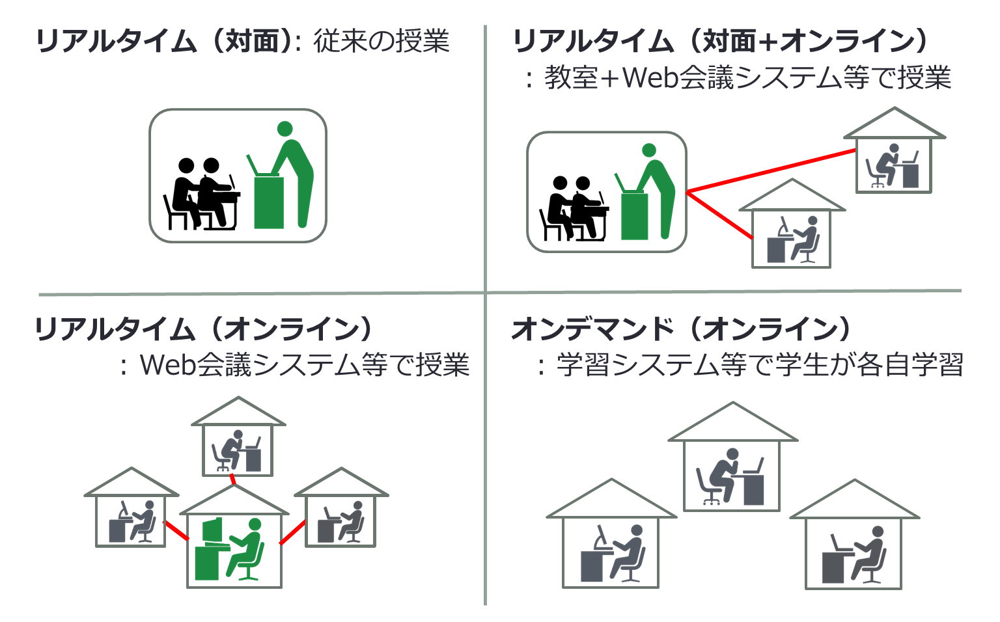

Last update: 2020/4/2

## Introduction

As stated by the <a href="https://www.u-tokyo.ac.jp/ja/about/president/COVID-19-message.html" target="_blank">Dean's message</a>  the University of Tokyo has decided to introduce online classes to the S semester in 2020 in order to prevent the spread of the new coronavirus COVID-19. It says that "Face-to-face lectures will be minimized and online classes will be encouraged and promoted. " However, since the message was issued on March 18, the situation has become more serious and it has become necessary to prepare for a full online class scenario.

This is the first time for many faculty members to conduct online classes and the time available for preparation is very limited. Under such circumstances, various efforts have already been made in various places in order to provide students with the same learning environment.

This portal has been created in an attempt to help reduce the burden on faculty and staff when the university promotes online classes. In this portal, we are going to provide the following information that is useful for smoothly bringing online the lessons we have been conducting in-person.

* What is an online class
* What kind of system environment is available at our university
* What can the system actually do
* Specific ways to teach online courses
* What resources are available

However, it is still not enough. There is a way you could help. Some teachers may have already started classes online; if you are one of them, we would be grateful if you could send a message to [utelecon-inquiries@googlegroups.com](mailto:utelecon-inquiries@googlegroups.com)telling us what you know, and suggesting methods. In this portal, we would like to share such information with those who need it.

We believe that the knowledge accumulated and shared in this portal will help create a community that achieves our goal of an online system, and  will ultimately support maintaining or improving a high-quality learning environment for our students.

A message from all the members editing this Portal
　

## To use the ICT system for Education at the University of Tokyo

There are several ICT systems for education at the University of Tokyo  

The broad picture is as shown above. The UTokyo Account, which indicates that you are a member of the University of Tokyo,  is the basis for using many services. UTAS for syllabus registration, and ITC-LMS for distributing teaching materials and attendance management can be used if you have a UTokyo Account. However, activation is required separately for Office 365 (which gives you access to Word and Excel) and ECCS Cloud Mail (which gives you access to Google services). Also, if you want to use the video conferencing system (Zoom, Webex, Google Hangouts Meet) with your University account, you will need to activate it using ECCS Cloud Mail.

Even if you already have an Office 365 or Google account, if you want to share video files with students only within members of the university, or want to use Google Drive (file storage) without worrying about capacity, please enable each account.    

The following is a description of each service and procedures required to use them. If you encounter any problems during the following procedures, notify us at[utelecon-inquiries@googlegroups.com](mailto:utelecon-inquiries@googlegroups.com) Please include (a) in which steps below, (b) what you did, and (c) what was the result. (If you only tell us that it didn't work, we often cannot figure out what the problem was).

1. **UTokyo Account:** This account indicates that "you are a member of the University of Tokyo", which is the basis for all other services. If you are a new faculty member, you will find your account number (10 digits, common ID) and initial password on the documents that are handed to you after April 1, 2020.
  * **（New faculty members）Task:** [Change the initial password](https://utacm.adm.u-tokyo.ac.jp/webmtn/LoginServlet) [video](https://youtu.be/tTpAlqVhEXQ)
1. **UTAS (Academic Affairs System):** A system used to register syllabi and grades. Information regarding online classes will most likely be provided via this system as well. Your UTokyo Account must be set correctly in order to use this. 
 * **Task:** If you can use your UTokyo Account, there is no need to do anything in particular.
1. **ITC-LMS (Learning Management System):** Used for posting materials, submitting assignments, and managing attendance for the class in which you are responsible. UTAS is usually used before the course starts (syllabus registration) and after the course ends (grades registration), whereas ITC-LMS is used during the course period. Your UTokyo Account must be set correctly in order to use this system. 
 * **Task:** If you can use your UTokyo Account, there is no need to do anything in particular. (Reference: [ITC-LMS teacher page](../lms_lecturers/)）
1. **ECCS Cloud Mail (Google Mail/ G Suite for Education):**  A Google service that is available to all faculty and staff. A Google account (ECCS cloud mail account) is issued to all faculty and staff. This is required to use the University's video conferencing system account. Also, because it is a Google account, you can use Google Drive for file storage, Google Docs for document  service, Google Spreadsheet for spreadsheet service, YouTube for video distribution service, etc. To use this, you need to have set up UTokyo Account correctly, and activate the system when you start using it. 
  * **Task:** Set an account name from "ECCS Cloud Mail " and a password from "ECCS Cloud Mail (Change Password) '' in the [UTokyo Account user menu](https://utacm.adm.u-tokyo.ac.jp/webmtn/LoginServlet) to activate G Suite for Education  (<a href="https://hwb.ecc.u-tokyo.ac.jp/wp/literacy/email/initialize/" target="_blank">details</a>).
  * **Task:** After completing the above, wait up to 1 hour until you can actually use G Suite for Education (log in to Google) (It is updated every hour and will take about 5 minutes until it shows). Go to <a href="https://mail.google.com/a/g.ecc.u-tokyo.ac.jp" target="_blank">ECCS Cloud Mail</a>enter the account name (alphanumeric characters that you set) and password, and confirm that you can log in to Gmail.
1. **Office 365 (Microsoft):** This will give you access to the Word software, Excel spreadsheet software, and PowerPoint presentation software. In order to use it, you need to set up your UTokyo Account correctly, and you need to activate the system when you start using it.
  * **Task:** From the[UTokyo Account user menu](https://utacm.adm.u-tokyo.ac.jp/webmtn/LoginServlet) agree to "Office 365 ProPlus License Agreement '' and activate Office 365 ([video](https://youtu.be/OYl5P67mDYI)). 
1. **Video conferencing system:** This can be used to stream classes online in real time or to record videos for classes. In our university, [Zoom](../zoom/)，[Webex](../webex)，and [GoogleハングアウトMeet](../google_hangouts_meet) are available. If you are not sure which one to use, we recommend Zoom. Please check each page for directions on how to use each system.

Some of you may already be using Google, Microsoft, and Zoom on your own, but it is important for users to be able to use **their university accounts**. By using your university accounts, services created only for the members of the University will be available to you. For example, users can view files shared only within university members with Google Drive or share files with students only within the university. Also, you can hold video conferences with the maximum participants of 500 people on Zoom with your university account, where it is usually up to 100 people with a normal account.

The procedure for activating ECCS Cloud Email (Google) and Office 365 (Microsoft) has been described above, but to see other information on what you can do with those systems, refer to the " The University of Tokyo ICT Handbook (Humanities & Sciences) ”[2019 version](pdf/01_2019_ict.pdf) on ([The University of Tokyo's First Year Seminar page](https://fye.c.u-tokyo.ac.jp/students/)) as necessary. 

## Main forms of online classes
In this section, we will introduce three main forms of online classes, compare them with face-to-face classes, and explain each form and the requirements for online classes (media classes).  

　Traditional classes are conducted face-to-face in real time. On the other hand, online classes are broadly divided into: real-time face-to-face and online (synchronous hybrid type), real-time online only (synchronous online type), and students studying online at their own pace (on-demand) (asynchronous online type).
　We will introduce each type below.
  
  
* Real-time（face-to-face + online) type ( synchronous hybrid type)
  * This is a form in which classes are given in an actual classroom and the contents are distributed via a web conference system.  
  * The requirement for this form of online lesson (media lesson) is that it is "simultaneous and interactive." A web conference system meets this requirement by allowing teachers and students to use online chat and voice calls. Even if it is a video distribution, or if there is a function to accept comments, the requirements can be met.
  * Reference: Reference: How to prepare for real-time (face-to-face + online) type (synchronous hybrid type) (in progress)
  * Reference: [Online Basic Course "How to use Zoom to teach online class sessions"](https://utelecon.github.io/events/2020-03-19/)
   
   
* Real-time online only (synchronous online type)
  * This is a form in which all teachers and students connect online and conduct classes using a web conference system.  
  * The requirement for this form of online lesson (media lesson) is that it is "simultaneous and interactive." A web conference system meets this requirement by allowing teachers and students to use online chat and voice calls. Even if it is a video distribution, or if there is a function to accept comments, the requirements can be met.
  * Reference: How to prepare for real-time online only (synchronous online type) (in progress)
  * Reference: [Online Basic Course "How to use Zoom to teach online class sessions"](https://utelecon.github.io/events/2020-03-19/)
   
     
* On-demand (online) type (asynchronous online type)
  * In this form, students learn individually based on teaching materials prepared by teachers using a learning management system. For example, the following methods are possible．
    * Students watch the video materials created by the faculty members or the existing video materials such as OCW (Open Course Ware) and MOOC (Massive Open Online Course) within a predetermined range every week. After watching the video, students submit assignments and ask questions on the bulletin board. 
    * Students watch the recording of the lesson conducted in real time using the web conferencing system. After watching the video, students submit the assignment and answer questions on the bulletin board.
  * There are two requirements for this form of online lesson (media lesson). For example, teachers can meet the requirements by preparing a web bulletin board (ITC-LMS has this function) to encourage students to exchange opinions, and by conducting quizzes, or a “question and answer session” about the lesson contents.
    1. It is necessary to provide sufficient guidance by conducting quizzes, correcting guidance, and question and answer sessions, by using either of the following two methods.
      * After every session, the teaching assistant must meet the students in a place other than the classroom.
	  * **OR**，the teacher or teaching assistant must use the Internet and other appropriate tools immediately after the class ends.
  
    1. It is necessary to secure the opportunity for students to exchange opinions about the class (the bulletin board function on ITC-LMS meets this requirement).
  * Reference: Reference: On-demand (online) type (asynchronous online type) preparation method (in progress)
  * Reference: [Online Basic Course "How to Create On-Demand Online Classes Using Videos and Texts, Not Live Streaming"](https://utelecon.github.io/events/2020-03-27/)

## How to apply each teaching method online (in progress)

* Online Q & A session
* [Online Handwriting](how_to_teach_online_handwriting)
* Reading online
* Group work online

## How to use specific tools (in progress)

* How to set up a learning environment
  * [How to use ITC-LMS](../lms_lecturers/)
  * How to use Google Classroom
   
   
* How to design teaching materials
  * Each topic is explained in [the Online Basic Course "How to create on-demand online classes using videos and texts instead of live distribution."](https://utelecon.github.io/events/2020-03-27/)Please watch that video until the article is completed.
  * A quick way to enter text using Google Docs speech recognition
  * How to make a simple video using PowerPoint
  * How to make a video using the web conferencing system
   
   
* How to upload and share files
  * How to use Google Drive
  * How to use One Drive

## 
Practical examples and references (call for more information)

Here, we introduce the materials shared by professors. We greatly appreciate professors who provided us with this information. 
If you have any useful materials on online conference systems, please contact us at [utelecon-inquiries@googlegroups.com](mailto:utelecon-inquiries@googlegroups.com).  
Alternatively, you can send us pull requests via[utelecon の Github](https://github.com/utelecon/utelecon.github.io/)by forking information below.
We introduce the information in a bulleted list for now, but we will organize them after we have got more materials.  
In addition, we ask for your understanding that there is a possibility that each class method might be introduce separately in the online section.

* How to Teach Online Lecture on Laptop: [\[Powerpoint\]](materials/online_example_1pc.pptx) [\[video(MPEG4)\]](materials/online_example_1pc.mp4) (Engineering, Professor Kawahara): Explains how to teach using an online blackboard.
* Zoom User Guide 0.3 [\[PDF\]](materials/zoom_v03.pdf) (Engineering, Professor Aida): Explains how to use Zoom with multiple Mac screenshots.
* How to Teach Online Group Work Lesson Using Google Meet[\[PDF\]](materials/google_meet_groupwork.pdf)  (Engineering Professor Yanagisawa): Explains how to do group work online (Zoom Breakout cannot not convey the voice of teachers, but this teaching method makes it possible).
* How to Give Handwritten Notes on a Laptop, Using a Smartphone and a OH Camera [\[PDF\]](materials/doc-cam-lecture.pdf) (Engineering, Professor Koseki): Explains how to shoot your handwritten notes on A4 paper with an OH camera and distribute them as your real-time board writing.
* How to Give a Blackboard Lecture On a Laptop and a Tablet [\[PDF\]](materials/pc+ipad.pdf) (Engineering, Professor Kumada, Professor Suzuki): Explains how to write on a tablet like a whiteboard, and how to switch the tablet screen with slides and PDF files.
* A method of handwriting and distributing documents using a Windows tablet with a pen touch function (ex. Surface) [\[video(YouTube)\]](https://www.youtube.com/watch?v=gj-xBZEgt-A) (Information Science and Technology, Ph.D. student, Sasaya): A method showing how to use and share PDF files in class, while writing directly over it, or sharing OneNote.

## Links (call for more information)

