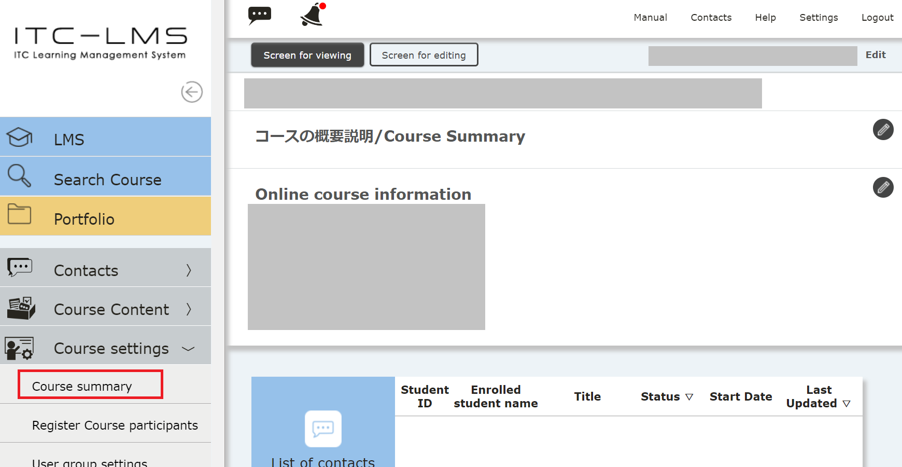
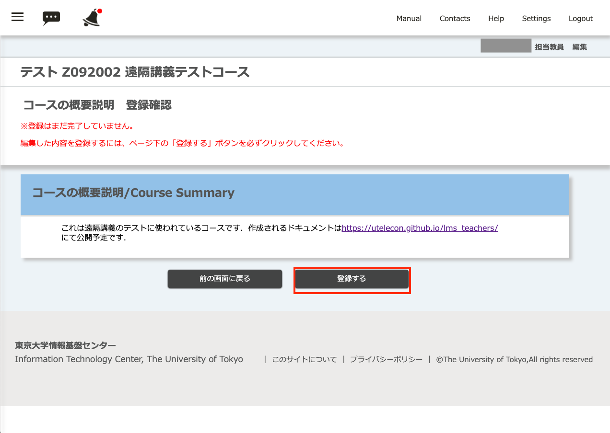
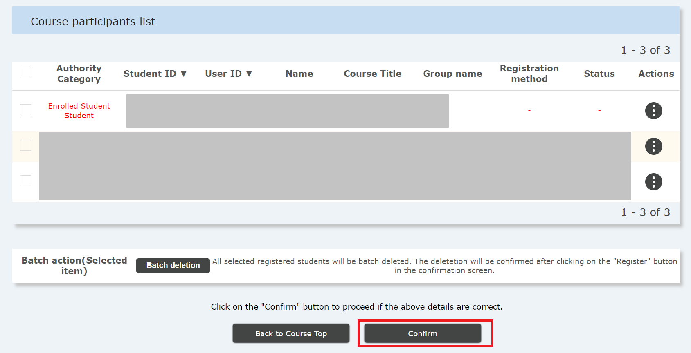

In ITC-LMS, lectures offered in terms and semesters are called "Courses". First, set up the course according to your subject.

## Course Summary

You can set a document to be displayed on the top screen when a student searches for a course on the ITC-LMS, or select it from the timetable.

* It is a good idea to write down the basic information you want to tell your students here.
* Students can easily find the online course URL if you write it down here, but they can also use the course search function to view this without registering for the course. If you do not want to show it to anyone other than the students registering for the class, you should write it in the "Course material" tab that will be available after registration.

1. On the course screen, select the three line icon at the top left to bring out the menu options.

2. Expand "Course Settings" and select "Course Summary".

3. Write the course description in "Contents" and select "Go to confirmation screen". In addition to writing text, you can change the font, list items, links, etc.

4. After confirming how the summary is displayed, select "Register".

[手順動画](https://youtu.be/Sdqtw2m1j48)

## Setting for course registration, message usage

Students enrolled in UTAS courses will be automatically enrolled in the relevant courses. However, for non-compulsory courses, registration on UTAS will be performed shortly after the course starts. Therefore, in order to be able to use it in the first few lessons, it is necessary to make such settings.

1. On the course screen, select the three line icon at the top left to bring out the menu options.

2. Expand "Course Settings" and select "Course Summary". 

3. The screen below shows the typical settings. We will explain the basic functions.
  * The enrollee range setting is made for  "Registration + temporary registration". Students who have chosen a subject as a "Favorite" on UTAS can participate in this course as a "temporary registrant". If you select "Registered students only", students who have not registered on UTAS will not be able to participate in this course.
  * Self-registration is "Permitted". Even if you do not register on UTAS, if you find this course by searching for a course and self-register, you will become a "temporary registrant" and can participate in the course. To let students who have registered the course as  "Favorite" on UTAS participate from the first lecture, set to "Permit". Students will, then, be able to register themselves.Self-registration is "Permitted". Even if you do not register on UTAS, if you find this course by searching for a course and self-register, you will become a "temporary registrant" and can participate in the course. To let students who have registered the course as  "Favorite" on UTAS participate from the first lecture, set to "Permit". The students will then be able to register themselves.

  * If you change “After course Registration” to “Automatically change 'Enrollee range setting' to 'Registered students only' ", the “Enrollee range setting” is automatically set for students whose registration is confirmed on UTAS. You can change it back to "Registration + temporary registration" later if necessary.
4. Select "Go to confirmation page." 

5. Select "Register."

<!-- 
コース設定 -> コース設定で編集する
「履修者範囲設定」，「自己登録」，「履修確定以降」，「メッセージ利用」についてお勧め設定と，変更するとどうなるかの説明をする
-->

## Participant registration by the instructor
Teachers and TAs who are not registered on UTAS but are jointly in charge of the course need to be registered as a course participant by the instructor. In addition, the instructor can invite students to participate in the course even if the student has not registered yet on UTAS.

1. On the course screen, select the three line icon at the top left to bring out the menu options.

2. Expand "Course Settings" and select "Course Summary".

3. Select "Search Student" or "Search Instructor" on the "Course Participant Registration" screen.

4. If you select "Search Student", you can search by either "Student ID Number" or "Name". Here, we have searched by the student's name.

5. The student is displayed. Select the check box of the applicable student (note that there may be multiple students with the same name), and select “Authority” out of “Teacher”, “TA”, or “Student” and click “Confirm”. 

7. Select "Go to confirmation page".

8. Select "Register."

[Procedure](https://youtu.be/TYCXBRzPpAA)

* When searching for faculty members, search by the "Common ID" instead of "Student ID number".
* You can also use batch registration using Excel files.
* When searching for a faculty member, a "User ID" with the same name but a number other than 10 digits may come up. This is left to refer to the contents of the old ITC-LMS.  Instructors can no longer login to the old UTAS, so if you want the instructor to participate in the course, register the  10 digit number for the user ID.
* Do not use the search function for students or faculty members unless you really need it.

<!-- 
コース参加者登録で何ができるか．TAや他の担当教員の登録．
自己登録を許さない場合での手動登録などの説明
-->

## References
* <a href="https://www.ecc.u-tokyo.ac.jp/en/itc-lms/faq.html">FAQ (ITC-LMS)</a>
  * <a href="https://www.ecc.u-tokyo.ac.jp/en/announcement/2017/05/17_2521.html">What is "Enrollee Range Setting?" (for instructors)</a>
  * <a href="https://www.ecc.u-tokyo.ac.jp/en/announcement/2019/06/26_3014.html">Settings for Self-registration on ITC-LMS (for instructors)</a>
  * <a href="https://www.ecc.u-tokyo.ac.jp/en/announcement/2016/08/08_2282.html">How to add staff or students to a course on ITC-LMS (for instructors) </a>
  * <a href="https://www.ecc.u-tokyo.ac.jp/en/announcement/2016/08/10_2288.html">What is "Temporary Enrollment Registration" on ITC-LMS? </a>
  * <a href="https://www.ecc.u-tokyo.ac.jp/en/announcement/2019/06/26_3010.html">Automatic enrollment of students on ITC-LMS and the Academic Affairs System</a>
