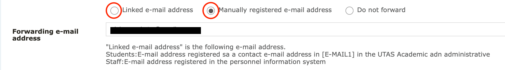
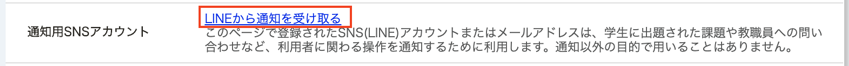
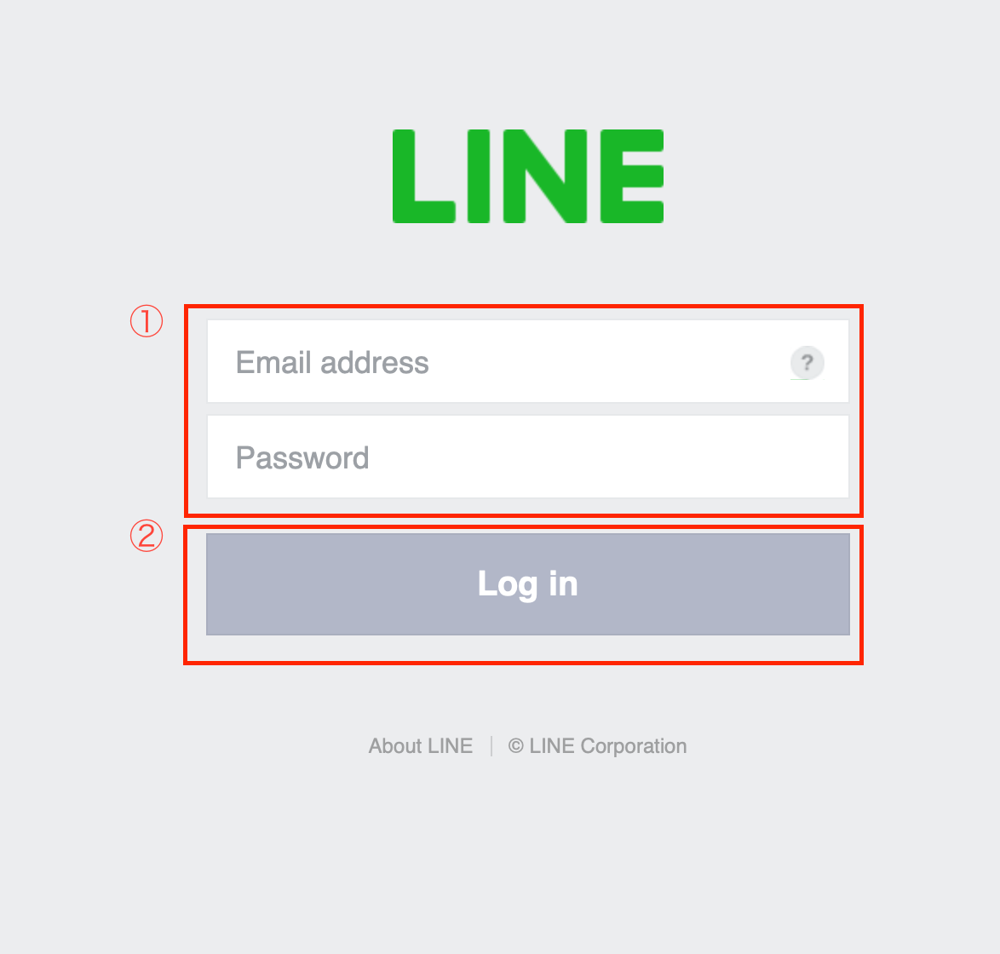
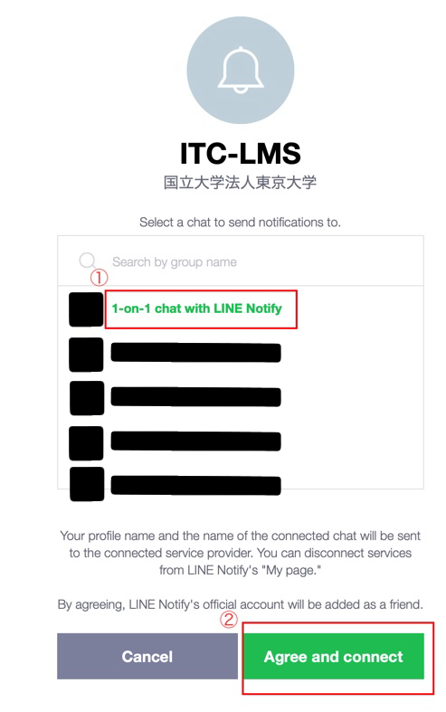
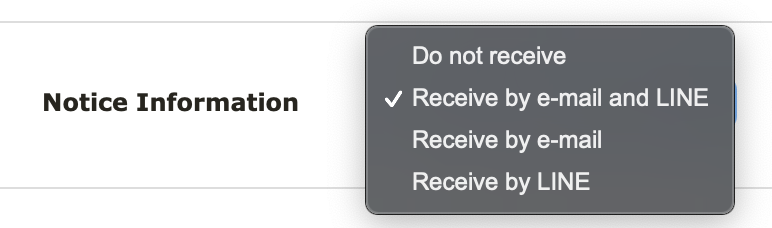
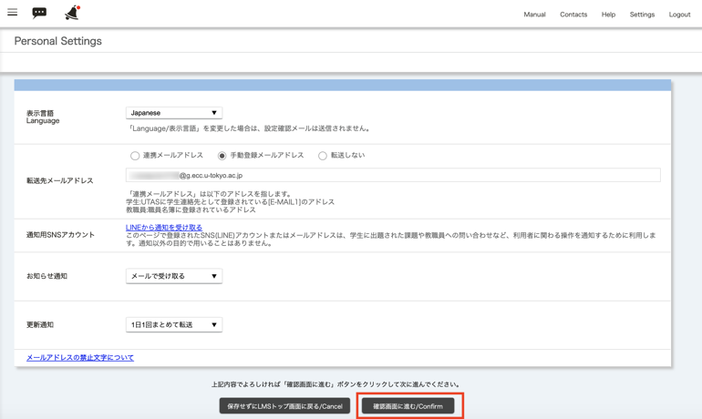
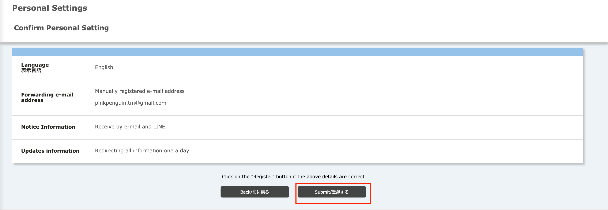
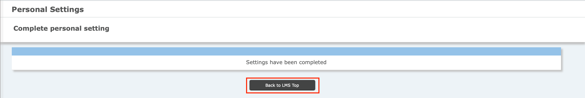

When you log into ITC-LMS, you can see students’ activity (e.g. message to teachers,  or  whether a student submits a homework or not) as a “Notification".  In addition, you can accept the notification by email or LINE application.  Here we introduce how to set the information.

1.You can see timetable on ITC-LMS．Click `Settings` button on top right.

2. The screen shows the settings (See below), you can set notifications from LINE or email on ITC-LMS.

3.If you want to notify by email, please select a `forwarding address`. Set an address that you frequently check.
<!--
学務システム UTAS に登録された連絡先（`[E-Mail1]`）を通知先に使いたい場合には，`連絡メールアドレス`を指定してください．それ以外のアドレスを使いたい場合には，`手動登録メールアドレス`を指定し，直下のボックス（以下の図では表示されていない）にメールアドレスを入力してください．
-->

|指定する項目|効果|
|---|---|
|`連絡メールアドレス`|職員名簿に登録されているアドレスに通知|
|`手動登録メールアドレス`|以下の図の直下のボックスに入力したメールアドレスに通知|
|`転送しない`|メールでは通知しない **（注）LINEで通知を受け取る場合以外，選択しないでください**|

4.If you want to notify by LINE app, select`Receive LINE notification`. **（Caution） Some smartphone, such as iPhone or other iOS device cannot set this settings. In this case, you must use PC（Windows or macOS）instead．**

Like this, you will see LINE log in window. Fill in your mail address and click，`Log in`.

In the next screen, select `Accept Notification from LINE app` and click `consent access`.

When the screen shows "finished setup", go back to `LMS top page`. Then please try to check your settings. 

5. In the two hop-up menu below, select notification and update notification. In the notification, you may receive important notification. **DO NOT SELECT "Reject the notification"．**

6. Click `Proceed to confirmation screen`.

7. Click `Register`.

8.You see "Setup completed", and click `Back to LMS TopPage`.

[Procedures](https://youtu.be/xAur5zar5Sc)

## References
* <a href="https://www.ecc.u-tokyo.ac.jp/itc-lms/faq.html">FAQ (ITC-LMS)</a>
  * <a href="https://www.ecc.u-tokyo.ac.jp/announcement/2014/04/21_1886.html"> How to receive notificartions in English from ITC-LMS  (for instructors/ students)</a>
