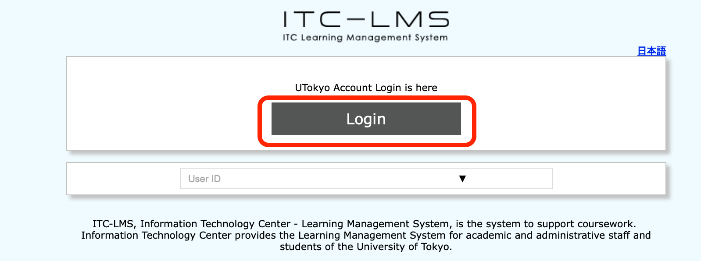
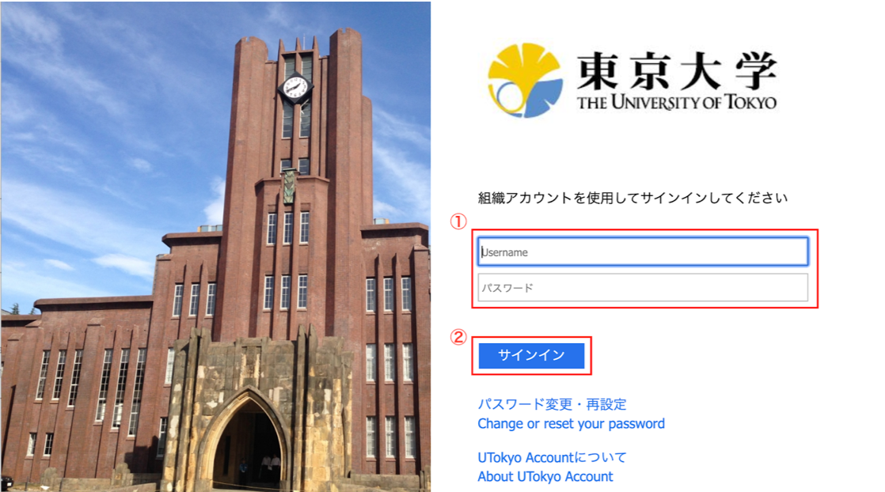

Here we are going to introduce you how to log into ICT-LMS.  The login method is the same for teachers and students.

 1. Access <a href="https://itc-lms.ecc.u-tokyo.ac.jp/login" target="_blank">https://itc-lms.ecc.u-tokyo.ac.jp/login</a> ，and presss "log in". 

 2.If you can see the screen below, enter your common ID (Students: 10-digit ID, Teachers: last 10-digit of 18-digit ID) and click `Sign in`.

[Procedures](https://youtu.be/xAur5zar5Sc)
## References
* <a href="https://www.ecc.u-tokyo.ac.jp/itc-lms/faq.html">FAQ (ITC-LMS)</a>
