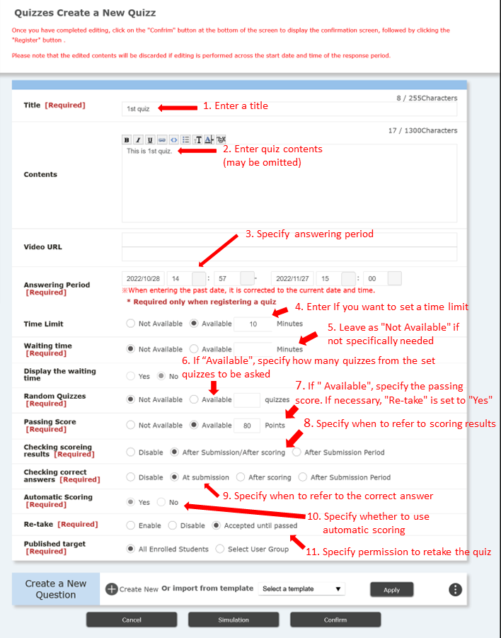
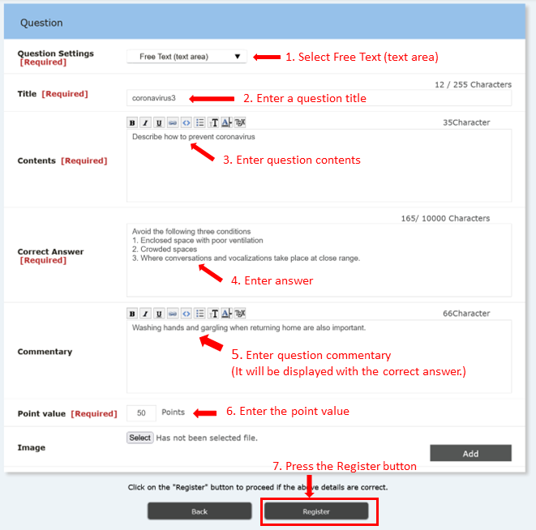
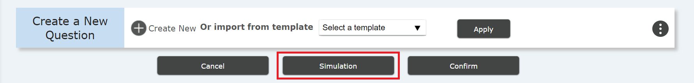

## Overview

* In the "quiz" menu, you can ask questions in a question-and-answer format.
  *This function can be used to check whether students have listened to the class properly and how much students have understood.
    * Due to cheating issues, you need to be careful about how to apply the results of the quiz to your grades.
    * We suppose it is more suitable for casual use such as using it instead of attendance confirmation.
  * It is necessary to decide in advance how to deal with troubles such as not being able to submit answers to a quiz.
    * Various cases are envisioned, such as when a student is unfamiliar with the operation or when the system is overloaded.
    * It is safer not to treat scores strictly until both teachers and students are used to the system.
  * Since various conditions can be set, it is necessary to carefully consider the nature of the quiz before creating it.
    * For students to study on their own, to check their understanding during class, to give grades, etc.
  * Unlike "Assignment", students cannot submit after the deadline.
    * For example, if you want students who did not make it to the deadline to do a quiz with a penalty point, you need to create another quiz with another deadline.

## How to create quizzes

1. Click the ⊕ button at the bottom left of the "quiz," the fifth section from the top of the "Course Summary" screen.
   - Create a new "quiz".

   

2. On the "Test new registration" page, set the following contents.

   1. In "Title", enter the title of the quiz.
   2. In "Quiz content", enter a description of the content of the quiz. It can be omitted.
   3. In the "Answer period", set the period during which students can answer the quiz.
      - If you set "OK" or "OK until reaching the passing score" to "Retake", students can take the quiz as many times they want during this period.
      - If "Retake" is disabled, students can take the quiz only once during this period.
      - For example, you can set the answer period to (1) only during class hours, or (2) until the next class starts, etc.
      - You cannot withdraw the quiz once the answer period starts. Set the start time carefully.
   4. "Time limit" allows you to set the answer time for the entire quiz.
      - In case you choose "Yes", the answer is forcibly terminated when students go over the time limit and the answer at that time will be submitted.
   5. In "Waiting Time", you can set the time to wait before starting the answer.
      - You can use this setting when you want students to read the explanation before starting the quiz.
      - You don’t necessarily have to use this function.
   6. If you choose "Yes" to "Random questions" and select a specific number of questions to ask, the number of questions will randomly be selected from the questions you have prepared in advance.
      - You can use this setting when you want students to take the quiz repeatedly and want to prevent them from using cheating methods such as memorizing the answers in order.
   7. If you choose “Yes” to "Passing Grade", students will take the exam repeatedly until they reach the passing score.
   8. In the "Referring of the scoring result," you set whether or not students are able to refer to their own score after answering, and when they can check the score.
      - You can select from “not possible” (students cannot check their own scores), “at the time of submission” (for automatic scoring), “after scoring” (for manual scoring), or “at the end of the answer period” (after all students have answered).
   9. "Refer to correct answer" allows you to set whether or not students should refer to the correct answer and commentary, and when to refer to it.
      - You can select from “not possible” (students cannot check the correct answers), “at the time of submission” (before scoring in the case of manual scoring), “after scoring”, or “at the end of the answer period” (after all members have answered).
      - When students can refer to the correct answer, the answer may be known to other students who have not / are taking the exam, so please set it appropriately.
   10. In "Automatic scoring", set whether the system will grade automatically when students finish answering the questions, or whether the teacher will grade manually.
       - In order to perform automatic scoring, it is necessary to make all the questions closed questions or a fill-in-the-blank style whose answers should be unique strings of characters (note orthographic variants, such as a difference between full-width and half-width).
   11. In "Retake", set whether students can take the quiz more than once.
       - If the purpose of the quiz is self-improvement, it is a good idea to set the retake as "OK" or "OK until the passing score is reached".
       - If you want to reflect the result of the quiz on students’ grades, it is better to set the quiz retake as "not possible".

   

3. 「設問作成」の「⊕新規作成」で必要な数だけ設問を追加します。

   1. 以下の4種類から選んで設問を作成します。
      - 単一選択形式（ラジオボタン）
      - 複数選択形式（チェックボックス）
      - フリーテキスト形式（テキストエリア）
      - 穴埋め形式
   2. <u>単一選択形式（ラジオボタン）の作り方</u>
      1. 「設問設定」で「単一選択形式（ラジオボタン）」を選択します。
      2. 「タイトル」を入力します。
      	 - 問1などのタイトルであって、設問そのものではありません。
      3. 「設問内容」 で実際の問題文を入力します。
      4. 解答の項目数（選択肢の数）を選択します。
      5. 解答項目（解答の選択肢）を必要な数だけ入力します。
      6. 正解の解答項目のチェックボックスをチェックします。
      7. 解説文を入力します。提出後、採点後、解答期間終了時に学生が参照できます。
      8. 配点を入力します。問題総数や合格点、重要度に応じて決めて下さい。
      	 - 合計点数が何点になるかは事前に確認しておいて下さい。
      9. 「登録する」ボタンを押す

      
   
   
   
   3. <u>複数選択形式（チェックボックス）の作り方</u>
   　 <b>※正解が複数あるだけで、ラジオボタンとほとんど同じです。</b>
      1. 「設問設定」で「複数選択形式（チェックボックス）」を選択します。
      2. 「タイトル」を入力します。
      	 - 問1などのタイトルであって、設問そのものではありません。
      3. 「設問内容」 で実際の問題文を入力します。
      4. 解答の項目数（選択肢の数）を選択します。
      5. 解答項目（解答の選択肢）を必要な数だけ入力します。</b>
      6. <b>正解の解答項目のチェックボックスをすべてチェックします。</b>
      7. 解説文を入力します。提出後、採点後、解答期間終了時に学生が参照できます。
      8. 配点を入力します。問題総数や合格点、重要度に応じて決めて下さい。
      	 - 合計点数が何点になるかは事前に確認しておいて下さい。
      9. 「登録する」ボタンを押す

      
   
   
   
   4. <u>フリーテキスト形式（テキストエリア）の作り方</u>
   　 <b>※正解が文章になっているだけで、ラジオボタンやチェックボックスとほとんど同じです。自動採点は出来ません。</b>
      1. 「設問設定」で「フリーテキスト形式（テキストエリア）」を選択します。
      2. 「タイトル」を入力します。
      	 - 問1などのタイトルであって、設問そのものではありません。
      3. 「設問内容」 で実際の問題文を入力します。
      4. <b>正解の文章を入力します。</b>
      5. 解説文を入力します。提出後、採点後、解答期間終了時に学生が参照できます。
      6. 配点を入力します。問題総数や合格点、重要度に応じて決めて下さい。
      	 - 合計点数が何点になるかは事前に確認しておいて下さい。
      7. 「登録する」ボタンを押す

      
   
   
   
   4. <u>穴埋め形式の作り方</u>
   　 <b>※設問への入力欄の挿入の仕方や自動採点方式の選択などが他と異なります。</b>
      1. 「設問設定」で「穴埋め形式」を選択します。
      2. 「タイトル」を入力します。
      	 - 問1などのタイトルであって、設問そのものではありません。
      3. <b>「設問内容」 で実際の問題文を入力します。</b>
         - 解答の入力欄（穴）を挿入したい場所で「穴埋めタグ追加」ボタンを押します（[fb]という文字列が挿入されます）。
      4. <b>解答項目数（穴の数）を指定します。</b>
      5. <b>正解の文字列を必要な数だけ入力します。</b>
         - 問題文から一意な文字列になるように出題の仕方を注意します。
      6. <b>自動採点方式を指定します。</b>
         - 不正解の解答があった場合の点数の付け方を変えられます。
      7. 解説文を入力します。提出後、採点後、解答期間終了時に学生が参照できます。
      8. 配点を入力します。問題総数や合格点、重要度に応じて決めて下さい。
      	 - 合計点数が何点になるかは事前に確認しておいて下さい。
      9. 「登録する」ボタンを押す

      

4. 受験シュミレーションをします。
   - 「テスト 新規登録」の画面で「受験シュミレーション」ボタンを押します。
   - 一通り試験を受験してみて内容を確かめてみて下さい。
   

5. 確認画面に進みます。
   - 「テスト 新規登録」の画面で「確認画面に進む」ボタンを押します。
   

6. 確認してテストを登録します。
   - 「確認」ボタンを押します。
   

## 参考情報

* <a href="https://www.ecc.u-tokyo.ac.jp/itc-lms/faq.html">FAQ: よくある質問 (ITC-LMS)</a>
  * <a href="https://www.ecc.u-tokyo.ac.jp/announcement/2015/04/08_2029.html">ITC-LMS のテンプレートを別のコースや違うアカウントでも使いたい （教員）</a>
  * <a href="https://www.ecc.u-tokyo.ac.jp/announcement/2014/04/10_1858.html">ITC-LMS で作成したテストを確認する方法 (教員)</a>
  * <a href="https://www.ecc.u-tokyo.ac.jp/announcement/2014/04/23_1889.html">ITC-LMS のテストや課題の評価で利用できる文字について (教員)</a>
  * <a href="https://www.ecc.u-tokyo.ac.jp/announcement/2014/04/23_1888.html">ITC-LMSのテストで、複数の穴埋めを用意した問題を作成したい(教員)</a>
  * <a href="https://www.ecc.u-tokyo.ac.jp/announcement/2014/04/23_1890.html">ITC-LMSのテストで出題時に配点を表示させたい(教員)</a>