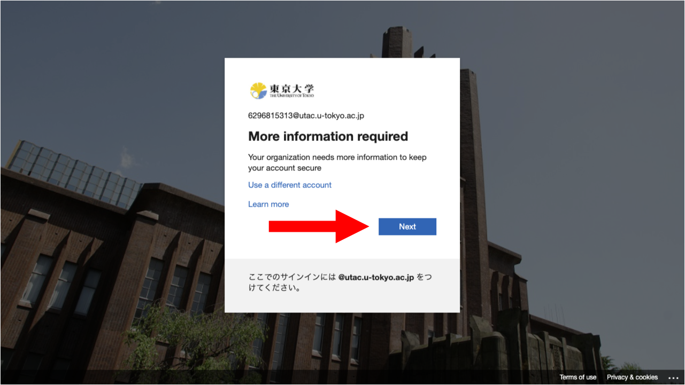

## Introduction
For verification methods in multi-factor authentication for UTokyo Accounts, in addition to smartphone apps such as the “Google Authenticator”, there are PC apps used in conjunction with a specific device called security key. An example of those products is the combination of some models of the “YubiKey” security key and “Yubico Authenticator” app.

This page introduced how to register and sign in by a verification method as YubiKey security key and Yubico Authenticator app for multi-factor authentication for UTokyo Accounts.

YubiKey could also cooperate with another advanced security system “FIDO” for the multi-factor authentication, so please refer to the [FIDO security key in Multi-Factor Authentication for UTokyo Accounts](fido-security_key) for more details. Additionally, even if YubiKey is registered as a FIDO security key, it still can be also registered as an authentication app (which is useful as it allows you to sign in to [some systems where FIDO is not available](fido-security_key#unsupported-system).

## Registration procedures for Yubico Authenticator

To register the combination of YubiKey security key and Yubico Authenticator app as a verification method for multi-factor authentication for your UTokyo account, please follow the four procedures below.

## Installation of “Yubico Authenticator” app

Firstly, you need to download the Yubico Authenticator app to your PC or smartphone and register for the YubiKey.
1. Please install the Yubico Authenticator app from the [download page of Yubico Authenticator](https://www.yubico.com/products/yubico-authenticator/).
2. Connect your YubiKey by following the instructions of Yubico Authenticator app.

### Display of QR code

You need to display the QR code to register the Yubico Authenticator app as a verification method for multi-factor authentication for UTokyo accounts. Since the displaying method of QR code differs depending on the situations, details would be explained separately.

1. Access the [Security info page](https://account.activedirectory.windowsazure.com/proofup.aspx?proofup=1&whr=utac.u-tokyo.ac.jp).
2. The sign in page will appear (if you are not already signed in). Enter your UTokyo Account username (10-digit Common ID) and password and click “Sign in”.

3. Click “Next” in the “More information required” page.
4. Click “I want to use a different authentication app” in the middle of the setup page.

5. Follow the instructions until you reach the QR code page.

### If you have already registered the first verification method

If you have already registered another verification method as your first one and wish to register the Yubico Authenticator app as an alternative verification method, please follow the procedures below.

1. Click "Add method" in the [Security info page](https://account.activedirectory.windowsazure.com/proofup.aspx?proofup=1&whr=utac.u-tokyo.ac.jp)
2. For “Which method would you like to add?”, select “Authenticator app” and click “Add”.

3. Click “I want to use a different authentication app”.

4.Follow the instructions until you reach the QR code page.

### Adding an account to Yubico Authenticator

1. For adding an account to Yubico Authenticator app, please press “Configure Yubikey” at the upper right corner, and press the “Add account” on the screen displayed.

2. Please press the “Scan QR code”, scan the QR code according to the instructions on your screen, and press “Save”.
* If you are using a PC, the QR code displayed on the same screen will be read, not by scanning the QR code by the camera of your PC. Therefore, when you do this process for the first time, it may ask you for the permission of screen recording.

3. The process is completed if you see your account is added in the Yubico Authenticator app.

### Procedures of signing in Yubico Authenticator

1. When you sign in to the UTokyo account (after entering the password), the screen for verifying identity through multi-factor authentication using the default verification method will be displayed. Please press the “Having troubles? Sign in another way” or “I can’t use my Microsoft Authenticator app right now”.

* If you set the default verification method to “App based authentication or hardware token - code”, the screen in step 3 will be displayed from the beginning. Please follow step 3 as step 1 and 2 are skipped.

2. Please press “Use a verification code”.

3. When the input column of “Enter code” is displayed, please open the Yubico Authenticator app with YubiKey connected, check the 6-digit number shown in the app and fill out these numbers into the input column.

