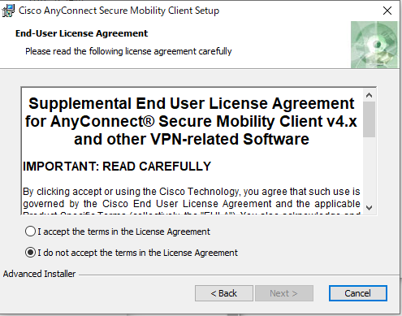

## Introduction
{:#introduction}

UTokyo VPN is a VPN service available to all the faculties and staff of University of Tokyo. When a device is connected to the UTokyo VPN from outside the campus, the device communicates via the VPN gateway installed at the Information Technology Center. Thereafter, the device virtually connects to the UTNET - the University of Tokyo campus network.
To use UTokyo VPN, first install AnyConnect, a VPN client application, on your device. When the installed application is launched, it connects to the VPN gateway through the UTokyo Account authentication process, allowing communication from the device to the outside world through UTNET via VPN.

## Requirements for use
{:#requirements}

This service is available only for an eligible user who has completed the Information Security Training, has a personal computer (PC) with the required operating systems (OS), and can use multi-factor authentication.

**Eligible user:** University of Tokyo faculties and staff and students having a UTokyo Account.

Information Security Training: It is mandatory to take an information security course to use the UTokyo VPN. If you have not attended the annual information security training, please contact: `jouhousecurity.adm __at__gs.mail.u-tokyo.ac.jp` (change `__at__` to @).

**Enable Multi-factor Authentication:** To use UTokyo VPN, you are required to enable multi-factor authentication for your UTokyo Account (please refer to [Using multi-factor authentication](/en/utokyo_account/mfa/) for your UTokyo Account). Thereafter, enable multi-factor authentication for your UTokyo Account (Multi-factor UTokyo VPN will be available 40 minutes after you apply for the authentication).

**Device Types and OS for VPN:** UTokyo VPN is accessible on the following versions of Windows and macOS. Moreover, iPhone, Android, and other smartphones can be used other than the PC, however, currently we do not provide manuals or support for them.

Windows: Windows 11, 10, 8.1
macOS: macOS 12 Monterey, 11 Big Sur, 10.15 Catalina, 10.14 Mojave

**Access to e-journals:** You cannot access e-journals via UTokyo VPN. Please refer to [the EZproxy page on the library website](https://www.lib.u-tokyo.ac.jp/en/library/literacy/user-guide/campus/offcampus/ezproxy) for information on how to use the e-journals, e-books, and databases that the library subscribes to from outside the campus.

## How to use UTokyo VPN on Windows devices
{:#windows}
### Preparation: Download and Install the VPN Client Application.
{:#windows-setup}

Install the application “AnyConnect” on your device to connect to UTokyo VPN.

**Step A:** Go to [https://vpn1.adm.u-tokyo.ac.jp](https://vpn1.adm.u-tokyo.ac.jp). When the UTokyo Account authentication page appears as illustrated below, log in with your UTokyo Account.

**Step B:** After the log-in, a download page for the AnyConnect client application, as illustrated below, will appear. Click “Download for Windows” to download the client application.

After these steps, install the application as you would do for any other Windows application.

If the download page does not appear but is a blank page, please access [this page](https://vpn1.adm.u-tokyo.ac.jp/+CSCOE+/logon.html?tgroup=utvpn-tunnel-group).

**Step C:** End User License Agreement, please select “I accept the terms in the License Agreement” and click “Next” to proceed.

<ul style="display: flex;">
<li style="list-style: none;">
  </li>
<li style="list-style: none;">
  </li>
<li style="list-style: none;">
  </li>
</ul>

**Step D:** If the installation was completed successfully, the VPN client application “Cisco AnyConnect Secure Mobility Client” is added to the application.

You are now ready to use VPN.

### Steps to connect to the UTokyo VPN
{:#windows-connect}

The following steps are required, every time to use the VPN. Please note that your device will not connect automatically to the VPN immediately after booting your PC.

**Step E:** After launching the “Cisco AnyConnect Secure Mobility Client” installed following the Preparation steps, the window illustrated below will appear. Enter **vpn1.adm.u-tokyo.ac.jp** as the VPN server. Click the “Connect” button. 

**Step F:** After clicking the “Connect” button, the following UTokyo Account authentication window appears. Log in with your UTokyo Account.

**Step G:** If the window displaying “Connected: vpn1.adm.u-tokyo.ac.jp” appears as illustrated below, your device is connected to the VPN. Communication is performed via this VPN while connected to the University of Tokyo campus network. Except for some communication platforms such as Zoom and WebEx that do not require a VPN connection and e-journal sites, all communications occur via this VPN, connecting to the University of Tokyo campus network.

**Step H:** To view the current connection status, click on the “Cisco AnyConnect Secure Mobility Client” icon again. If the window displaying “Connected to vpn1.adm.u-tokyo.ac.jp” illustrated below appears, your device is connected to the UTokyo VPN.

To disconnect from the VPN, click the “Disconnect” button in this window.

## How to use UTokyo VPN on macOS devices
{:#macos}
### Preparation: Download and Install the VPN Client Application
Install the application “AnyConnect” on your device to connect to UTokyo VPN.

**Step A:** Go to [https://vpn1.adm.u-tokyo.ac.jp](https://vpn1.adm.u-tokyo.ac.jp). When the UTokyo Account authentication page appears as illustrated below, log in with your UTokyo Account.

**Step B:** After the log-in, a download page for the AnyConnect client application, as illustrated below, will appear. Click “Download for macOS” to download the client application.

After these steps, install the application as you would do for any other macOS application.

If the download page does not appear but is a blank page, please access [this page](https://vpn1.adm.u-tokyo.ac.jp/+CSCOE+/logon.html?tgroup=utvpn-tunnel-group).

**Step C:** During the installation of AnyConnect, a window with the following message “System Extension Blocked” may appear, please click the “OK” button. A window with the following message will appear “AnyConnect System Extension Blocked”. Please follow the instructions to allow the system software from “Cisco AnyConnect Socket Filter”, which is displayed in the “General” in “Security & Privacy” in “System Preferences”. Additionally, the window on the right will also appear, please click “Allow”. 

<ul style="display: flex;">
<li style="list-style: none;">
  </li>
<li style="list-style: none;">
  </li>
</ul>

**Step D:** If the installation was completed successfully, a folder named “Cisco” is created in the Applications folder. In the folder, the AnyConnect client application “Cisco AnyConnect Secure Mobility Client.app” is installed. 

You are now ready to use VPN.

Note: After installing the AnyConnect client application on a macOS 11 Big Sur or later, three extensions with the name “Cisco AnyConnect Socket Filter” are added to the “Network” in the “System Preferences.” These extensions are necessary for shifting networks between VPN and others such as Wi-Fi or LAN. They do not record the contents of communications or send the information outside the host. These extensions' statuses are always “connected (green dot)” regardless of a real connection to the UTokyo VPN. 

### Steps to connect to the UTokyo VPN
The following steps are required, every time to use the VPN. Please note that your device will not connect automatically to the VPN immediately after booting your PC.

**Step E:** After launching the “Cisco AnyConnect Secure Mobility Client” installed following the Preparation steps, the window illustrated below will appear. Enter **vpn1.adm.u-tokyo.ac.jp** as the VPN connection destination. Click the “Connect” button. 

**Step F:** After clicking the “Connect” button, the following UTokyo Account authentication window appears. Log in with your UTokyo Account.

**Step G:** If the window displaying “Connected: vpn1.adm.u-tokyo.ac.jp” appears as illustrated below, your device is connected to the VPN. Communication is performed via this VPN while connected to the University of Tokyo campus network. Except for some communication platforms such as Zoom and WebEx that do not require a VPN connection and e-journal sites, all communications occur via this VPN, connecting to the University of Tokyo campus network.

**Step H:** To view the current connection status, click on the “Cisco AnyConnect Secure Mobility Client” icon again. If the window displaying “Connected to vpn1.adm.u-tokyo.ac.jp” illustrated below appears, your device is connected to the UTokyo VPN.

To disconnect from the VPN, click the “Disconnect” button in this window.

## FAQ:
{:#faq} 

### Troubles with the installation of the VPN client application or connection to VPN
#### Q. In Step A of the Preparation section, the error message “You don’t have access to this” appears.
- It is possible that your application for multi-factor authentication has not been completed. Please see [this page](/en/utokyo_account/mfa/) to enable multi-factor authentication for your UTokyo Account.

#### Q. In Step B of the Preparation section, the download page does not appear and a blank page is displayed.
- Please access [this page](https://vpn1.adm.u-tokyo.ac.jp/+CSCOE+/logon.html?tgroup=utvpn-tunnel-group) and try downloading.

#### Q. In Step B of the Preparation section, the error message “Unable to update the session management database” is displayed, and the download page is not displayed.
- There is a possibility that you have not completed the information security training course. If that is the case, you cannot use UTokyo VPN. Please contact the Security Team of the Information Environment Division at the headquarters, `jouhousecurity.adm __at__ gs.mail.u-tokyo.ac.jp` (change `__at__` to @), with your UTokyo Account user name.

#### Q. In step D of the How to use UTokyo VPN section, the error message "AnyConnect profile settings mandate a single local user, but multiple local users are currently logged into your computer. A VPN connection will not be established" appears.
- It is possible that multiple users are simultaneously logged in on the device that is trying to connect to the UTokyo VPN, please log off all the users except the user connecting to the VPN.

#### Q. I want to use a local printer even when connected to UTokyo VPN.
- When you are connected to UTokyo VPN, the communication to the local network to which your computer is connected also goes through the VPN. Click the gear button on the bottom left of the AnyConnect Secure Mobility Client window. The following window will appear. In the "Preferences" tab of this window, check the "Allow local (LAN) access when using VPN (if configured)" check box.

<ul style="display: flex;">
<li style="list-style: none;">
	
	
 In case of Windows 

</li>
<li style="list-style: none;">
	
	
 In case of macOS 

</li>
</ul>

### Troubleshooting
#### Q. Does "UTokyo faculty and staff with a UTokyo Account" mean those who are employed by UTokyo? Or does it include temporary staff, visiting researchers, and others who are working or conducting research at UTokyo?
- A. In addition to the former category, it includes temporary staff, visiting researchers, and others who are working or conducting research at UTokyo.

#### Q. Can I access the employee ID card issued and employment management system from off-campus?
- A. Yes, you can access the employee ID card issued and employment management systems from off-campus by connecting to the UTokyo VPN.

#### Q. Will I be able to view internal departmental websites?
- A. No. It depends on the access restrictions of your departmental site. You are required to ask your department.

#### Q. Is it necessary to get a new account every six months like a UTokyo Wi-Fi account?
- UTokyo VPN authentication is done with a UTokyo Account, not a UTokyo Wi-Fi account. Therefore, you can continue to use UTokyo VPN without changing it. However, users are required to complete an information security training session, annually.

#### Q. I arrived after the period of the information security training was over.
- You can use the UTokyo VPN from the time you arrive. Please read the "Information Security Education Materials" on the Information Security Education page carefully before using UTokyo VPN. If you have not completed the training, you face the risk of being banned from the VPN connection sooner or later.

#### Q. Can I apply for and set up UTokyo VPN outside of the campus?
- Yes, you can.

## Regulations
{:#regulations}
- UTokyo VPN Usage Regulations
- UTokyo VPN Operation Regulations

## Inquiry form
{:#inquiry-form}
Please use [this UTokyo VPN inquiry form](https://forms.office.com/r/U0R5L40D3e) to contact us.