## Roles

### Webex Meetings

Below are some of the main privileges in Webex Meetings. ([“What Are the Different Roles in Webex Meetings?”](https://help.webex.com/en-us/article/WBX9000028575/What-Are-the-Different-Roles-in-Webex-Meetings?))

+ **Host:** In addition to starting and ending meetings, the Host can assign the Presenter role to participants, manage breakout sessions, move participants to the lobby or let them into meetings, launch Slido, and record meetings. The host can also mute other participants.
+ **Cohost:** The Cohost has much of the same privileges as the Host and can assist the Host in smoothly carrying out the meeting.
+ **Presenter:** Those in the Presenter role can share content. If the Host has “Anyone can share” enabled, any participant who shares their content will automatically be assigned the Presenter role. When “Anyone can share” is disabled, only participants who are assigned as Presenters by the Host/Cohost can share content and run polls.
+ **Attendee:** Those in the Attendee role can unmute themselves and transmit video. They can also chat with other participants. Attendees cannot unmute themselves if the Host has disabled the “Allow attendees to unmute themselves” setting.

### Webex Webinars

Below are some of the main privileges in Webex Webinars. ([“Roles in Webex Webinars”](https://help.webex.com/en-us/article/nme90adb/Roles-in-Webex-Webinars))

+ **Host:** In addition to starting and ending events, the host can manage the privileges of other participants.
+ **Cohost:** The Cohost has almost the same privileges as the Host and can assist the Host in smoothly carrying out the meeting.
+ **Presenter:** Those in the Presenter role can share content. They can also mute and unmute themselves. 
+ **Panelist:** The Panelist can take part in Q&A sessions with participants. They can also mute and unmute themselves.
+ **Attendee:** Attendees cannot transmit video and cannot unmute themselves, but must wait for the Host to unmute them. Also, since the assumption is that people who are unfamiliar with each other will be participating in the same event, Attendees cannot chat amongst themselves, but can only chat with the Host, Panelist, or Presenter. The sole exception is that Attendees can view Q&A sessions with other Attendees.

## Screen Layout

+ Once you enter the meeting/webinar, you will encounter the following screen.

+ There is an array of buttons located on the bottom of the screen. The screen may look different depending on your situation. For example, some buttons may be hidden from you depending on your privileges, and you may not be able to see some of the labels depending on the size of your Webex window.
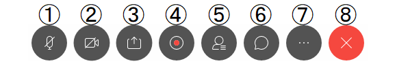

1. **Mute**: This button turns black when your microphone is activated. The button turns red when you are muted. When the microphone is picking up and delivering sound, an animation will play inside the microphone icon. **As a rule, make sure to keep yourself muted (i.e., keep the icon red) whenever you are not speaking, to prevent unexpected sounds from being heard by other participants.** You can unmute yourself by holding down the space key while the Webex window is active (releasing the space key will put you on mute again).
1. **Video**: When this button is black, that means your video is turned on. The button turns red when your video is turned off. **If your network environment is unstable, try turning off the video (i.e., turning the icon red).**
1. **Sharing**: Using this feature, you can share materials with other participants by sharing your screen. You can share your entire screen or allow others to only view specific application windows. You can use this feature to share content such as your PowerPoint slides or videos with others. In addition, there is a whiteboard feature that allows you to share your handwritten notes on the spot.
1. **Recording (for Hosts and Cohosts only)**: You can record your discussions during meetings so you can view them later. The recordings can be stored on the cloud (i.e., on the Webex server) or saved directly to your computer. However, depending on your settings, you may be unable to save your recordings directly to your computer. Note that the Cohost can start a recording only if the Host is not in the session.
1. **Reactions**: You can send reactions, such as raising your hand or giving a thumbs up.
Other Options: Other options can be accessed from here.
1. **Leave**: Click this button to leave the meeting. If you are in a breakout session, you can press this to leave the breakout session and return to the main meeting.
1. **Apps**: You can access third-party apps such as Slido from here.
1. **Participants**: Clicking the “Participants” button will display the participant list. By moving your mouse on top of the name of a participant on the list, you can send personal messages or remove that participant from the meeting by using the drop-down menu.
1. **Chat**: Clicking the chat button will display the chat window, from where you can send messages to everyone or a specific participant.
1. **Panel options**: You can click on this button to display the Notes, Polling, and Q&A windows.

Below is some additional information regarding the items on the menu that are most frequently used.

## Screen Sharing

Click “Share” to see the windows that are available for you to share. Choose the desired window and press  “Share” to start sharing.
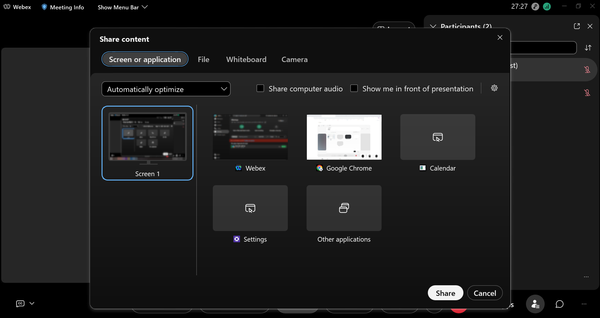

+ Select “**Screen 1**” to share your entire screen with all participants. (If you are using multiple monitors and have several screens, then you will have more options to choose from, such as “Screen 1,” “Screen 2,” and so on.)  
+ The window you currently have opened will also be shown among the options. You can choose to share only specific windows. If you do not want others to see other areas of your screen, you should select a specific window for sharing.
+ Select “**New whiteboard**” to share a whiteboard screen that you can freely write on.
+ Click the speaker icon to the right of “**Automatically optimize**” to choose whether to share audio that is played on your computer.

### Annotating While Screen Sharing

Moving up your mouse while screen sharing will display the control menu for your Meeting/Webinar. Click on the “Annotate” button to show the annotation palette. This will allow you to draw lines, arrows, squares, etc., over the currently displayed images and share them.  If you click the topmost icon on the annotation palette, the palette will also be displayed on the screens of the other participants, who can then make their own annotations. You can use this feature to have participants answer simple Yes/No questions, for example.

Sharing your whiteboard will enable annotations for both you and the participants. (You can turn this feature off if necessary.)

## Advanced Settings for Speakers, Microphones, and Cameras

<figure>

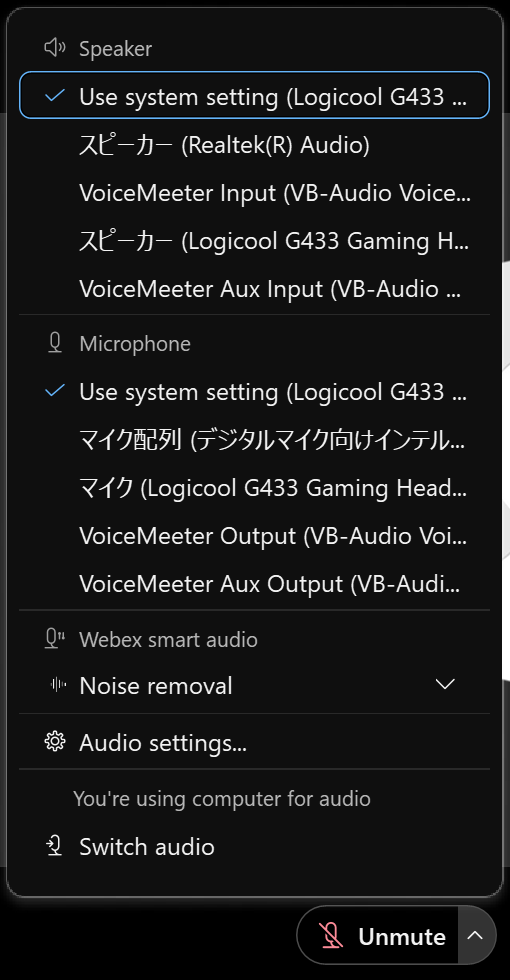
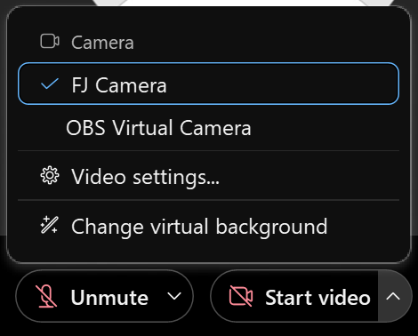

</figure>

Click the arrow signs to the right of the “Mute” and “Camera” buttons to choose the speaker, microphone, and camera you want to use for Webex.

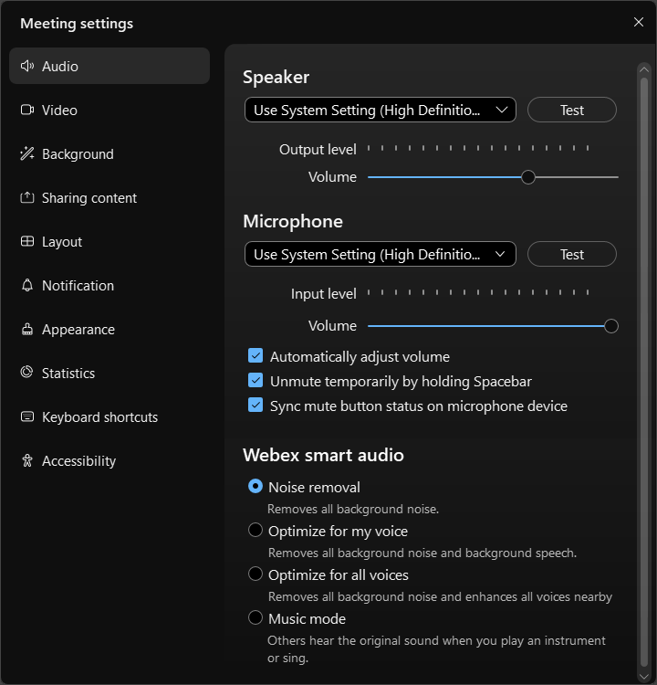{:width="600px"}
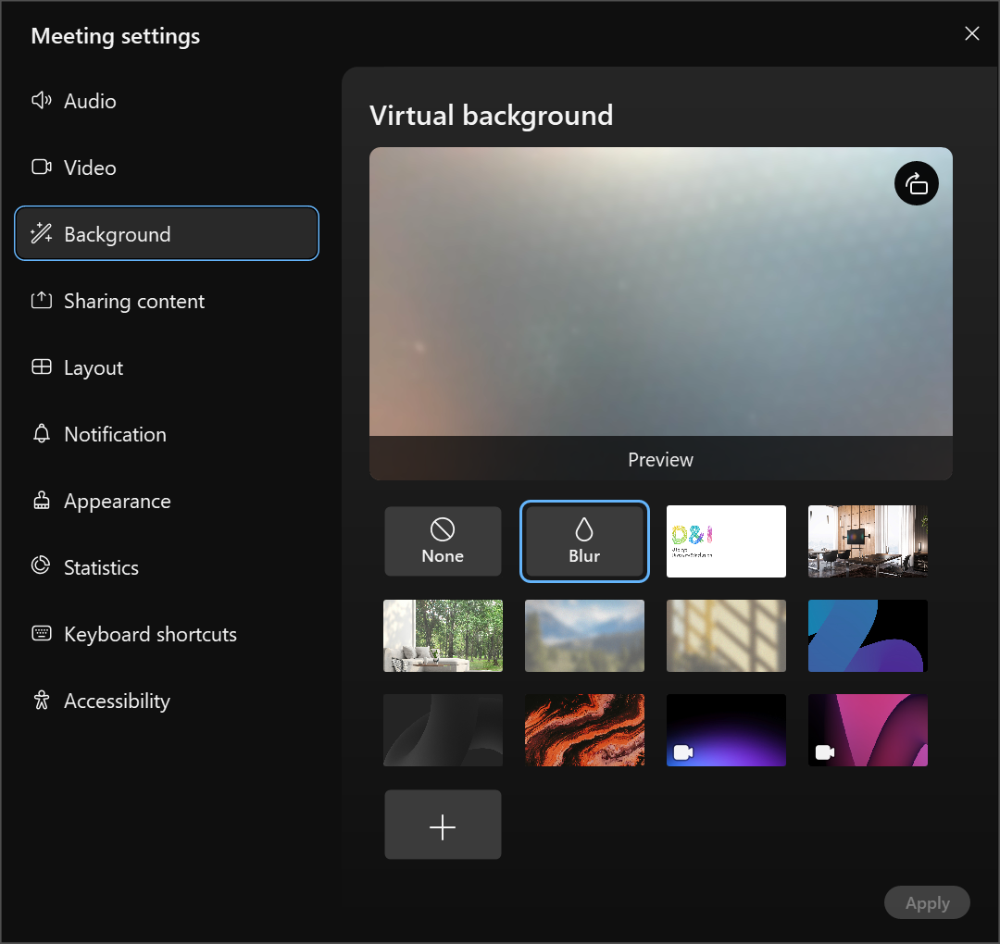{:width="600px"}

Click “Settings” to select and test the different options.

+ **Speaker**: Select the speaker you want to use. (If you have any additional speakers connected to your device, you need to choose from among several options.) Click “**test**” to hear a confirmation sound.
+ **Microphone**: Select the microphone you want to use. (If you have any additional microphones attached to your device, you need to choose from among several options.) If the microphone is picking up sound correctly, you will see movement on the meter below. Click “**test**” to have the microphone take a short recording and playback the audio to you so you can check that it is working correctly. If necessary, check “**Automatically adjust volume.**” Generally speaking, it is recommended that you enable “**Noise removal**,” but if someone else is talking nearby, choosing “**Optimize for my voice**” may help to filter out their voice. Selecting “**Music mode**” will disable the noise reduction feature, which means that the microphone will pick up background music and noise.
+ **Camera**: Select the camera you want to use. (If you have any additional cameras attached to your device, you need to choose from among several options.) A preview of the camera will be displayed immediately below, so you can check the video feed. You may also set up a virtual background. **However, note that virtual backgrounds may not work with low-performance devices.**

## Participants

Clicking on “Participants” will display the participant list.

<figure>

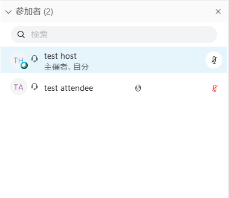
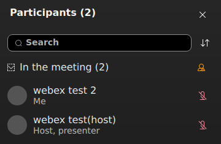

</figure>

The image on the left shows the host’s screen, while the image on the right shows the participant’s screen.

+ **Hand Icon**: When any participant other than the host clicks on the hand icon, this signifies that they are raising their hand. In the above image, the test attendee is raising their hand.
+ **Microphone Icon**: When a participant’s microphone icon is red, this means that they are muted. The host can also mute participants. In the above image, both the test host and test user have their microphones muted.
+ You can search or reorder the participant list as necessary.
+ In Webex Webinars, those who are participating as attendees can only see themselves on the list, and cannot see other participants.

## Operating Slido

When the host activates Slido, the Slido panel will appear.

<figure>

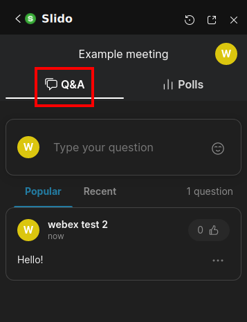
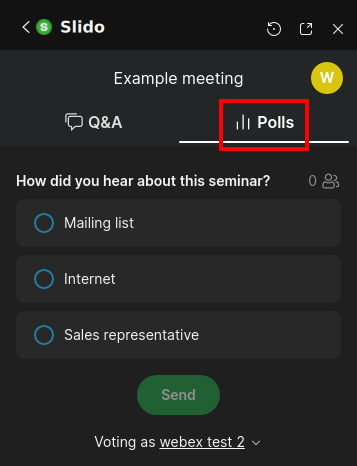

</figure>

+ When the host runs a Poll, a response page will appear under the Voting tab of the participants’ screens.
+ Questions can be managed under the Q&A tab.
+ The basic instructions are the same as the web version.

## Chat

Clicking “Chat” will enable you to send text messages. You cannot view chat messages that were sent before you joined the meeting.
{:width="350px"}

+ **To**: You can change the recipient of the message. Select “Everyone” to send your message to all participants.

## Q&A

Click “Q&A” to send a question to the host, presenter, or (if you are using Webex Webinars) the panelist.

<figure>

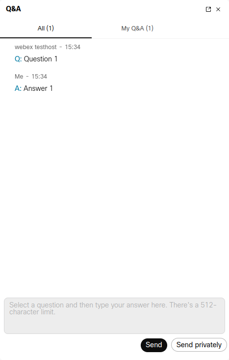
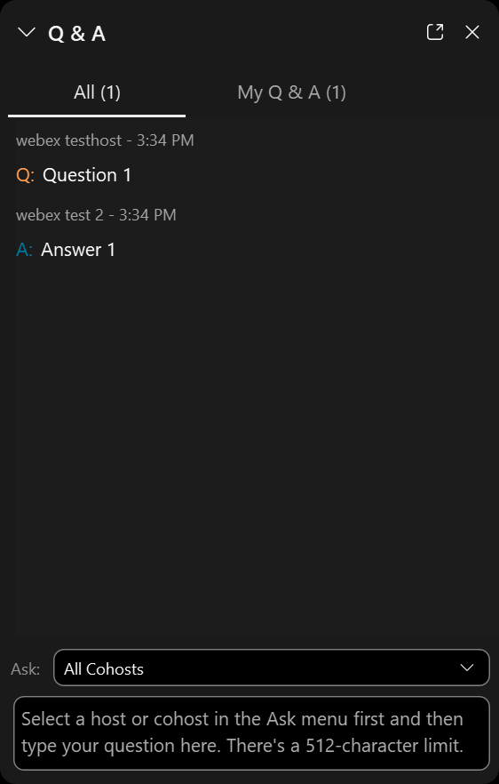

</figure>

+ The image on the left shows the host’s screen, while the image on the right shows the participant’s screen. Once all respondents have submitted their answers, both screens will be shared with the participants. Participants who joined while the meeting is in progress can also read past Q&As.
+ You can use the drop-down menu to limit respondents to specific individuals, such as the Host.
+ The Host can click on “Send Privately” and choose from among the following options: “Respond Privately,” “Defer,” and “Dismiss.” For example, you can select “Respond Privately” to send responses that should not be made public to all participants, or select “Defer” for questions that require further research and cannot be answered immediately. 

## Breakout Sessions

Using the breakout session feature, you can create several “breakout sessions” in addition to the “main meeting.” Participants can divide into their respective breakout sessions for discussions or return to the main meeting as necessary. **A maximum of 100 breakout sessions can be created.**
**The breakout session feature cannot be used for End-to-End Encrypted Meetings.**
Participants can move between sessions by pressing the “Join” button. They can also return to the main meeting by pressing the “Leave” button. (In some cases, the participant’s movements may be restricted by the Host.)
<figure>

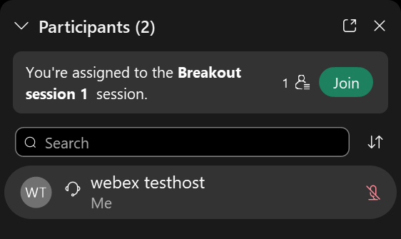

</figure>

During breakout sessions, participants can share videos or screens and send each other chats, just like in the main meeting. (The instructions are the same as sessions that are not breakout sessions).
Furthermore, you can ask the Host for help. Asking for help will notify the Host, who may then come to your session. However, you cannot request help from a Host if they are participating in one of the sessions, in which case you will need to wait.
{:width="400px"}

For specific instructions for Hosts, see [Things You Can Do in Webex Meetings and Webex Webinars (as Host)](do_webex_host).

## Lobby Feature (Only for Webex Meetings)

Participants who attempt to join a locked meeting will first be sent to the Lobby.
**In End-to-End Encrypted Meetings, participants who have already joined the meeting cannot be sent to the Lobby.**

{:width="600px"}

[Back to How to use Webex](.)
