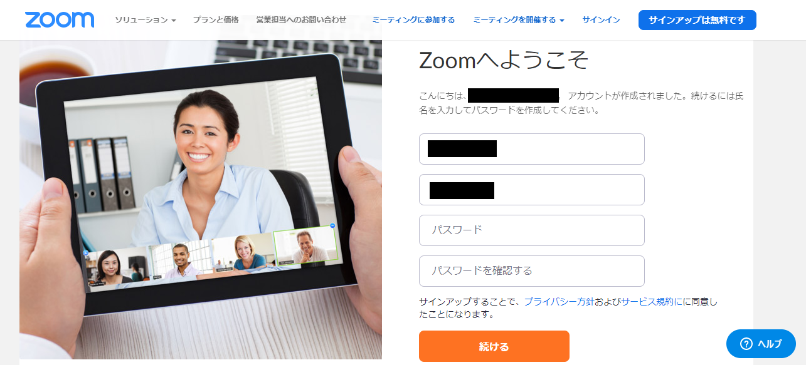

## お知らせ

* 授業を行うためにZoomの会議を<font color="green">開催する人</font>(またはそれを代行する人)は, <a href="create_account" target="">Zoomのアカウントのアクティベーション</a>が<font color="green">必要</font>です
* 授業に<font color="purple">参加するだけの人</font>(正確には誰かが開催したZoom会議に参加(join)するだけの人)はZoomアカウントのアクティベーションは<font color="purple">不要</font>です

* 教職員および3/24時点でUTokyo Accountを持っていた学生のECCSクラウドメール(G Suite for Education)のGmailアドレス (xxxxx@g.ecc.u-tokyo.ac.jp)に, 大学で契約するZoom Pro (500人までの会議とWebinarが可能) のアカウントのアクティベーションを招待するメールが届いています(3/16 教職員あて, 3/24-25 学生あてに発出)
 * アカウントのアクティベーションが必要(授業や会議の開催, その代行をする人), またはしたい人は, ECCSクラウドメールを開いてそのメールを取得し, 本ページを参考にアクティベーションを行って下さい. <a href="https://hwb.ecc.u-tokyo.ac.jp/wp/literacy/email/initialize/">ECCSクラウドメールの設定</a>をしていない方はして下さい.
 * アクティベーションしようとしたら<font color="red">「ユーザが存在しません」というエラーが出る</font>という事例が多く報告されております. そうなったら<a href="https://tinyurl.com/v5pvzb5">現在わかっている最善の対処方法</a>をご覧いただき, フォームへの質問にもお答えください. 解決しない場合は utelecon-inquiries@googlegroups.com へご連絡下さい.

* そのほか問題が生じた場合も、utelecon-inquiries@googlegroups.com までご連絡ください。


## Zoom license activated by this email 

 * [Zoom Pro](https://www.zoom.us/pricing/?zcid=2502&creative=372836060623&keyword=%2Bzoom%20%E8%A8%98%E9%8C%B2&matchtype=b&network=g&device=c&gclid=Cj0KCQjwx7zzBRCcARIsABPRscOD9-6-XKTSyUy5gK7SieIY89abNP-_0OcXGIezRfUuLq-BCwSJfCAaAiN9EALw_wcB)
 * Allows up to 500 participants per meeting 
 * Valid until 4/30 April. Whether or not the contractContract is continuation continued after that this date is currently under consideration.

## Preparation in advance 

If you have not yet activated your <a href="https://www.ecc.u-tokyo.ac.jp/announcement/2016/02/08_2116.html" target="_blank">「ECCS Cloud Email」 (G Suite for Education)</a>, go to the <a href="https://utacm.adm.u-tokyo.ac.jp/webmtn/LoginServlet" target="_blank">UTokyo Account user menu</a> (<a href="https://hwb.ecc.u-tokyo.ac.jp/wp/literacy/email/initialize/" target="_blank"> details on the procedure </a>). Xxxx@g.ecc.u-tokyo.ac.jp If you can use this email address, it is already activated. 

## How to create an account 

1. The following invitation e-mail was will be sent to all faculty academic and administrative staff members (March 16, 2020) and all students (March 24 to 25, 2020, some students have may not be been able to create them their account and we are currently investigating the cause)., Has arrived in your to their ECCS cCloud eEmail. Please Log into Gmail with your ECCS cloud email account and to open it the invitation (students invitation will be sent at a later date). 
    


1. Click "Activate Zoom Account" in the email.  
  
1. The following screen will appear on the web browser. Click on the "Sign up with password" below.   
  * To[any person who by mistake pressed "Sign in with Google](#if_you_create_a_wrong_account) on the previous screen
  
  
1. Set your name and password and press "Continue"  
  
  
1. The account setting ishas been completed. If necessary, make dDetailed settings can be made using in "Start Zoom Meeting Now" or "My Account" if necessary. 
  
  
  
With the above flow, you can create an account. 

<a name="if_you_create_a_wrong_account"> </a>
## 間違えて作ってしまった人は

上記で「Googleのサインイン」でアカウントをアクティベートしてしまうと, 正しくZoom Proのライセンスが有効になりません. 回復するために以下のどちらかを行ってください.

### 回復方法1: アクティベーションメールを再送してもらう.

情報戦略チーム jouhousenryaku.adm@gs.mail.u-tokyo.ac.jp へ以下の文面で連絡をお送りください

```
◯◯(所属)の◯◯です
UTokyo Account (10桁の共通ID)は, ◯◯◯◯◯◯◯◯◯◯です

Zoomアカウントを間違えてアクティベートしたので, アクティベーションのメールを再送してください

```

例:

```
情報基盤センターの田浦健次朗です
UTokyo Account (10桁の共通ID)は, 261....608です

Zoomアカウントを間違えてアクティベートしたので, アクティベーションのメールを再送してください

```

### 回復方法2: 自力で回復する
1. [Zoomホームページ](https://zoom.us/) へ行く
1. もし Sign In 中であれば, 以下のように「マイアカウント」というボタンが現れる
 
ので, それを押す. 以下のような画面になるので
 
「サインアウト」をクリックする.
1. 再び[Zoomホームページ](https://zoom.us/) へ行くと今度は以下のように「サインイン」ボタンが現れる
 
ので, それを押して, 以下のように入力画面を表示し,
 
<font color="red">「パスワードをお忘れですか」</font>へ進む(ここがポイント).
1. 以下のメールアドレスの窓に,
 
<font color="red">10桁の共通ID@g.ecc.u-tokyo.ac.jp</font> を入力. 「送信」すると，アクティベーション用のリンクがあなたのECCSクラウドメールアカウント (xxxx@g.ecc.u-tokyo.ac.jp) に送られてきます.  <font color="red">注:</font> 指定するメールアドレスは, 10桁の共通ID@g.ecc.u-tokyo.ac.jp ですが, 実際にはあなたがECCSを初期設定した際に指定したアカウントで読むことができます(両者はエイリアスになっています. (<a href="https://www.ecc.u-tokyo.ac.jp/announcement/2020/03/12_3139.html" target="_blank">説明</a>).
 
