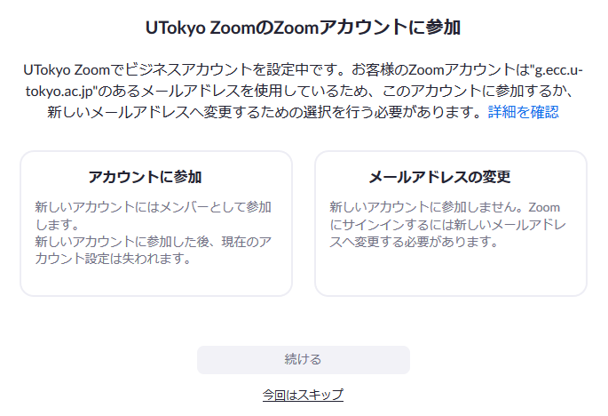

## Notice

* **The method of creating an account has changed significantly. You can now create an account without an invitation email**
* Click here](create_account_invitation)in case you have been sent an invitation email on the evening of May 16, 2020

## Zoom license activated by this email

 * [Zoom Pro](https://www.zoom.us/pricing/?zcid=2502&creative=372836060623&keyword=%2Bzoom%20%E8%A8%98%E9%8C%B2&matchtype=b&network=g&device=c&gclid=Cj0KCQjwx7zzBRCcARIsABPRscOD9-6-XKTSyUy5gK7SieIY89abNP-_0OcXGIezRfUuLq-BCwSJfCAaAiN9EALw_wcB)
 * Up to 500 participants per meeting
 * Available until the end of 2020

## Preparations

If you have not yet activated your <a href="https://www.ecc.u-tokyo.ac.jp/announcement/2016/02/08_2116.html" target="_blank">「ECCS Cloud Email」 (G Suite for Education)</a>, please go to <a href="https://utacm.adm.u-tokyo.ac.jp/webmtn/LoginServlet" target="_blank">UTokyo Account User Menu</a> (<a href="https://hwb.ecc.u-tokyo.ac.jp/wp/literacy/email/initialize/" target="_blank">details</a>). Those who can use the xxxx@g.ecc.u-tokyo.ac.jp e-mail address, your account have already been activated.

## How to create an account

1. Go to [Zoom's sign-up (account creation) page](https://zoom.us/signup), enter your birthday, and then enter the  **common ID 10 digits @g.ecc.u-tokyo.ac.jp (please use the original 10-digits email, even if you have altered it)**. Press "Sign up"（**do not press "sign in with Google"**). 
[Click here in case of trouble](#ng_signup)  
   

1. Log in to [ECCS Cloud Email](https://mail.google.com/a/g.ecc.u-tokyo.ac.jp), open the email "Activate your Zoom account" from Zoom, and click "Active Account" to create an account.  
    
  
1. After creating an account, sign in from the[Zoom sign-in page](https://zoom.us/signin). The screen will display "Join UTokyo Zoom's Zoom account" as shown in the image below. Click "Join account" and then "Continue". 
    

1. Check if the account name on the [Zoom  account Profile Page](https://zoom.us/account) is displayed as "UTokyo Zoom". If so, the account creation process was successful.

  * Immediately after creation , even if the user type is Basic on the profile page（[https://zoom.us/profile](https://zoom.us/profile)）, it will be changed to Licensed within an hour, so please wait for a while. 
  * Even when your account is changed to "Licensed", it will say "Free trial" on the account profile page（[https://zoom.us/account](https://zoom.us/account)). 
  
  
## Trouble-shooting

### I'm having trouble signing up for Zoom
* Please confirm if you have not already created an account with a 10 digit common ID @g.ecc.u-tokyo.ac.jp
  * Please try signing in with the common ID 10 digit @g.ecc.u-tokyo.ac.jp address on the[Zoom sign-in page](https://zoom.us/signin)(if you are already signed in with another account, please sign out).
  * If you do not know the password, enter the 10-digit common ID @g.ecc.u-tokyo.ac.jp address on the [password reset page](https://zoom.us/forgot_password), and use the email from Zoom that came to ECCS Cloud Email to enter the password. Reset your passsword.

### User type is now Basic instead of Licensed
* If you have a Zoom account with a common ID of 10 digits @g.ecc.u-tokyo.ac.jp, it will be licensed within an hour, so please wait a moment.

## In case it still does not work
* Please use the chat support at the bottom right
* If that does not work , please use the email-specific [trouble support](/supports/) provided by Zoom.
 
