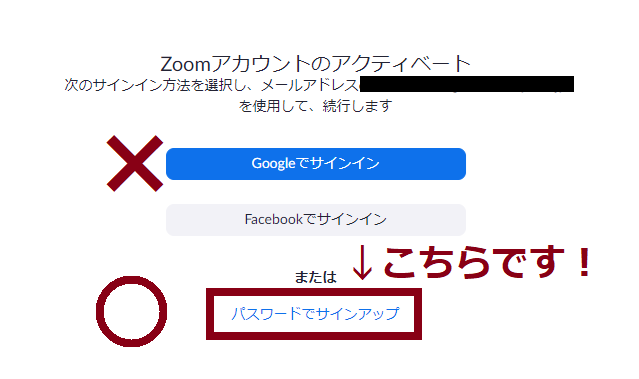

## Notice

* As of May 16, 2020, **you can [create and account](create_account) without using an invitation email**
* This page is intended for those who sent an invitation email individually on the evening of May 16, 2020, so please read the [account creation page](create_account)and create it.

## Zoom license activated by this email

 * [Zoom Pro](https://www.zoom.us/pricing/?zcid=2502&creative=372836060623&keyword=%2Bzoom%20%E8%A8%98%E9%8C%B2&matchtype=b&network=g&device=c&gclid=Cj0KCQjwx7zzBRCcARIsABPRscOD9-6-XKTSyUy5gK7SieIY89abNP-_0OcXGIezRfUuLq-BCwSJfCAaAiN9EALw_wcB)
 * Up to 500 participants in one meeting
 * Available until the end of 2020

## Preparations

If you have not activated your <a href="https://www.ecc.u-tokyo.ac.jp/announcement/2016/02/08_2116.html" target="_blank">「ECCS Cloud Mail」 (G Suite for Education)</a> yet, please go to <a href="https://utacm.adm.u-tokyo.ac.jp/webmtn/LoginServlet" target="_blank">UTokyo Account User Menu</a> and activate your account(<a href="https://hwb.ecc.u-tokyo.ac.jp/wp/literacy/email/initialize/" target="_blank">details</a>). Those who can use the xxxx@g.ecc.u-tokyo.ac.jp email have already activated their account.

## How to create an account

1. The following invitation email has arrived from Zoom in your ECCS cloud email. [Log in](https://mail.google.com/a/g.ecc.u-tokyo.ac.jp) to Gmail with your ECCS cloud email account and open it.
    


1. Click on "Activate Zoom Account" in the email. 

1. The following screen will appear in your web browser. Click "Sign up with password" below (do not press "Sign in with Google"). 
  * To those who [mistakenly pressed "Sign in with Google"](#if_you_create_a_wrong_account) to create an account.
  
  
1. Set your name and password and press "Continue"  .
  
  
1. The account setting is completed. If necessary, set detailed settings in "Start Zoom meeting now" or "My account".
  
  
  
Like that, you can create an account.

<a name="if_you_create_a_wrong_account"> </a>
## In case you made a mistake and clicked on "Sign in with Google" to create an account

If you activated your account with "Google Sign-in", the Zoom Pro license will not be activated correctly. Please do either of the following to recover the correct account.

### Recovery method 1: Have the activation email resent.

Please contact the Information Strategy Team jouhousenryaku.adm@gs.mail.u-tokyo.ac.jp with the following text (For part-time lecturers, write the department in charge of the lecture at the University of Tokyo).

```
◯◯(所属、身分)の◯◯です
UTokyo Account (10桁の共通ID)は, ◯◯◯◯◯◯◯◯◯◯です

Zoomアカウントを間違えてアクティベートしたので, アクティベーションのメールを再送してください

```

Example:

```
情報基盤センター教授の田浦健次朗です
UTokyo Account (10桁の共通ID)は, 261....608です

Zoomアカウントを間違えてアクティベートしたので, アクティベーションのメールを再送してください

```

### Recovery method 2: Recover by yourself
1. [Zoomホームページ](https://zoom.us/) へ行く
1. もし Sign In 中であれば, 以下のように「マイアカウント」というボタンが現れる
 
ので, それを押す. 以下のような画面になるので
 
「サインアウト」をクリックする.
1. 再び[Zoomホームページ](https://zoom.us/) へ行くと今度は以下のように「サインイン」ボタンが現れる
 
ので, それを押して, 以下のように入力画面を表示し,
 
<font color="red">「パスワードをお忘れですか」</font>へ進む(ここがポイント).
1. 以下のメールアドレスの窓に,
 
<font color="red">10桁の共通ID@g.ecc.u-tokyo.ac.jp</font> を入力. 「送信」すると，アクティベーション用のリンクがあなたのECCSクラウドメールアカウント (xxxx@g.ecc.u-tokyo.ac.jp) に送られてきます.  <font color="red">注:</font> 指定するメールアドレスは, 10桁の共通ID@g.ecc.u-tokyo.ac.jp ですが, 実際にはあなたがECCSを初期設定した際に指定したアカウントで読むことができます(両者はエイリアスになっています. (<a href="https://www.ecc.u-tokyo.ac.jp/announcement/2020/03/12_3139.html" target="_blank">説明</a>).
 
