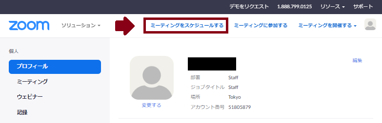
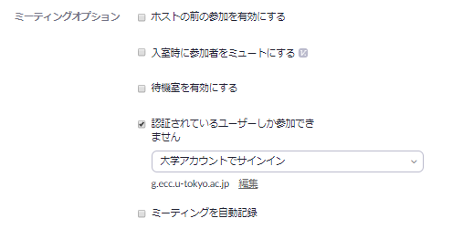
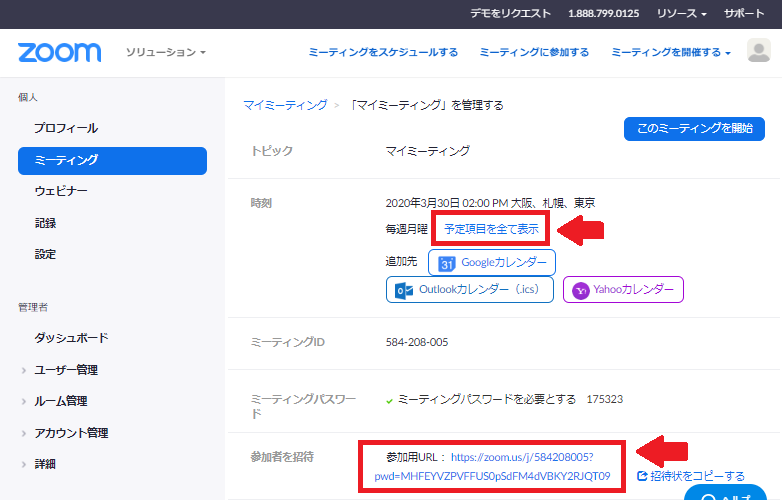

* Updated on 2020/03/28
* Click [here](create_room_software)for information on how to use the Zoom software.  

This section describes how to create a Zoom conference room using a Web browser（Reference: [Reserve a room (meeting room) where the URL used for all 13 lessons does not change](how_to_use_in_classroom_faculty_members#schedule)）．  

１．Open a web browser and goo to the <a href="https://zoom.us/profile" target="_blank"> Zoom my account</a>page(if you are not signed in, sign in with your Zoom account),and press "Schedule a Meeting" on the top right.    

２．Schedule the meeting by setting the conditions and pressing "Save" below.
(Part of settings)    
    
    

The following is a supplementary explanation focusing on points that are particularly necessary.  

  * **Recurrent meeting**: Allows you to schedule daily, weekly or monthly meetings.（Reference: [Reserve a room (meeting room) where the URL used for all 13 lessons does not change](how_to_use_in_classroom_faculty_members#schedule)）．
  * **ミーティングパスワード**: 設定しても構いませんが，初期設定では URL にパスワードの情報が埋め込まれているため，パスワードを設定していたとしても URL を共有するだけで，参加者は会議室へ入ることができます．
  * **ミーティングオプション**:  
    * **ホストより前の参加を有効にする**: オフにするとホストが入らないと他の参加者も会議室に入れない．他の参加者が早めに入って少し話しても良いのであれば ON にすることを推奨  
    * **入室時に参加者をミュートにする**: 最初は一方向的に説明したいときなどに ON にすること推奨  
    * **認証されているユーザーしか参加できません**: <a href="https://zoom.us/profile/setting" target="_blank">Zoom のユーザー設定</a>において，「認証されているユーザーしかミーティングに参加できません」をオンにすると，本学の Zoom アカウントでサインインしないと入室できない「大学アカウントでサインイン」を選択できるようになります（正確には，g.ecc.u-tokyo.ac.jp のドメイン制限をします．ドメインは開催者側で編集可能です）．ただ，参加者全員が本学のZoomアカウントでサインインする必要があるため，慣れていないうちはオフが推奨  

３．保存後，参加者への招待に書かれている**参加用 URL**をメールなどを用いて参加者に通知します．  
  

  * 初期設定では **URL にパスワード情報が入っている**ため，パスワードを設定していたとしても別途パスワードを共有する必要はありません
  * 「招待状をコピーする」で得られる文章には，電話での参加方法など多様な情報が含まれているため，招待状をコピーではなく，**会議室の URL だけを共有することをおすすめ**します．  
  * 定期的なミーティングをスケジュールした場合は，「予定項目を全て表示」を押すことによって，例外的な日時設定をすることができます（例えば，毎週火曜日にスケジュールしているけれども，ある週は木曜日にしたいなど）．

