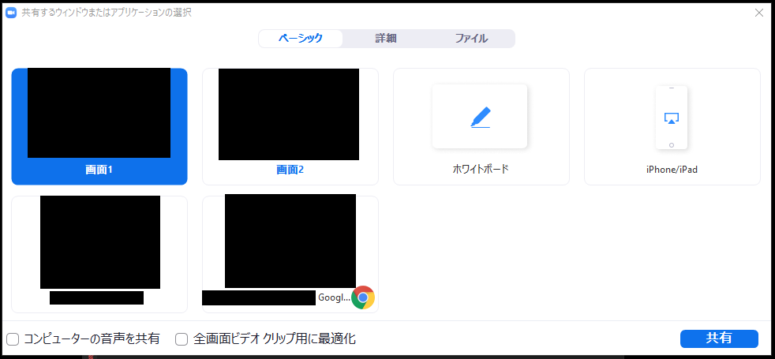

In this section we give concrete directions on how to use Zoom.  

The following screen is displayed when entering a meeting room（this screenshot shows a meeting room with only 1 participant）.
If you move the mouse cursor over the Zoom screen, the menu bar shown in the figure below will pop up.  
    
The menu buttons are explained from left to right （some version may not display all the buttons as here）．
  1. **Microphone mark** : Press this to mute (mute) or unmute (the screen shows "mute off" because it is currently muted). Pressing the arrow mark next to it enables you to make settings related to the microphone.
  1. **Video mark** : Press to turn the video on or off (the screen shows "Start Video" because the camera is currently off). Pressing the up mark next to it will allow you to make video settings.
  1. **Invitation** : You can send an invitation by e-mail. Since the organizer and participants already know the URL of the conference room, they can invite others by sharing the meeting URL.
  1. **Screen Share** : You can share screens in your device.
  1. **Reactions** : You can express reactions by sending "applause" or "agree" emoji.
  1. **Details** : Menus that could not fit on the screen are included here (If the screen width is large enough, all menus will be displayed on the screen and "Details" may not be displayed).
      **Participants** : Displays a list of participants.  
	  **Chat** : text chat.  
	  **Record on this computer** : You can record if your host allows it. This button is often not used by anyone other than the organizer.  
  1. **Leave meeting** : Leave the meeting. A confirmation screen appears after you press it, so you do not exit immediately when you press the button.
  
  
The following describes the details of the menu items mostly used.

## Microphone advanced settings
  
  
  
If you press the upper mark next to the microphone mark, an additional menu will appear. Below is a brief description of each command.
  * **Microphone** : You can select the microphone you want to use (if you have a separate microphone, you will have multiple choices, so choose the one you wish to use).
  * **Speaker** : You can select the speaker you want to use (if you have a separate speaker, you will have multiple choices, please select the one you wish to use)
  * **Test speaker and microphone** : You can test speaker and microphone as the menu name suggests.
  * **Switch to phone audio** : You will get information on how to join a meeting by phone (basically not used).
  * **Exit from computer audio** : As the menu name suggests, you exit from computer audio. If you want to mute, please press the microphone mark instead (basically not used).
  * **Audio Settings** : Configure audio settings. You can choose detailed settings such as "Mute microphone when joining a meeting" and "Press and hold the space key to temporarily unmute yourself".
  
  
## Advanced video settings
  
  
  
If you press the upper mark next to the video mark, an additional menu will appear. Below is a brief description of each option. 
  * **Camera** : You can select the camera you want to use (if you have a separate camera, you will have multiple choices, please select the one you wish to use).
  * **Video setting** : You can choose between video settings, such as "Mute video when joining a meeting" and "Always show participant names in video".
  
  
## Screen sharing
  
When you press the menu "Share screen", the options of screens to be shared appear. Select the desired one and press "Share" to start sharing the screen.
  
  
  
  * 「画面」を選択すると，共有する人の画面そのものが全員に共有されます（画像のようにマルチモニタなどで画面が複数ある場合は画面1，画面2と選択肢が増えます）．
  * 「ホワイトボード」を選択すると自由に描けるホワイトボードが全員に共有されます．
  * 「iPhone/iPad」を選択すると iPhone/iPad の画面共有ができるようになります（プラグインが必要）．同じ WiFi ネットーワーク内にあるデバイスから AirPlay 経由で共有できます．
  * 現在開いているウィンドウも選択肢に表示されます．ウィンドウ単位で画面共有することもできます．ウィンドウ以外の場所を見られたくない場合は，そのウィンドウを選択して画面共有することをおすすめします．
  
  
## Participants
  
メニュー「参加者」を押すと，参加者一覧が見られる画面が出てきます．
    
  
  * 「手を挙げる」: これを押すと，開催者および参加者が「手を挙げている」ことがわかるようになります．
  * 自分の名前のところにマウスカーソルを合わせると，ミュートのオン，オフ，詳細より表示される名前の変更
  

  
## Chat
  
メニュー「チャット」を押すと，テキストチャットができるようになります．ここで，注意が必要なのは，途中からログインすると過去のテキストチャットが確認できない点です．そのため，テキストを送付したいメンバーが全員いる状態でテキストを送付することが重要になります．
    
  
  * 「送信先」を変更することで，メッセージの送信先を「全員」や個人に変更できます．デフォルトでは全員に送信されるようになっています．
  * 「ファイル」を選択することによって，コンピュータにあるファイルや Dropbox などにあるファイルを送信できるようになります．
