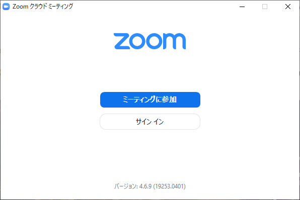

## Sign up and Sign in
* In Zoom, creating an account is called "sign up", and using the signed up account is called "sign in".
* Zoom uses an email address as the account name (registered name). The account is linked to the email address.
* By signing in, you can:
  * Use features that can only be used with the license of the signed-in account.
  * Manage settings of the signed in account. Various settings for holding a meeting can be changed for each account. Once set, you can use those settings by signing in to your account.
  * Join a meeting "authentication" restrictions.
* You can participate in meetings that are not restricted by "authentication" even if you are not signed up or signed in.

## Two ECCS cloud email addresses
* Your ECCS Cloud Mail address can be set for the original ab12345678@g.ecc.u-tokyo.ac.jp format, or to an alternative sanshiro-hongo@g.ecc.u-tokyo.ac.jp format by your choice.
* Apart from this, there are email addresses such as 1234567890@g.ecc.u-tokyo.ac.jp that start with a <a href="https://utlecon.github.io/glossary">10-digit common ID</a>.
* These two email addresses are valid email addresses that will reach the same ECCS cloud email regardless of which you use for sign in.

## Zoom license and email address
* Faculty members and students at the University of Tokyo can use a license with a large number of participants (hereinafter referred to as the University of Tokyo license). This license is associated with an email address that starts with a<b><u>10-digit numeric<a href="https://utlecon.github.io/glossary"> common ID</a>, such as 1234567890@g.ecc.u-tokyo.ac.jp .</u></b>
* <b><u>Zoom and ECCS cloud mail are not linked as a system.</u></b>
* <b><u> You cannot use the University of Tokyo license unless you sign up with an address that starts with a 10-digit common ID. The ECCS cloud mail password and Zoom password are also independent from each other. Changing one does not change the other.</u></b>
* In addition, Zoom does not distinguish between the email address that starts with a 10-digit common ID and the email address that is normally used in ECCS cloud email, so you can sign up for Zoom using each of these two addresses. In this case, the license of the latter address will not be the University of Tokyo license.
<!-- * さらにややこしいことに，Zoomは，サインアップした後で登録メールアドレスを変更することもできます．この変更先のメールアドレスにECCSで普段使っているメールアドレスを使うと，このメールアドレスで東大ライセンスを使えることになります．-->
* You can check whether you have a license from the University of Tokyo on your computer by checking if the user type is marked as "Licensed" at<a href="https://zoom.us/profile">https://zoom.us/profile</a>.
* For troubleshooting related to sign up at the University of Tokyo license, pleas click <a href="https://utelecon.github.io/zoom/setting_issues">here</a>.

## Sign in on Windows and Mac
Although you can also participate in the Zoom meeting only with a browser, we recommend using the app because the functions are limited and the operation differs depending on the browser. You can launch the application by clicking the URL in the browser. In this case, <b><u> it is important to pay attention to the relationship between the browser and Zoom application.</u></b>
* Sign in with browser
  * You can sign in from <a href="https://zoom.us/signin">https://zoom.us/signin</a>.
  * Click the URL of the Zoom meeting in the signed-in browser to join the meeting while signed in. The easiest way to do this is <b><u> by clicking the Zoom Meeting URL in your signed-in browser or entering the Zoom Meeting URL in the address bar.</u></b>
  * If you are using multiple browsers such as Chrome and Firefox, you cannot join the meeting while signed in to a browser different of the one you are attempting to join the meeting.
  * However, when you are signed in with the application, you can participate in the signed-in state even if you are not signed in with the browser.
* Sign in with the app
  * If you want to join the Zoom meeting from the browser you signed in to, you do not need to sign in with the application.
  * The following window will appear when the application is started directly and you are not signed in.
  
  * Click "Sign in" to register your email address with Zoom (if you have not changed it, start with a common 10-digit ID such as 1234567890@g.ecc.u-tokyo.ac.jp).
　　  

## Participation in lectures and Zoom authentication
* In order to prevent that a third party unrelated to the University of Tokyo participates in an online lecture and interferes with the lecture, participation can restricted by "authentication".
* In case of meeting with NO "authentication" restrictions, You can join the meeting from any account, or even if you are not signed in.
* For meetings that require "authentication", you must join the meeting while signed in with the specified email address domain. In the online lecture at the University of Tokyo, you will be signed in with the email address xxxxx@g.ecc.u-tokyo.ac.jp. 

<!--
* <b><u> If you are signed in at xxxxx@g.ecc.u-tokyo.ac.jp, you can participate in lectures that require "authentication" even if your account is not licensed by Todai.．</u></b>
-->

## When authentication fails
* If you are not signed in, or if you are signed in with an email address other than g.ecc.u-tokyo.ac.jp, the following display will appear. Click "Sign in to join" or "Switch accounts to join" to sign in with the email address of g.ecc.u-tokyo.ac.jp. If you have not yet updated the registered email address in Zoom, the email address starts with a common 10-digit ID, such as 1234567890@g.ecc.u-tokyo.ac.jp.

   

## Test if you can sign in and join
* You can check your sign in status by connecting to the "Meeting room that requires sign-in to Zoom at g.ecc.u-tokyo.ac.jp" of the following Google spreadsheet or Office 365 Microsoft Excel (both require authentication with an university account). Please use thisfor testing.

  * <a href="https://docs.google.com/spreadsheets/d/1jf1O-lbDwIsz9QJdPWWhZTh-Nn4Z_ge3BXGIua2fyCs/edit?usp=sharing" target="_blank">Google Spreadsheet</a>

  * <a href="https://univtokyo-my.sharepoint.com/:x:/g/personal/2615215597_utac_u-tokyo_ac_jp/EZN59-QgxfpHg7NX8Vc89wsBVE5wxTBpno2Z05UCwbkLUA?e=FaRkgq" target="_blank">Microsoft Excel Sheet</a>

* Since there are usually no participants in this meeting, the following screen will be displayed on Windows / Mac when participating.
  
* The screen is as follows on iPhone.
  

