ここでは，オンラインストレージサービスにミーティングの録画ファイルを Google Drive にアップロードし，学内限定で共有する方法を説明します． 

## 動画ファイルをアップロードして共有する

1. [Google](http://mail.google.com/a/g.ecc.u-tokyo.ac.jp)に， ECCSクラウドメール（@g.ecc.u-tokyo.ac.jp）のアドレスでログインします．既にECCS以外のアカウントでログインしている場合，アカウントを切り替えてください．
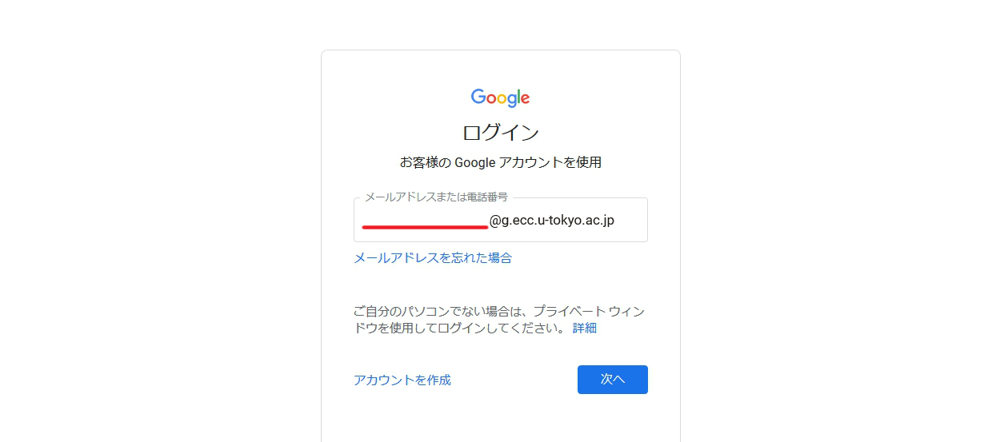

2. ドライブを選択し，ファイル，フォルダをアップロードします．
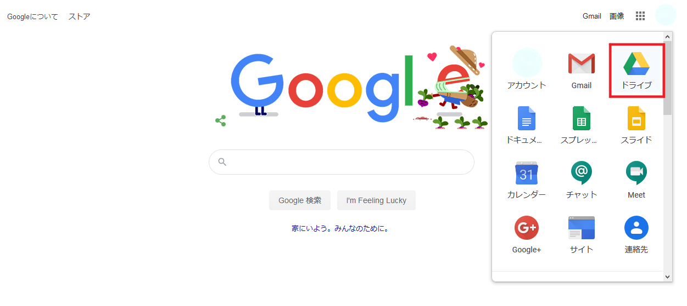
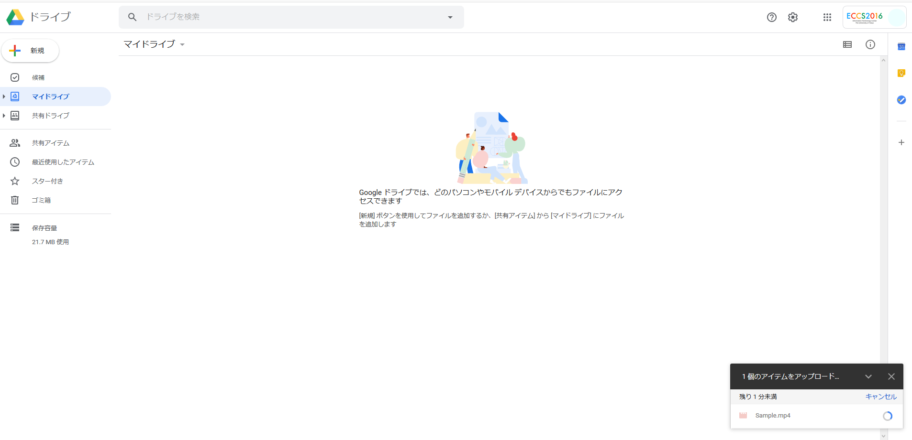

3. 共有したいファイル，フォルダを右クリックし，「共有」タブを選択します．
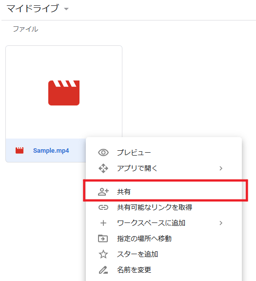

    * ファイル単位，フォルダ単位どちらでも共有することができます．
    * ただし，動画のダウンロードを禁止する場合は，ファイル単位で共有の設定をする必要があります．

4. 右下の「詳細設定」を選択します．
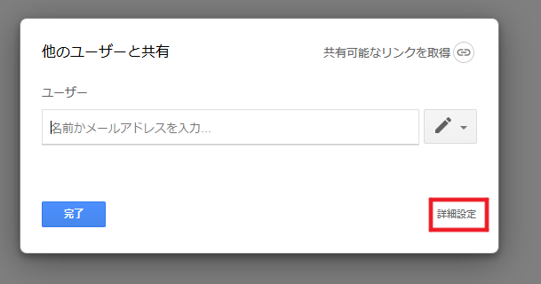

5. 「アクセスできるユーザー」の「変更」を選択し，「オン-リンクを知っている東京大学ECCSクラウドメール会員」を選択します．
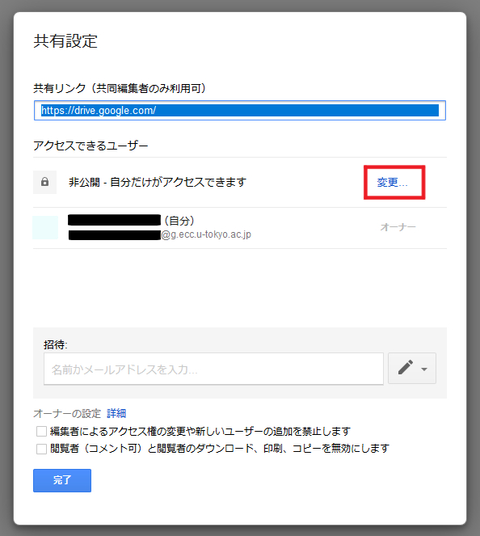
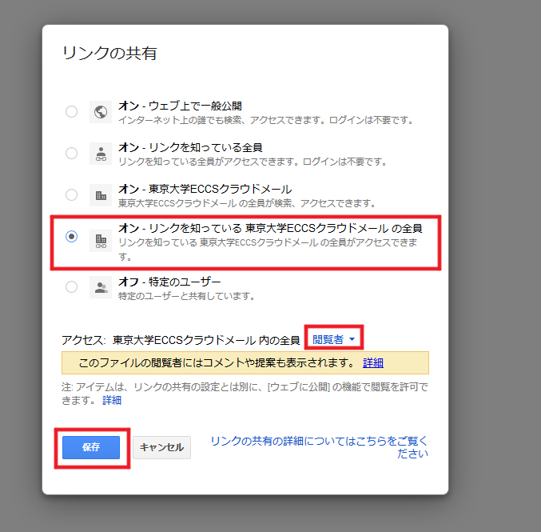

6. 「アクセス:東京大学ECCSクラウドメール 内の全員」が「閲覧者」になっていることを確認し，「保存」します．

7. 「オーナーの設定」のうち，「編集者によるアクセス権の変更や新しいユーザーの追加を禁止します」と，「閲覧者（コメント可）と閲覧者のダウンロード，印刷，コピーを無効にします」の両方にチェックを入れます（学生のダウンロードを禁止しない場合，後者のチェックは不要です）．
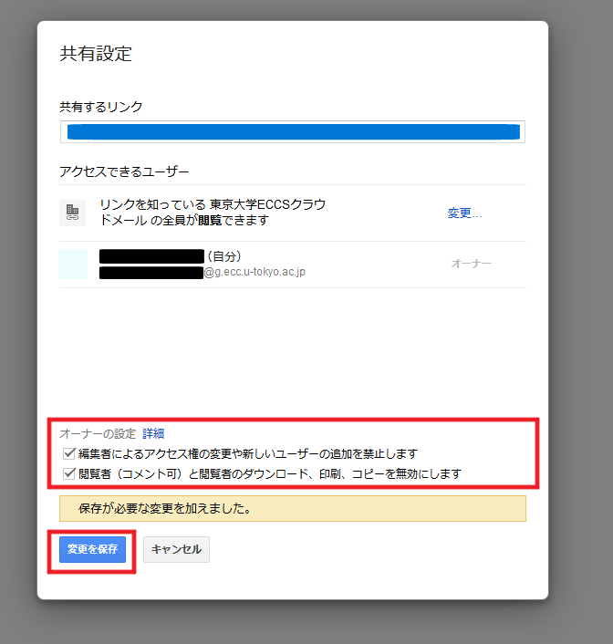

8. 「変更を保存」で設定を保存し，「完了」をクリックします．

9. 共有用のリンクをコピーして，ITC-LMSやメールなどで共有します（ファイル，フォルダを右クリックし，「共有」タブを開くことで，共有用のリンクを取得することができます）．
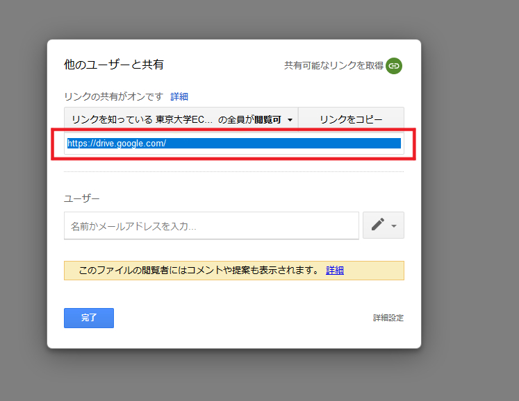

参考URL：[Googleドライブの使い方（ECCS）](https://www.ecc.u-tokyo.ac.jp/announcement/2017/04/27_2503.html)

## 録画ファイルの共有を解除する
ここでは，録画ファイルの共有を解除する（共有用URLを無効化する）方法を説明します．

1. [Google](http://mail.google.com/a/g.ecc.u-tokyo.ac.jp)に， ECCSクラウドメール（@g.ecc.u-tokyo.ac.jp）のアドレスでログインし，ドライブにアクセスします．
2. 共有を解除したいファイル，フォルダを右クリックし，「共有」タブを選択します．
3. 右下の「詳細設定」を選択します．
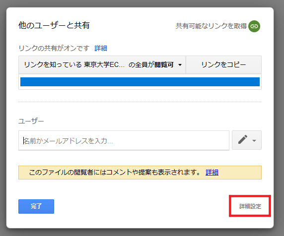

4. 「アクセスできるユーザー」の「変更」を選択します．
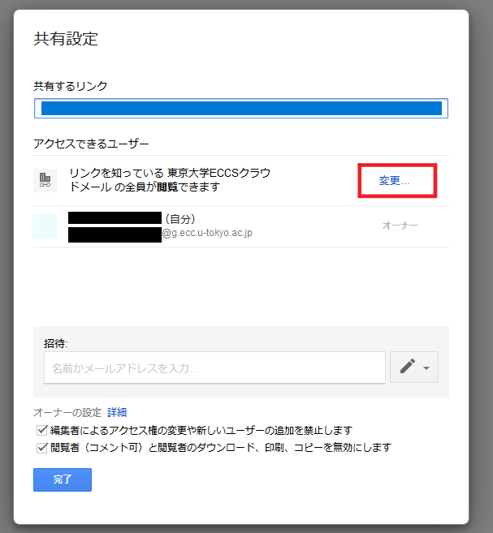

5. 「オフ-特定のユーザー」を選択し，「保存」します．
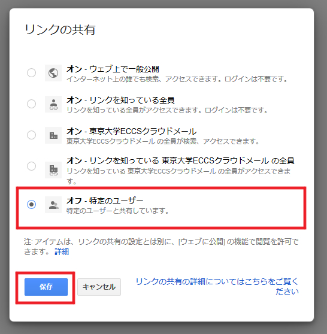

6. 「アクセスできるユーザー」が「非公開-自分だけがアクセスできます」になっていることを確認し，「完了」を選択します．
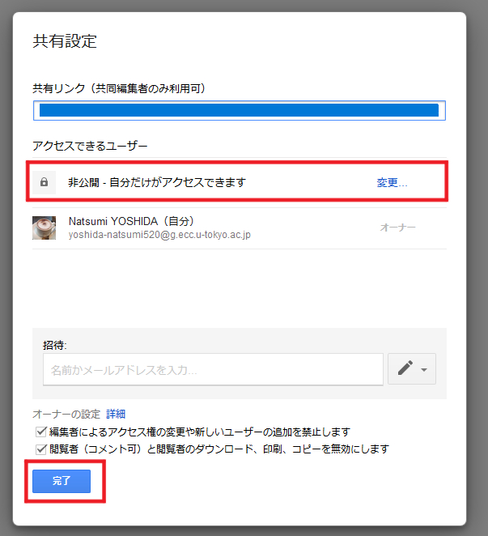

7. ITC-LMSやメールなどで、リンクの期限切れを告知します．もしくはリンクの記述を削除します．
