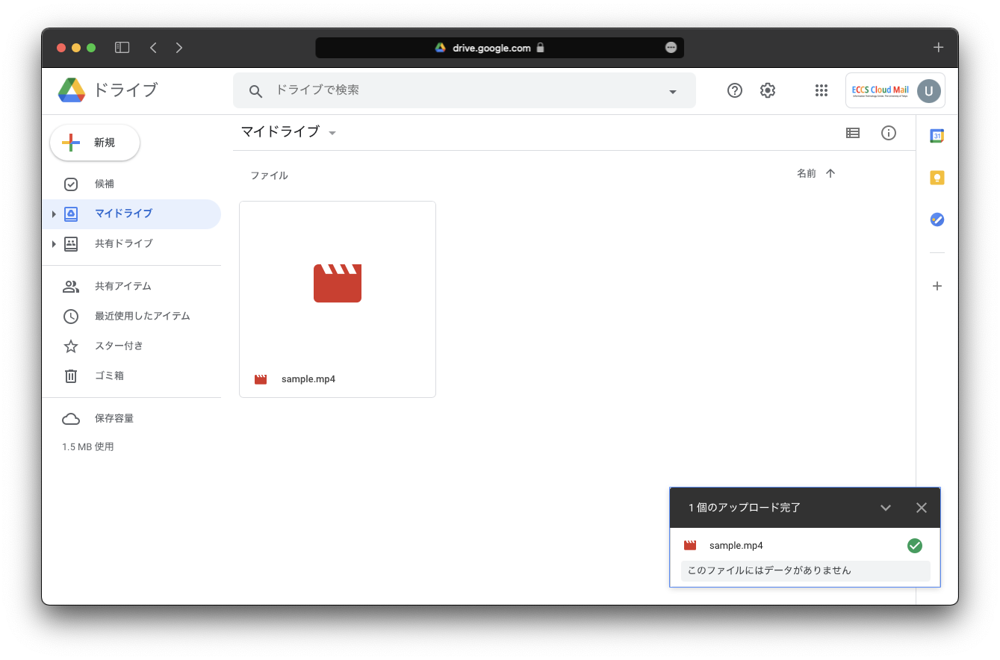
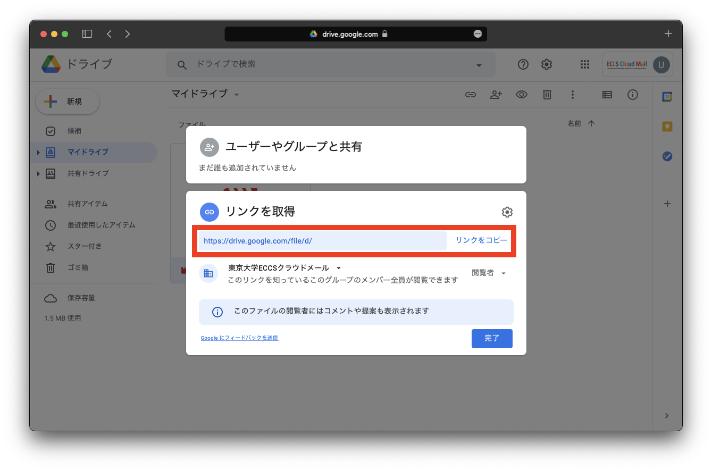
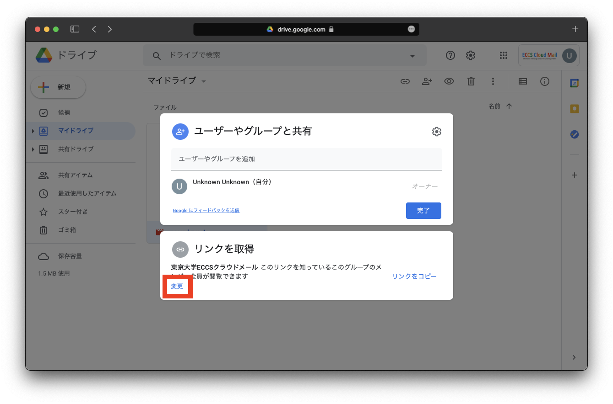
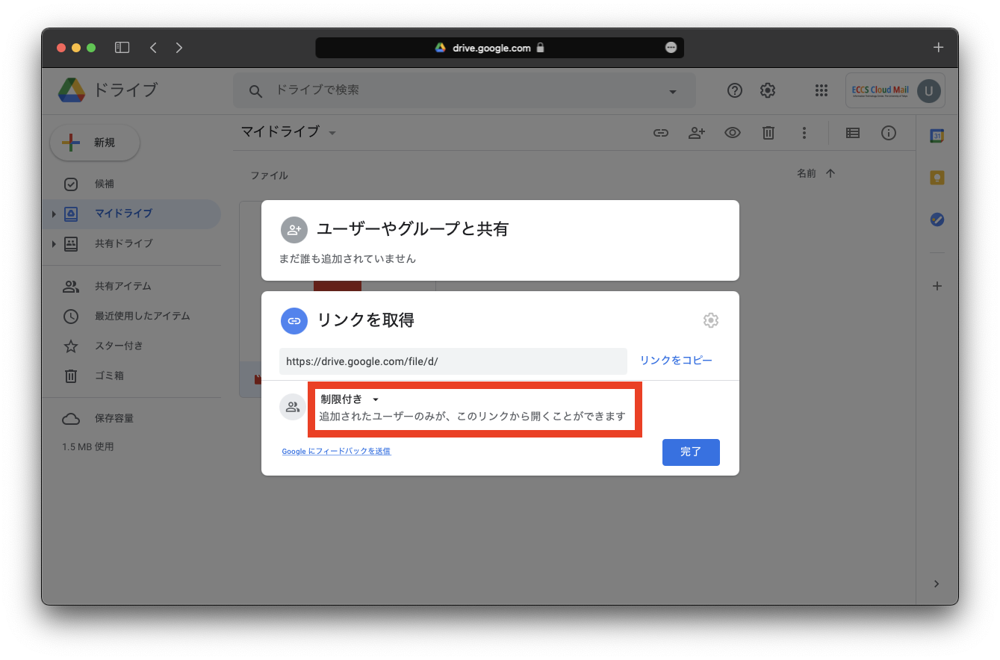

ここでは，ミーティングの動画ファイルを Google Drive にアップロードし，学内限定で共有する方法を説明します． 

## 動画ファイルをアップロードして共有する

1. [Google Drive](https://drive.google.com/drive/my-drive)に， ECCSクラウドメール（@g.ecc.u-tokyo.ac.jp）でログインします．既にECCS以外のアカウントでログインしている場合，アカウントを切り替えてください．

2. Google Driveにファイルをアップロードします．

3. 共有したいファイル，フォルダを右クリックし，「共有」を選択します．

    * ファイル単位，フォルダ単位どちらでも共有することができます．
    * ただし，動画のダウンロードを禁止する場合は，ファイル単位で共有の設定をする必要があります．

4. 右上の設定ボタン（歯車のアイコン）を選択します．

5. 「他のユーザーとの共有設定」で「閲覧者と閲覧者（コメント可）に，ダウンロード，印刷，コピーの項目を表示する」のチェックを外します．チェックを外したら，右上の矢印ボタンを選択して，前の画面に戻ります．（学生のダウンロードを禁止しない場合，この手順は不要です）

5. 「リンクを取得」の「東京大学ECCSクラウドメールと共有」を選択します．

6. 「東京大学ECCSクラウドメール」が「閲覧者」になっていることを確認したら，画面に表示されているリンクをコピーして，ITC-LMSやメールなどで共有してください．「完了」を選択すると，共有設定の画面が閉じます．

参考URL：[Googleドライブの使い方（ECCS）](https://www.ecc.u-tokyo.ac.jp/announcement/2017/04/27_2503.html)

## 動画ファイルの共有を解除する
ここでは，動画ファイルの共有を解除する（共有用URLを無効化する）方法を説明します．

1. [Google Drive](https://drive.google.com/drive/my-drive)に， ECCSクラウドメール（@g.ecc.u-tokyo.ac.jp）でログインします．既にECCS以外のアカウントでログインしている場合，アカウントを切り替えてください．
2. 共有を解除したいファイル，フォルダを右クリックし，「共有」を選択します．
3. 「リンクを取得」の右下にある「変更」を選択します．

4. 「東京大学ECCSクラウドメール」と書かれている場所を選択して，「制限付き」に変更します．

5. 「リンクを取得」が「制限付き」になっていることを確認し，「完了」を選択します．

6. ITC-LMSやメールなどで、リンクの期限切れを告知します．もしくはリンクの記述を削除します．
