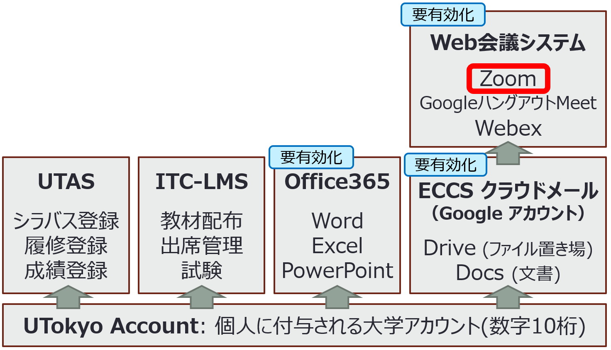

更新日: 2020年3月29日

## はじめに  

東京大学では，<a href="https://www.u-tokyo.ac.jp/ja/about/president/COVID-19-message.html" target="_blank">総長のメッセージ</a>にある通り，新型コロナウィルスCOVID-19感染拡大を防止するため, 2020年度のSセメスターにオンライン授業を本格導入することになりました.メッセージにおいては，授業に関し「対面での講義は最小限とし、オンライン化を奨励し推進する」とされています．しかしながら，メッセージが出た3月18日以降，事態は深刻さを増し，全面的なオンライン授業実施に備えざるを得なくなってきています．

オンライン授業の実施は多くの教職員にとって，初めてのことでありかつ備える時間も非常に限られています．そのような中，大学という学びの環境を変わらず提供したいという思いのもと，これまで既に各所で様々な取り組みが進んでいることと思います．

本ポータルは，本学が授業のオンライン化をすすめるにあたり，教職員の負担を減らす一助としていただくために「走りながら」つくってしております．本ポータルでは，対面で行っていた授業をスムーズにオンライン化することに有用と思われる，次のような情報提供を行おうとしています．

* 何をもってオンライン授業というのか
* 本学でどういったシステム環境が使えるのか
* そのシステムでは実際にどういうことができるのか
* どういった具体的工夫があるのか
* リソースにはどのようなものがあるか

しかしながら，まだまだ不十分です．そこでお願いがあります．既に授業をオンラインで実施されている先生方もいらっしゃると思います．ぜひそうした先生方には「こんな方法を知っている」「こんな工夫ができる」「こうすればうまくいく」といったことを[utelecon-inquiries@googlegroups.com](mailto:utelecon-inquiries@googlegroups.com)宛にお送りいただけると幸いです．本ポータルにおいてそうした情報を必要とする方々に届けていきたいと思います．

先生方の知が本ポータルに結集し共有され，本ポータルがオンライン化を成し遂げるコミュニティとなっていくことが，学生に対し質の高い学習環境の維持あるいは向上の支えになると信じております．

本ポータル編集に参画する教職員一同
　

## 東京大学における教育のためのICTシステムを利用するために

東京大学における教育のための ICT システムは複数あります．  

全体像は上記の図のようになっています. 東京大学の構成員であることを示す UTokyo Account が多数のサービスを利用するための基礎となります．シラバス登録などを行う UTAS，教材配布や出席管理を行う ITC-LMS は UTokyo Account を保持していれば利用可能ですが，Word や Excel が利用できる Office 365 や Google のサービスを利用できる ECCS クラウドメールは別途有効化が必要です．また，本学のアカウントで Web 会議システム（Zoom，Webex，GoogleハングアウトMeet）を利用したい場合は，ECCSクラウドメールを用いて有効化する必要があります．  
Office 365 や Google のアカウントを既にお持ちの方でも，学生に対して学内限定で動画ファイルを共有したい，容量を気にせず Google Drive（ファイル置き場）を利用したい場合は，それぞれ有効化することをおすすめします．  

以下，それぞれのサービスの説明とサービスを利用するための作業を説明します. 以下の作業中, このページに書かれている通りにならないなど, 問題を見つけた場合は [utelecon-inquiries@googlegroups.com](mailto:utelecon-inquiries@googlegroups.com) までご連絡下さい. その際, (a) 以下のどのステップで, (b) 自分が何をしたら, (c) どのような結果になったか, を含めていただければ幸いです(「できませんでした」というだけの情報ですとこちらで問題がわからない場合が多いです). 

1. **UTokyo Account:** 他のサービスすべてのもととなる, 「あなたが東京大学の構成員である」ことを示すアカウントです. 令和2年度新規の教職員には, 2020/4/1 以降に配られる書類に, あなたのアカウント番号(10桁の数字. 共通IDという)と初期パスワードが書かれています.
  * **（新規の教職員用）有効化作業:** [初期パスワードを変更](https://utacm.adm.u-tokyo.ac.jp/webmtn/LoginServlet)してください. [手順動画](https://youtu.be/tTpAlqVhEXQ)
1. **UTAS (学務システム):** シラバスを登録したり, 成績の登録をしたりするのに使うシステムです. オンライン授業に関する情報も, このシステムを経由して提供することになるでしょう. 使うためにはUTokyo Accountが正しく設定されている必要があります.
 * **作業:** UTokyo Account を利用できれば，特に利用するための作業はありません.
1. **ITC-LMS (学習管理システム):** 自分が担当する授業に関して, 資料を掲示したり, 課題を提出させたり, 出席を管理したりなどの用途に使います. UTASと似ていて紛らわしいですが, UTASは授業が始まる前(シラバス登録)と後(成績登録), ITC-LMSは授業期間中に使うと, 大雑把には思っていてください. 使うためにはUTokyo Accountが正しく設定されている必要があります. 
 * **作業:** UTokyo Account を利用できれば，特に利用するための作業はありません（参考:  [ITC-LMS 教員向けページ](../lms_lecturers/)）
1. **ECCS クラウドメール (Googleメール，正確に言うと G Suite for Education):** 全教職員が利用できる Google のサービスで，全教職員に本学の Google アカウント（ECCS クラウドメールアカウント）が発行されています．本学のWeb会議システムのアカウントを使うためには必須になります．また，Google アカウントであることから，ファイル置き場の Google Drive，文書作成サービスの Google Docs，表計算サービスの Google Spreadsheet，動画配信サービスの YouTube などが使えます．使うためにはUTokyo Accountが正しく設定されている必要があるのと, 使い始める際にシステムの有効化を行う必要があります.  
  * **作業:** [UTokyo Account利用者メニュー](https://utacm.adm.u-tokyo.ac.jp/webmtn/LoginServlet) の「ECCSクラウドメール」からアカウント名, 「ECCSクラウドメール(パスワード変更)」からパスワードを設定して, G Suite for Educationを有効化して下さい (<a href="https://hwb.ecc.u-tokyo.ac.jp/wp/literacy/email/initialize/" target="_blank">手順についての詳細</a>).
  * **作業:** 上記が終わってから実際にG Suite for Education が使える(Googleにログインできる)ようになるまで, 最大1時間ほどお待ち下さい（毎時0分に更新で反映まで5分程度かかります）. その後，<a href="https://mail.google.com/a/g.ecc.u-tokyo.ac.jp" target="_blank">ECCSクラウドメール</a>に移動して，設定したアカウント名（ご自身が設定した英数字）とパスワードを入力して，Gmail にログインできることを確認してください．
1. **Office 365 (Microsoft):** 文書作成ソフトの Word, 表計算ソフトの Excel， プレゼンテーションソフトの PowerPoint などが利用できるようになります．使うためにはUTokyo Accountが正しく設定されている必要があるのと, 使い始める際にシステムの有効化を行う必要があります.
  * **作業:** [UTokyo Account利用者メニュー](https://utacm.adm.u-tokyo.ac.jp/webmtn/LoginServlet) から「Office 365 ProPlus利用許諾」に合意し, Office 365の有効化をして下さい ([手順動画](https://youtu.be/OYl5P67mDYI)). 
1. **Web会議システム:** リアルタイムにオンラインで授業を配信したり，授業用の動画を録画するために利用できます．本学では，[Zoom](../zoom/)，[Webex](../webex)，[GoogleハングアウトMeet](google_hangouts_meet) が利用できます．どれにしようか迷われている方は，利用しやすい Zoom をおすすめします．利用する準備方法はそれぞれのページをご覧ください．

ここで，注意してほしいのは, Google，Microsoft，Zoomも, すでに自分で使っているという方もいらっしゃると思いますが, そういった方も**大学のアカウントで使えるように**していただくことが重要です．これらのアカウントを使えるようにすることで，本学構成員向けのサービスを利用できるようになり，例えば，Google Drive で学内限定で共有されたファイルを閲覧したり，学生に学内限定でファイルを共有したり，Zoom で通常アカウントでは参加者数の上限が100名のところ，500名の会議を行うことができたりするようになります.

ECCSクラウドメール(Google)とOffice 365(Microsoft)の有効化の手順は前述していますが, それらのシステムでどんなことができるかも含め, 東京大学[初年次ゼミナールのページ](https://fye.c.u-tokyo.ac.jp/students/)にある, 『東京大学ICT活用ハンドブック（文理共通）』 ([2019年度版](pdf/01_2019_ict.pdf))で詳しく説明しているため，必要に応じて御覧ください． 

## オンライン授業の主な形態  
　ここでは，従来の授業と比較しながら，オンライン授業の主な形態3つを紹介し，それぞれの形態の説明とオンライン授業（メディア授業）としての要件の説明を行います．  

　従来の授業は，リアルタイムに対面で行うものです．一方，オンライン授業には大きく分けて，リアルタイムに対面かつオンラインで行う形態（同期ハイブリッド型），リアルタイムにオンラインのみで行う形態（同期オンライン型），学生が自身のペース（オンデマンド）でオンライン学習する形態（非同期オンライン型）があります．  
　以下，それぞれについて説明します．
  
  
* リアルタイム（対面+オンライン）型（同期ハイブリッド型）
  * 実際の教室で授業をして，Web会議システムなどでその内容を配信する形態です．  
  * この形態のオンライン授業（メディア授業）としての要件は，「同時かつ双方向に行われる」ことです．Web会議システムを利用すれば，チャットや音声による通話ができるためその要件を満たせますし，映像配信であったとしてもコメントなどを受け付ける機能があれば，その要件を満たすことができます．
  * 参考: リアルタイム（対面+オンライン）型（同期ハイブリッド型）の準備方法（途中）
  * 参考: [オンライン基礎講座「授業のオンライン化を念頭に置いた、Zoom の使い方」](https://utelecon.github.io/events/2020-03-19/)
   
   
* リアルタイム（オンライン）型（同期オンライン型）
  * Web会議システムなどを用いて教員と学生全員がオンラインでつながり授業を行う形態です．  
  * この形態のオンライン授業（メディア授業）としての要件は，「同時かつ双方向に行われる」ことです．Web会議システムを利用すれば，チャットや音声による通話ができるためその要件を満たせますし，映像配信であったとしてもコメントなどを受け付ける機能があれば，その要件を満たすことができます．
  * 参考: リアルタイム（オンライン）型（同期オンライン型）の準備方法（途中）
  * 参考: [オンライン基礎講座「授業のオンライン化を念頭に置いた、Zoom の使い方」](https://utelecon.github.io/events/2020-03-19/)
   
     
* オンデマンド（オンライン）型（非同期オンライン型）
  * 学習管理システムなどで教員が用意した教材をもとに学生が個別に学習する形態です．例えば，以下のような方法が考えられます．
    * 学生は教員が作成した動画教材，もしくは OCW（Open Course Ware）や MOOC（Massive Open Online Course）などの既存の動画教材を毎週決められた範囲で視聴し，別途課題提出や掲示板での質疑応答を行う
    * Web会議システムを用いてリアルタイムに行った授業の録画を後から視聴して，課題提出や掲示板での質疑応答を行う
  * この形態のオンライン授業（メディア授業）としての要件は，以下の2つです．例えば，教員が Web 掲示板（ITC-LMSにその機能有）を用意して学生同士が意見交換できるよう促し，適宜授業内容に関して小テスト，問いかけ，質疑応答などを行うことで要件を満たせます．
    1. 以下の2つの方法どちらかを用いて，設問解答、添削指導、質疑応答等による十分な指導を併せ行うことが必要
      * 毎回の授業の実施に当たって、指導補助者が教室等以外の場所において学生等に対面すること
	  * **又は**，当該授業を行う教員若しくは指導補助者が当該授業の終了後すみやかにインターネットその他の適切な方法を利用すること
  
    1. 当該授業に関する学生の意見交換の機会の確保が必要（学習管理システム ITC-LMS の掲示板機能で実現可能）
  * 参考: オンデマンド（オンライン）型（非同期オンライン型）の準備方法（途中）
  * 参考: [オンライン基礎講座「ライブ配信ではない，動画やテキストなどを用いたオンデマンド型オンライン授業の作り方」](https://utelecon.github.io/events/2020-03-27/)

## 各授業方法のオンライン化（執筆中）

* 質疑応答のオンライン化
* 板書のオンライン化
* 輪読のオンライン化
* グループワークのオンライン化

## 具体的なツールの使い方（執筆中）

* 学習環境の整え方
  * [ITC-LMSの使い方](../lms_lecturers/)
  * Google Classroom の使い方
   
   
* 教材の作り方
  * [オンライン基礎講座「ライブ配信ではない，動画やテキストなどを用いたオンデマンド型オンライン授業の作り方」](https://utelecon.github.io/events/2020-03-27/)にてそれぞれのトピックを説明しているため，記事が出来上がるまではそちらの動画を御覧ください
  * Googleドキュメントの音声認識を使った素早いテキスト入力の方法
  * PowerPoint を用いた簡単な動画の作り方
  * Web 会議システムを使った動画の作り方
   
   
* ファイルのアップロードと共有方法
  * Google Drive の使い方
  * One Drive の使い方

## ご共有いただいた実践例・参考情報（随時募集中）

ここで，ご共有いただいた資料を紹介いたします．ご共有いただいた先生方，誠にありがとうございます．  
資料をお持ちの方でご共有いただける場合は[utelecon-inquiries@googlegroups.com](mailto:utelecon-inquiries@googlegroups.com)にご連絡いただけると幸いです．  
現時点では，箇条書きでご紹介させていただきますが，情報が増えてきましたら別途整理などさせていただく予定です．

* PC1台でできるオンライン講義 [\[Powerpoint\]](materials/online_example_1pc.pptx) [\[動画(MPEG4)\]](materials/online_example_1pc.mp4) (工学系・川原先生): 板書の授業をオンラインで行うための方法を動画付きで説明いただいています
* Zoom利用の手引き0.3 [\[PDF\]](materials/zoom_v03.pdf)（工学系・相田先生）: Mac のスクリーンショットを多用した Zoom の使い方を解説いただいています
* Google meetを使ったグループワーク型授業の例 [\[PDF\]](materials/google_meet_groupwork.pdf)  (工学系・柳澤先生): オンラインにおいてグループワークをする方法が説明されています（Zoomのブレークアウトでは教員の声などを伝えられませんが，その点を克服している画期的な方法です）

## リンク集（随時募集中）

